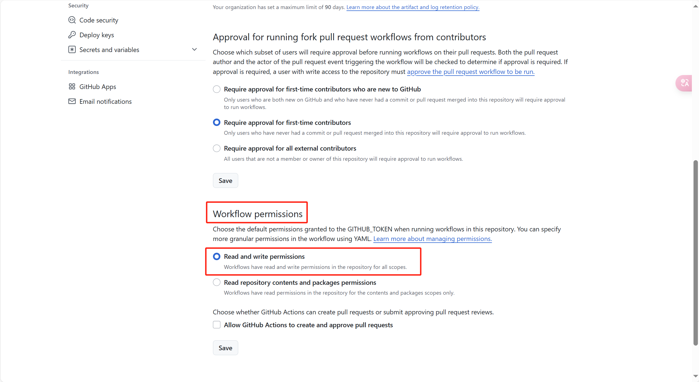
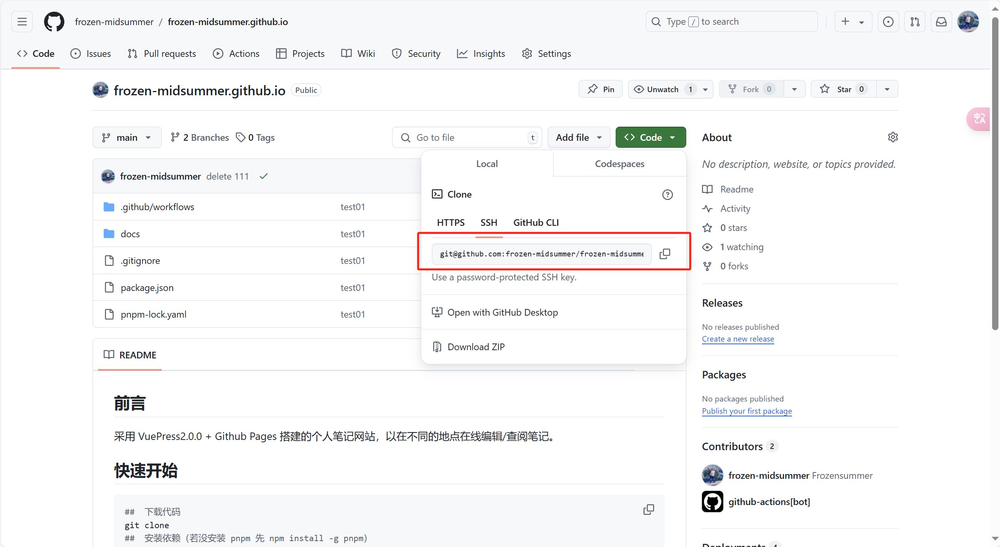

## 1 github 配置

### 1.1 设置正确的 base 选项

如果你准备发布到 `https://<USERNAME>.github.io/` ，你可以省略这一步，因为 base 默认就是 "/" 。

如果你准备发布到 `https://<USERNAME>.github.io/<REPO>/` ，也就是说你的仓库地址是 `https://github.com/<USERNAME>/<REPO>` ，则将 base 设置为 `"/<REPO>/"`。

### 1.2 选择你想要使用的 CI 工具

这里我们以 [GitHub Actions](https://github.com/features/actions) 为例。创建 `.github/workflows/docs.yml` 文件来配置工作流。

### 1.3 github action 权限配置

在 settings >> Actions >> General 中配置 github action 工作流的读写权限。



### 1.4 github page 配置

在 settings >> Pages >> Build and deployment 中配置 github page 主页对应的代码分支（vuepress 编译出的 docs 目录）。


## 2 github push 不上去的问题

有时执行 git push 的时候会报错 443 超时，可以检查一下是否开启了全局代理(Global)，可以开启全局代理，用 git bash push 代码。

### 2.1 配置本地 github ssh 彻底解决 git push 不上去的问题

windows:

```bash
ssh-keygen -t rsa -b 4096 -C "610798187@qq.com"
```

安装过程中一直点击 enter 即可，完成后代开 C:\User\XXX\\.ssh\id_rsa.pub

将文件内的内容复制进个人 setting 的 SSH and GPG keys 的 SSH keys 中即可


然后进入仓库用这个 url clone 项目



然后就可以解决代码 push 443 的问题了

附：git page 上现实的 contributor 为以下 git 配置

```bash
git config --global user.name "frozen-midsummer"
git config --global user.email "610798187@qq.com"
```

附：

git 连接的远程仓库地址位于.git/config 文件中

### 2.2 参考博文：

[如何使用 SSH 连接到 Github](https://zhuanlan.zhihu.com/p/111344840)

## 3 VS Code 使用技巧

[VS Code 自定义 Markdown 粘贴图片的位置](https://blog.csdn.net/LT_admin/article/details/135136872)
