## 一、类加载机制

> 概述

+ 虚拟机的类加载机制：**把描述类的数据从Class文件加载到内存**，并对数据进行校验、转换解析和初始化，**最终形成可以直接被虚拟机使用的Java类型**。
+ 在Java语言中，类型的加载、连接和初始化过程都是在**程序运行期间**完成的，虽然会让提前编译面临困难以及加载类增加一些开销，但为**Java应用提供了极高的拓展性和灵活性**。

---

#### 判断两个类是否相同？

+ 类的完整类名必须一致，包括包名。
+ 加载这个类的ClassLoader（指ClassLoader实例对象）必须相同。

​        也就是说，在JVM中，即使两个类对象是源于同一个Class文件，只要加载它们的ClassLoader不同，那么这两个对象也是不相等的。这里所指的“相等”， 包括代表类的Class对象的equals()方法、 isAssignableFrom()方法、 isInstance()方法的返回结果， 也包括了使用instanceof关键字做对象所属关系判定等各种情况。   

---

### 类加载过程

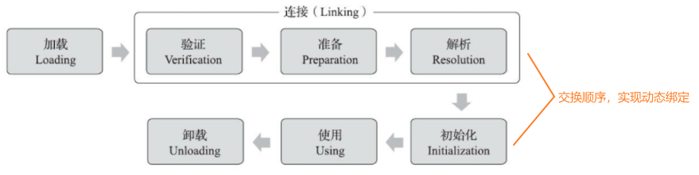

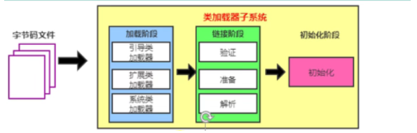

---

#### Step1：加载

> 在加载阶段，Java虚拟机要完成：

+ 通过一个**类的全限定名**来获取定义此类的**二进制字节流**。
+ 将这个字节流所代表的**静态存储结构**转化为**方法区的运行时数据结构**(拿到内存)。
+ 在内存中生成一个代表这个类的`java.lang.Class`对象，作为**方法区这个类的各种数据的访问入口**。

​	**一个非数组类的加载阶段（加载阶段获取类的二进制字节流的动作）是可控性最强的阶段，这一步我们可以去完成还可以自定义类加载器去控制字节流的获取方式（重写一个类加载器的 `loadClass()` 方法）。数组类型不通过类加载器创建，它由 Java 虚拟机直接创建。**

---

**注**：第一条“通过类的全限定名来获取二进制流”的规则，并没有指定字节流从哪里、如何获取，这就可以在加载阶段构建了一个广阔的舞台：

+ 本地系统直接加载。

+ 从ZIP压缩包中提取：是日后JAR、EAR、WAR格式的基础。
+ 从网络中获取：典型应用是Web Applet。
+ 运行时计算生成，使用最多的是**动态代理**技术。
+ 有其他文件生成，典型场景JSP。
+ 从数据库中读取、从加密文件中获取...

​       **加载阶段完成后**，**Java虚拟机外部的二进制字节流就按照虚拟机所设定的格式存储在方法区之中。类型数据安置在方法区之后，会在Java堆内存中实例化一个`java.lang.Class`对象，作为程序访问方法区中类型数据的外部接口。**

---

#### Step2：连接

##### 验证

+ **目的**：确保Class文件的字节流包含的信息符合《Java虚拟机规范》的全部约束要求，保证被加载类的正确性，确保不会威胁虚拟机的安全。
+ 验证阶段会完成四个阶段的检验动作：文件格式验证、元数据验证、字节码验证和符号引用验证。
  1. 文件格式校验：验证字节流是否符合 class 文件的规范，并且能被当前版本的虚拟机处理。只有通过这个阶段的验证后，字节流才会进入内存的方法区进行存储，所以后面的3个阶段的全部是基于方法区的存储结构进行的，不会再直接操作字节流；
  2. 元数据验证：对字节码描述的信息进行语义分析，以保证其描述的信息符合 Java 语言规范的要求。目的是保证不存在不符合 Java 语言规范的元数据信息；
  3. 字节码验证：该阶段主要工作是进行数据流和控制流分析，保证被校验类的方法在运行时不会做出危害虚拟机安全的行为；
  4. 符号引用验证：最后一个阶段的校验发生在虚拟机将符号引用转化为直接引用的时候，这个转化动作将在连接的第三个阶段——解析阶段中发生。符号引用验证的目的是确保解析动作能正常执行。

##### 准备

​	**准备阶段是正式为类中定义的变量（即静态变量， 被static修饰的变量） 分配内存**并**设置类变量初始值**的阶段。

+ 为类中定义的变量（即静态变量，被static修饰的变量）分配内存并设置该类变量的默认初始值（零值）。
+ 这时候进行内存分配的**仅包括类变量（static），不包括实例变量**，**实例变量**将会在**对象实例化时随着对象一起分配在Java堆中**。
+ **这里不包含被final修饰的static**，因为**final在编译阶段就会分配了，准备阶段会显式初始化**。

##### 解析

​	解析阶段是**Java虚拟机将常量池内的符号引用替换为直接引用的过程**。

+ 是Java虚拟机将常量池内的符号引用替换为直接引用的过程，**也就是得到类或者字段、方法**在**内存中的指针或者偏移量**。
+ 解析动作主要针对类或接口、字段、类方法、接口方法、方法类型、方法句柄和调用限定符7类符号引用进行。
+ **符号引用**：符号引用以一组符号来描述所引用的目标，其字面量形式定义在《Java虚拟机规范》中的Class文件格式中。与JVM实现的内存布局无关。  
+ **直接引用**：**直接引用是可以直接指向目标的指针、 相对偏移量或者是一个能间接定位到目标的句柄。和虚拟机实现的内存布局直接相关的。** 
+ 解析阶段发生的**具体时间没有被要求**，常在初始化之后才发生。
+ 在程序实际运行时，只有符号引用是不够的，举个例子：在程序执行方法时，系统需要明确知道这个方法所在的位置。Java 虚拟机为每个类都准备了一张方法表来存放类中所有的方法。当需要调用一个类的方法的时候，只要知道这个方法在方法表中的偏移量就可以直接调用该方法了。**通过解析操作符号引用就可以直接转变为目标方法在类中方法表的位置，从而使得方法可以被调用**。

---

#### Step3：初始化

> 概述

+ 初始化阶段就是执行类构造器`<clinit>()`方法的过程。**直到初始化阶段，JVM才真正开始执行类中编写的Java代码（字节码），将主导权移交给应用程序**。
+ `<clinit>()`方法是由**编译器自动收集类中的所有类变量的赋值动作和静态语句块（static{}块） 中的语句合并产生的** ，编译器收集的顺序是由语句在源文件中出现的顺序决定的 。 
+ `<clinit>()`方法与类的构造函数（即在虚拟机视角中的实例构造器`<init>()`方法）不同， 它不需要显式地调用父类构造器， Java虚拟机会保证在子类的``<clinit>()``方法执行前， 父类的``<clinit>()``方法已经执行完毕。 因此在Java虚拟机中第一个被执行的``<clinit>()``方法的类型肯定是`java.lang.Object`。  
+ `<clinit>()`方法对于类或接口来说并不是必需的， **如果一个类中没有静态语句块， 也没有对变量的赋值操作， 那么编译器可以不为这个类生成`<clinit>()`方法** 。 
+ JVM必须保证一个类的`<clinit>()`方法在多线程下被**同步加锁**。因为 `<clinit>()` 方法是带锁线程安全，所以在多线程环境下进行类初始化的话可能会引起死锁，并且这种死锁很难被发现。

##### 主动初始化

有且只有六种情况必须立刻对类进行初始化：

1. 当遇到 new 、 getstatic、putstatic或invokestatic 这4条直接码指令时，比如 new 一个类，读取一个静态字段(未被 final 修饰)、或调用一个类的静态方法时。
   - 当jvm执行new指令时会初始化类。即当程序创建一个类的实例对象。
   - 当jvm执行getstatic指令时会初始化类。即程序访问类的静态变量(不是静态常量，常量会被加载到运行时常量池)。
   - 当jvm执行putstatic指令时会初始化类。即程序给类的静态变量赋值。
   - 当jvm执行invokestatic指令时会初始化类。即程序调用类的静态方法。
2. 使用 `java.lang.reflect` 包的方法对**类进行反射调用**时。如：Class.forname("..."), newInstance()等等。如**果类没初始化，需要触发其初始化**。
3. 初始化一个类，如果其**父类还未初始化，则先触发该父类的初始化**。
4. 当虚拟机启动时，**用户需要定义一个要执行的主类 (包含 main 方法的那个类)，虚拟机会先初始化这个类**。
5. 当使用JDK 7新加入的动态语言支持时， 如果一个`java.lang.invoke.MethodHandle`实例最后的解析结果为REF_getStatic、 REF_putStatic、REF_invokeStatic、 REF_newInvokeSpecial四种类型的方法句柄， 并且这个方法句柄对应的类没有进行过初始化， 则需要先触发其初始化。  
6. 当一个接口中定义了JDK8新加入的默认方法（被default关键字修饰的接口方法）时，如果有这个接口的实现类发生了初始化，那该接口要在其之前被初化。

---

### 类加载器的分类

**启动类加载器、引导类加载器(Bootstrap Class Loader)<——扩展类加载器(Extension Class Loader)<——应用程序类加载器(Application Class Loader)<——用户自定义类加载器(User Class Loader) **

#### 启动类加载器(引导类加载器)

> 概述

+ 这个类加载器使用C++语言实现，是JVM自身的一部分。（**其他所有的类加载器都继承于java.lang.ClassLoader**）
+ 负责加载存放在<JAVA_HOME>\lib目录， 或者被-Xbootclasspath参数所指定的路径中存放的， 而且是Java虚拟机能够识别的库到虚拟机的内存中。  （JAVA_HOME/jre/lib/rt.jar、resources.jar或sun.boot.class.path路径下的内容）。
+ 没有父加载器，加载拓展类和应用程序加载器。

---

#### 扩展类加载器

> 概述

+ 这个类加载器是在类sun.misc.Launcher$ExtClassLoader中以Java代码的形式实现的，父类加载器为启动类加载器。
+ 它负责加载<JAVA_HOME>\lib\ext目录中， 或者被java.ext.dirs系统变量所指定的路径中所有的类库。如果用户创建的JAR放在此目录下，也会自动由扩展类加载器加载。

---

#### 应用程序类加载器(系统类加载器)

> 概述

+ 这个类加载器由sun.misc.Launcher$AppClassLoader来实现。
+ 是ClassLoader类中的`getSystemClassLoader()`方法的返回值，也称**“系统类加载器”**。
+ 负责加载环境变量classpath或系统属性java.class.path指定路径下的类库。

---

#### 线程上下文类加载器

> 概述

+ 这个类加载器可以通过`java.lang.Thread`类的`setContextClassLoader()`方法进行设置，如果创建线程时还未设置，它将会从父线程中继承一个。
+ 如果在应用程序的全局范围内都没有设置过，那么这个类加载器默认就是应用程序类加载器。
+ **通过这个类加载器可以实现逆向访问类，即父类到子类的一个访问**。
+ 本质默认为**application classloader**。

---

#### 自定义类加载器

> 为什么要自定义类加载器？

+ 隔离加载类。在某些框架内进行中间件与应用的模块隔离。在某个应用中需要使用中间件，这个中间件有自己的依赖的jar包，在同一个工程里面，如果引用多个框架的话，有可能会出现某些类的路径一样、类名也相同，这样就会出现类的冲突了，这个时候就需要做一个类的仲裁，像现在主流的容器类的框架一样，它们都会自定义类的加载器，实现不同的中间件隔离，避免类的冲突
+ 修改类加载方式。
+ 扩展加载源。加载的类除了可以在网络、本地物理磁盘、jar包去加载之外，还可以从数据库、网络甚至机顶盒进行加载。
+ 防止源码泄露。Java代码容易被反编译，可以进行编译加密。当有了字节码文件或者没有反编译的手段，java代码是很容易被编译和篡改，所以，为了防止编译和篡改，我们可以对字节码文件进行加密，当我们需要运行这个字节码文件时候，我们需要解密来还原成内存中的类，而这个解密的操作，就需要自定义类的加载器来实现

---

#### JDK9新特性

+ 扩展机制被移除（jdk9基于模块化构建，Java类库天然满足扩展需求，无需保留ext目录了），扩展类加载器重命名为平台加载器（Platform ClassLoader），可以通过ClassLoader的新方法`getPlatformClassLoader()`来获取。
+ 平台类加载器和应用程序类加载器不在继承自`java.net.URLClassLoader`。现在启动类加载器、平台类加载器、应用程序类加载器都继承自`jdk.internal.loader.BulitinClassLoader`。

+ 双亲委派：在委派给父加载器之前，先判断类是否能够归属到某一个系统模块中，如果可以找到归属关系，优先委派给负责那个模块的加载器完成加载。
+ 类加载器有了名称，可以在构造方法中指定，通过`getName()`来获取。平台类是platform，应用类是app。
+ 启动类加载器现在在JVM内部和Java类库共同协作实现的类加载器。

---

#### ClassLoader类

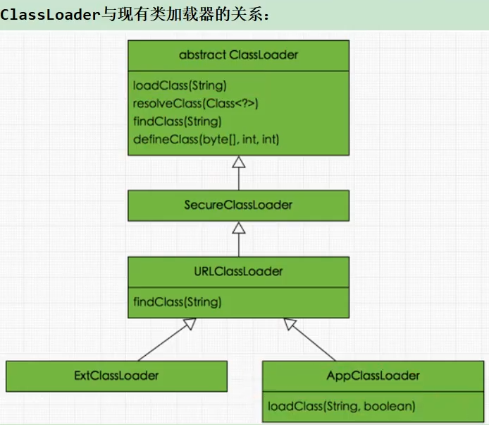

​           **是一个抽象类，其后所有的类加载器都继承于ClassLoader（不包括启动类加载器）**。

​	Java程序在运行的时候,[JVM](https://so.csdn.net/so/search?q=JVM&spm=1001.2101.3001.7020)通过**类加载机制(ClassLoader)**把class文件加载到内存中,只有class文件被载入内存,才能被其他class引用,使程序正确运行起来.

> 方法

+ getParent()：返回该类加载器的超类加载器。
+ loadClass(String name)：加载名称为name的类，返回结果为java.lang.Class的实例。
+ findClass(String name)：查找名称为name的类，返回结果为java.lang.Class的实例。

> 获取ClassLoader的途径

+ clazz.getClassLoader()：获取当前类的ClassLoader。
+ Thread.currentThread().getContextClassLoader()：获取当前线程上下文的ClassLoader。
+ ClassLoader.getSystemClassLoader()：获取系统的ClassLoader
+ DriverManager.getCallerClassLoader()：获取调用者的ClassLoader

##### Class.forName()与ClassLoader.loadClass()的区别

+ class.forname()：是一个**静态方法**，最常用的是`Class.forName(String classname)`；根据传入的类的全限定名返回一个Class对象。**该方法将Class文件加载到内存的同时，会执行类的初始化**。
+ ClassLoader.loadClass()：这是一个**实例方法**，需要一个CLassLoader对象来调用该方法。**该方法将CLass文件加载到内存时，并不会执行类的初始化，直到这个类第一次使用时才初始化**。因为该方法需要得到一个ClassLoader对象，所以可以根据需要指定使用哪个类的加载器。`ClassLoader cl = ....; cl.loadClass(com.myj.jvm.HelloWorld);`

---

### 双亲委派机制

> 概述

+ 各种类加载器之间的层次关系被称为类加载器的“双亲委派模型”。 
+ 双亲委派模型要求除了顶层的启动类加载器外， 其余的类加载器都应有自己的父类加载器。 
+ 这里类加载器之间的父子关系一般不是以**继承**（Inheritance） 的关系来实现的， 而是通常使用**组合**（Composition） 关系来复用父加载器的代码。
+ 并不是一个具有强制性约束力的模型。  
+ 在`java.lang.ClassLoader.loadClass(String,boolean)`接口中体现。

> 工作过程（原理）

​        当一个类加载器收到类加载的请求时，系统会首先判断当前类是否被加载过，已经被加载的类会直接返回，否则才会尝试加载。加载的时候，它首先不会自己去尝试加载这个类， 而是把这个请求委派给父类加载器的`loadClass()`去完成， 每一个层次的类加载器都是如此， 因此所有的加载请求最终都应该传送到最顶层的启动类加载器中， 只有当父加载器反馈自己无法完成这个加载请求（它的搜索范围中没有找到所需的类）时，子加载器才会尝试自己去完成加载。

> 好处

​        双亲委派模型保证了Java程序的稳定运行，**可以避免类的重复加载**（JVM 区分不同类的方式不仅仅根据类名，相同的类文件被不同的类加载器加载产生的是两个不同的类），**也保证了 Java 的核心 API 不被篡改**。如果没有使用双亲委派模型，而是每个类加载器加载自己的话就会出现一些问题，比如我们编写一个称为 `java.lang.Object` 类的话，那么程序运行的时候，系统就会出现多个不同的 `Object` 类。 

#### 破坏双亲委派模型

+ **破坏的诉求**：**有基础类型又要调用回用户的代码**

  一个典型的例子便是JNDI服务，JNDI现在已经是Java的标准服务，它的代码由启动类加载器来完成加载（在JDK 1.3时加入到rt.jar的），肯定属于Java中很基础的类型了。但JNDI存在的目的就是对资源进行查找和集中管理，它需要调用由其他厂商实现并部署在应用程序的ClassPath下的JNDI服务提供者接口（Service Provider Interface，SPI）的代码，现在问题来了，启动类加载器是绝不可能认识、加载这些代码的，那该怎么办？  

+ 自定义加载器的话，需要继承 `ClassLoader` 。重写 `loadClass()` 方法会打破双亲委派机制。如果我们不想打破双亲委派模型，就重写 `ClassLoader` 类中的 `findClass()` 方法(JDK1.2加入)即可，无法被父类加载器加载的类**最终会通过这个方法被加载**。

+ 为实现SPI服务，引入Thread Context ClassLoader 。Java中涉及SPI的服务使用这个**线程上下文类加载器**去加载所需的SPI服务代码， **这是一种父类加载器去请求子类加载器完成类加载的行为， 这种行为实际上是打通了双亲委派模型的层次结构来逆向使用类加载器**， 已经违背了双亲委派模型的一般性原则。 

+ 用户追求程序动态性：代码热替换、热部署... 

> 双亲委派的逆向调用

**SPI** ，全称为 Service Provider Interface，是一种服务发现机制。它通过在ClassPath路径下的META-INF/services文件夹查找文件，自动加载文件里所定义的类。

SPI 的本质是将接口实现类的全限定名配置在文件中，并由服务加载器读取配置文件，加载实现类。这样可以在运行时，动态为接口替换实现类。

Java SPI就是提供这样的一个机制：为某个接口寻找服务实现的机制。有点类似IOC的思想，就是将装配的控制权移到程序之外，在模块化设计中这个机制尤其重要。

​        Java中涉及SPI的加载基本上都采用这种方式来完成， 例如JNDI、JDBC、 JCE、 JAXB和JBI等。 不过， 当SPI的服务提供者多于一个的时候， 代码就只能根据具体提供者的类型来硬编码判断， 为了消除这种极不优雅的实现方式， 在JDK 6时， JDK提供了java.util.ServiceLoader类， 以META-INF/services中的配置信息， 辅以责任链模式， 这才算是给SPI的加载提供了一种相对合理的解决方案。 

---

#### 沙箱安全机制

+ 沙箱机制就是将Java代码限定在JVM特定的运行范围内，并且严格限制代码对本地系统资源的访问。通过这样的措施来保证对代码的有限隔离，防止对本地系统的破坏。
+ 沙箱主要限制系统资源访问，包括CPU、内存、文件系统、网络等。
+ 当前最新的安全机制实现，引入了**域**的概念。JVM会把所有代码加载到不同的系统域和应用域。

---

#### 热替换的实现

​        对Java来说，如果一个类已经加载到系统中，通过修改类文件，并无法让系统再来加载并重定义这个类。一个可行实现热替换的方法是灵活运用ClassLoader。（对JVM来说，不同ClassLoader加载的同名类属于不同的类型）

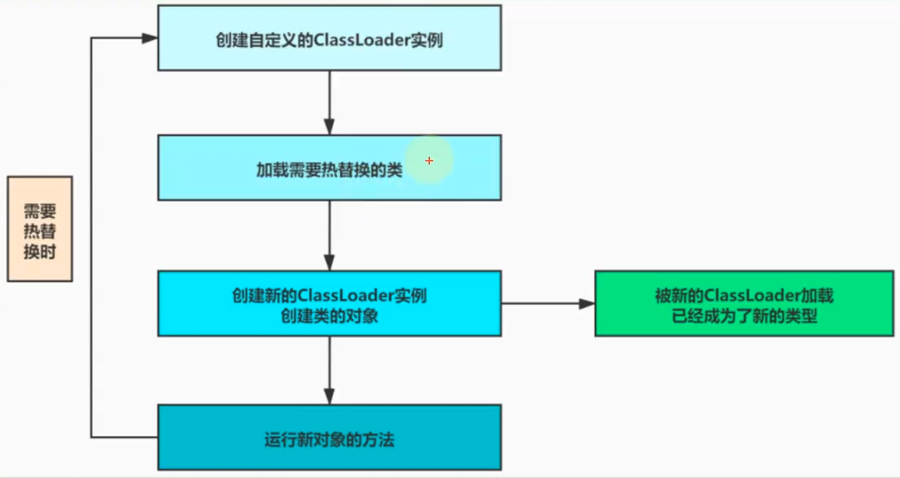

---

## 二、运行时数据区

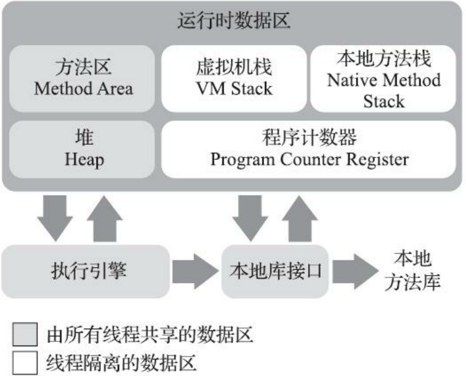

线程私有：程序计数器、虚拟机栈、本地方法栈。

线程间共享：堆、堆外内存（元空间、代码缓存）。

---

### 程序计数器

+ **线程私有**，可以看作是当前线程所执行的字节码的行号指示器，占用内存极小，**字节码解释器工作时通过改变这个计数器的值来选取下一条需要执行的字节码指令，分支、循环、跳转、异常处理、线程恢复等功能都需要依赖这个计数器来完成**。
+ 在多线程的情况下，程序计数器记录当前线程执行的位置，从而当线程被切换回来的时候能够知道该线程上次运行到哪儿了。
+ 如果线程正在执行一个Java方法，计数器记录正在执行字节码指令的地址。如果线程正在执行一个Native方法，计数器的值为空。

---

### Java虚拟机栈


> 概述

+ **线程私有**，生命周期与线程相同。**栈是运行时的单位，堆是存储的单位**。
+ 每个方法被执行时，Java虚拟机都会同步创建一个**栈帧**用于存储**局部变量表、操作数栈、动态连接、方法出口**等信息。方法从调用到执行完毕，对应一个栈帧入栈到出栈。**JVM对Java栈的操作只有：入栈、出栈**。
+ 由于跨平台设计，Java的指令都是根据栈来设计的。不同平台CPU架构不同，所以不能设计为基于寄存器的。
+ 优点是跨平台，指令集小，编译器容易实现。缺点是性能下降，实现同样的功能需要更多的指令。
+ 栈是一种快速有效的分配存储的方式，访问速度仅次于程序计数器。对栈来说，不存在GC的问题。

> 栈可能会出现的异常

《Java虚拟机规范》允许**Java栈的大小是动态的或者是固定不变的**。

+ 如果采用固定大小的JVM栈，那每一个线程的JVM栈容量可以在线程创建的时候独立选定。如果线程请求分配的栈容量超过JVM栈允许的最大容量，JVM会抛出一个**StackOverflowError**异常。
+ 如果JVM栈是可以动态扩展的，并且在尝试扩展的时候无法申请到足够的内存，或者在创建新的线程时没有足够的内存去创建对应的JVM栈，那么JVM会抛出一个**OutOfMemoryError**异常。

> 其他

+ **设置栈大小的指令：-Xss**

---

#### 运行时栈帧结构

> 概述

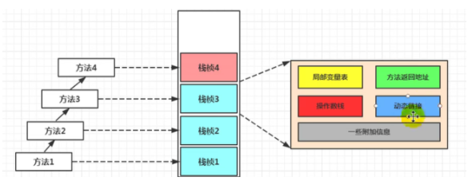

+ JVM以方法作为最基本的执行单元，**栈帧**则是用于支持JVM进行方法调用和方法执行背后的数据结构。
+ 每个栈帧都包括了**局部变量表、操作数栈、动态连接（或指向运行时常量池的方法引用）、方法返回地址和一些额外的附加信息**。
+ 在编译Java程序源码的时候，栈帧中需要多大的局部变量表，需要多深的操作数栈就已经被分析计算出来，并且写入到方法表的Code属性之中。换言之，一个栈帧需要分配多少内存，并不会受到程序运行期变量数据的影响，而仅仅取决于程序源码和具体的虚拟机实现的栈内存布局形式。
+ 同一时刻、 同一条线程里面 只会有一个活动的栈帧，称为**当前栈帧**，对应**当前方法**以及**当前类**。执行引擎运行的所有字节码指令只针对当前栈帧进行操作。

---

##### 局部变量表

+ 是一组变量值的存储空间， 用于存放**方法参数**和方法内部定义的**局部变量**。 由**数组**实现。
+ 在Java程序被编译为Class文件时， 就在方法的**Code属性的max_locals数据项**中确定了该方法所需分配的局部变量表的最大容量，即**局部变量表所需的容量大小是在编译期确定下来的**。   
+ 局部变量表的容量以**变量槽**（Slot）为最小单位，变量槽的长度可以随着处理器、 操作系统或虚拟机实现的不同而发生变化。  
+ 对于64位的数据类型（long、double），Java虚拟机会以**高位对齐**的方式为其分配两个连续的变量槽空间。由于局部变量表是建立在线程堆栈中的，属于线程私有的数据，无论读写两个连续的变量槽是否为原子操作，都不会引起**数据竞争**和**线程安全**问题。
+ Java虚拟机通过**索引定位**的方式使用局部变量表，索引值的范围是从0开始至局部变量表最大的变量槽数量。如果访问的是32位数据类型的变量， 索引N就代表了使用第N个变量槽， 如果访问的是64位数据类型的变量， 则说明会同时使用第N和N+1两个变量槽，同时不允许以任何方式单独访问其中一个。
+ 当一个方法被调用时，JVM使用局部变量表来完成**参数值到参数变量列表的传递**过程，即实参到形参的传递。如果执行实例方法，那第0位索引的变量槽默认是用于传递**方法所属对象实例的引用**，可以通过**this**来访问到这个隐含的参数。
+ **变量槽是可以重用的**，如果当前字节码PC计数器的值已经超出了某个变量的作用域， 那这个变量对应的变量槽就可以交给其他变量来重用。不过，会**直接影响到GC**（slot被复用之前，就算代码已经该变量的作用域，也不会被回收）。  
+ **局部变量表中的变量是重要的垃圾回收根节点，只要被局部变量表中直接或间接引用的对象都不会被回收**。

---

##### 操作数栈

+ 操作数栈的最大深度也在编译的时候被写入到Code属性的max_stacks数据项之中。Javac编译器的数据流分析工作保证了在方法执行的任何时候， 操作数栈的深度都不会超过在max_stacks数据项中设定的最大值。  
+ 操作数栈的每一个元素都可以是包括long和double在内的任意Java数据类型。32位数据类型所占的栈容量为1，64位数据类型所占的栈容量为2。
+ 操作数栈中元素的数据类型必须与字节码指令的序列严格匹配， 在编译程序代码的时候， 编译器必须要严格保证这一点， 在类校验阶段的数据流分析中还要再次验证这一点。
+ Java虚拟机的解释执行引擎被称为“基于栈的执行引擎”， 里面的“栈”就是操作数栈。       

> 栈顶缓存

​	由于基于栈式架构的虚拟机所使用的零地址指令更加紧凑，但完成一项操作的时候必然需要使用更多的入栈和出栈指令，这同时也就意味着需要更多的**指令分派（instruction dispatch）次数和内存读/写次数。**
由于操作数是存储在内存中的，因此频繁地执行内存读/写操作必然会影响执行速度。为了解决这个问题，HotSpot JVM的设计者们提出了栈顶缓存技术（ToS，Top-of-Stack Cashing），**将栈顶元素全部缓存在物理的CPU的寄存器中，以此降低对内存的读/写次数，提升执行引擎的执行效率**。

---

##### 动态连接

+ 每个栈帧都包含一个指向**运行时常量池**中<span style="background-color: yellow">该栈帧所属方法的引用</span>，持有这个引用是为了支持方法调用过程中的动态连接。
+ Class文件的常量池中存有大量的符号引用，字节码中的方法调用指令就以常量池里指向方法的符号引用作为参数。这些符号引用一部分会在类加载阶段或者第一次使用的时候就被转化为直接引用，这种转化被称为静态解析。（类加载的解析阶段）
+ **如果被调用的方法在编译期无法被确定下来**（如多态），将在每一次运行期间都转化为直接引用，这部分就称为动态连接。        

> 方法的绑定机制

<span style="background-color: yellow">绑定是一个字段、方法或者类在符号引用被替换为直接引用的过程，这仅仅发生一次。</span>

+ **早期绑定**：对应静态解析，即被调用的目标方法**如果在编译期可知，且运行期保持不变**时，即可将这个方法与所属的类型进行绑定。
+ **晚期绑定**：对应动态连接，即被调用的目标方法**无法在编译期被确定，只能在程序运行期根据实际的类型绑定相关的方法**。

> 非虚方法

如果方法在编译期就确定了具体的调用版本，且此版本在运行时不可变，这样的方法称为**非虚方法**。

+ 非虚方法：静态方法、私有方法、final方法、实例构造器、父类方法。
+ 其他方法为虚方法。

> 动态、静态类型语言

二者区别在于对类型的检查是在编译期还是在运行期。

+ 静态：Java...

+ 动态：JS、Python...

---

##### 方法返回地址

当一个方法开始执行后，有两种退出方式：

+ 正常调用完成：执行引擎遇到任何一个方法返回的字节码指令。
+ 异常调用完成：遇到异常。

​        无论哪种退出方式，在方法退出之后，都必须返回到最初方法被调用时的位置，程序才能继续执行。方法返回时可能需要在栈帧中保存一些信息，用来帮助恢复它的上层主调方法的执行状态。一般来说，方法正常退出时，主调方法的PC计数器的值就可以作为返回地址，栈帧中很可能会保存这个计数器值。而方法异常退出时，返回地址是要通过异常处理器表来确定的，栈帧中就一般不会保存这部分信息。 

---

##### 附加信息

+ 《Java虚拟机规范》 允许虚拟机实现增加一些规范里没有描述的信息到栈帧之中，例如与调试、性能收集相关的信息，这部分信息完全取决于具体的虚拟机实现。

+ 一般会把动态连接、 方法返回地址与其他附加信息全部归为一类， 称为栈帧信息。     

---

### 本地方法栈

​        本地方法栈（Native Method Stacks）与虚拟机栈所发挥的作用是非常相似的，其区别只是虚拟机栈为虚拟机执行Java方法（也就是字节码）服务，而本地方法栈则是为虚拟机使用到的本地（Native）方法服务。

+ 线程私有。
+ 具体做法：在Native Method Stack中登记native方法，在Execution Engine执行时加载本地方法库。
+ 当某个线程调用本地方法时，它就进入了一个全新的并且不再受虚拟机限制的世界，它和虚拟机拥有相同的权限。

> 为什么需要使用本地方法？  

+ 与Java环境外的交互。
+ 与操作系统交互。通过使用本地方法，我们得以用Java实现了jre与底层系统的交互，甚至JVM的某些部分就是用C写的。
+ Sun's Java。Sun的解释器是用C实现的，这使得它能像一些普通的C一样与外部交互。

---

### Java堆和栈的区别，为什么要这么设计(为什么要堆栈分离)

**区别：**

1. 栈内存存储的是局部变量而堆内存存储的是实体
2. 栈内存的更新速度要快于堆内存，因为局部变量的生命周期很短
3. 栈内存存放的变量生命周期一旦结束就会被释放，而堆内存存放的实体会被垃圾回收机制不定时回收。

**为什么要这么设计(堆栈分离)**：

（1）从软件设计的角度来看，**栈代表了处理逻辑**，而**堆代表了数据**，这样**分离使得处理逻辑更为清晰**。这种**隔离、模块化的思想在软件设计的方方面面都有体现**。

（2）堆与栈的分离，使得**堆中的内容可以被多个栈共享。这种共享有很多好处，一方面提供了一种有效的数据交互方式（如内存共享），另一方面，节省了内存空间**。

（3）栈因为运行时的需要（如保存系统运行的上下文），需要进行址段的划分。由于栈只能向上增长，因此会限制住栈存储内容的能力。而堆不同，堆的大小可以根据需要动态增长。因此，堆与栈的分离，使得动态增长成为可能，相应栈中只需要记录堆中的一个地址即可。

（4）堆和栈的完美结合就是面向对象的一个实例。其实，面向对象的程序与以前结构化的程序在执行上没有任何区别，但是面向对象的引入使得对待问题的思考方式发生了改变，是更接近于自然的思考方式。当把对象拆开会发现，对象的属性其实就是数据，存放在堆中，而对象的方法就是处理逻辑，存放在栈中。我们编写对象的时候，其实即编写了数据结构，也编写了处理数据的逻辑。

​	总结：**栈主要用来执行程序，堆主要用来存放对象，为栈提供数据存储服务。也正是因为堆与栈分离的思想才使得JVM的垃圾回收成为可能**。

### Java堆

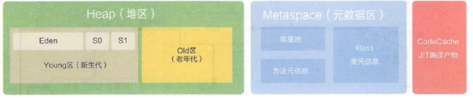

> 概述

+ Java堆是虚拟机所管理的内存中最大的一块，线程共享。唯一目的：**存放对象实例**。

+ **几乎**所有的对象实例以及数组都应当在堆上分配 ，但是，随着JIT编译期的发展与逃逸分析技术逐渐成熟，栈上分配、标量替换优化技术将会导致一些微妙的变化，所有的对象都分配到堆上也渐渐变得不那么“绝对”了。从**JDK 1.7开始已经默认开启逃逸分析**，如果某些方法中的对象引用没有被返回或者未被外面使用（也就是未逃逸出去），那么对象可以直接在栈上分配内存。

+ Java堆可以处于物理上不连续的内存空间中， 但在逻辑上它应该被视为连续的。

+ Java堆既可以被实现成固定大小的，也可以是可扩展的，不过当前主流的Java虚拟机都是按照可扩展来实现的（通过参数`-Xms // memory start用来设置堆空间的初始内存大小`和`-Xmx //设置最大内存大小`设定）。如果在Java堆中没有内存完成实例分配，并且堆也无法再扩展时，Java虚拟机将会抛出`OutOfMemoryError`异常。   

+ 在堆中new的对象**几乎**都在Eden区，但是超大对象直接放Old区。 

  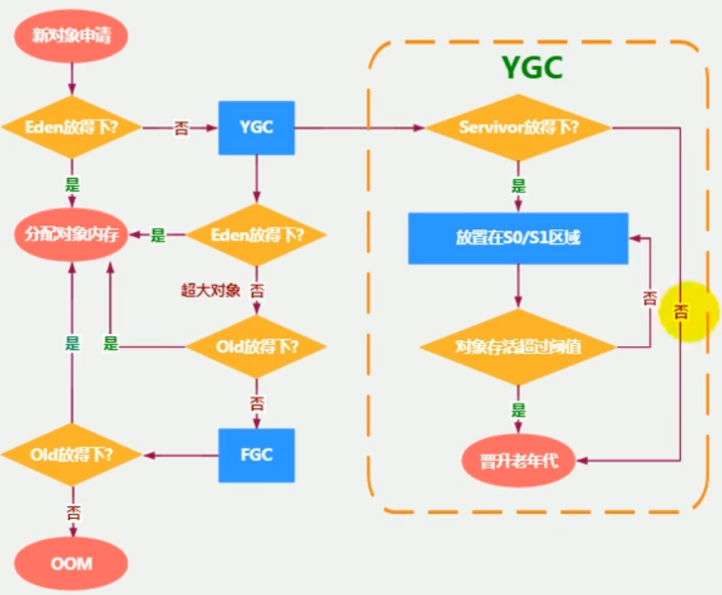

##### 将年轻代划分出survivor区的作用

​	所以在「堆内存」划分中，将年轻代划分出Survivor区（Survivor From 和Survivor To），⽬的就是为了**有⼀块完整的内存空间供垃圾回收器进⾏拷⻉(移动)**  ，而新的对象则放入eden区。

> 出现的错误

堆这里最容易出现的就是 `OutOfMemoryError`错误，并且出现这种错误之后的表现形式还会有几种，比如：

1. **`OutOfMemoryError: GC Overhead Limit Exceeded`** ： 当JVM花太多时间执行垃圾回收并且只能回收很少的堆空间时，就会发生此错误。
2. **`java.lang.OutOfMemoryError: Java heap space`** ：假如在创建新的对象时, 堆内存中的空间不足以存放新创建的对象, 就会引发该错误。(和本机物理内存无关，和你配置的内存大小有关！)

---

##### CPU100%问题如何快速定位

1. 找到最耗CPU的进程；
   - 执行top -c ，显示进程运行信息列表
   - 键入P (大写p)，进程按照CPU使用率排序
2. 找到最耗CPU的线程；
   - top -Hp ，显示一个进程的线程运行信息列表
   - 键入P (大写p)，线程按照CPU使用率排序
3. 查看堆栈，定位线程在干嘛，定位对应代码
   - 首先，将线程PID转化为16进制。**工具**：printf**方法**：printf "%xn
   - 查看堆栈，找到线程在干嘛。**工具**：jstack**方法**：jstack 10765 | grep '0x2a34' -C5 --color

---

#### 逃逸分析

> 概述

+ 逃逸分析(Escape Analysis)是即时编译器优化技术中一个十分重要的手段。这是一种可以有效减少Java 程序中同步负载和内存堆分配压力的跨函数全局数据流分析算法。通过逃逸分析，Java Hotspot编译器能够分析出**一个新的对象的引用的使用范围**，从而决定**是否要将这个对象分配到堆上**。
+ 逃逸分析的**基本行为就是分析对象动态作用域**：当一个对象在方法中被定义后，它可能被外部方法所引用，例如作为调用参数传递到其他地方中，称为方法逃逸。
+ this逃逸：this逃逸是指在构造函数返回之前其他线程就持有该对象的引用，调用尚未构造完成的对象的方法可能引起奇怪的问题。
+ HotSpot并未使用，目前所有的对象实例还是在堆上分配的。 

> 例如：
>

```java
public static StringBuffer craeteStringBuffer(String s1, String s2) {
    StringBuffer sb = new StringBuffer();
    sb.append(s1);
    sb.append(s2);
    return sb;
}
```

StringBuffer sb是一个方法内部变量，上述代码中直接将sb返回，这样这个StringBuffer有可能被其他方法所改变，这样它的作用域就不只是在方法内部，虽然它是一个局部变量，称其逃逸到了方法外部。甚至还有可能被外部线程访问到，譬如赋值给类变量或可以在其他线程中访问的实例变量，称为**线程逃逸**。

```java
public static String createStringBuffer(String s1, String s2) {
    StringBuffer sb = new StringBuffer();
    sb.append(s1);
    sb.append(s2);
    return sb.toString();
}
```

不直接返回 StringBuffer，那么StringBuffer将不会逃逸出方法。

> 使用逃逸分析，编译器可以对代码做如下优化：

+ **同步省略**。JIT编译器借助逃逸分析后发现，如果一个对象被发现只能从一个线程被访问到，那么对于这个对象的操作可以不考虑同步，叫做同步省略，也成锁消除。因为线程同步的代价很高，会降低并发性和性能。

+ **栈上分配**。如果经过逃逸分析后发现，一个对象并没有逃逸出方法的话，那么就可能被优化成栈上分配。

+ **分离对象或标量替换**。标量是指一个无法再分解成更小数据的数据，与之对应的是聚合量。有的对象可能不需要作为一个连续的内存结构存在也可以被访问到，那么对象的部分（或全部）可以不存储在内存，而是存储在CPU寄存器中。

---

### 方法区

> 概述

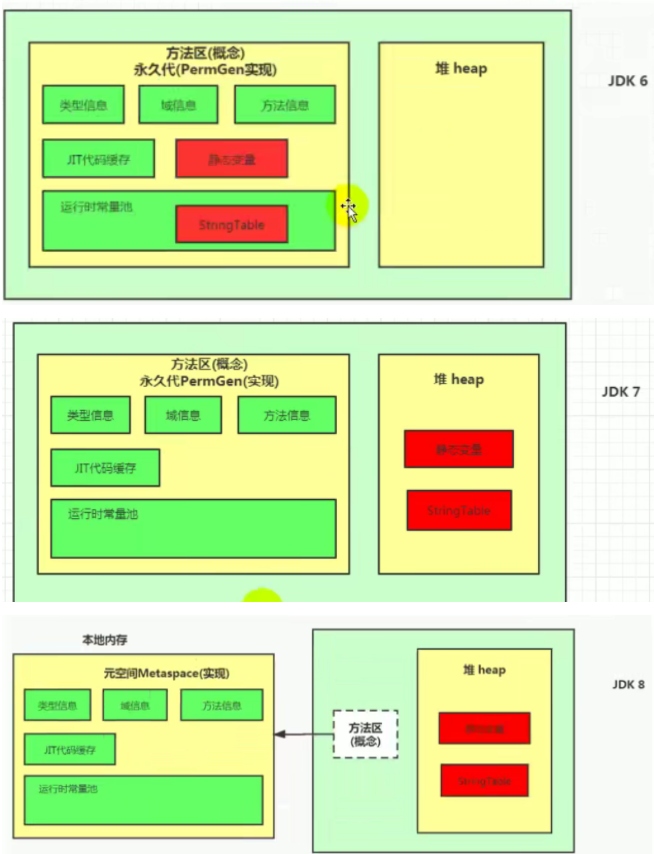

​	⽅法区主要是⽤来存放已被虚拟机加载的「类相关信息」：包括类信息、常量池  ，类信息⼜包括了类的版本、字段、⽅法、接⼝和⽗类等信息。  常量池⼜可以分「静态常量池」和「运⾏时常量池」，静态常量池主要存储的是「字⾯量」以及「符号引⽤」等信息，静态常量池也包括了我们说的「字符串常量池」。  运⾏时常量池」存储的是「类加载」时⽣成的「直接引⽤」等信息。  

​	但⾃从在「JDK7」以后，就已经把「运⾏时常量池」和「静态常量池」转移到了「堆」内存中进⾏存储（对于「物理分区」来说「运⾏时常量池」和「静态常量池』就属于堆）  

+ 线程共享，用于存储**已被虚拟机加载**的**类型信息、常量、静态变量、即时编译器编译后的代码缓存**等数据。

  

+ 虽然《Java虚拟机规范》中把方法区描述为堆的一个逻辑部分，但是它却有一个别名叫作“非堆”（Non-Heap），目的是与Java堆区分开来。 

+ JDK6有了放弃永久代，逐步采用本地内存的计划——>JDK7，已经把原本放在永久代的字符串常量池、静态变量等移出——>JDK8，完全废弃了永久代，采用在本地内存中实现的元空间（Metaspace）来代替。    

+ `-XX:MetaspaceSize`、`-XX:MaxMetaspaceSize`：设置初始和最大的元空间大小。

---

#### 方法区的演进细节

+ JDK1.6及之前：有永久代，静态变量存放在永久代上。
+ JDK1.7：有永久代，但已经逐步“去永久代”，字符串常量池、静态变量移除，保存在堆中。
+ JDK1.8及之后：无永久代，类型信息、字段、方法、常量保存在本地内存的元空间，但字符串常量池、静态变量仍在堆中。

---

#### 方法区的实现从永久代变成元空间有什么区别？

​	最主要的区别就是：元空间存储不在虚拟机中，而是使用本地内存，JVM不会再出现方法区的内存溢出，以往永久代经常因为内存不够，导致抛出OOM异常。

#### 永久代为何被元空间替代？

+ 为永久代设置空间大小比较困难：比如在某些场景下，动态加载类过多，容易产生Prem区的OOM。
+ 对永久代进行调优比较困难。

#### StringTable为什么要调整？

​        JDK1.7中，将StringTable放到了堆空间中，因为永久代的回收效率很低，只有在full gc的时候才会触发。而full gc是老年代、永久代不足的时候才会触发。但是实际开发中会有大量的字符串被创建，回收效率低，导致永久代内存不足。

---

#### 运行时常量池

+ 运行时常量池是方法区的一部分。Class文件中除了有类的版本、字段、方法、接口等描述信息外，还有一项信息是常量池表（Constant Pool Table），用于**存放编译期生成的各种字面量与符号引用**，这部分内容将在类加载后存放到**方法区的运行时常量池中**。
+ Java虚拟机对于Class文件每一部分（自然也包括常量池） 的格式都有严格规定，如每一个字节用于存储哪种数据都必须符合规范上的要求才会被虚拟机认可、加载和执行，但对于运行时常量池，《Java虚拟机规范》 并没有做任何细节的要求。不过一般来说，除了保存Class文件中描述的符号引用外，还会把由符号引用翻译出来的直接引用也存储在运行时常量池中。
+ 运行时常量池是方法区的一部分，自然受到方法区内存的限制，当常量池无法再申请到内存时会抛出OutOfMemoryError异常。          

> 常量池与运行时常量池

+ 常量池是Class文件的一部分，用于存放编译期生成的各种字面量和符号引用，在加载类型到JVM后，就会创建对应的运行时常量池。
+ 运行时常量池除了包含编译期已经明确的量，也包括运行期解析之后才能获得的方法或者字段引用。此时不再是常量池中的符号引用了，而是真实地址。

---

### 直接内存

+ 直接内存（Direct Memory）并不是虚拟机运行时数据区的一部分，也不是《Java虚拟机规范》中定义的内存区域。但是这部分内存也被频繁使用，而且也可能导致OutOfMemoryError异常出现。
+ 其大小不受-Xmx指定的最大堆大小，不受JVM内存回收管理。可以通过`MaxDirectMemorySize`设置，默认与堆的最大值一致。
+ **来源于NIO**：在JDK 1.4中新加入了NIO（New I/O）类，引入了一种基于通道（Channel）与缓冲区（Buffer）的I/O方式（传统的IO基于流），它可以使用Native函数库直接分配堆外内存，然后通过一个**存储在Java堆里面的DirectByteBuffer对象**作为这块内存的引用进行操作。 这样能在一些场景中显著提高性能， 因为避免了在Java堆和Native堆中来回复制数据。      
+ 通常访问直接内存的速度会优于Java堆，即读写性能高。

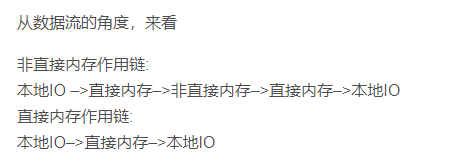

##### 直接内存使用场景

- 有很大的数据需要存储，它的生命周期很长
- 适合频繁的io操作，例如网络并发场景

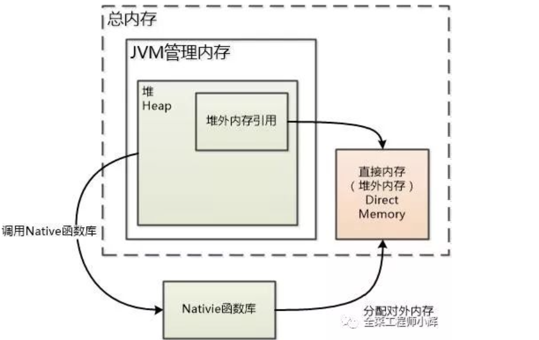

---

## 三、对象的实例化

### 创建对象的方式

+ new
+ Class的newInstance()：反射的方式，只能调用空参构造器，权限必须是public，在JDK9已经过时，改成了下面这个。
+ Constructor的newInstance(xxx)：反射的方式，可以调用带参构造器，权限没有要求。
+ 使用clone：不调用任何构造器，当前类需要事先Cloneable接口，事先clone()。
+ 使用反序列化：从文件、网络等中获取对象的二进制流。
+ 第三方库Objenesis

---

### 创建对象的步骤(过程)

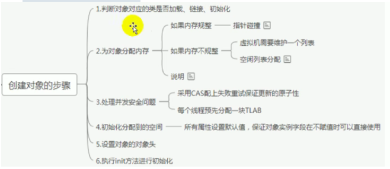

> 对象创建的过程


---

#### Step1：类加载检查(判断对象对应的类是否加载、连接、初始化)

​        当Java虚拟机遇到一条字节码new指令时，首先将去检查这个指令的参数是否能在常量池中定位到一个类的符号引用，并且检查这个符号引用代表的类是否已被加载、解析和初始化过。如果没有，那必须先执行相应的类加载过程 。

---

#### Step2：分配内存

​        在类加载检查通过后，接下来虚拟机将为新生对象分配内存。对象所需内存的大小在**类加载完成后便可完全确定**，为对象分配空间的任务实际上便等同于把一块确定大小的内存块从Java堆中划分出来。**分配方式**有 **“指针碰撞”** 和 **“空闲列表”** 两种：

##### 指针碰撞

​		GC收集器：Serial、ParNew

​        假设Java堆中内存是绝对规整的，所有被使用过的内存都被放在一边，空闲的内存被放在另一边，中间放着一个指针作为分界点的指示器，那所分配内存就仅仅是把那个指针向空闲空间方向挪动一段与对象大小相等的距离，这种分配方式就叫做指针碰撞。

##### 空闲列表

​		GC收集器：CMS

​        如果Java堆中的内存并不是规整的， 已被使用的内存和空闲的内存相互交错在一起， 那就没有办法简单地进行指针碰撞了， 虚拟机就必须维护一个列表， 记录上哪些内存块是可用的， 在分配的时候从列表中找到一块足够大的空间划分给对象实例， 并更新列表上的记录， 这种分配方式称为空闲列表。   

##### 如何选择分配方式？

​        选择哪种分配方式由Java堆是否规整决定，而Java堆是否规整又由所采用的**垃圾收集器是否带有空间压缩整理的能力**决定。

​        因此，当使用Serial、 ParNew等带压缩整理过程的收集器时，系统采用的分配算法是指针碰撞， 既简单又高效；而当使用CMS这种基于清除算法的收集器时，理论上就只能采用较为复杂的空闲列表来分配内存。

##### 内存分配的并发问题  

​        堆区是线程共享区域，任何线程都可以访问到堆区中的共享数据。由于在实际开发过程中，对象实例的创建在JVM中十分频繁，因此在并发环境下从堆区中划分空间是线程不安全的。所以为了避免多个线程操作同一地址，需要使用加锁等机制（但是会影响速度，所以有了TLAB）：

- **CAS+失败重试：** CAS 是乐观锁的一种实现方式。所谓乐观锁就是，每次不加锁而是假设没有冲突而去完成某项操作，如果因为冲突失败就重试，直到成功为止。**虚拟机采用 CAS 配上失败重试的方式保证更新操作的原子性。**
- **TLAB（本地线程分配缓冲 ）：** 预先在 Eden 区为每一个线程分配一小块私有缓存区域，JVM 在给线程中的对象分配内存时，首先在 TLAB 分配，只有本地缓冲区用完了，分配新的缓存区时才需要同步锁定（即采用上述方式）。 虚拟机是否使用TLAB， 可以通过`-XX： +/-UseTLAB`参数来设定，默认只占Eden的1%。  

##### 内存分配策略（对象Promotion策略）

+ 优先分配到Eden。
+ 大对象直接分配到Old，为了避免为大对象分配内存时由于分配担保机制带来的复制而降低效率。（应避免程序中出现过多的大对象）
+ 长期存活的对象分配到Old。
+ 动态对象年龄判断。如果Survivor区中相同年龄的所有对象大小的总和大于Survivor空间的一半，年龄大于等于该年龄的对象可以直接进入老年代，无须等到`MaxTenuringThreshold`中要求的年龄。
+ 空间分配担保。`-XX:HandlePromotionFailure`（已失效）
  1. 在发生 Minor GC 之前，虚拟机先检查老年代最大可用的连续空间是否大于新生代所有对象总空间，如果条件成立的话，那么 Minor GC 可以确认是安全的。
  2. 如果不成立的话虚拟机会继续检查老年代最大可用的连续空间是否大于历次晋升到老年代对象的平均大小，如果大于，将尝试着进行一次 Minor GC；如果小于就要进行一次 Full GC。

---

#### Step3：初始化零值

​        内存分配完成之后，虚拟机必须将分配到的内存空间（但不包括对象头） 都初始化为零值 。这一步操作保证了对象的实例字段在 Java 代码中可以不赋初始值就直接使用，程序能访问到这些字段的数据类型所对应的零值。

​        如果使用了TLAB的话， 这一项工作也可以提前至TLAB分配时顺便进行。   

---

#### Step4：设置对象头

​        初始化零值完成之后，**虚拟机要对对象进行必要的设置**，例如这个对象是哪个类的实例、如何才能找到类的元数据信息、对象的哈希码、对象的 GC 分代年龄等信息。 **这些信息存放在对象头中。** 另外，根据虚拟机当前运行状态的不同，如是否启用偏向锁等，对象头会有不同的设置方式。

---

#### Step5：执行init()方法

​        在上面工作都完成之后，从虚拟机的视角来看，一个新的对象已经产生了，但从 Java 程序的视角来看，对象创建才刚开始：构造函数，即Class文件中的`<init>` 方法还没有执行，所有的字段都还为零。所以一般来说，执行 new 指令之后会接着执行 `<init>` 方法，把对象按照程序员的意愿进行初始化，这样一个真正可用的对象才算完全产生出来。

---

### 对象的内存布局

在 Hotspot 虚拟机中，对象在内存中的布局可以分为 3 块区域：**对象头**、**实例数据**和**对齐填充**。

#### 1、对象头

​        包括两类信息**，**第一类用于**存储对象自身的运行时数据**（哈希码、GC 分代年龄、锁状态标志、线程持有的锁、偏向时间戳...），另一类是**类型指针**，即对象指向它的类元数据的指针，虚拟机通过这个指针来确定这个对象是哪个类的实例。

#### 2、实例数据

​        实例数据部分是**对象真正存储的有效信息**，即我们在程序代码里面所定义的各种类型的字段内容，无论是从父类继承下来的，还是在子类中定义的字段都必须记录起来。  

#### 3、对齐填充

​        对象的第三部分是**对齐填充**，这并不是必然存在的，也没有特别的含义，它仅仅起着**占位符**的作用。 因为 Hotspot 虚拟机的自动内存管理系统要求对象起始地址**必须是 8 字节的整数倍**，换句话说就是对象的大小必须是 8 字节的整数倍。而对象头部分正好是 8 字节的倍数（1 倍或 2 倍），因此，当对象实例数据部分没有对齐时，就需要通过对齐填充来补全。   

例子：

```java
public class Customer{
    int id = 1001;
    String name;
    Account acct;
    {
        name = "匿名客户";
    }
    public Customer(){
        acct = new Account();
    }
}

public class Test{
    public static void main(String[] args){
        Customer cust = new Customer();
    }
}

//局部变量表不用放this，因为是静态的，第一个就放args
```


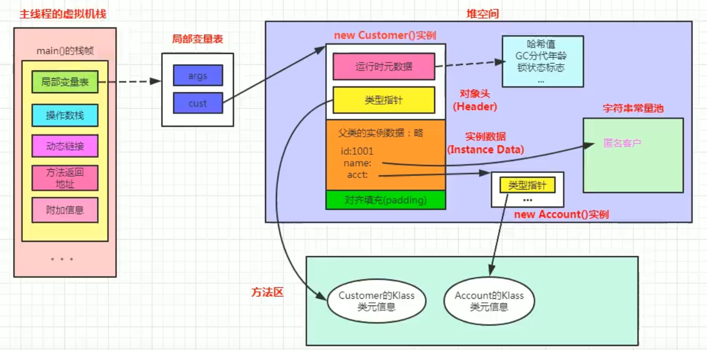

---

### 对象的访问定位

​        创建对象是为了使用对象，Java程序会通过**栈上的reference数据**来操作堆上的具体对象。由于reference类型在《Java虚拟机规范》 里面只规定了它是一个指向对象的引用，所以对象访问方式也是由虚拟机实现而定的，主流的访问方式主要有**使用句柄**和**直接指针**两种：      

#### 1、使用句柄

​        如果使用句柄的话，那么 Java 堆中将会划分出一块内存来作为句柄池，**reference 中存储的就是对象的句柄地址**，而句柄中包含了对象实例数据与类型数据各自的具体地址信息。

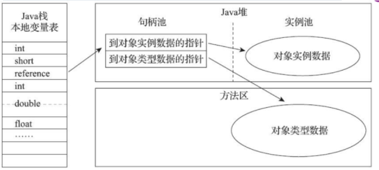

#### 2、直接指针

​        如果使用直接指针访问，那么 Java 堆对象的布局中就必须考虑如何放置访问类型数据的相关信息，而 **reference 中存储的直接就是对象的地址**。

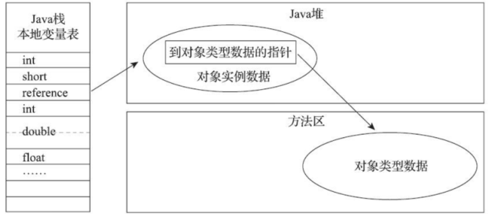

> 两种方式的优劣

​       这两种对象访问方式各有优势，使用句柄来访问的最大好处就是reference中存储的是稳定句柄地址，在对象被移动（垃圾收集时移动对象是非常普遍的行为） 时只会改变句柄中的实例数据指针，而reference本身不需要被修改。

​       使用直接指针来访问最大的好处就是速度更快，它节省了一次指针定位的时间开销，由于对象访问在Java中非常频繁，因此这类开销积少成多也是一项极为可观的执行成本。

​        **HotSpot主要使用第二种方式进行对象访问**。

---

## 四、垃圾收集

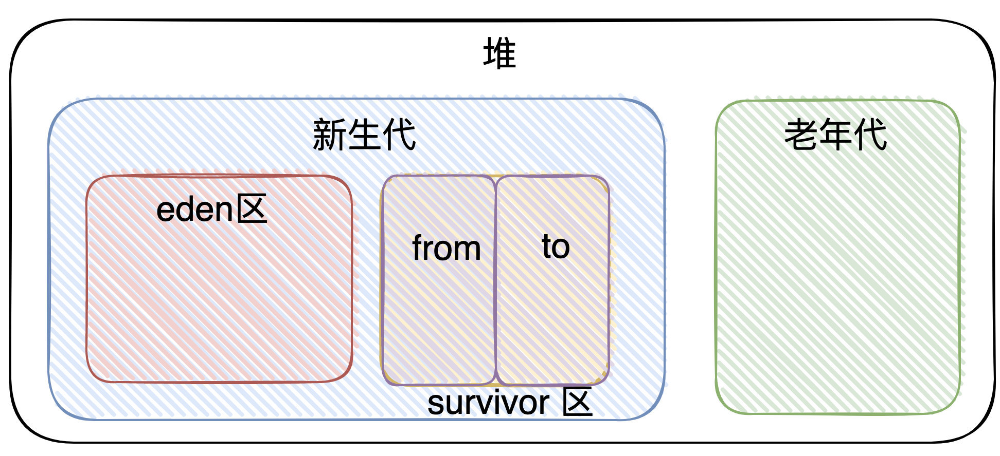

​	**Java垃圾回收是Java程序执行自动内存管理的过程**。当Java程序在JVM上运行时，将在堆上创建对象，当这些对象不再使用时，垃圾收集器找到这些需要回收的对象(垃圾)将其删除以释放内存。

### 对象是否需要回收？

​	堆中几乎放着所有的对象实例，对堆垃圾回收前的第一步就是要判断哪些对象已经死亡（即**不能再被任何途径使用的对象就是垃圾，对象所占用的空间就可以被回收**）。

**判断对象不再被使用的算法**：**引用计数法**、**可达性分析法**

---

#### 引用计数法

给对象中添加一个引用计数器，每当有一个地方引用它，计数器就加 1；当引用失效，计数器就减 1；任何时候计数器为 0 的对象就是不可能再被使用的。

**这个方法实现简单，效率高，但是目前主流的虚拟机中并没有选择这个算法来管理内存，其最主要的原因是它很难解决对象之间相互循环引用的问题。**

---

#### 可达性分析算法

这个算法的基本思想：通过一系列的称为 **“GC Roots”** 的对象作为起点，从这些节点开始向下搜索，节点所走过的路径称为引用链，当一个对象到 GC Roots 没有任何引用链相连的话，则证明此对象是不可用的。

> 可作为 GC Roots 的对象包括下面几种：
>

- **虚拟机栈(栈帧中的本地变量表)中引用的对象**，譬如各个线程被调用的方法堆栈中使用到的参数、 局部变量、 临时变量等。  
- **本地方法栈(Native 方法)中引用的对象**。
- **方法区中类静态属性引用的对象**，譬如Java类的引用类型静态变量 。
- **方法区中常量引用的对象**，譬如字符串常量池（String Table） 里的引用。  
- 所有被同步锁持有的对象。
- Java虚拟机内部的引用，如基本数据类型对应的Class对象，一些常驻的异常对象（如NullPointExcepiton、 OutOfMemoryError）等，还有系统类加载器。
- 反映Java虚拟机内部情况的JMXBean、 JVMTI中注册的回调、 本地代码缓存等。      

​       除了这些固定的GC Roots集合以外，根据用户所选用的垃圾收集器以及当前回收的内存区域不同，还可以有其他对象“**临时性**”地加入，共同构成完整GC Roots集合。（跨Region）   

---

#### 引用强度分类

**1．强引用（StrongReference）**

+ 以前我们使用的大部分引用实际上都是强引用，这是使用最普遍的引用。无论任何情况下，只要强引用关系还存在，垃圾收集器就永远不会回收掉被引用的对象。  当内存空间不足，Java 虚拟机宁愿抛出 OutOfMemoryError 错误，使程序异常终止，也不会靠随意回收具有强引用的对象来解决内存不足问题。

**2．软引用（SoftReference）**

+ 用来描述还有用，但非必须的对象。在系统将要发生内存溢出异常前， 会把这些对象列进回收范围之中进行第二次回收。软引用可用来实现内存敏感的高速缓存。

+ 软引用可以和一个引用队列（ReferenceQueue）联合使用，如果软引用所引用的对象被垃圾回收，JVM就会把这个软引用加入到与之关联的引用队列中。

**3．弱引用（WeakReference）**

+ 比如软引用更弱。弱引用与软引用的区别在于：只具有弱引用的对象拥有更短暂的生命周期。在垃圾回收器线程扫描它所管辖的内存区域的过程中，一旦发现了只具有弱引用的对象，不管当前内存空间足够与否，都会回收它的内存。不过，由于垃圾回收器是一个优先级很低的线程， 因此不一定会很快发现那些只具有弱引用的对象。

+ 弱引用可以和一个引用队列（ReferenceQueue）联合使用，如果弱引用所引用的对象被垃圾回收，JVM就会把这个弱引用加入到与之关联的引用队列中。

**4．虚引用（PhantomReference）**

+ "虚引用"顾名思义，就是形同虚设，与其他几种引用都不同，虚引用并不会决定对象的生命周期。如果一个对象仅持有虚引用，那么它就和没有任何引用一样，在任何时候都可能被垃圾回收。为一个对象设置虚引用关联的**唯一目的**只是为了能在这个对象被收集器回收时收到一个系统通知。   

+ **虚引用与软引用和弱引用的一个区别在于：** 虚引用必须和引用队列（ReferenceQueue）联合使用。当垃圾回收器准备回收一个对象时，如果发现它还有虚引用，就会在回收对象的内存之前，把这个虚引用加入到与之关联的引用队列中。程序可以通过判断引用队列中是否已经加入了虚引用，来了解被引用的对象是否将要被垃圾回收。程序如果发现某个虚引用已经被加入到引用队列，那么就可以在所引用的对象的内存被回收之前采取必要的行动。

特别注意，在程序设计中一般很少使用弱引用与虚引用，使用软引用的情况较多，这是因为**软引用可以加速 JVM 对垃圾内存的回收速度，可以维护系统的运行安全，防止内存溢出（OutOfMemory）等问题的产生**。

---

#### 不可达对象不是非死不可

> 要真正宣告一个对象死亡，至少要经历两次标记过程：

1. 如果对象在进行可达性分析后发现没有与GC Roots相连接的引用链，那它将会被第一次标记。
2. 随后进行一次筛选，筛选的条件是此对象是否有必要执行finalize()方法。 **假如对象没有覆盖finalize()方法，或者finalize()方法已经被虚拟机调用过，那么虚拟机将这两种情况都视为“没有必要执行**”。  

> 是否被执行死刑：

1. 如果这个对象被判定为确有必要执行finalize()方法，那么该对象将会被放置在一个名为F-Queue的队列之中，并在稍后由一条由虚拟机自动建立的、低调度优先级的Finalizer线程去执行它们的finalize()方法。   
2. finalize()方法是对象逃脱死亡命运的最后一次机会，稍后收集器将对F-Queue中的对象进行第二次小规模的标记，如果对象要在finalize()中成功拯救自己——只要重新与引用链上的任何一个对象建立关联即可，譬如把自己（this关键字）赋值给某个类变量或者对象的成员变量，那在第二次标记时它将被移出“即将回收”的集合；如果对象这时候还没有逃脱，那基本上它就真的要被回收了。   

当然，不建议使用finalize()方法去拯救对象，finalize()能做的所有工作， 使用try-finally或者其他方式都可以做得更好、更及时。  

---

#### 方法区的GC、如何判断类没用了？

方法区的GC主要涉及：**常量池中废弃的常量、不再使用的类型**。

+ 常量能否被回收的判定：只要不被使用，就可以回收了。
+ 类型能否被回收的判定：1、该类所有的实例都已经被回收。2、该类的类加载器已经被回收。3、该类对应的`java.lang.Class`对象没有在任何地方被引用。

---

### 垃圾收集算法

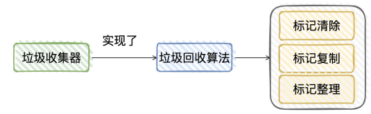

#### 分代收集理论

> 基于三个假说：

+ 弱分代假说（Weak Generational Hypothesis）：绝大多数对象都是朝生夕灭的。  
+ 强分代假说（Strong Generational Hypothesis）：熬过越多次垃圾收集过程的对象就越难以消亡。
+ 跨代引用假说（ Intergenerational Reference Hypothesis）：跨代引用相对于同代引用来说仅占极少数。（存在互相引用关系的两个对象， 是应该倾向于同时生存或者同时消亡的  ）   

#### 为什么需要分代

​	大部分对象都死得早，只有少部分对象会存活很长时间，在堆内存上都会物理或逻辑上进行分代，为了使stop the world持续的时间尽可能短以及提高并发式GC所能应付的内存分配速率。

> 分类

+ 部分收集（Partial GC）
  1. 新生代收集（Minor GC/Young GC）：通常能单独发生收集行为的只是新生代 。
  2. 老年代收集（Major GC/Old GC）：目前只有**CMS收集器会有单独收集老年代的行为**。有些资料Major GC与Full GC同义。   
  3. 混合收集（Mixed GC）：指目标是收集**整个新生代以及部分老年代的垃圾收集。 目前只有G1收集器会有这种行为**。  

+ 整堆收集（Full GC）

​        分代收集理论也有其缺陷，最新出现（ 或在实验中）的几款垃圾收集器都展现出了面向全区域收集设计的思想，或者可以支持全区域不分代的收集的工作模式。  

##### 新生代什么时候会变成老年代

1. 如果对象太大了，就会直接进入老年代(对象创建很大或者Survivor区没法存下该对象)
2. 如果对象太老了，就会晋升老年代(每发生一次Minor GC，存活的对象年龄+1，达到默认值15则晋升老年代)

##### 什么时候触发Minor GC

​	当Eden空间不足时，就会触发Minor GC。存活下来的对象，则会被送到Survivor区，当放生Minor GC时，Eden区和from survivor区的存活对象会被复制到to Survivor区，然后交换from和to指针，以保证下一次Minor GC时to指向的Survivor区还是空的。年轻代GC不关心老年代对象。

##### 什么时候触发major gc

Major GC触发：**老年代空间不足时，会尝试触发Minor GC。如果之后空间还不足，则触发Major GC**。如果Major GC后内存还不足，就报OOM了。

---

#### 标记-清除算法

+ 算法分为“标记”和“清除”阶段：首先标记出所有需要回收的对象，在标记完成后，统一回收掉所有被标记的对象，也可以反过来，标记存活的对象，统一回收所有未被标记的对象。
+ 它是最基础的收集算法，后续的算法都是对其不足进行改进得到。这种垃圾收集算法会带来两个明显的问题：
  1. **执行效率不稳定**：如果有大量对象需要回收，需要进行大量的标记和清除动作，导致效率随对象数量增长而降低 。
  2. **内存空间的碎片化**：标记、清除之后会产生大量不连续的内存碎片，空间碎片太多可能会导致当以后在程序运行过程中需要分配较大对象时无法找到足够的连续内存而不得不提前触发另一次垃圾收集动作。   

---

#### 标记-复制算法（Young区用）

+ 目的：为了解决标记-清除算法面对大量可回收对象时执行效率低的问题。
+ 将内存分为大小相同的两块，每次使用其中的一块。当这一块的内存使用完后，就将还存活的对象复制到另一块去，然后再把使用的空间一次清理掉。这样就使每次的内存回收都是对内存区间的一半进行回收。
+ **现在的商用Java虚拟机大多都优先采用了这种收集算法去回收新生代**，HotSpot虚拟机默认Eden和Survivor的大小比例是8∶1 (不是最初的1:1)。
+ 当Survivor空间不足以容纳一次Minor GC之后存活的对象时，就需要依赖其他内存区域（实际上大多就是老年代）进行分配担保（Handle Promotion）。   

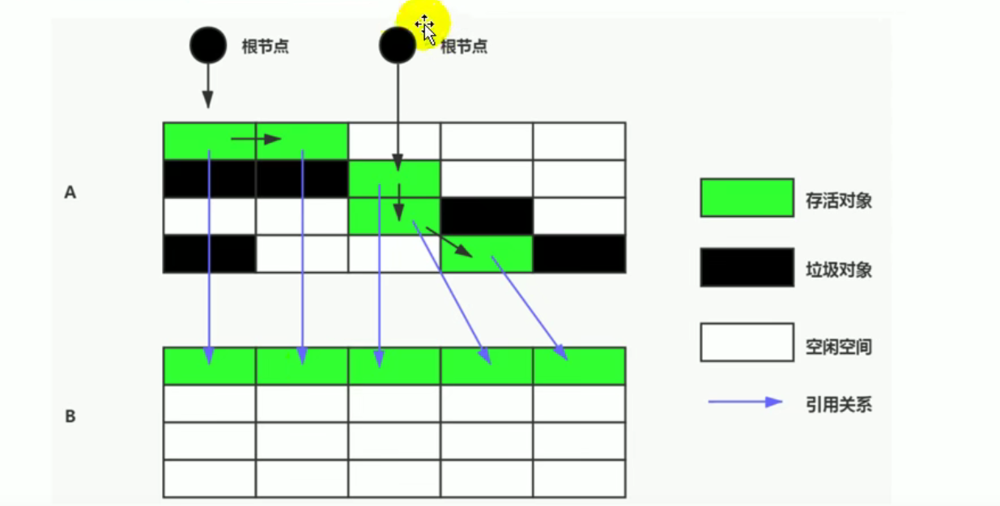

---

#### 标记-整理(压缩)算法（Old区用）

​	分为标记和整理两个阶段：首先标记出所有需要回收的对象，让所有存活的对象都向一端移动，然后直接清理掉端边界以外的内存。不会产生空间碎片，但是整理会花一定的时间。

+ 除了浪费空间，标记-复制算法在对象存活率较高时就要进行较多的复制操作，效率将会降低。更关键的是，如果不想浪费50%的空间，就需要有额外的空间进行分配担保，以应对被使用的内存中所有对象都100%存活的极端情况，所以在老年代一般不能直接选用这种算法。  
+ 标记-清除算法与标记-整理算法的本质差异在于前者是一种非移动式的回收算法， 而后者是移动式的。移动则内存回收时会更复杂， 不移动则内存分配时会更复杂。    
+ HotSpot虚拟机里面关注吞吐量的Parallel Scavenge收集器是基于标记-整理算法的，而关注延迟的CMS收集器则是基于标记-清除算法的（当空间碎片过多，CMS会进行一次标记-整理）。  

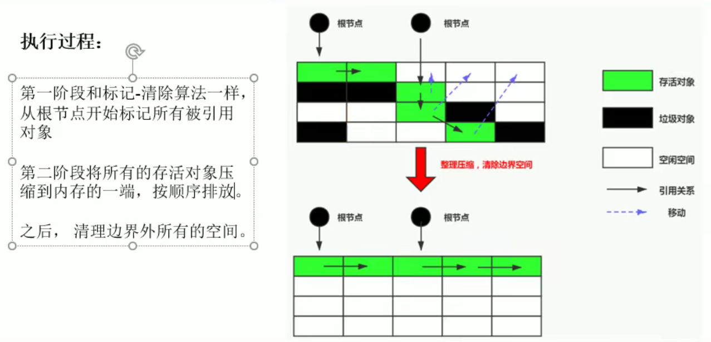

#### card table

​	HotSpot虚拟机下 有「card table」（卡表）来避免全局扫描「⽼年代」对象，堆内存」的每⼀⼩块区域形成「卡⻚」，卡表实际上就是卡⻚的集合。**当判断⼀个卡⻚中有存在对象的跨代引⽤时，将这个⻚标记为脏⻚**，那知道了「卡表」之后，就很好办了。每次Minor GC 的时候只需要去「卡表」找到「脏⻚」，找到后加⼊⾄GC Root，⽽不⽤去遍历整个「⽼年代」的对象了。

---

### HotSpot的算法细节

#### 记忆集与卡表

​        为解决对象跨代引用的问题，垃圾收集器在新生代中建立了记忆集数据结构，用以避免把整个老年代加进GC Roots扫描范围。除了Old和Young之间，所有涉及部分区域收集行为的垃圾收集器，如G1、ZGC、Shenandoah，都会面临相同的问题。

​        RSet的价值在于使得垃圾回收不需要扫描整个堆，能够快速定位到真正引用它的堆对象地址。

> RSet（记忆集）	

+ 记忆集是一种用于记录从非收集区域指向收集区域的指针集合的抽象数据结构。

+ 若用非收集区域所有含跨代引用的对象数组来实现RSet的话，空间占用和维护成本都很高。而在垃圾收集的场景中，收集器只需要通过记忆集判断出某一块非收集区域是否存在有指向了收集区域的指针就可以了。那设计者在实现记忆集的时候，便可以选择更为粗犷的记录粒度来节省记忆集的存储和维护成本，下面列举了一些可供选择的记录精度：    
  1. 字长精度：每个记录精确到一个机器字长，这个精度决定了机器访问物理内存地址的指针长度，该字含跨代指针。
  2. 对象精度：每个记录精确到一个对象，该对象里有字段含有跨代指针。
  3. **卡精度**：每个记录精确到一块内存区域，该区域内有对象含有跨代指针。“卡精度”所指的是用一种称为“**卡表**”的方式去实现记忆集，这也是目前最常用的一种记忆集实现形式。      

> 卡表（Card Table）

+ 卡表就是记忆集的一种具体实现，它定义了**记忆集的记录精度、与堆内存的映射关系**等。
+ 卡表最简单的形式可以只是一个字节数组，而HotSpot虚拟机确实也是这样做的。字节数组CARD_TABLE的每一个元素都对应着其标识的内存区域中一块**特定大小的内存块**，这个内存块被称作“卡页” 。一般来说，卡页大小都是以2的N次幂的字节数。    
+ 一个卡页的内存中通常包含不止一个对象，只要**卡页内有一个（或更多）对象的字段存在着跨代指针，那就将对应卡表的数组元素的值标识为1**，称为这个元素变脏，没有则标识为0。在垃圾收集发生时，只要**筛选出卡表中变脏的元素**，就能轻易得出哪些卡页内存块中包含跨代指针，把它们加入GC Roots中一并扫描。  

---

#### 写屏障

+ 在Hotspot虚拟机中通过<span style="background-color: yellow">写屏障（Write Barrier）</span>技术维护卡表状态。
+ 写屏障可以看作在虚拟机层面对“引用类型字段赋值”这个动作的AOP切面，在引用对象赋值时会产生一个**环形通知**，供程序执行额外的动作，也就是说赋值的前后都在写屏障的覆盖范畴内。 <span style="background-color: yellow">在赋值前的部分的写屏障叫作写前屏障，在赋值后的则叫作写后屏障</span>。HotSpot虚拟机的许多收集器中都有使用到写屏障，但直至G1收集器出现之前，其他收集器都只用到了写后屏障。
+ 应用写屏障后，虚拟机就会为所有赋值操作生成相应的指令，一旦收集器在写屏障中增加了更新卡表操作，无论更新的是不是老年代对新生代对象的引用，每次只要对引用进行更新，就会产生额外的开销，不过这个开销与Minor GC时扫描整个老年代的代价相比还是低得多的。  

---

#### 并发的可达性分析（增量更新、SATB）

+ 可达性分析算法理论上要求全过程都基于一个**能保障一致性的快照**中才能进行分析。如果用户线程与收集器并发工作会产生一个严重问题：**把原本存活的对象错误标记为已消亡，这会导致程序的错误**。  

+ 为了解决并发扫描时的对象消失问题，有两种解决方案：**增量更新**、**原始快照**。
  1. 增量更新：当插入新的引用关系时，将这个引用记录下来，等并发扫描结束后，再将这个记录过引用关系的对象为根，再次扫描一次。
  2. 原始快照：当要删除引用关系时，将这个要删除的引用记录下来，等并发扫描结束后，再将这个记录过引用关系的对象为根。也可以理解为，无论引用关系删除与否，都会按照刚刚开始扫描那一刻的对象图快照来进行搜索。  
+ CMS是基于增量更新来做并发标记，G1、Shenandoah采用原始快照的方式。
+ 相比起增量更新算法，原始快照搜索能够减少并发标记和重新标记阶段的消耗，避免CMS那样在最终标记阶段停顿时间过长的缺点，但是在用户程序运行过程中确实会产生由跟踪引用变化带来的额外负担。  

---

### 经典垃圾收集器

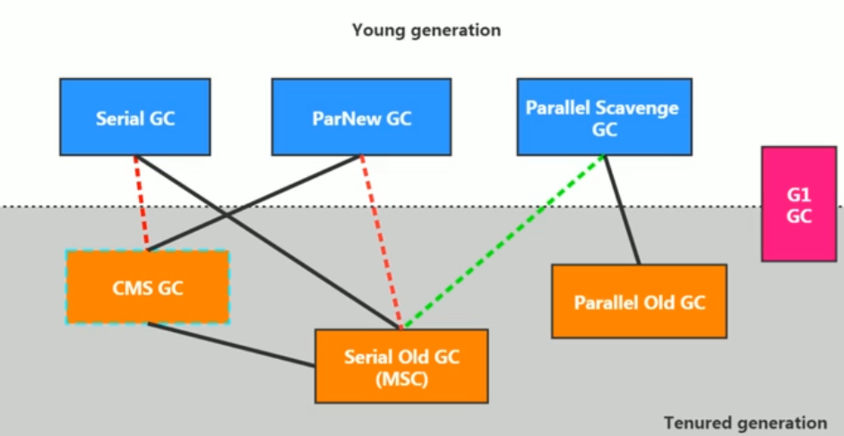

+ JDK9开始：两根红线的搭配remove了。

+ JDK14开始：绿线被deprecated了。
+ JDK14开始：CMSremove了。
+ JDK8默认：Parallel Scavenge + Parallel Old。
+ JDK9开始默认：G1。

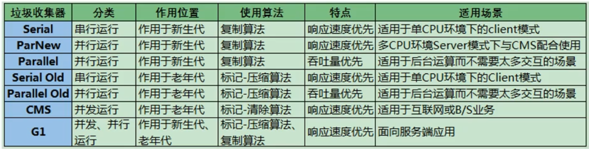

#### 查看默认的垃圾回收器

​	`-XX:+PrintCommandLineFlags`：查看命令行相关参数（包含使用的垃圾回收器）。

​	使用命令行指令：`jinfo -flag 相关垃圾回收器参数 进程ID`。

**手动选择垃圾回收器**：

​	例：`-XX:+UseParNewGC`

---

#### Serial收集器

+ 单线程工作的收集器，但它的“单线程”的意义并不仅仅是说明它只会使用一个处理器或一条收集线程去完成垃圾收集工作，更重要的是强调在它进行垃圾收集时，必须暂停其他所有工作线程，直到它收集结束。

  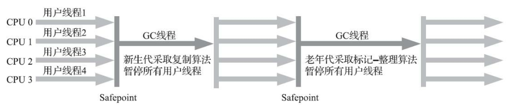

+ 虚拟机的设计者们当然知道 Stop The World带来的不良用户体验，所以在后续的垃圾收集器设计中停顿时间在不断缩短（仍然还有停顿，寻找最优秀的垃圾收集器的过程仍然在继续）。
+ 优点：**简单而高效（与其他收集器的单线程相比）**，对于内存资源受限的环境， 它是所有收集器里额外内存消耗最小的；对于单核处理器环境中，Serial 收集器由于没有线程交互的开销，自然可以获得很高的单线程收集效率。Serial 收集器对于运行在 Client 模式下的虚拟机来说是个不错的选择。

---

#### ParNew收集器

+ ParNew收集器实质上是Serial收集器的多线程并行版本，除了同时使用多条线程进行垃圾收集之外，其余的行为包括Serial收集器可用的所有控制参数、收集算法、Stop The World、对象分配规则、回收策略等都与Serial收集器完全一致，在实现上这两种收集器也共用了相当多的代码。    

  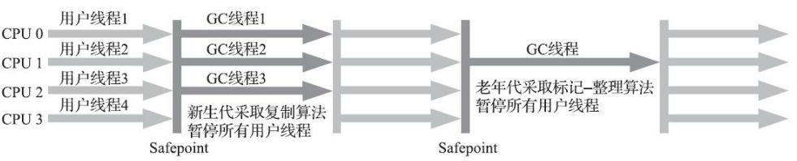

+ 它是许多运行在 Server 模式下的虚拟机的首要选择，除了 Serial 收集器外，只有它能与 CMS 收集器配合工作。

---

#### Serial Old收集器  

+ Serial Old是Serial收集器的老年代版本，它同样是一个单线程收集器，使用标记-整理算法。（原理与Serial相同） 
+ 这个收集器的**主要意义**是供客户端模式下的HotSpot虚拟机使用。
+ 在服务端模式下， 它有两种用途：
  1. 在JDK 5以及之前的版本中与Parallel Scavenge收集器搭配使用 。
  2. 作为CMS收集器发生失败时的**后备预案**，在并发收集发生Concurrent Mode Failure时使用。   

---

#### Parallel Scavenge 收集器（JDK8）

+ 特点：与其他收集器不同，CMS等收集器的关注点是尽可能地缩短垃圾收集时用户线程的停顿时间，而Parallel Scavenge收集器的目标则是达到一个可控制的吞吐量。
+ Parallel Scavenge收集器提供了两个参数用于精确控制吞吐量：
  1. 控制最大垃圾收集停顿时间：`-XX： MaxGCPauseMillis`
  2. 直接设置吞吐量大小：`-XX： GCTimeRatio`    

+ **这是JDK1.8的默认收集器**。

  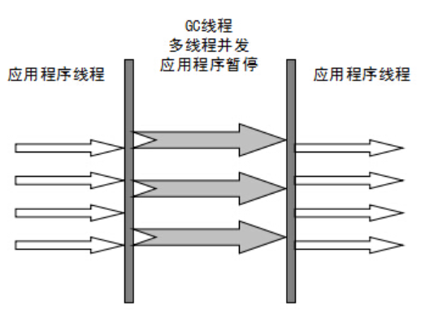

---

#### Parallel Old收集器（JDK8）

+ 是Parallel Scavenge收集器的老年代版本，支持多线程并发收集，基于标记-整理算法实现。
+ 在注重吞吐量或者处理器资源较为稀缺的场合， 都可以优先考虑Parallel Scavenge加Parallel Old收集器这个组合。      

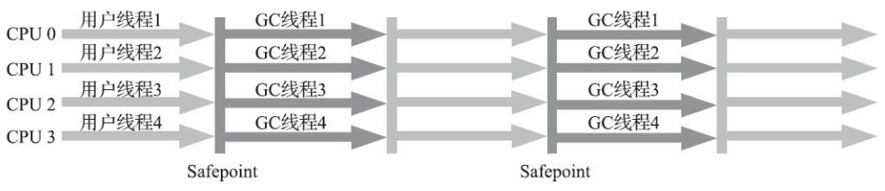

---

#### CMS收集器  

+ CMS（Concurrent Mark Sweep）收集器是一种以获取最短回收停顿时间为目标的收集器。
+ 目前很大一部分的Java应用集中在互联网网站或者基于浏览器的B/S系统的服务端上， 这类应用通常都会较为关注服务的响应速度， 希望系统停顿时间尽可能短， 以给用户带来良好的交互体验。 CMS收集器就非常符合这类应用的需求。
+ 目前已不推荐使用。    

> 基于标记-清除，整个过程分为：

1. 初始标记：只是标记GC Roots能直接关联到的对象，速度很快。
2. 并发标记：从GC Roots的直接关联对象开始遍历整个对象图的过程，这个过程耗时较长但是不需要停顿用户线程，可以与垃圾收集线程一起并发运行。  
3. 重新标记：为了修正并发标记期间，因用户程序继续运作而导致标记产生变动的那一部分对象的标记记录，时间比初始标记略长。  
4. 并发清除：清理删除掉标记阶段判断的已经死亡的对象，由于不需要移动存活对象，所以这个阶段也是可以与用户线程同时并发的。  

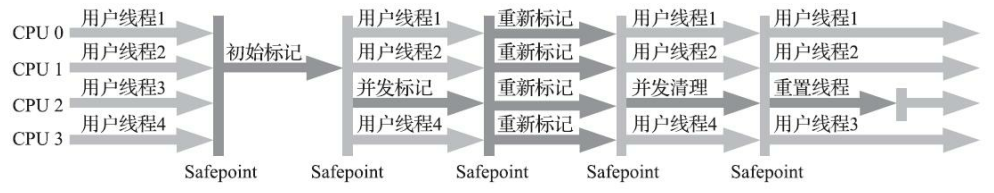

> 优缺点：

+ 优点：并发收集、 低停顿。
+ 缺点：
  1. 对CPU资源敏感：默认启动的回收线程数是（处理器核心数量+3）/4，处理器小于4核时，负载较大。  
  2. <span style="background-color: yellow">无法处理浮动垃圾</span>：有可能出现“Con-current ModeFailure”失败进而导致另一次<span style="background-color: yellow">完全“Stop The World”的Full GC的产生</span>。  
  3. 收集结束时会有大量空间碎片产生。

---

#### G1收集器（JDK9）

+ G1开创了收集器**面向局部收集**的设计思路和**基于Region**的内存布局形式。官方给G1设定的目标是在延迟可控的情况下获得尽可能高的吞吐量。

+ G1收集器是一个**并行回收器**，它把堆内存分割为很多不相关的region（物理上不连续）。使用不同的region来表示Eden、Survivor0/1、Old等。Region中还有一类特殊的Humongous区域，专门用来存储大对象。G1认为只要大小超过1.5region的对象即可判定为大对象。  
+ **G1 GC将region作为单次回收的最小单元**，有计划地**避免**在整个Java堆中进行全区域的垃圾收集。G1跟踪各个Region垃圾堆积的价值大小（回收所获得的空间大小以及回收所需时间的经验值），在后台维护一个优先列表，**每次根据允许的收集时间，优先回收价值最大的region**。（可预测停顿时间模型的基础）
+ 优先处理回收价值收益最大的那些Region，这也就是“Garbage First”名字的由来。  
+ HotSpot的垃圾收集器，除了G1，其他均使用内置的JVM线程执行GC的多线程操作，而G1可以采用应用线程承担后台运行的GC工作，即当JVM的GC线程处理速度慢时，系统会调用应用程序帮助加速垃圾回收过程。
+ G1跨Region引用对象主要靠记忆集解决。（下面再详细写）

##### 应用场景

+ **面向服务端应用**，主要针对配备多核CPU及大容量内存的机器。以极高概率满足 GC 停顿时间要求的同时，还具备高吞吐量性能特征。
+ 最主要的应用是需要低GC延迟，并具有大堆的应用程序提供解决方案。
+ 在下列情况下，G1可能比CMS好：
  1. 超过50%的Java堆被活动数据占用。
  2. 对象分配频率或年代提升频率变化很大。
  3. GC停顿时间过长（>0.5~1s）

> 优势

+ **并行与并发**：
  1. 并行性：G1能充分利用 CPU多核环境下的硬件优势，使用多个GC线程同时工作，此时用户线程STW。
  2. 并发性：G1拥有与应用程序交替执行的能力，部分工作可以和应用程序同时执行，因此，一般不会在整个回收阶段发生STW的情况。
+ **分代收集**：虽然 G1 可以不需要其他收集器配合就能独立管理整个 GC 堆，但是还是保留了分代的概念。
+ **空间整合**：
  1. CMS：标记-清除，若干次之后进行一次碎片整理。
  2. G1：从整体可以看做**标记-整理**；从局部上来看是基于**标记-复制**算法实现的（Region之间是**复制算法**）。当Java堆非常大时，G1的优势更加明显。
+ **可预测的停顿时间模型**：这是 G1 相对于 CMS 的另一个大优势，降低停顿时间是 G1 和 CMS 共同的关注点，但 G1 除了追求低停顿外，还能建立可预测的停顿时间模型，能让使用者明确指定在一个长度为 M 毫秒的时间片段内，消耗在垃圾收集上的时间不得超过N毫秒。相比CMS GC，G1未必能做到CMS在最好情况下的停顿时间，但是最差的情况要好很多。

---

##### 相对CMS的缺点

+ 相较于CMS，G1不具备全方位的优势。如在用户程序运行过程中，G1无论是为了垃圾收集产生的内存占用还是程序运行时的额外执行负载都要比CMS要高。 
+ 就内存占用来说，虽然G1和CMS都使用卡表来处理跨代指针，但G1的卡表实现更为复杂，而且堆中每个Region都必须有一份卡表，这导致G1的记忆集（和其他内存消耗）可能会占整个堆容量的20%乃至更多的内存空间。 
+ 从执行负载的角度，G1除了使用写后屏障来进行同样的（由于G1的卡表结构复杂，其实是更烦琐的）卡表维护操作外，为了实现STAB算法，还需要使用**写前屏障来跟踪并发时的指针变化情况**。由于G1对写屏障的复杂操作要比CMS消耗更多的运算资源，所以**CMS的写屏障实现是直接的同步操作**，而G1就不得不将其实现为类似于消息队列的结构，**把写前屏障和写后屏障中要做的事情都放到队列里，然后再异步处理**。       
+ 从经验上来说，在小内存应用上CMS的表现大概率会优于G1，而G1在大内存的应用上在发挥优势。平衡点大概在6-8GB之间。当然，随着HotSpot的开发者对G1的不断优化，也会让对比结果继续向G1倾斜。  

> 参数设置

+ `-XX:+UserG1GC`：手动指定G1收集器。
+ `-XX:G1HeapRegionSize`：设置每个region的大小，值是2的幂，1~32MB之间。默认是堆内存的1/2000。
+ `-XX:MaxGCPauseMillis`：设置期望达到的最大GC停顿时间（JVM会尽力但不保证达到），默认200ms。
+ `-XX:ParallelGCThread`：设置STW工作线程数的值，最多设置8。
+ `-XX:ConcGCThreads`：设置并发标记的线程数。设置为ParallelGCThread的1/4左右。
+ `-XX:InitiatingHeapOccupancyPercent`：设置触发并发GC周期的Java堆的占用率阈值。超过此值，触发GC，默认值45%。

##### G1调优

G1的设计原则是简化JVM性能调优，通常只需要设置：

+ 确保开启G1。
+ 设置堆的最大内存。
+ 设置最大的停顿时间。设置的不要过于严苛，G1的吞吐量目标是90%的应用程序时间和10%的垃圾回收时间，设置过低会直接影响吞吐量。

G1提供了三种垃圾回收模式：Young GC、Mixed GC、Full GC，在不同的条件下被触发。

---

##### G1垃圾回收过程

+ **初始标记**：标记GC Roots能直接关联到的对象，并且修改TAMS指针的值，让下一阶段用户线程并发运行时，能正确地在可用的Region中分配新对象。这个阶段需要停顿线程，但耗时很短，而且是借用进行Minor GC的时候同步完成的，所以G1收集器在这个阶段实际并没有额外的停顿。 
+ **并发标记**：从GC Root开始对堆中对象进行可达性分析，递归扫描整个堆里的对象图，找出要回收的对象，这阶段耗时较长，但可与用户程序并发执行。当对象图扫描完成以后，还要重新处理SATB（原始快照）记录下的在并发时有引用变动的对象。
+ **最终标记**：对用户线程做另一个短暂的暂停，用于处理并发阶段结束后仍遗留下来的最后那少量的SATB记录。
+ **筛选回收**：负责更新Region的统计数据，对各个Region的回收价值和成本进行排序，根据用户所期望的停顿时间来制定回收计划，可以自由选择任意多个Region构成回收集，然后**把决定回收的那一部分Region的存活对象复制到空的Region中，再清理掉整个旧Region的全部空间**。这里的操作涉及存活对象的移动，是必须暂停用户线程，由多条收集器线程并行完成的。

<span style="background-color: yellow">除了并发标记外， 其余阶段也是要完全暂停用户线程的</span>

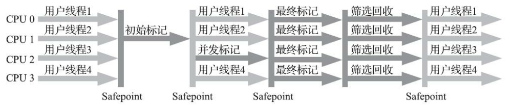

---

##### G1的记忆集

+ G1存在跨Region引用的问题，使用记忆集来避免全堆作为GC Roots扫描。
+ 它的每个Region都维护有自己的记忆集，这些记忆集会记录下**别的Region指向自己的指针**，并标记这些指针分别在哪些卡页的范围之内。 
+ G1的记忆集在存储结构的本质上是一种**哈希表**，Key是别的Region的起始地址，Value是一个集合，里面存储的元素是卡表的索引号。  
+ 一方面这是一种“双向”的卡表结构，更复杂；同时由于Region数量比传统收集器的分代数量明显要多得多，因此G1收集器要比其他的传统垃圾收集器有着更高的**内存占用负担**。 根据经验，G1至少要耗费大约相当于Java堆容量**10%至20%的额外内存**来维持收集器工作。   

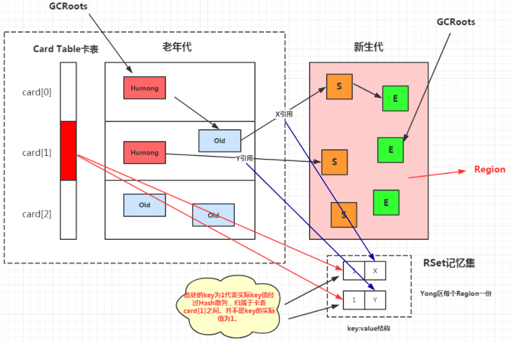

---

### 低延迟垃圾收集器

#### Shenandoah  

+ Shenandoah是第一款不由Oracle开发的，收到了官方的排挤。
+ Shenandoah像是G1的下一代继承者，也是使用基于Region的堆内存布局， 同样有着用于存放大对象的Humongous Region， 默认的回收策略也同样是优先处理回收价值最大的Region。
+ 但在管理堆内存方面，与G1至少有着三处不同：
  1. 回收阶段可以与用户线程并发。
  2. 默认不使用分代收集。
  3. 摒弃了Rset，改为使用**连接矩阵**来记录跨Region的引用关系。

+ Shenandoah使用转发指针和读屏障来实现并发整理。  

#### ZGC

+ ZGC和Shenandoah的目标是高度相似的， 都希望在尽可能对吞吐量影响不太大的前提下，实现在任意堆内存大小下都可以把垃圾收集的停顿时间限制在十毫秒以内的低延迟。 ZGC几乎在所有地方并发执行，除了初始标记是STW，所以停顿时间几乎就耗费在初始标记上，这部分的实际时间很少。 
+ ZGC也采用基于Region的堆内存布局，但其Region具有动态性——动态创建和销毁， 以及动态的区域容量大小。（暂时不设分代）
+ 使用了读屏障、染色指针和内存多重映射等技术来实现可并发的标记-压缩算法。
+ 工作过程可分为4个阶段：并发标记——并发预备重分配——并发重分配——并发重映射。   
+ 未来将在服务端、大内存、低延迟应用的首选垃圾收集器。

---

### GC的日志分析

#### 内存分配与垃圾回收参数列表

+ `-XX:+PrintGC`：输出GC日志，类似：`-verbose:gc`
+ `-XX:+PrintGCDetials`：输出GC详细日志
+ `-XX:+PrintGCTimeStamps`：输出GC的时间戳（以基准时间的形式）
+ `-XX:+PrintGCDataStamps`：输出GC的时间戳（以日期的形式）
+ `-XX:+PrintHeapAtGC`：在进行GC的前后打印出堆的信息
+ `-Xloggc:./logs/gc.log`：日志文件的输出路径

#### 日志分析工具

常用的日志分析工具有：GCViewer、GCEasy、GCHisto、GCLogViewer、Hpjmeter、garbagecat等。

---

## 五、其他

### 方法调用

​        方法调用并不等同于方法中的代码被执行，方法调用阶段唯一的任务就是**确定被调用方法的版本**（即调用哪一个方法）。

#### 解析

​        所有方法调用的目标方法在Class文件里面都是一个常量池中的符号引用，在类加载的解析阶段，会将其中的一部分符号引用转化为直接引用。这种解析能够成立的前提：**编译器可知，运行期不可变**。

​        这类方法的调用被称为“解析”，主要有**静态方法**和**私有方法**两大类。前者与类型直接关联，后者在外部不可被访问，这两种方法各自的特点决定了它们都不可能通过继承或别的方式重写出其他版本，因此它们都适合在类加载阶段进行解析。  

​        调用不同类型的方法，字节码指令集设计了不同的指令，JVM支持以下5条：

+ `invokestatic`：用于调用静态方法。
+ `invokesprecial`：用于调用实例构造器`<init>()`方法、私有方法、父类中的方法。
+ `invokevirtual`：用于调用所有的虚方法。
+ `invokeinterface`：用于调用接口方法，会在运行时再确定一个实现该接口的对象。  
+ `invokedynamic`：先在运行时动态解析出调用点限定符所引用的方法，然后再执行该方法。前面4条调用指令，分派逻辑都固化在Java虚拟机内部，而invokedynamic指令的分派逻辑是由用户设定的引导方法来决定的。  

##### 虚方法

​        只要能被invokestatic和invokespecial指令调用的方法，都可以在解析阶段中确定唯一的调用版本，Java语言里符合这个条件的方法共有静态方法、私有方法、实例构造器、父类方法4种，再加上被final修饰的方法（尽管它使用invokevirtual指令调用），这5种方法调用会在类加载的时候就可以把符号引用解析为该方法的直接引用。这些方法统称为“非虚方法” ，与之相反，其他方法就被称为“虚方法”。

​        在动态分派里面有个注意点（动态分派的那个例子里有体现）：在父类中添加虚函数，父类中调用这个虚函数，子类继承父类后，子类实现的虚函数就会在父类调用的时候自动响应。  

---

#### 分派

##### 1、静态分派

+ 所有依赖静态类型来决定方法执行版本的分派动作，都称为静态分派。
+ 典型应用：**方法重载**。
+ 发生在**编译阶段**，即确定静态分派的动作实际上不是由JVM来执行的，因此也有些资料将其归为“解析”。

```java
/**
*  输出结果：
*  hello,guy!
*  hello,guy!
*/
public class StaticDispatch{
    static class Man extends Human{}
    static class Woman extends Human{}
    public void sayHello(Human guy){
        System.out.println("hello,guy!");
    }
    public void sayHello(Man guy){
        System.out.println("hello,man!");
    }
    public void sayHello(Woman guy){
        System.out.println("hello,woman!");
    }
    public static void main(String[] args){
        Human man = new Man();  //“Human”称为变量的“静态类型”，或者叫“外观类型”。
        Human woman = new Woman();  //后面的“Man”、“Woman”则称为变量的“实际类型”或“运行时类型”
        StaticDispatch sr = new StaticDispatch();
        sr.sayHello(man);
		sr.sayHello(woman);
    }
}
```

​        静态类型和实际类型在程序中都可能会发生变化，区别是静态类型的变化仅仅在使用时发生，变量本身的静态类型不会被改变，并且最终的静态类型是在编译期可知的；而实际类型变化的结果在运行期才可确定，编译器在编译程序的时候并不知道一个对象的实际类型是什么。  

​        **JVM（准确来说是编译器）在重载时是通过参数的静态类型而不是实际类型作为判定依据的**。由于静态类型在编译期可知，所以在**编译阶段Javac编译器就根据参数的静态类型决定了会使用哪个重载版本**，因此选择了`sayHello(Human)`作为调用目标，并把这个方法的符号引用写到main()方法里的两条`invokevirtual`指令的参数中。  

---

##### 2、动态分派

+ 在运行期根据实际类型确定方法执行版本的分派过程称为动态分派。  

+ 动态分派与**重写**有关，其根源在于虚方法调用指令invokevirtual的执行逻辑 。
+ 只对方法有效，对字段无效。（深入理解JVM，P421例子；尚硅谷JVM视频，P209）

> invokevirtual指令的运行时解析过程大致分为以下几步：  

1. 找到操作数栈顶的第一个元素所指向的**对象的实际类型**，记作C。（方法重写的本质）
2. 如果在类型C中找到与常量中的描述符和简单名称都相符的方法，则进行访问权限校验，如果通过则返回这个方法的直接引用，查找过程结束；不通过则返回`java.lang.IllegalAccessError`异常。
3. 否则，按照继承关系从下往上依次对C的各个父类进行第二步的搜索和验证过程。
4. 如果始终没有找到合适的方法， 则抛出`java.lang.AbstractMethodError`异常。   

---

### 类文件概述

#### 字节码文件、字节码指令

+ 源代码经过编译器编译之后便会生成一个字节码文件，Class文件是一组以8个字节为基础单位的二进制流，内容是**JVM的指令**。
+ **字节码指令**：由一个字节长度的、代表着某种特定操作含义的**操作码**以及跟随其后的零至多个代表此操作所需参数的**操作数**所构成。Class文件中许多指令不包含操作数，只有一个操作码。

---

#### 如何查看字节码文件

+ 通过Binary Viewer等阅读器一个一个二进制的看。
+ 使用`-javap`：jdk自带的反解析工具。
+ 使用IDEA插件：jclasslib或jclasslib bytecode viewer客户端工具（可视化更好）。

---

#### 前端编译器

主要有**javac与ECJ**：

+ Java源代码编译的结果是字节码，那么肯定有一种编译器能够将Java源码编译为字节码，这就是**前端编译器**。
+ **javac编译器**：配置在path环境中的，是一种能够将Java源码编译成字节码的**全量式编译**的前端编译器。不过Hotspot并没有强制要求使用javac来编译。
+ **ECJ**（Eclipse Compiler for Java）：内置在Eclipse中，开源，是一种**增量式编译器**（每次使用Ctrl+S时，把为编译部分的源码逐行编译，所以效率比javac高）。Tomcat中使用ECJ编译器来编译jsp文件。

---

#### JVM是怎么运行Class文件的？

1. 通过**解释器**解释执行，逐行将字节码翻译成机器码并执行。效率较差。
2. **即时编译JIT**，将一个方法中包含的所有字节码编译成机器码后再执行（热点代码），编译后的机器码会被缓存下来。
   - 被多次调用的方法。
   - 被多次执行的循环体。
3. JIT 的编译器
   - C1编译器：是一个简单快速的编译器，主要的关注点在于局部性的优化，适用于执行时间较短或对启动性能有要求的程序，例如，GUI应用对界面启动速度就有一定要求，C1也被称为Client Compiler。
   - C2编译器：是为长期运行的服务器端应用程序做性能调优的编译器，适用于执行时间较长或对峰值性能有要求的程序，C2也被称为Server Compiler。

HotSpot默认采用**混合模式**，综合了**解释执行和即时编译两者的优点**。

---

### Class文件结构

注意：任何一个Class文件都对应着唯一的一个类或接口的定义信息，但是反过来说，类或接口并不一定都得定义在文件里（譬如类或接口也可以动态生成，直接送入类加载器中）。

+ Class文件是一组以**8个字节为基础单位的二进制流**，各个数据项目严格按照顺序紧凑地排列在文件之中，中间没有添加任何分隔符。当遇到需要占用8个字节以上空间的数据项时，则会按照高位在前的方式分割成若干个8个字节进行存储。
+ Class文件格式采用一种类似于C语言结构体的伪结构来存储数据，这种伪结构中只有两种数据类型：“**无符号数**”和“**表**”。
  1.  **无符号数**：属于基本数据类型，以u1、u2、u4、u8来分别代表1/2/4/8个字节的无符号数。可以用来描述数字、索引引用、数量值或者按照UTF-8编码构成字符串值。
  2. **表**：由多个无符号数或者其他表作为数据项构成的复合数据类型，用于描述**有层次关系的复合结构的数据**，整个Class文件本质上也可以视作是一张表。  

+ 无论是无符号数还是表，当需要描述同一类型但数量不定的多个数据时，经常会使用一个**前置的容量计数器**加若干个连续的数据项的形式。 

#### 魔数与Class文件的版本

+ 每个Class文件的头4个字节被称为**魔数**，**唯一作用**：确定这个文件是否为一个能被虚拟机接受的Class文件。
+ 紧接着魔数的4个字节存储的是**Class文件的版本号**：第5和第6个字节是次版本号，第7和第8个字节是主版本号（jdk每个大版本，主版本号+1）。高版本的JDK能兼容低版本，反之不行。  

#### 常量池

+ 紧接着主、次版本号之后的是**常量池入口**，常量池可以比喻为Class文件里的资源仓库，它是Class文件结构中与其他项目关联最多的数据，通常也是占用Class文件空间最大的数据项目之一。另外，它还是在Class文件中**第一个出现的表类型数据项目**。
+ 由于常量池中常量的数量是不固定的，所以在常量池的入口需要放置一项**u2类型**的常量池容量计数值，计数从1开始（只有它从1开始）。
+ 将第0项常量空出来目的在于：如果后面某些指向常量池的索引值的数据在特定情况下需要表达“不引用任何一个常量池项目”的含义，可以把索引值设置为0来表示。
+ 常量池中主要存放两大类常量：**字面量和符号引用**。
+ 字面量与Java语言层面的常量含义类似，包括文本字符串、被声明为final的常量值等。
+ 符号引用则属于编译原理方面的概念，主要包括下面几类常量：
  1. 被模块导出或者开放的包  
  2. 类和接口的全限定名  
  3. 字段的名称和描述符  
  4. 方法的名称和描述符  
  5. 方法句柄和方法类型  
  6. 动态调用点和动态常量  

+ 常量池中每一项常量都是一个表，有17种不同类型的常量。（书P304）  

#### 访问标志

+ 在常量池结束之后，紧接着的2个字节代表访问标志。
+ 作用：识别一些类或者接口层次的访问信息，包括： 这个Class是类还是接口、是否定义为public类型、 是否定义为abstract类型、如果是类的话、是否被声明为final等等。   

#### 类索引、 父类索引与接口索引集合  

+ 类索引和父类索引都是一个**u2类型**的数据，而接口索引集合是一组**u2类型的数据的集合**，Class文件中由这三项数据来**确定该类型的继承关系**。
+ 类索引用于确定这个类的全限定名，父类索引用于确定这个类的父类的全限定名。
+ 接口索引集合就用来描述**这个类实现了哪些接口**，这些被实现的接口将按implements关键字（如果这个Class文件表示的是一个接口，则应当是
  extends关键字）后的接口顺序从左到右排列在接口索引集合中。      

**查找过程**：

+ 类索引和父类索引各自指向一个类型`CONSTANT_Class_info`的类描述符常量，通过`CONSTANT_Class_info`类型的常量中的索引值可以找到定义在`CONSTANT_Utf8_info`类型的常量中的全限定名字符串。     

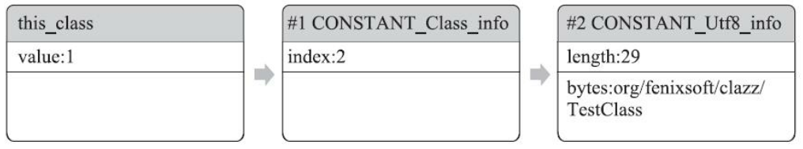

+ 接口索引入口的第一项u2类型的数据为**接口计数器**，表示**索引表的容量**。若该类没有实现任何接口，则计数器值为0，后面接口的索引表不再占用任何字节。   

#### 字段表集合

+ 用于描述接口或者类中声明的变量。描述结构：依次包括访问标志（access_flag）、名称索引（name_index）、描述符索引（descriptor_index）、属性表集合（attributes）几项。  
+ 字段表集合中不会列出从父类或者父接口中继承而来的字段，但**有可能出现原本Java代码之中不存在的字段**，譬如在内部类中为了保持对外部类的访问性，编译器就会自动添加指向外部类实例的字段。
+ 在Java语言中字段是无法重载的，两个字段的数据类型、修饰符不管是否相同，都必须使用不一样的名称，但是对于Class文件格式来讲，只要两个字段的描述符不是完全相同，那字段重名就是合法的。  

#### 方法表集合

+ Class文件存储格式中对方法的描述与对字段的描述采用了几乎完全一致的方式，方法表的结构如同字段表一样，依次包括访问标志（access_flag）、名称索引（name_index）、描述符索引（descriptor_index）、属性表集合（attributes）几项。
+ **方法里面的代码哪里去了？**：方法里的Java代码，经过Javac编译器编译成字节码指令之后，存放在方法属性表集合中一个名为“**Code**”的属性里面，属性表作为Class文件格式中最具扩展性的一种数据项目。
+ 与字段表集合相对应地，如果父类方法在子类中没有被重写，方法表集合中就不会出现来自父类的方法信息。 但同样地，有可能会出现由编译器自动添加的方法，最常见的便是类构造器`<clinit>()`方法和实例构造器`<init>()`方法。
+ 在Java语言中，重载一个方法，除了要与原方法具有相同的简单名称之外，还要求必须拥有一个与原方法不同的**特征签名**。特征签名是指一个方法中各个参数在常量池中的字段符号引用的集合，也正是因为返回值不会包含在特征签名之中，所以Java语言里面是**无法仅仅依靠返回值的不同来对一个已有方法进行重载的**。但是在Class文件格式之中，特征签名的范围明显要更大一些，只要描述符不是完全一致的两个方法就可以共存。也就是说，如果两个方法有相同的名称和特征签名，但返回值不同，那么也是可以合法共存于同一个Class文件中的。      

#### 属性表集合

+ Class文件、字段表、方法表都可以携带自己的属性表集合，以描述某些场景专有的信息。与Class文件中其他的数据项目要求严格的顺序、长度和内容不同， 属性表集合的限制稍微宽松一些，不再要求各个属性表具有严格顺序。
+ 对于每一个属性，它的名称都要从常量池中引用一个`CONSTANT_Utf8_info`类型的常量来表示，而属性值的结构则是完全自定义的，只需要通过一个u4的长度属性去说明属性值所占用的位数即可。      

##### Code属性

+ Java程序方法体里面的代码经过Javac编译器处理之后， 最终变为字节码指令存储在Code属性内。Code属性出现在方法表的属性集合之中，但并非所有的方法表都必须存在这个属性，譬如接口或者抽象类中的方法就不存在Code属性。  
+ Code属性是Class文件中最重要的一个属性，如果把一个Java程序中的信息分为代码（Code， 方法体里面的Java代码）和元数据（Metadata，包括类、字段、方法定义及其他信息）两部分，那么在整个Class文件里，Code属性用于描述代码，所有的其他数据项目都用于描述元数据。    

**Exceptions属性**

+ 作用：列举出方法中可能抛出的受查异常，也就是方法描述时在throws关键字后面列举的异常。  

**LineNumberTable属性**

+ 作用：描述Java源码行号与字节码行号（字节码的偏移量）之间的对应关系。  

**LocalVariableTable及LocalVariableTypeTable属性  **

+ 作用：用于描述栈帧中局部变量表的变量与Java源码中定义的变量之间的关系。  

**SourceFile及SourceDebugExtension属性  **

+ 作用：SourceFile属性用于记录生成这个Class文件的源码文件名称。  

**ConstantValue属性  **

+ 作用：通知虚拟机自动为静态变量赋值。只有被static关键字修饰的变量（类变量）才可以使用这项属性。     

**MethodParameters属性  **

+ 在JDK8时新加入到Class文件格式中的，它是一个用在方法表中的变长属性。作用：记录方法的各个形参名称和信息。  

**模块化相关属性  **

+ JDK 9的一个重量级功能是Java的模块化功能，因为模块描述文件（module-info.java）最终是要编译成一个独立的Class文件来存储的，所以，Class文件格式也扩展了Module、ModulePackages和ModuleMainClass三个属性用于支持Java模块化相关功能。  

---

### 内存模型JMM

《Java虚拟机规范》中曾试图定义一种“Java内存模型” 来屏蔽各种硬件和操作系统的内存访问差异，让 Java 程序在各种平台下都能达到一致的内存访问效果。主要目的：定义程序中各种变量的访问规则，即关注在虚拟机中把变量值存储到内存和从内存中取出变量值这样的底层细节。  

#### 主内存与工作内存

- 所有的变量都存储在主内存（Main Memory）中。
- 每个线程都有一个私有的工作内存，存储了该线程以读/写共享变量的主内存副本。
- 线程对变量的所有操作（读取、 赋值等） 都必须在工作内存中进行，而不能直接读写主内存中的数据。
- 不同的线程之间无法直接访问对方本地内存中的变量，线程间变量值的传递均需要通过主内存来完成  。

> JMM定义了 8 个操作来完成主内存和工作内存的交互操作：

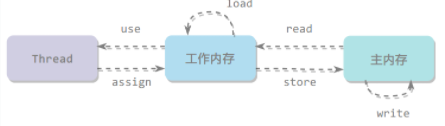

- lock（锁定）：作用于主内存的变量，它把一个变量标识为一条线程独占的状态。
- unlock（解锁）：作用于主内存的变量，它把一个处于锁定状态的变量释放出来，释放后的变量才可以被其他线程锁定。
- read（读取）：作用于主内存的变量，它把一个变量的值从主内存传输到线程的工作内存中，以便随后的load动作使用。
- load（载入）：作用于工作内存的变量，它把read操作从主内存中得到的变量值放入工作内存的变量副本中。 
- use（使用） ： 作用于工作内存的变量，它把工作内存中一个变量的值传递给执行引擎，每当虚拟机遇到一个需要使用变量的值的字节码指令时将会执行这个操作。
- assign（赋值）： 作用于工作内存的变量，它把一个从执行引擎接收的值赋给工作内存的变量，每当虚拟机遇到一个给变量赋值的字节码指令时执行这个操作。 
- store（存储）： 作用于工作内存的变量，它把工作内存中一个变量的值传送到主内存中，以便随后的write操作使用。
- write（写入）： 作用于主内存的变量，它把store操作从工作内存中得到的变量的值放入主内存的变量中。           

**注意**：上述的每一个操作都是原子的、不可再分的。

#### 内存模型三大特性

> **原子性**

+ Java 内存模型保证了 read、load、use、assign、store、write、lock 和 unlock 操作具有原子性。
+ 如果应用场景需要一个更大范围的原子性保证（经常会遇到），Java内存模型还提供了lock和unlock操作来满足这种需求，尽管虚拟机未把lock和unlock操作直接开放给用户使用，但是却提供了更高层次的字节码指令monitorenter和monitorexit来隐式地使用这两个操作。这两个字节码指令反映到Java代码中就是同步块——synchronized关键字，因此在synchronized块之间的操作也具备原子性。  

> **可见性**

可见性指当一个线程修改了共享变量的值，其它线程能够立即得知这个修改。Java内存模型是通过在变量修改后将新值同步回主内存，在变量读取前从主内存刷新变量值这种依赖主内存作为传递媒介的方式来实现可见性的， 无论是普通变量还是volatile变量都是如此。   

主要有3个关键字能够实现可见性：

- volatile：volatile的特殊规则保证了新值能立即同步到主内存，以及每次使用前立即从主内存刷新。
- synchronized：对一个变量执行 unlock 操作之前，必须把变量值同步回主内存（执行store、write操作）。
- final：被 final 关键字修饰的字段在构造器中一旦初始化完成，并且没有发生 this 逃逸（this逃逸很危险，其它线程有可能通过 this 引用访问到初始化了一半的对象），那么其它线程就能看见 final 字段的值。

**volatile 并不能保证操作的原子性。**

> **有序性**

+ 在本线程内观察，所有操作都是有序的（线程内似表现为串行的语义）。在一个线程观察另一个线程，所有操作都是无序的（“指令重排序”现象和“工作内存与主内存同步延迟”现象）。
+ 在 Java 内存模型中，允许编译器和处理器对指令进行重排序，重排序过程不会影响到单线程程序的执行，却会影响到多线程并发执行的正确性。
+ Java语言提供了**volatile和synchronized两个关键字来保证线程之间操作的有序性**，volatile关键字本身就包含了禁止指令重排序的语义，而synchronized则是由“一个变量在同一个时刻只允许一条线程对其进行lock操作”这条规则获得的， 这个规则决定了持有同一个锁的两个同步块只能串行地进入。  

可以看到，synchronized可以同时满足JMM的三大特性，间接造就了它被程序员滥用的局面。不过越“万能”，通常会伴随更大的性能影响。

---

#### volatile关键字

> 当一个变量被定义成volatile后，将具备两项特性：

+ **保证此变量对所有线程时可见的**，虽然volatile变量在各个线程的工作内存中是不存在一致性问题的，但是Java里面的运算操作符并非原子操作，这导致volatile变量的运算在**并发下一样是不安全的**。
+ **禁止指令重排序优化**，普通的变量仅会保证在该方法的执行过程中所有依赖赋值结果的地方都能获取到正确的结果，而不能保证变量赋值操作的顺序与程序代码中的执行顺序一致。   

> 如果对声明了 volatile 的变量执行写操作，JVM 会向处理器发送一条 **Lock 前缀指令**，该指令在多核处理器下会引发两件事情：

- **将当前处理器缓存行的数据写回到系统内存。**
- **这个写回内存的操作会使在其他 CPU 里缓存了该内存地址的数据无效。**

> 下面我们来详细说明一下 Lock 前缀指令引发的两件事情。
>

- **Lock 前缀指令会引起处理器缓存回写到内存中**。Lock 前缀指令在执行指令期间，会声言处理器的 **LOCK#** 信号，在多处理器环境中，LOCK# 信号会确保在声言该信号期间，处理器可以独占任何共享内存。比较老的处理器通过 **LOCK# 信号锁总线**来达到独占共享内存的目的；但现在的处理器不会声言 **LOCK#** 信号，而是会锁定这块内存区域的缓存并回写到内存，同时使用缓存一致性机制来确保修改的原子性，这一操作被称为缓存锁定，缓存一致性机制会阻止同时修改由两个以上处理器缓存的内存区域。
- **一个处理器的缓存回写到内存会导致其他处理器的缓存无效**。处理器通过 MESI（修改、独占、共享、无效）缓存一致性协议去维护内部缓存和其他处理器缓存的一致性。

---

### OOM 与 StackOverFlow 场景

1. OOM：
   1. java heap size 超过大小。堆内存溢出(不停创建对象，且保证GC roots与对象之间有路径避免垃圾回收，当对象们所占内存超过最大堆的大小限制就能出现这个异常)
   2. GC overhead limit exceeded：超过98%的时间用来做GC并且回收 了不到2%的堆内存。用来避免内存过小造成应用不能正常工作。
   3. 直接内存溢出Direct buffer memory：常见的比如在 NIO 中可以使用 native 函数直接分配堆外内存就容易导致 OOM 的问题。
   4. 如果虚拟机栈可以动态扩展，并且扩展时无法申请到足够的内存，抛出 OutOfMemoryError 异常
2. SOF：
   - 递归调用，超过栈的大小。

#### 排查OOM

​	一般手段是：先通过内存映像工具对Dump出来的堆转储快照进行分析，重点是确认内存中的对象是否是必要的，也就是要先分清楚到底是出现了内存泄漏还是内存溢出。

​	如果是内存泄漏，可进一步通过工具查看泄漏对象到GC Roots的引用链。这样就能够找到泄漏的对象是通过怎么样的路径与GC Roots相关联的导致垃圾回收机制无法将其回收。掌握了泄漏对象的类信息和GC Roots引用链的信息，就可以比较准确地定位泄漏代码的位置。

​	如果不存在泄漏，那么就是内存中的对象确实必须存活着，那么此时就需要通过虚拟机的堆参数（ -Xmx和-Xms）来适当调大参数；从代码上检查是否存在某些对象存活时间过长、持有时间过长的情况，尝试减少运行时内存的消耗。

---

#### ThreadLocal

> 概述

通常情况下，我们创建的变量是可以被任何一个线程访问并修改的。**如果想实现每一个线程都有自己的专属本地变量该如何解决呢？** JDK中提供的`ThreadLocal`类正是为了解决这样的问题。 `ThreadLocal`类主要解决的就是让每个线程绑定自己的值，可以将`ThreadLocal`类形象的比喻成存放数据的盒子，盒子中可以存储每个线程的私有数据。

如果你创建了一个`ThreadLocal`变量，那么访问这个变量的每个线程都会有这个变量的本地副本，这也是`ThreadLocal`变量名的由来。他们可以使用 `get()` 和 `set()` 方法来获取默认值或将其值更改为当前线程所存的副本的值，从而避免了线程安全问题。

> 原理

**最终的变量是放在了当前线程的 `ThreadLocalMap` 中，并不是存在 `ThreadLocal` 上，ThreadLocal 可以理解为只是ThreadLocalMap的封装，传递了变量值。**

**每个Thread中都具备一个ThreadLocalMap**（ThreadLocalMap是ThreadLocal的静态内部类，只是挂在Thread下面而已，而ThreadLocalMap可以存储以ThreadLocal为key的键值对。比如我们在同一个线程中声明了两个 `ThreadLocal` 对象的话，会使用 `Thread`内部都是使用仅有那个`ThreadLocalMap` 存放数据的，`ThreadLocalMap`的 key 就是 `ThreadLocal`对象，value 就是 `ThreadLocal` 对象调用`set`方法设置的值。`ThreadLocal` 是 map结构是为了让每个线程可以关联多个 `ThreadLocal`变量。这也就解释了ThreadLocal声明的变量为什么在每一个线程都有自己的专属本地变量。

#### ThreadLocal导致的OOM

**`ThreadLocalMap` 中使用的 key 为 `ThreadLocal` 的弱引用,而 value 是强引用。**所以，如果 `ThreadLocal` 没有被外部强引用的情况下，在垃圾回收的时候会 key 会被清理掉，而 value 不会被清理掉。这样一来，`ThreadLocalMap` 中就会出现key为null的Entry。假如我们不做任何措施的话，value 永远无法被GC 回收，这个时候就可能会产生内存泄露。ThreadLocalMap实现中已经考虑了这种情况，在调用 `set()`、`get()`、`remove()` 方法的时候，会清理掉 key 为 null 的记录。使用完 `ThreadLocal`方法后 最好手动调用`remove()`方法。

#### remove 方法

1. remove方法中调用了 clear 和 expungeStaleEntry 方法。
2. clear 方法作用是清除对象的引用
3. expungeStaleEntry 是核心清理函数，从 slateSlot 开始遍历，清理无效的 entry 并且将此 entry 置为 null，直到扫到空 entry，另外，在遍历过程中还会对非空的 entry 做 rehash。
   1. 删除 staleSlot 处的 value 和 entry。
   2. 对从 staleSlot 位置到下一个为空的 slot 之间碰撞的 entry 进行 rehash。
   3. 删除从 staleSlot 位置到下一个为空的 slot 之间所有无效的 entry。

---

### 内存泄漏

**概述**：严格来说，**只要对象不会再被程序使用，但是GC又不能回收的情况，叫做内存泄漏**。但是在广义上讲，因为一些原因导致对象的生命周期变得很长甚至导致OOM，也叫内存泄漏。

#### 泄漏的分类

+ **经常发生**：发生泄漏的代码会被多次执行，每次执行，泄漏一块内存。
+ **偶然发生**：在某些特定情况下才会发生。
+ **一次性**：发生内存泄漏的方法只会执行一次。
+ **隐式泄漏**：一直占着内存不释放，直到执行结束；严格的说这个不算内存泄漏，因为最终释放掉了，但是如果执行时间特别长，也可能会导致内存耗尽。

#### 泄漏的8种情况

**1、静态集合类**

静态集合类，如HashMap、LinkedList等等。如果这些容器为静态的，那么它们的生命周期与JVM程序一致，则容器中的对象在程序结束之前将不能被释放，从而造成内存泄漏。简单而言，长生命周期的对象持有短生命周期对象的引用，尽管短生命周期的对象不再使用，但是因为还被持有它的引用而不能被回收。

```java
public class MemoryLeak{
    Static List list = new ArrayList();
    public void oomTest(){
        Object obj = new Object(); //局部变量，但是一直不能被回收
        list.add(obj);
    }
}
```

**2、单例模式**

与静态集合类类似，因为单例的静态性，其生命周期和JVM的生命周期相同，所以如果单例对象持有外部对象的引用，那么这个外部对象也不会被回收，那么就会OOM。

**3、内部类持有外部类**

如果一个外部类的实例对象的方法返回了一个内部类的实例对象。如果这个内部类对象被长期引用了，即使那个外部类不再被使用，也不会被回收，造成OOM。

**4、各种连接，如数据库连接、网络连接和IO连接等**

比如数据库，不再使用时，需要调用close方法来释放与数据库的连接。如果不对Connection、Statement和ResultSet进行显式关闭，会造成大量对象无法回收，从而引起内存泄漏。

**5、变量不合理的作用域**

一般而言，一个变量定义的作用域大于其适用范围，就很有可能造成内存泄漏。另一方面，如果没有即使地把对象设置成null，有很可能导致内存泄漏的发生。

```java
//伪代码，一般来说，msg使用完之后就没用了，但是msg的生命周期与对象的生命周期相同，此时msg还不能被回收，所以造成内存泄漏；另一种解决方法，使用完设置null
public class UsingRandom{
    private String msg;
    public void receiveMsg(){
        //一般情况下msg是要定义在这个里面的 
        readFromNet();//从网络接收数据保存到msg中
        saveDB();//把msg保存到数据库中
    }
}
```

**6、改变哈希值**

当一个对象被存储进HashSet之后，就不能修改这个对象中那些参与计算哈希值的字段了。否则，对象修改后的哈希值与最初的不同，这样就会找不到对象，也会导致无法单独删除该对象，从而造成内存泄漏。

**7、缓存泄漏**

内存泄漏的另一个常见来源是**缓存**，一旦把对象引用放入到缓存中，就很容易遗忘。对于这个问题，可以使用`WeakHashMap`代表缓存，该Map的特点是当除了自身对Key的引用外，此key没有其他引用，那么此Map就会丢弃该值。

**8、监听器与回调**

内存泄漏的第三个常见来源是监听器和其他回调，如果客户端在你实现的API中注册回调，却没有显式取消，那么就会聚集。需要确保回调立即被当做垃圾回收的最佳方法是只保存它的弱引用，例如将他们保存称为WeakHashMap中的键。

---

## 六、性能监控与调优

### 性能优化的步骤

#### 1、性能监控

+ GC频繁
+ cpu load过高
+ OOM
+ 内存泄漏
+ 死锁
+ 程序响应时间较长

#### 2、性能分析

+ 打印GC日志，通过GCViewer等工具来分析日志信息。
+ 灵活运用命令行工具，jstack、jmap、jinfo等。
+ dump出堆文件，使用内存分析工具来实时查看JVM状态。
+ 使用阿里的Arthas，或jconsole，jVisualVM来实时查看JVM状态。
+ jstack查看堆栈信息。

#### 3、性能调优

+ 适当增加内存，根据业务背景选择垃圾回收器
+ 优化代码，控制内存使用
+ 增加机器，分散节点压力
+ 合理设置线程池线程数量
+ 使用中间件提高程序效率，比如缓存、消息队列等
+ 其他的优化方法

> 目的：

​       通过更改参数、源代码、属性配置等，减少GC、Full GC的次数，从而改善应用的响应速度和吞吐量。

#### 性能评测的指标

+ 停顿时间（响应时间）
+ 吞吐量（对单位时间内完成的工作量的量度）：GC中的吞吐量=1-1/(1+n)，`-XX:GCTimeRatio = n`
+ 并发量
+ 内存占用
+ 相互间的关系

---

### 工具

#### 命令行篇

+ -jps：查看正在运行的Java进程；语法：`jps [-q] [-mlvV] [<hostid>]` -q(只显示本地虚拟机id)、-l（输出全类名）、-m（输出虚拟机进程启动时传递给     main的参数）、-v（列出虚拟机进程启动时的JVM参数）

+ -jstat：查看JVM统计信息，语法：`jstat -<option> [-t] [-h<lines>] <vmid> [<interval>] [<count>]`

  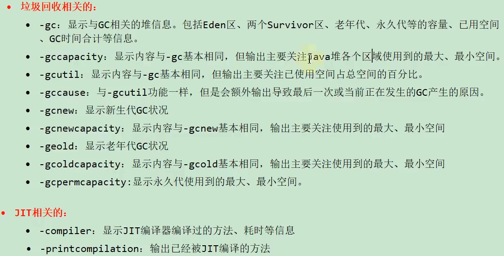

+ -jinfo：实时查看和修改JVM配置参数

+ -jmap：导出内存映像文件&内存使用情况

+ -jhat：打印JVM中线程快照

+ -jcmd：多功能命令行

+ -jstatd：远程主机信息收集

#### GUI篇

> JDK自带的工具

+ jconsole：查看Java应用程序的运行状况、监控堆信息、元空间使用情况、类加载器情况等。位置：jdk\bin\jconsole.exe
+ Visual VM：用于查看JVM上运行的基于Java的应用程序的详细信息。位置：jdk\bin\jvisualvm.exe
+ JMC：能够以极低的性能开销收集JVM的性能数据。

> 第三方

+ MAT：基于Eclipse的内存分析工具，是一个快速、功能丰富的Java heap分析工具，可以帮我们查找内存泄漏和减少内存消耗。
+ Arthas：阿里开源的Java诊断工具。可以在线排查问题，无需重启：动态跟踪代码。
+ Btrace：Java运行时追踪工具，可以在不停机的情况下，跟踪指定的方法调用、构造函数调用和系统内存等信息。
+ IDEA中也有一个插件，JProfiler（收费，很强大）。

---


---

### JVM选项参数

#### -X

+ 非标准化参数，还算稳定，不过后续可能会删改。
+ 特别地：
  1. `-Xms<size>`=`-XX:InitialHeapSize`（设置初始Java堆大小，默认为物理内存的1/64）
  2. `-Xmx<size>`=`-XX:MaxHeapSize`（设置对打Java堆大小，默认为物理内存的1/4）
  3. `-Xss<size>`=`-XX:ThreadStackSize`（设置Java线程堆栈大小）

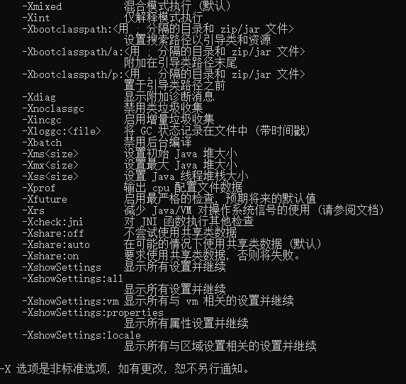

---

#### -XX

+ 非标准化参数，属于实验性的，不稳定，用于开发和调试JVM。
+ 分类：
  1. Boolean：`-XX:+<opyion>`表示启动option属性；`+XX:-<option>`表示禁用option属性。
  2. key-value：数值型`-XX:<option>=<number>`；非数值型`-XX:<name>=<string>`

+ 特别地`-XX:+PrintFlagsFinal`：
  1. 输出所有参数的名称和默认值。
  2. 默认不包括Diagnostic和Experimental的参数。
  3. 可以配合`-XX:+UnlockDiagnosticVMOptions`和`-XX:+UnlockExperimentalVMOptions`使用。

#### 添加JVM参数

**运行jar包**

`java -Xms50m -Xmx50m -XX:+PrintGCDetails -jar demo.jar`

**通过Tomcat运行war包**

+ linux系统下可以在tomcat/bin/catalina.sh中添加类似如下配置：`JAVA_OPTS=-Xms512M -Xmx1024M`
+ Windows系统下在catalina.bat中添加类似如下配置：`set "JAVA_OPTS=-Xms512M -Xmx1024M"`

**程序运行过程中**

+ 使用`jinfo -flag<name>=<value><pid>`设置非Boolean类型参数
+ 使用`jinfo -flag[+|-]<name><pid>`设置Boolean类型参数

---

### 常用参数

#### 打印设置的XX选项及值

+ `-XX:+PrintCommandLineFlags`：可以在程序运行前打印出用户手动设置或者JVM自动设置的XX选项。
+ `-XX:+PrintFlagsInitial`：表示打印出所有XX选项的默认值。
+ `-XX:+PrintFlagsFinal`：打印出所有XX选项运行时的值
+ `-XX:+PrintVMOptions`：打印JVM参数

#### 堆、栈、方法区等内存大小的设置

##### 栈

+ `-Xss128k` ：设置每个线程的栈大小为128k，等价于`-XX:ThreadStackSize=128k`

##### 堆

+ `-Xmx<size>`=`-XX:MaxHeapSize`（设置对打Java堆大小，默认为物理内存的1/4）

+ `-Xmn2g`：设置年轻代大小为2G，推荐设置为整个堆大小的3/8
+ `-XX:NewSize=1024m`：设置年轻代初始值为1024m
+ `-XX:MaxNewSize=1024m`：设置年轻代最大值为1024m
+ `-XX:SurvivorRatio=8`：设置Eden与一个Survivor区大小的比例
+ `-XX:+UseAdaptiveSizePolicy`：自动选择各区大小比例
+ `-XX:NewRatio=4`：设置老年代与年轻代的比值
+ `-XX:PretenureSizeThreadshold=1024`：设置大于此阈值的对象直接分配在Old区，单位是字节。只对Serial、ParNew收集器有效
+ `-XX:MaxTenuringThreshold=15`：进入Old区的年龄，默认为15
+ `-XX:+PrintTenuringDistribution`：让JVM在每次MinorGC后打印出当前使用的Survivor中对象的年龄分布
+ `-XX:TargetSurvivorRatio`：表示MinorGC结束后Survivor区域中占用空间的期望比例。

##### 方法区

+ `-XX:MetaspaceSize`：初始空间大小
+ `-XX:MaxMetaspaceSize`：最大空间，默认没有限制
+ `-XX:+UseCompressedOops`：压缩对象指针
+ `-XX:+UseCompressedClassPointers`：压缩类指针
+ `-XX:CompressedClassSpaceSize`：设置klass Metaspace的大小，默认为1G。

**直接内存**：`-XX:MaxDirectMemorySize`：指定直接内存容量，默认与Java堆大小一样。

#### OOM相关的选项

+ `-XX:+HeapDumpOnOutOfMemoryError`：表示在内存出现OOM的时候，把heap转存（Dump）到文件以便后续分析
+ `-XX:+HeapDumpBeforeFullGC`：表示在出现FullGC之前，生成Heap转储文件
+ `-XX:HeapDumpPath=<path>`：指定heap转存文件的存储路径
+ `-XX:OnOutOfMemoryError`：指定一个可行性程序或者脚本的路径，当发生OOM的时候，去执行这个脚本

#### GC日志参数选项

+ `-verbose:gc`：输出gc日志信息，默认输出到标准输出，等同于`-XX:+PrintGC`
+ `-XX:+PrintGCDetails`：在发生GC时打印内存回收详细的日志，并在进程退出时输出当前内存各区域分配情况
+ `-XX:+PrintGCTimeStamps`：输出GC发生的时间戳
+ `-XX:+PrintGCDataStamps`：以日期格式输出GC发生的时间戳
+ `-XX:+PrintHeapAtGC`：每一次GC前和GC后，都打印堆信息。
+ `-Xloggc:<file>`：把GC日志写入到每一个文件中去，而不是打印到标准输出中。

#### 其他

+ `-XX:+DisableExplicitGC`：禁止HotSpot执行`system.gc()`，默认禁用

+ `-XX:+DoEscapeAnalysis`：开启逃逸分析
+ `-XX:+UseTLAB`：使用TLAB，默认打开
+ `-XX:+PrintTLAB`：打印TLAB的使用情况
+ `-XX:TLABSize`：设置TLAB大小

#### 使用Java代码获取JVM参数

通过使用Runtime和ManagementFactory。

通过这些api可以监控我们的应用程序服务器的堆内存使用情况，设置一些阈值进行报警等处理。

### GC日志剖析

#### Minor GC

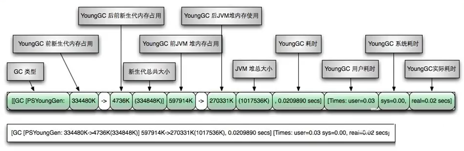

#### Full GC

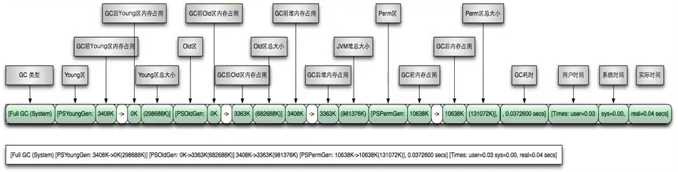

#### GC时间

+ user：进程执行用户态代码所使用的的时间，这是执行此进程所使用的实际CPU时间。
+ sys：进程在内核态消耗的时间，即在内核执行系统调用或等待系统事件所使用的CPU时间。
+ real：程序从开始到结束所用的时钟时间。

由于多核的原因，一般的GC时间中，real time是小于sys+user time的。假如大于，则可能是IO负载非常重或者CPU不够用。

#### GC日志分析工具

+ GCeasy
+ GCViewer
+ GCHisto、GCLogViewer、Hpjmeter、garbagecat等。


想把GC日志保存到文件的话，使用`-Xloggc:/path/to/gc.log`

