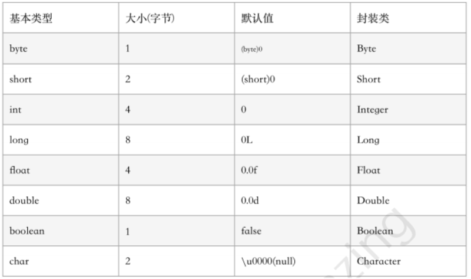

# Java 基础

## 一、语言特性

#### JDK、JRE、JVM

- <span style="background-color: yellow">JVM（Java Virtual Machine）</span>：整个 Java 实现跨平台的最核心的部分，将 A.class 字节码文件解释成二进制 1010101010 这样的数据。
- <span style="background-color: yellow">JRE（ Java Runtime Environment）</span>：**Java 运行时环境**，包含 JVM、Java 类库、java 命令等
- <span style="background-color: yellow">JDK（Java Development Kit）</span>： Java 开发工具包，拥有 JRE 所拥有的一切，还有编译器（javac）和工具（javadoc 和 jdb）。

---

#### Java 和 C++ 区别

​ 一次编译，到处(前提是装有 JVM)运行

- 都是面向对象语言，都支持封装、继承、多态；
- Java 不提供指针来直接访问内存；
- Java 的类是单继承的，C++ 支持多重继承；虽然 Java 的类不支持多继承，但接口可以多继承；
- Java 有自动内存管理机制，不需要程序员手动释放无用内存；
- C 语言中字符串或字符数组最后都会有一个额外的字符 ‘\0’ 来表示结束，而在 java 语言中没有结束符这一概念。

---

#### Java 的平台无关性

1.  JVM：运行在虚拟机之上，屏蔽掉了硬件和操作系统的差异。
2.  JMM：JMM 的初衷就是来屏蔽掉各种硬件和操作系统的内存访问差异，以实现让 Java 程序在各种平台下都能达到一致的内存访问效果。
    JMM 规定了所有的变量都存储在主内存（Main Memory）中。每个线程还有自己的工作内存（Working Memory）,线程的工作内存中保存了该线程使用到的变量的主内存的副本拷贝，
    线程对变量的所有操作（读取、赋值等）都必须在工作内存中进行，而不能直接读写主内存中的变量（volatile 变量仍然有工作内存的拷贝，但是由于它特殊的操作顺序性规定，
    所以看起来如同直接在主内存中读写访问一般）。不同的线程之间也无法直接访问对方工作内存中的变量，线程之间值的传递都需要通过主内存来完成。

        	volatile保证可见性
        			不保证原子性
        			禁止指令重排（保证有序性）

---

#### 什么是注解？什么是元注解？

**注解**是一种标记，使类或接口附加额外信息，帮助编译器和 JVM 完成一些特定功能，例如 `@Override` 标识一个方法是重写方法。就是代码中的**特殊标记**，**这些标记可以在编译、类加载、运行时被读取，并执行相对应的处理**。

​ **开发中用到的**：框架中@controller @param，java 原生的@overrided，@deprecated 等(原生的注解多用于标记和检查)。

**元注解**是自定义注解的注解，例如：

3. Retention：指定其所修饰的注解的保留策略
4. @Document：该注解是一个标记注解，用于指示一个注解将被文档化
5. @Target：用来限制注解的使用范围
6. @Inherited：该注解使父类的注解能被其子类继承
7. @Repeatable：该注解是 Java8 新增的注解，用于开发重复注解


---

#### Class 类、Class 对象

​ 在程序运行期间，系统为所有对象维护一个运行时类型标识，这个信息会跟踪每个对象所属的类，虚拟机利用运行时类型信息选择要执行的正确方法，保存这些信息的类就是 Class，这是一个泛型类。

获取 Class 对象：① `类名.class` 。② 对象的 `getClass`方法。③ `Class.forName(类的全限定名)`。

---

#### == 和 equals 的区别

**==**：如果比较的对象是基本数据类型，则比较的是数值是否相等；如果比较的是引用数据类型，则比较的是对象的地址值是否相等。

**equals**：判断两个对象是否相等（比的是内存中存放的内容是否相等 ）， 但它一般有两种使用情况：

- **类没有重写 equals 方法**，调用的是 Object 超类的 equals 方法，则通过 equals 比较该类的两个对象时，等价于通过 "==" 比较内存地址。

- 类重写了 equals 方法来比较两个对象的内容是否相等。

---

#### 两个对象的 hashCode() 相同，则 equals() 也一定为 true 吗？

​ 两个对象的 hashCode() 相同，equals() 不一定为 true。因为在哈希(散列)表中，hashCode() 相等即两个键值对的哈希值相等，然而哈希值相等，并不一定能得出键值对相等，因为会发生<span style="background-color: yellow">散列冲突</span>。

​ 只有 hash 值相同，那说明该元素哈希冲突了，如果 hash 值和 equals()或者==都相同，那就说明元素还是同一个了。

---

#### 为什么重写 equals() 就一定要重写 hashCode() 方法？

​ 这个问题应该是有个前提，就是你需要用到 HashMap、HashSet 等 Java 集合，用不到哈希表的话，其实仅仅重写 equals() 方法也可以。而工作中的场景是常常用到 Java 集合，所以 Java 官方建议重写 equals() 就一定要重写 hashCode() 方法。

​ 为了支持基于 **hash 机制的 Java 集合**类，如：Set、Map，在确定元素插入位置和判断元素是否相等时，都需要先根据 `key.hashCode()` 计算出 hash 值。当发生 hash 冲突时，才需要调用 equals 来比较 key 值是否相同。

重写 hashcode 的原因是为了将“为我们需要认定为相同的两个对象返回相同的哈希值，这么做的原因是集合中比较两个对象时，先比对了他们的哈希值，以此来排除哈希值不同的两个对象一定不等，这样做对集合的效率是有利的。”

(用 hashcode 跟 equals 方法配合，都重写好配合。)

---

#### 深拷贝和浅拷贝？

<font color='red'> 深拷贝和浅拷贝都是对象拷贝</font>，对于对象中的基本数据类型，直接简单复制一份；对象中的引用数据类型，分两种情况：

- 浅拷贝：**引用传递。（默认）**，只是把指向对象实例的地址复制一份到引用上。
- 深拷贝：**创建一个新的对象，并复制其内容。**

实现方式：

- 浅拷贝：类实现 Cloneable 接口，直接调用 Object 类中的 `clone()` 方法。

- 深拷贝：类实现 Cloneable 接口，重写 Object 类中的 `clone()` 方法，依次克隆各个可变的引用类型。也可以序列化，但是效率不理想。

---

#### 序列化与反序列化

- 创建的字节流是<span style="background-color: yellow">与平台无关</span>的，在一个平台上序列化的对象可以在不同的平台上反序列化。
- 序列化是为了解决在对象流进行读写操作时所引发的问题。

> 什么情况下需要序列化？

- 把内存中的对象状态保存到一个文件中或者数据库中时候；
- 想用套接字在网络上传递对象的时候；

> 序列化的实现

​ 将需要被序列化的类实现 `Serializable` 接口，该接口没有需要实现的方法，只是用于标注该对象是可被序列化的，然后使用一个输出流（如：FileOutputStream）来构造一个 ObjectOutputStream 对象，接着使用 ObjectOutputStream 对象的 writeObject(Object obj) 方法可以将参数为 obj 的对象写出，要恢复的话则使用输入流。

---

#### 泛型、类型擦除

- <font color='red'>泛型实现了类型参数化，使得类型可以作为参数适用于尽可能多的场景。</font>
- 在创建对象或调用方法的时候才明确下具体的类型，使用泛型的好处是使代码更加简洁(不在需要强制转换)，程序更加健壮(在编译期间没有警告，在运行期间就不会出现 ClassCastException 类型转换异常)。
- 我们常用泛型机制来统一集合中存储的元素，这样集合中取出的元素是泛型指定的类型，不需要进行大量向下转型。<span style="background-color: yellow">强化类型安全，提高代码复用</span>。
- 泛型是通过<span style="background-color: yellow">类型擦除</span>来实现的，编译器在编译时擦除了所有类型相关的信息，所以在运行时不存在任何类型相关的信息。这样做的目的，是确保能和 Java 5 之前的版本开发二进制类库进行<span style="background-color: yellow">兼容</span>。

> 类型擦除

​ <span style="background-color: yellow">泛型信息只存在于代码编译阶段</span>，在进入 JVM 之前，与泛型相关的信息会被擦除掉，专业术语叫做类型擦除。在泛型类被类型擦除的时候，之前泛型类中的类型参数部分如果没有指定上限，如< T >则会被转译成普通的 Object 类型，如果指定了上限如 < T extends String > 则类型参数就被替换成类型上限。

> <font color='red'>如何验证类型擦除？</font>

​ 利用类型擦除的原理，用<span style="background-color: yellow">反射</span>的手段就绕过了正常开发中编译器不允许的操作限制。

> List< ? extends T > 和 List < ? super T > 之间有什么区别 ?

​ `List< ? extends T >` 可以接受任何继承自 T 的类型的 List，而`List < ? super T >`可以接受任何 T 的父类构成的 List。

---

#### final、finally、finalize 的区别

- final：是个关键字，代表最终。
  1. 修饰一个变量：变量必须初始化，且不能被重新赋值
  2. 修饰一个引用：引用地址不能变，但是指向的对象可以改变
  3. 修饰一个方法：无法被重写，但可以被继承
  4. 修饰一个类：无法被继承
- finally：一般作用在 try...catch 代码块中，将一定要执行的代码放在 finally 代码块中，无论是否出现异常，该代码块都会被执行，**一般用来存放一些关闭资源的操作**。
- finalize：Object 类的一个方法，GC 回收对象前会先调用这个对象的 finalize( ) 方法，这个方法允许在子类中被重写，常用来进行一些资源释放工作，如：关闭文件或数据库连接等。

---

#### 大端模式和小端模式

大端模式：高数据位保存在内存的低地址位中，低数据位保存在内存的高地址位中

小端模式：高数据位保存在内存的高地址位中，低数据位保存在内存的低地址位中

C 语言中，默认是小端存储；<span style="background-color: yellow">默认是大端存储</span>；在网络上传输数据普遍采用的都是大端模式

---

#### 反射及其应用场景

​ **每个类都有一个 Class 对象，包含了与类有关的信息**。当编译一个新类时，会产生一个同名的 .class 文件，该文件内容保存着 Class 对象。类加载相当于 Class 对象的加载，类在第一次使用时才动态加载到 JVM 中。

​ 也可以使用`Class.forName(“com.mysql.jdbc.Driver”)`这种方式来控制类的加载，该方法会返回一个 Class 对象。

​ **反射可以提供运行时的类信息，并且这个类可以在运行时才加载进来，甚至在编译时期该类的 .class 不存在也可以加载进来。**Class 和 java.lang.reflect 一起对反射提供了支持，java.lang.reflect 类库主要包含了以下三个类：

- Field ：可以使用 get() 和 set() 方法读取和修改 Field 对象关联的字段；
- Method ：可以使用 invoke() 方法调用与 Method 对象关联的方法；
- Constructor ：可以用 Constructor 创建新的对象。

应用举例：工厂模式，使用反射机制，根据全限定类名获得某个类的 Class 实例。

> 优缺点

**优点：**

- 运行期类型的判断，class.forName() 动态加载类，提高代码的灵活度；

**缺点：**

- <span style="background-color: yellow">性能开销</span> ：反射涉及了动态类型的解析，所以 JVM 无法对这些代码进行优化。因此，反射操作的效率要比那些非反射操作低得多。我们应该避免在经常被执行的代码或对性能要求很高的程序中使用反射。

- <span style="background-color: yellow">安全限制</span>：使用反射技术要求程序必须在一个没有安全限制的环境中运行。如果一个程序必须在有安全限制的环境中运行，那么这就是个问题了。
- <span style="background-color: yellow">内部暴露</span>：由于反射允许代码执行一些在正常情况下不被允许的操作（比如：访问私有的属性和方法），所以使用反射可能会导致意料之外的副作用，这可能导致代码功能失调并破坏可移植性。反射代码破坏了抽象性，因此当平台发生改变的时候，代码的行为就有可能也随着变化。

---

#### 动态代理

​ 当想要给实现了某个接口的类中的方法，加一些额外的处理。比如说加日志，加事务等。可以给这个类创建一个代理，故名思议就是创建一个新的类，这个类不仅包含原来类方法的功能，而且还在原来的基础上添加了额外处理的新功能。这个代理类并不是定义好的，是动态生成的。具有解耦意义，灵活，扩展性强。

动态代理的**应用**：Spring 的 AOP 、加事务、加权限、加日志。

> 怎么实现动态代理

​ 首先必须定义一个接口，还要有一个 InvocationHandler（将实现接口的类的对象传递给它）处理类。再有一个工具类 Proxy（习惯性将其称为代理类，因为调用它的 newInstance() 可以产生代理对象，其实它只是一个产生代理对象的工具类）。利用到 InvocationHandler，拼接代理类源码，将其编译生成代理类的二进制码，利用加载器加载，并将其实例化产生代理对象，最后返回。

​ 每一个动态代理类都必须要实现 InvocationHandler 这个接口，并且每个代理类的实例都关联到了一个 handler，当我们通过代理对象调用一个方法的时候，这个方法的调用就会被转发为由 InvocationHandler 这个接口的 invoke 方法来进行调用。我们来看看 InvocationHandler 这个接口的唯一一个方法 invoke 方法：

```java
Object invoke(Object proxy, Method method, Object[] args) throws Throwable
```

- proxy: 指代我们所代理的那个真实对象
- method: 指代的是我们所要调用真实对象的某个方法的 Method 对象
- args: 指代的是调用真实对象某个方法时接受的参数

Proxy 类的作用是动态创建一个代理对象的类。它提供了许多的方法，但是我们用的最多的就是 newProxyInstance 这个方法：

```java
public static Object newProxyInstance(ClassLoader loader, Class<?>[] interfaces,  InvocationHandler handler)  throws IllegalArgumentException
```

- loader：一个 ClassLoader 对象，定义了由哪个 ClassLoader 对象来对生成的代理对象进行加载；
- interfaces：一个 Interface 对象的数组，表示的是我将要给我需要代理的对象提供一组什么接口，如果我提供了一组接口给它，那么这个代理对象就宣称实现了该接口(多态)，这样我就能调用这组接口中的方法了；
- handler：一个 InvocationHandler 对象，表示的是当我这个动态代理对象在调用方法的时候，会关联到哪一个 InvocationHandler 对象上。

​ 通过 Proxy.newProxyInstance 创建的代理对象是在 Jvm 运行时动态生成的一个对象，它并不是我们的 InvocationHandler 类型，也不是我们定义的那组接口的类型，而是在运行是动态生成的一个对象。

---

#### Object 包含哪些方法？

clone( )、equals(Object)、finalize( )、hashCode( )、wait( )、wait(long)、notify( )、notifyAll( )、toString( )、getClass( )

---

1．clone 方法
保护方法，实现对象的浅复制，只有实现了 Cloneable 接口才可以调用该方法，否则抛出 CloneNotSupportedException 异常。

2．getClass 方法
final 方法，获得运行时类型。

3．toString 方法
该方法用得比较多，一般子类都有覆盖。

4．finalize 方法
该方法用于释放资源。因为无法确定该方法什么时候被调用，很少使用。

5．equals 方法
该方法是非常重要的一个方法。一般 equals 和==是不一样的，但是在 Object 中两者是一样的。子类一般都要重写这个方法。

6．hashCode 方法
该方法用于哈希查找，重写了 equals 方法一般都要重写 hashCode 方法。这个方法在一些具有哈希功能的 Collection 中用到。

一般必须满足 obj1.equals(obj2)==true。可以推出 obj1.hash- Code()==obj2.hashCode()，但是 hashCode 相等不一定就满足 equals。不过为了提高效率，应该尽量使上面两个条件接近等价。

7．wait 方法
wait 方法就是使当前线程等待该对象的锁，当前线程必须是该对象的拥有者，也就是具有该对象的锁。wait()方法一直等待，直到获得锁或者被中断。wait(long timeout)设定一个超时间隔，如果在规定时间内没有获得锁就返回。

调用该方法后当前线程进入睡眠状态，直到以下事件发生。

（1）其他线程调用了该对象的 notify 方法。

（2）其他线程调用了该对象的 notifyAll 方法。

（3）其他线程调用了 interrupt 中断该线程。

（4）时间间隔到了。

此时该线程就可以被调度了，如果是被中断的话就抛出一个 InterruptedException 异常。

8．notify 方法
该方法唤醒在该对象上等待的某个线程。

9．notifyAll 方法
该方法唤醒在该对象上等待的所有线程。

#### 值传递与引用传递的区别

​ java 中基础类型数据传递都是值传递，java 中实例对象的传递是引用传递。**值传递是指在调用函数时将实际参数复制一份传递到函数中，这样在函数中如果对参数进行修改，将不会影响到实际参数**。**所谓引用传递是指在调用函数时将实际参数的地址传递到函数中，那么在函数中对参数所进行的修改，将影响到实际参数**。

​ **值传递和引用传递都是传递的栈空间中的内容，因为栈空间存的是基本数据类型的值（所以表现为值传递），而栈空间存的引用类型的地址（所以表现为引用传递）。**

​ 值传递是对基本型变量而言的，传递的是该变量的一个副本，改变副本不影响原变量的值。而引用传递一般是对于对象型变量而言的，传递的是对象地址的一个副本，并不是对象本身。

#### 关键字 static 的作用

- 为特定数据类型或对象分配单一的存储空间，与创建对象的个数无关
- 在不创建对象的情况下就可以用来直接调用方法或使用类的属性
- JVM 在类加载的连接阶段的准备过程中对其进行初始化也就是分配内存空间，的初始化时会执行 static 代码块，static 代码块经常会被用来初始化静态变量，需要注意的是 static 代码块只会被执行一次

## 二、面向对象

### vs 面向过程

<span style="background-color: yellow">面向对象 OOP</span>：把数据及对数据的操作方法放在一起，作为一个相互依存的整体——对象。对同类对象抽象出其共性，形成类。

- <span style="background-color: yellow">面向过程</span>：以事件为中心的编程思想，编程的时候把解决问题的步骤分析出来，然后用函数把这些步骤实现，在一步一步的具体步骤中再按顺序调用函数。

  面向过程性能比面向对象高，所以当性能是重要的考量因素时，如：单片机、嵌入式开发、Linux/Unix 等一般采用面向过程开发。

- <span style="background-color: yellow">面向对象</span>：在日常生活或编程中，简单的问题可以用面向过程的思路来解决，直接有效，但是当问题的规模变得更大时，用面向过程的思想是远远不够的。所以慢慢就出现了面向对象的编程思想。

  更符合人类的思维方式。易维护、易复用、易扩展，由于面向对象有封装、继承、多态性的特性，可以设计出低耦合的系统。

---

### 面向对象的三大特性

- <span style="background-color: yellow">封装</span>：把数据和操作数据的方法封装（**使用 private 修饰**）起来，对数据的访问只能通过定义的方法（getter & setter 方法），**提高了安全性**。
- <span style="background-color: yellow">继承</span>：从已有类得到继承信息创建新类的过程。通过继承使得子类具有父类的属性和方法，同时子类也可以新增新的属性和方法。**提高代码复用性，并且继承是多态的前提**。<span style="background-color: yellow">注意点：</span>
  1. <span style="background-color: yellow">子类拥有父类对象所有的属性和方法</span>（包括私有属性和私有方法），但是父类中的私有属性和方法子类是无法访问，**只是拥有**，例如私有属性，只能通过 public 的 get 和 set 方法访问到，但私有方法不行。
  2. <span style="background-color: yellow">构造器私有化的类不能被继承</span>，因为如果 A 类构造函数私有化了，类 B extend A 的话会报错，因为子类会调用 super( )，会因为私有化无法访问。
  3. 被 final 修饰，<span style="background-color: yellow">当用 final 修饰一个类时，表明这个类不能被继承</span>，这主要是防止任何继承类改变它的本来含义。
- <span style="background-color: yellow">多态</span>：<font color='red'>父类引用指向子类对象。</font>(多态实现的前提：继承；要有方法重写；父类引用指向子类对象)只有在程序运行期间才能确定引用变量到底会指向哪个类的实例对象。当使用多态方式调用方法时，首先检查父类中是否有该方法，如果没有，则编译错误；如果有，再去调用子类的同名方法。**降低程序耦合度，使程序易扩展**。(**属性不具有多态性**，方法具有。子类覆盖父类的方法或属性后，**只有新方法才能被调用，属性则继续调用父类本身的旧属性**)

---

### Java 中创建对象的方式

- 使用<span style="background-color: yellow">new</span>关键字。

- 使用<span style="background-color: yellow">Class 类</span>的<span style="background-color: yellow">newInstance()</span>方法，该方法调用无参的构造器创建对象（反射）：`Class.forName.newInstance()`。

  - 直接调用 Class 对象的 newInstance()方法创建，使用的默认构造器来创建该类的实例

  - 若想使用指定的构造器来创建实例，先获得该 class 对象，利用该 class 对象的 getConstructor 方法获取指定构造器，再调用 Constructor 方法创建 Java 对象。

    getDeclareMethod 获取的是类自身声明的所有方法，包含 public、protected 和 private 方法，getMethod 获取的是类的所有共有方法，这就包括自身的所有 public 方法，和从基继承的、从接口实现的所有 public 方法。

- 使用<span style="background-color: yellow">clone()</span>方法。

- <span style="background-color: yellow">反序列化</span>，比如调用 ObjectInputStream 类的 readObject() 方法。

---

### 访问权限控制符有哪些？

| 访问权限控制符 | 本类 | 包内 | 包外子类 | 任何地方 |
| -------------- | ---- | ---- | -------- | -------- |
| public         | √    | √    | √        | √        |
| protected      | √    | √    | √        | ×        |
| 无             | √    | √    | ×        | ×        |
| private        | √    | ×    | ×        | ×        |

---

### 子类是否可以重写(覆盖)父类 private 或 static 方法

- Java 中 <span style="background-color: yellow">static 方法不能被重写</span>，因为**方法重写是基于运行时动态绑定的**，而 static 方法是编译时静态绑定的。static 方法跟类的任何实例都不相关，所以概念上不适用。（**静态方法可以被继承**，如果父类和子类中存在同样名称和参数的静态方法，那么该子类的方法会把原来继承过来的父类的方法<span style="background-color: yellow">隐藏</span>）
- Java 中也<span style="background-color: yellow">不可以覆盖 private 的方法</span>，因为 private 修饰的变量和方法只能在当前类中使用， 如果是其他的类继承当前类是不能访问到 private 变量或方法的，当然也不能覆盖。

### 重写与重载的区别

- **重写**：所以**在方法名，参数列表，返回类型(除过子类中方法的返回值是父类中方法返回值的子类时)都相同的情况下，** 对方法体进行修改或重写，这就是重写。但要注意**子类函数的访问修饰权限不能少于父类的。**访问修饰符的限制一定要大于被重写方法的访问修饰符（public>protected>default>private)

- **重载**：在一个类中，同名的方法如果有不同的参数列表（**参数类型不同、参数个数不同甚至是参数顺序不同**）则视为重载。同时，重载对返回类型没有要求，可以相同也可以不同，但**不能通过返回类型是否相同来判断重载**。重载是一个类中多态性的一种表现。重载要求同名方法的参数列表不同(参数类型，参数个数，甚至是参数顺序)，重载的时候，返回值类型可以相同也可以不同，无法以返回值类型作为判断重载函数的区分标准。

- 二者区别：

  方法的重载和重写都是实现多态的方式，区别在于前者实现的是**编译时的多态性**，而后者实现的是**运行时的多态性**。**重载发生在一个类中**，同名的方法如果有不同的参数列表（参数类型不同、参数个数不同或者二者都不同）则视为重载；**重写发生在子类与父类之间**，重写要求子类被重写方法与父类被重写方法有相同的参数列表，有兼容的返回类型，比父类被重写方法更好访问，不能比父类被重写方法声明更多的异常（里氏代换原则）。重载对返回类型没有特殊的要求，不能根据返回类型进行区分。

---

### static 可以修饰类么

​ static 一般用来修饰成员变量或方法。但有一种特殊用法是**用 static 修饰内部类**，普通类是不允许声明为静态的，只有内部类才可以。

### 什么时候会使用静态内部类

**静态内部类的主要特点：**

1. 不持有外部类的引用（普通内部类持有）
2. 可以直接创建实例，不需要先创建外部类（普通内部类需要）
3. 可以有静态成员变量、方法（普通内部类不行）和非静态成员变量、方法
4. 只可以直接访问外部类静态成员，不可以直接访问外部类的非静态成员（普通内部类可以），需要通过传入外部类引用的方式才能访问。

**使用场景：**

​ 外部类与内部类有很强的联系，需要通过内部类的方式维持嵌套的可读性。内部类可以单独创建。内部类不依赖于外部类，外部类需要使用内部类，而内部类不需使用外部类（或者不合适持有外部类的强引用）。

---

### 接口 vs 抽象类

[深入理解 Java 的接口和抽象类](https://www.cnblogs.com/dolphin0520/p/3811437.html)

从设计层面来说，抽象类是对类的抽象，是一种模板设计；接口是对行为的抽象，是一种行为规范。

> 不同点：

- 抽象类中可以定义构造函数，接口不能定义构造函数；

- JDK1.8 之前，抽象类中可以有抽象方法、静态方法和具体方法，而接口中只能有抽象方法（public abstract）和常量（public static final）；

  ```java
  JDK8引入了接口默认方法，接口中可以包含带有具体实现的方法，需要使用 default 修饰。
  JDK8中接口中可以包含静态方法。之前不能包含是因为，接口不可以实现方法，只可以定义方法，所以不能使用静态方法（因为静态方法必须实现）。现在可以包含了，只能直接用接口调用静态方法。JDK1.8 仍然不可以包含静态代码块。
  ```

- 抽象类中的成员权限可以是 public、默认、protected（抽象类中抽象方法就是为了重写，所以不能被 private 修饰），而接口中的成员只可以是 public（方法默认：public abstract、成员变量默认：public static final）；

> 抽象类和接口的选择

​ 抽象类是为了简化接口的实现，它不仅提供了公共方法的实现，让你可以快速开发，又允许你的类完全可以自己实现所有的方法，不会出现紧耦合的问题。

应用场合：

1. 接口是对行为的抽象，行为模型应该总是通过接口而不是抽象类定义。
2. 抽象类是对类的抽象，为具体类提供准则时创建抽象类。

<font color='red'>在我平时使用过程中，优先定义接口，如果有多个接口实现有公用的部分，则使用抽象类，然后集成它</font>。

---

### 子类初始化的顺序

存在继承的情况下，初始化顺序为：

1. 父类（静态变量、静态语句块）
2. 子类（静态变量、静态语句块）
3. 父类（实例变量、普通语句块）
4. 父类（构造函数）
5. 子类（实例变量、普通语句块）
6. 子类（构造函数）

---

### super 、transient

> super 的作用

- <span style="background-color: yellow">访问父类的构造函数</span>：可以使用 super() 函数访问父类的构造函数，从而委托父类完成一些初始化的工作。
- <span style="background-color: yellow">访问父类的成员</span>：如果子类重写了父类的某个方法，可以通过使用 super 关键字来引用父类的方法实现。

> 为什么 this 和 super 不能出现在一个构造函数里面？

​ 因为 this 必然会调用其它的构造函数，其它的构造函数必然也会有 super 语句的存在，所以在同一个构造函数里面有相同的语句，就失去了语句的意义，编译器也不会通过。

> transient 关键字的作用

对于不想进行序列化的变量，使用 transient 关键字修饰。

transient 关键字的作用是：阻止实例中那些用此关键字修饰的的变量序列化。当对象被反序列化时，被 transient 修饰的变量值不会被持久化和恢复。transient 只能修饰变量，不能修饰类和方法。

---

## 三、数据类型

#### Java 都有哪些基本数据类型？



---

#### char 和 String 的区别

- char 相当于一个<span style="background-color: yellow">int 值</span>，可以参与表达式运算；String 代表一个地址值；

  ```java
  int和char可以互换，可以直接将一个不超过char范围的数字赋值给char。 char c = 97;(此时print的话，是 a)
  ```

- 占内存大小：字符常量占用 2 个字节，字符串常量占若干字节。

---

#### Integer/int、包装类的缓存

- int 是 Java 的八种基本数据类型之一，而 Integer 是 Java 为 int 类型提供的封装类；
- int 型变量的默认值是 0，Integer 变量的默认值是 null，说明 **Integer 可以区分出未赋值和值为 0**；
- Integer 变量必须实例化后才可以使用，而 int 不需要。
- 基本数据类型是在栈上分配的，包装类是在堆中分配。

> 比较

- 两个 new 出来的 Integer 比较的是地址。

- Integer 和 int 比较时，Integer 自动拆箱，相当于两个 int 在比较。

- 对于两个非 new 生成的 Integer 对象进行比较时，如果两个变量的值在区间 [-128, 127] 之间，则比较结果为 true，否则为 false。

  Java 在编译` Integer i = 100` 时，会编译成 `Integer i = Integer.valueOf(100)`，而 Integer 类型的 valueOf 的源码如下所示：

  ```java
  public static Integer valueOf(int var0) {
      return var0 >= -128 && var0 <= Integer.IntegerCache.high ? Integer.IntegerCache.cache[var0 + 128] : new Integer(var0);
  }
  可以看出：Java 对于 [-128, 127] 之间的数会放到一个名为cache的数组中缓存，比如：Integer i = 127，会将 127 进行缓存，下次再写 Integer j = 127 的时候，就会直接从缓存中取出，而对于这个区间之外的数就需要 new 了。
  ```

> 包装类的缓存：

- Boolean：全部缓存
- Byte：全部缓存（Byte 的数值范围是 -128 ～ 127）
- Character：<= 127 缓存
- Short、Integer、Long：-128 ~127 缓存
- Float、Double：没有缓存

---

#### String 为什么要设计成不可变类

- <span style="background-color: yellow">字符串常量池的需要</span>：**字符串常量池是 Java 堆内存**中一个特殊的存储区域, 当创建一个 String 对象时，假如此字符串值已经存在于常量池中，则不会创建一个新的对象，而是引用已经存在的对象；
- <span style="background-color: yellow">允许 String 对象缓存 HashCode</span>：Java 中 String 对象的哈希码被频繁地使用, 比如在 HashMap 等容器中。字符串不变性保证了 hash 码的唯一性，因此可以放心地进行缓存。这也是一种性能优化手段，意味着不必每次都去计算新的哈希码；
- <span style="background-color: yellow">String 被许多的 Java 类(库)用来当做参数</span>，例如：网络连接地址 URL、文件路径 path、还有反射机制所需要的 String 参数等, 假若 String 不是固定不变的，将会引起各种安全隐患。

---

#### String 类可以被继承么？

​ <span style="background-color: yellow">不可以</span>，因为被 final 修饰了。

​ final 是 java 中的一个关键字，可以用来修饰变量、方法和类。用关键词 final 修饰的域成为最终域。用关键词 final 修饰的变量一旦赋值，就不能改变，也称为修饰的标识为常量。如果一个类的域被关键字 final 所修饰，它的取值在程序的整个执行过程中将不会改变。

---

#### final 修饰 StringBuffer 后还可以 append 吗？

可以。final 修饰的是一个引用变量，那么这个引用始终只能指向这个对象，但是这个对象内部的属性是可以变化的。

#### 数组和链表的区别

- 存储形式：数组是一块连续的空间，声明时就要确定长度。；链表是一块可不连续的动态空间，长度可变，每个节点要保存相邻结点指针；
- 数据查找方面：数组的线性查找速度快，查找操作直接使用偏移地址。链表需要按顺序检索节点，效率低
- 数据插入或删除：链表可以快速插入删除节点，而数据则需要大量数据移动
- 越界问题：链表不存在越界问题，数组有越界问题


#### 数组和链表的应用场景

- 数组应用场景：对于想要快速访问数据，不经常有插入删除元素的时候，选择数组
- 链表应用场景：对于需要经常插入和删除元素，而对访问元素时的效率没有很高的要求的话，选择链表。

##### 消息队列可以用数组实现吗

​ 不推荐，因为消息队列中进来的任务数量不确定，并且插入与删除也比较频繁，还是链表更加适合。

---

## 四、Java IO

### 1、IO 分类


---

### 2、IO 与 NIO 区别？讲讲 NIO


1. Java <span style="background-color: yellow">IO 是面向流的，NIO 是面向缓冲区的基于通道的 IO 操作</span>；

2. **传统的 IO 流是阻塞式的**，会一直监听一个 ServerSocket，在调用 read 等方法时，会一直等到数据到来或者缓冲区已满时才返回。调用 accept 也是一直阻塞到有客户端连接才会返回。每个客户端连接过来后，服务端都会启动一个线程去处理该客户端的请求。并且多线程处理多个连接。每个线程拥有自己的栈空间并且占用一些 CPU 时间。每个线程遇到外部未准备好的时候，都会阻塞掉。阻塞的结果就是会带来大量的线程上下文切换。

   **NIO 是非阻塞式的**，<span style="background-color: yellow">Java NIO 实际上就是多路复用 IO</span>。 NIO 基于 Channel 和 Buffer(缓冲区)进行操作，数据总是从通道读取到缓冲区中，或者从缓冲区写入到通道中。 **Selector(选择区)用于监听多个通道的事件**（比如：连接打开，数据到达）。NIO 支持**面向缓冲区的、基于通道的 IO 操作**。**NIO 将以更加高效的方式进行文件的读写操作**。因此，**单个线程可以监听多个数据通道**。

#### 直接缓冲区与非直接缓冲区

- **非直接缓冲区**

​ 通过 allocate()方法获取的缓冲区都是非直接缓冲区，这些缓冲区是建立在**JVM 堆内存**之中。通过非直接缓冲区，想要将数据写入到物理磁盘中，或者是从物理磁盘读取数据。**都需要经过 JVM 和操作系统**，数据在两个地址空间中传输时，会**copy**一份保存在对方的空间中。所以非直接缓冲区的读取效率较低。


- **直接缓冲区**

​ 只有**ByteBuffer 可以获得直接缓冲区**，通过**allocateDirect()**获取的缓冲区为直接缓冲区，这些缓冲区是建立在**物理内存**之中的.

​ 直接缓冲区通过在操作系统和 JVM 之间**创建物理内存映射文件加快缓冲区数据读/写入物理磁盘的速度**。放到物理内存映射文件的数据就不归应用程序控制了，操作系统会自动将物理内存映射文件中的数据写入物理内存中。


#### 通道(Channel)

​ Channel 由 java.nio.channels 包定义的，**通道表示 IO 源与目标打开的连接**。Channel 类似于传统的“流”。只不过**Channel 本身不能直接访问数据，Channel 只能与 Buffer 进行交互** 。

​ 应用程序进行读写操作调用函数时，**底层调用操作系统提供给用户的读写 API**，调用这些 API 时会发生对应的指令。**DMA 会向 CPU 请求，让 DMA 去处理这些 IO 操作**，从而可以让 CPU 去执行其他命令。DMA 处理 IO 操作时，会请求总线的使用权。**当 IO 请求过多时，会导致大量总线用于处理 iO 请求，从而降低效率**。


​ 于是便有了 Channel，Channel 相当于一个**专门用于 IO 操作的独立处理器**，它具有独立处理 iO 的能力，当有 IO 请求时，它会自行处理这些 IO 请求。

---

### 3、BIO/NIO/AIO 区别？

**BIO**：**同步阻塞 IO**，每一个客户端连接，服务器端都会对应一个处理线程，对于没有分配到处理线程的连接就会被阻塞或者被拒绝。相当于是<font color='red'>一个连接一个线程</font>。

**NIO**：**同步非阻塞 IO，基于 Reactor 模型**，客户端和 channel（通道） 进行通信，channel 可以进行读写操作，通过多路复用器 selector 来轮询注册在其上的 channel，而后再进行 IO 操作。这样的话，在进行 IO 操作时用一个线程去处理就可以了。相当于是<font color='red'>一个请求一个线程</font>。

**AIO**：**异步非阻塞 IO**，相比 NIO 更进一步，<span style="background-color: yellow">完全由操作系统来完成请求的处理</span>，然后通知服务器端开启线程去处理，因此是<font color='red'>一个有效请求一个线程</font>。

​ linux 系统中，所有的读写请求都可以当成文件的读写来操作，对文件的读写一般要经过内核态和用户态的切换，**正因为有切换才导致了 IO 有同步和异步的说法**。首先一个 IO 操作其实分成了两个步骤：**发起 IO 请求和实际的 IO 操作**。

​ <span style="background-color: yellow">同步 IO 和异步 IO 的区别就在于第二个步骤是否阻塞</span>，如果实际的 IO 读写阻塞请求进程，那么就是同步 IO，因此阻塞 IO、非阻塞 IO、IO 复用都是同步 IO，如果不阻塞，而是操作系统帮你做完 IO 操作再将结果返回给你，那么就是异步 IO。

​ <span style="background-color: yellow">阻塞 IO 和非阻塞 IO 的区别在于第一步</span>，发起 IO 请求是否会被阻塞，如果阻塞直到完成那么就是传统的阻塞 IO，如果不阻塞，那么就是非阻塞 IO。

<span style="background-color: yellow">同步 IO 的特点</span>：

- 同步 IO 指的是：用户进程触发 I/O 操作并等待或者轮询的去查看 I/O 操作是否就绪。
- **同步 IO 的执行者是 IO 操作的发起者**。同步 IO 需要用户进程自己去读取数据，而读取数据的过程就是一个内核态到用户态的数据拷贝过程，所以这里必须有个阻塞。

<span style="background-color: yellow">异步 IO 的特点</span>：

- 异步 IO 是指用户进程触发 I/O 操作以后就立即返回，继续开始做自己的事情，而当 I/O 操作已经完成的时候会得到 I/O 完成的通知。
- **异步 IO 的执行者是内核线程**，内核线程将数据从内核态拷贝到用户态，所以这里没有阻塞。

---

### 4、IO 多路复用

​ 在 Linux 系统中，网络连接在内核中以文件描述符（Fd）的形式存在。

​ I/O 多路复用就通过一种机制，一个进程可以监视多个描述符，一旦某个 fd 就绪（一般是读就绪或者写就绪），能够通知程序进行相应的读写操作。select，poll，epoll 都是 IO 多路复用的机制，但**本质上都是同步 I/O**，因为他们都需要**在读写事件就绪后自己负责进行读写**，这个读写过程是阻塞的，而异步 I/O 则无需自己负责进行读写，异步 I/O 中内核线程会负责把数据从内核空间拷贝到用户空间。

> select ==> 时间复杂度 O(n)

​ 它仅仅知道有 I/O 事件发生了，却并不知道是哪几个流（可能有一个，多个，甚至全部），所以只能无差别<span style="background-color: yellow">轮询</span>所有流，找出能读出数据，或者写入数据的流进行操作。

​ select 最大的缺陷就是单个进程所打开的 fd 是有一定限制的，它由 FD_SETSIZE 设置，默认值是 1024/2048。

> poll ==> 时间复杂度 O(n)

​ poll 本质上和 select 没有区别，它将**用户传入的数据拷贝到内核空间**（epoll 中，用户态和内核态是共享这一块内存的），然后内核去查询每个 fd 的状态， **但是它没有最大连接数的限制**，原因是它是基于链表来存储的。

> epoll ==> 时间复杂度 O(1)

​ 不同于 select 和 poll 无差别轮询，epoll 中内核会把哪个流发生了怎样的 I/O 事件通知我们，所以我们说 epoll 实际上是**事件驱动（fd 绑定 event）**的。epoll 通过将有读写事件发生的连接重排至头部，将复杂度降低到了 O(1)。虽说连接数有上限，但是很大，1G 内存可以打开 10 万左右的连接。

​ epoll 的消息传递方式：<span style="background-color: yellow">通过内核和用户空间共享一块内存来实现的</span>。

​ 有 **EPOLL LT**（水平触发） 和 **EPOLL ET** 两种触发模式，LT 是默认的模式，ET 是“高速”模式。LT 模式下，只要这个 fd 还有数据可读，每次 `epoll_wait` 都会返回它的事件，提醒用户程序去操作，而在<span style="background-color: yellow">ET（边缘触发）模式</span>中，它只会提示一次，直到下次再有数据流入之前都不会再提示了，无论 fd 中是否还有数据可读。所以在 ET 模式下，read 一个 fd 的时候一定要把它的 buffer 读光，也就是说一直读到 read 的返回值小于请求值，或者遇到`EAGAIN`错误。还有一个特点是，epoll 使用“事件”的就绪通知方式，通过 epoll_ctl 注册 fd，一旦该 fd 就绪，内核就会采用类似 callback 的回调机制来激活该 fd，epoll_wait 便可以收到通知。

**epoll 为什么要有 EPOLL ET 触发模式？**

​ 如果采用 EPOLL LT 模式的话，系统中一旦有大量你不需要读写的就绪文件描述符，它们每次调用`epoll_wait`都会返回，这样会大大降低处理程序检索自己关心的就绪文件描述符的效率.。而采用 EPOLL ET 这种边沿触发模式的话，当被监控的文件描述符上有可读写事件发生时，epoll_wait()会通知处理程序去读写。如果这次没有把数据全部读写完(如读写缓冲区太小)，那么下次调用 epoll_wait()时，它不会通知你，也就是它只会通知你一次，直到该文件描述符上出现第二次可读写事件才会通知你！！！这种模式比水平触发效率高，系统不会充斥大量你不关心的就绪文件描述符。

---

## 五、Java 异常

#### 1、finally 必须执行！

<span style="background-color: yellow">记住一个原则：不管怎样，finally 代码块中的语句都会执行！</span>（除非在 try 中强制退出！）

- 情况 1：try 和 catch 中有 return，finally 中没有 return。执行！
- 情况 2：try 和 catch 中有 return，finally 中没有 return，但 finally 中有对 try 或 catch 中要 return 数据进行操作的代码。

  1. 返回的数据为基本数据类型，则 finally 中对要返回数据操作无影响。（比如返回 num 的值为 4，finally 中的 num++会让 num 变成 5，但是还是返回 4）
  2. 返回的数据为引用数据类型，finally 如果改变了返回对象的属性，则影响结果。

- 情况 3：try 和 catch 中有 return，finally 中也有 return。try 或 catch 中 return 后面的代码会执行，但最终的返回结果为 finally 中的 return 值，需要注意的是 try 或 catch 中 return 后面的代码会执行，只是存起来了，并没有返回，让 finally 捷足先登了。

---

#### 2、Error 和 Exception 的区别？

Error 类和 Exception 类的父类都是 Throwable 类。主要区别如下：

|                   | 说明                                                       | 举例                                                               |
| ----------------- | ---------------------------------------------------------- | ------------------------------------------------------------------ |
| Error（错误）     | 系统级错误，程序运行过程中发生严重错误，无法处理，只能退出 | OutOfMemoryError（内存不足错误）、StackOverflowError（栈溢出错误） |
| Exception（异常） | 程序需要捕获、处理的异常，是由于程序设计不完善而出现的问题 | 运行时异常和编译时异常                                             |

---

#### 3、运行时异常与受检异常

- **编译时异常（受检异常）**：指编译期间，编译器检测到某段代码可能会发生某些问题，需要程序员提前给代码做出错误解决方案，否则编译无法通过。
- **运行时异常（非受检异常）**：指编译通过了，但运行时出现的错误。

> RuntimeException 举例：

| RuntimeException                    | 说明                 |
| ----------------------------------- | -------------------- |
| Java.lang.NullPointerException      | 空指针异常           |
| Java.lang.NumberFormatException     | 字符串转换为数字异常 |
| Java.lang.IndexOutOfBoundsException | 数组角标越界异常     |
| Java.lang.illegalArgumentException  | 方法传递参数异常     |
| Java.lang.ClassCastException        | 数组类型转换异常     |

---

#### 4、throw vs throws？

- throw 用在方法体内，表示将异常抛出给调用者。
- throws 用在方法声明后面，表示这个方法会抛出某种类型的异常，给方法调用者来解决。

---

## 六、Java 集合


### 1、Collection vs Collections

- Collection 是一个集合接口，提供了对集合对象进行基本操作的通用接口方法。

- Collections 是一个操作 Set、List、Map 集合工具类，提供了对集合元素排序、查找、修改等功能。

---

### 2、Iterable vs Iterator

<font color='red'>Iterable 和 Iterator 都是 java 的迭代器接口</font>。

- Iterable 接口是专门创建新的迭代器，该接口包含一个能够产生 Iterator 接口的 iterator( ) 方法，实现了这个接口的集合对象支持迭代。

- Iterator 接口是一个顺序遍历迭代器，它能够用来遍历集合中的元素，JDK 中的集合框架继承了 Iterable 接口，并对 iterator( ) 方法进行了重写。所以当调用集合的 iteartor( ) 方法会返回该集合所实现的特定迭代器对象。

---

### 3、Comparable vs Comparator

Java 实现对象排序的方式有两种：

1. 自然排序：java.lang.Comparable
2. 定制排序：java.util.Comparator

> Comparable 和 Comparator 应该怎么选择呢？

- 当比较规则不会发生改变时，或者说当比较规则只有 1 个时，建议实现 Comparable 接口。
- 当比较规则有多个，并且需要多个比较规则之间频繁切换，建议使用 Comparator 接口。

```java
//自定义Arrays.sort()的例子：
Arrays.sort(T[],new Comparator<Integer>(){
    public int compare(Interger a, Integer b){
        return b-a; //降序
    }
});
```

---

### 4、集合的遍历

> 遍历 Collection 集合

<span style="background-color: yellow">遍历 Collection 集合中元素可以通过 for 循环、for-each、迭代器</span>。

- for-each 反编译成字节码之后，可以看到本质上也是通过迭代器来遍历的，它只比迭代器遍历多了生成中间变量这一步，所以 for-each 性能略微下降了一些。

- for-each 和迭代器需要实现 Iterable 接口并实现 iterator( ) 方法，实质上 Collection 集合都继承了 Iterable 接口并实现了 iterator( ) 方法，表明 Collection 集合下所有实现都可以采用 for-each 和迭代器来遍历。

> 遍历 Map 集合

Map 集合无法直接使用 for-each 或迭代器遍历。Map 集合通过 `entrySet()` 方法转换成 Set 集合，然后获取迭代器对象进行遍历。

> List 的遍历效率比较

- ArrayList 用 for 循环遍历比 iterator 迭代器遍历快，LinkedList 用 iterator 迭代器遍历比 for 循环遍历快。
- ArrayList 是直接通过数组来进行存储，所以在使用下标的方式循环遍历时性能最好，通过下标可以直接取数据，速度最快，而且由于 ArrayList 是实现了 RandomAccess 接口（随机存储），该接口是一个标记接口，表明了 ArrayList 集合中数据元素之间没有关联，支持快速随机访问。而如果对于 ArrayList 使用 for-each 或迭代器遍历就没有 for 循环遍历效率高了，因为迭代器强制将 RandomAccess 的 ArrayList 建立了前后遍历关系，且在每次遍历过程中进行了一堆判断，所有相对于 ArrayList 来说，<font color='red'>使用 for 循环比迭代器效率要高</font>。
- LinkedList 底层实现是双向链表，前后元素是通过链表中指针建立关联，无法直接取到对应的下标，因此在使用普通的 index 索引下标遍历时就需要计算对应的元素在哪，效率很低。而迭代器的实现就是指向下一个元素，迭代器直接通过 LinkedList 的指针进行遍历，一次遍历就能找到相应元素，所以 LinkedList 在使用迭代器遍历时效率最高。

---

### 5、ArrayList、LinkedList、Vector

**ArrayList**：

- ArrayList 实现了 List 接口，底层是基于数组实现的，并且实现了<font color='red'>动态扩容</font>。
- 由于底层是数组实现，所以元素在内存中是连续存储的，可以直接通过下标来查询数组，查询快，但增删慢，但这个增删慢也不是绝对的。
- 内部`grow() `方法来实现动态扩容，当添加元素发现容量满了时，就**扩容到原来数组的 1.5 倍**。
- 此外，它实现的接口： RandomAccess(这个接口的类支持快速随机访问，直接可以通过下标访问)、Cloneable、Serializable。

**LinkedList**：

- LinkedList 实现了 List 接口，底层是基于<span style="background-color: yellow">双向链表</span>实现，它增删速度比较快，但查询速度比较慢，在硬盘中的存储是不连续的。
- LinkedList 链表由一系列表项连接而成，一个表项包含 3 个部分：元素内容、前驱表和后驱表。链表内部有一个 header 表项，既是链表的开始也是链表的结尾。header 的后继表项是链表中的第一个元素，header 的前驱表项是链表中的最后一个元素。
- 虽然 LinkedList 没有下标的概念，但 LinkedList 依旧可以<font color='red'>通过指定索引值来进行查找、新增和删除操作</font>，如：删除元素时可以通过`remove(int index)`& `remove(Object o)` ，<font color='red'>当指定索引值来删除元素时</font>，它首先检查索引值合法性，然后通过从头遍历节点来实现删除操作，删除的节点等待 GC 回收。
- 此外，它实现的接口：Cloneable、Serializable。

#### ArrayList 与 LinkedList 的区别

1. ArrayList 是实现了基于**动态数组的数据结构**，而 LinkedList 是基于**链表的数据结构；**
2. 对于随机访问 get 和 set，ArrayList 要优于 LinkedList，因为 LinkedList 要移动指针；
3. 对于添加和删除操作 add 和 remove，一般大家都会说 LinkedList 要比 ArrayList 快，因为 ArrayList 要移动数据。

**Vector**:

- Vector 与 ArrayList 一样，也是通过数组实现的，<font color='red'>它是 Java 早期提供的线程安全的动态数组</font>。
- 它的方法上加了 synchronized 修饰来保证线程安全，因此它的访问速度比 ArrayList 慢，效率低下，很少使用。
- <span style="background-color: yellow">可以使用 CopyOnWriteArrayList 容器</span>

> ArrayList 的增删未必就是比 LinkedList 要慢：

- 如果增删都是在末尾来操作，此时 ArrayList 就不需要移动和复制数组来进行操作了。如果数据量有百万级的时，速度是会比 LinkedList 要快的。
- 如果删除操作的位置是在中间。由于 LinkedList 的消耗主要是在遍历上，ArrayList 的消耗主要是在移动和复制上（底层调用的是 arrayCopy() 方法，是 native 方法）。LinkedList 的遍历速度是要慢于 ArrayList 的复制移动速度的如果数据量有百万级的时，还是 ArrayList 要快。

---

### 6、Deque、Queue、Stack

```java
// 栈：peek() push() pop()
Stack<T> stack = new Stack<>();
Stack<T> stack = new LinkedList<>();

// 优先队列，可以作为堆使用(小顶堆)
PriorityQueue<int[]> pq = new PriorityQueue<int[]>(new Comparator<int[]>() {
    public int compare(int[] m, int[] n) {
        return m[1] - n[1];
    }
});

// Queue：poll() peek() offer()
Queue<T> queue = new LinkedList<>();

// Duque：双端队列
// 队尾：offerLast() pollFirst() peekFirst()    队首：offerFirst() pollLast() peekLast()
// ArrayDeque通常作为栈或队列使用，但是栈的效率不如LinkedList高。LinkedList通常作为栈或队列使用，但是队列的效率不如ArrayQueue高。
Duque<T> duque = new LinkedList<>();
Duque<T> duque = new ArrayDuque<>();
```

---

### 7、HashMap

底层数据结构：

- **JDK7**：Entry 数组 + 链表

- **JDK8**：Node 数组 + 链表/红黑树


#### Hashmap 底层原理

​ Hashmap 底层就是一个数组结构，数组汇总的每一项又是一个链表。数组+链表结构，新建一个 HashMap 时，会初始化一个数组，Entry(键值对)就是数组中的元素，它持有指向下一个元素的引用，就构成了链表。Hashmap 底层采用一个 Entry 数组保存所有 key-value 键值对，当需要存储一个键值对对象时，会根据 hash 算法来决定其在数组中的位置，再根据 equals 方法确定其在数组位置上链表的位置。当需要取出一个 Entry 对象时，也会根据 hash 算法找到其在数组中的存储位置， 在根据 equals 方法从该位置上的链表中取出 Entry。

#### put 过程

​ **首先对 key 做 hash 运算，计算出该 key 所在的 index，如果没有碰撞，直接放入数组中，如果碰撞了，判断目前的数据结构是链表还是红黑树，根据不同的情况来进行插入；假设 key 是相同的，则替换原来的值。最后判断哈希表是否满了(当前哈希表的大小\*负载因子，与哈希表中元素数量比较)，满了则扩容**。


#### get 过程

​ **首先对 key 做 hash 运算，计算出 key 所在的 index，判断是否有 hash 冲突，假设没有冲突直接返回，假设有冲突则判断当前数据结构是链表还是红黑树，分别从不同的数据结构中取出**。

- 首先将 key hash 之后取得所定位的桶。
- 如果桶为空则直接返回 null 。
- 否则判断桶的第一个位置(有可能是链表、红黑树)的 key 是否为查询的 key，是就直接返回 value。
- 如果第一个不匹配，则判断它的下一个是红黑树还是链表。
- 红黑树就按照树的查找方式返回值。
- 不然就按照链表的方式遍历匹配返回值。

**注意**：

- JDK7 插入时使用<span style="background-color: yellow">头插法</span>；
- JDK8 之后，使用<span style="background-color: yellow">尾插法</span>，且当链表长度 > 8 并且数组长度 ≥ 64 时，使用红黑树来解决链表查询慢的问题，当链表长度 ≤ 6 就转回链表。

---

#### 初始化过程(new 一个 Hashmap)

​ **Hashmap 有几个构造方法，但最主要的就是指定初始值大小和负载因子大小，如果我们不指定，默认的 HashMap 大小为 16，负载因子的大小为 0.75。**（念这个）

​ 负载因子的大小决定着哈希表的扩容和哈希冲突。例如 hashmap 的大小为 16，负载因子为 0.75，这意味着数组最多只能放 12 个元素，一旦超过 12 个元素，则哈希表需要扩容。

创建 HashMap 集合时，集合中的 map 全为 null：

- JDK7，在构造方法中创建了一个长度为 16 的 Entry[ ] table 用来存储键值对数据，`Entry<K,V>`。

- JDK8 ，不是在构造方法中创建数组，在首次 `resize()` 时，创建一个<span style="background-color: yellow">长度为 16</span> 的 Node[ ] table 来存储键值对数据，实质上 `Node<K,V> implements Map.Entry<K,V>`。<span style="background-color: yellow">负载因子是 0.75</span>（填入表中的元素个数/散列表的长度）， 如果自己传入初始大小 k，初始化大小为大于 k 的 2 的整数次方。例如如果传 25，大小为 32。

---

#### HashMap 中怎样判断一个元素是否相同？

​ 首先比较 hash 值，随后用==运算符和或 equals()方法来判断该元素是否相同。

​ 如果只有 hash 值相同，那就说明该元素哈希冲突了，如果 hash 值和 equals()或者==都相同，那说明该元素是同一个。


#### 什么情况下才会用到红黑树

​ 当数组大小大于 64 且链表的大小大于 8 的时候才会将链表改为红黑树，当红黑树大小为 6 时，会退化为链表。链表查询时间复杂度 O(N)，插⼊时间复杂度 O(1)，红⿊树查询和插⼊时间复杂度 O(logN)

​ 

#### resize()

有两种情况会调用 resize 方法：

- 第一次调用 `put()` 方法时，会调用 `resize()`方法对数组进行初始化。
- 扩容时会调用 `resize()`，数组大小<span style="background-color: yellow">翻倍</span>。

---

#### 为什么 JDK8 之后要改成尾插法？

- 头插法在并发下，扩容可能造成**循环链表**；
- JDK8 之后，当链表长度达到阈值，**升级为红黑树后头插法就不适用了**。


---

#### HashMap 的 size 为什么必须是 2 的整数次方？

为了能让 HashMap 存储高效，尽量减少碰撞，也就要尽量把数据分配均匀。

- 计算元素存放位置时，使用 hash 值对数组长度取模运算，这样一来，元素分布相对来说比较均匀，但模运算的效率不如位运算，所以源码中做了优化，使用 hash&(length-1) ，而实际上 <span style="background-color: yellow">hash%length = hash&(length-1)</span> 的**前提**是 length = 2<sup>^n</sup>。

  ```java
  bucketIndex = indexFor(hash, table.length);
  static int indexFor(int h, int length) {
       return h & (length-1);
  }
  ```

- 如果创建 HashMap 对象时，假如输入的数组长度是 10，那么 HashMap 通过一系列位运算和或运算得到的是 2 的幂次数，并且是离那个数最近的数字。

---

#### 为什么不直接通过 Key.hashCode()计算 hash 值

```java
//HashMap 中的 hash 方法将高位和低位都利用起来了，为了减少哈希冲突，提高效率。
static final int hash(Object key){
    int h;
    return (key==null) ? 0 : (h = key.hashCode()) ^ (h >>> 16);
}
```

​ 先计算出 hashcode 值，再与高 16 位做异或运算，产生最终哈希值；**好处是**：**增加了随机性，减少了碰撞的可能**。

​ 因为`key.hashCode()`函数调用的是 key 键值类型自带的哈希函数，返回 int 型散列值。int 值范围为**-2147483648~2147483647**，大概 40 亿的映射空间。只要哈希函数映射得比较均匀松散，一般应用是很难出现碰撞的。但问题是一个 40 亿长度的数组，内存是放不下的。HashMap 数组的初始大小才 16，用之前需要对数组的长度取模运算，得到的余数才能用来访问数组下标。

​ 这也正好解释了<span style="background-color: yellow">为什么 HashMap 的数组长度要取 2 的整数幂</span>。因为使用 `length - 1` 正好相当于一个“低位掩码”。& 操作的结果就是散列值的高位全部归零，只保留低位值，用来做数组下标访问。以初始长度 16 为例，16 - 1=15。2 进制表示是 00000000 00000000 00001111。假如和通过`key.hashCode()`计算得到的 hash 值做 & 操作的话，结果就是截取了最低的四位值。这时候问题就来了，这样就算我的散列值分布再松散，要是只取最后 4 位的话会很容易造成计算结果一样，导致 hash 冲突。


---

#### Hash 扩容机制

- JDK7：每次扩容通过 hash 值和新数组大小取余计算出原有对象加入新桶内的位置，非常耗时。

​ 首先调用 resize 方法，如果原有 table 长度已经到达上限，就不在扩容，否则，创建一个新的 table，并调用 transfer 方法，transfer 方法的作用是把**原 table 的 Node 放到新的 table 中**，使用的是**头插法**，也就是说，新 table 中的链表顺序和原 table 是相反的，可能会导致环形链表(线程 1 准备处理节点，线程二把 HashMap 扩容成功，链表已经逆向排序，那么线程 1 在处理节点时就可能出现环形链)。

- JDK8：因为每次扩容都是翻倍，与原来计算的 (n-1)&hash 的结果相比，只是多了一个 bit 位，因此在扩容时不需要取余，只需要看看原来的 hash 值新增的那个 bit 是 1 还是 0 就可以了，是 0 的话<span style="background-color: yellow">索引不变</span>，是 1 的话索引变成 <span style="background-color: yellow">原来索引 + 旧数组容量</span>，省去了重新计算索引值的时间。

  

​ 

---

#### HashMap vs HashTable

1. 继承的父类不同

   Hashtable 继承自 Dictionary 类，而 HashMap 继承自 AbstractMap 类，但两者都实现了 Map 接口。

2. 线程安全问题

   HashMap 线程不安全，Hashtable 线程安全。

3. 存储 null 问题

   HashMap 允许 key 和 value 为 null，而 Hashtable 中 key 和 value 都不允许出现 null 值。

4. 内部数组初始化大小不同

   HashMap 内部数组初始化大小为 16，增长方式是 2 的倍数。

   Hashtable 内部数组初始化大小为 11，增长方式是 old × 2 + 1 。

---

#### HashMap vs TreeMap

**相同点**：

1. HashMap 和 TreeMap 类实现 Map<K, V>，Cloneable，Serializable 接口；
2. 两者都基于键存储值，键值始终唯一，如果我们再次添加相同的键，则旧值将被新值替换；
3. 两者都不是线程安全的。

**不同点**：

1. **HashMap 是基于哈希表实现的，TreeMap 是基于树结构（如：红黑树）实现的。**
2. HashMap 不对键进行排序，TreeMap 会对键进行排序。
3. HashMap 允许一个空键和多个空值，TreeMap 不允许空键，但允许多个空值。
4. HashMap 访问和插入速度比 TreeMap 快，因为 HashMap 不会排序，因此它可以使用 put( ) 和 get( ) 方法以 O(1) 时间复杂度访问和插入。
5. HashMap 使用 equals( ) 方法进行重复键比较，但对于 TreeMap，键是根据 compareTo( ) 方法进行比较和排序的。

---

#### HashMap 的线程安全问题

HashMap 是线程不安全的，主要体现：

1. 在 JDK8 之前，在多线程环境下，扩容时可能造成元素间形成一个循环链表，造成<span style="background-color: yellow">并发死链</span>的问题。

   

2. 在 JDK8 中，解决了并发死链的问题，不过会发生**数据覆盖**的情况。

   

**解决方案**：

- Hashtable：直接在操作方法上加 synchronized 关键字，锁住整个数组，粒度比较大。
- Collections.synchronizedMap：使用 Collections 集合工具的内部类，通过传入 Map 封装出一个 SynchronizedMap 对象，内部定义了一个对象锁，方法内通过对象锁实现。
- <span style="background-color: yellow">ConcurrentHashMap</span>：使用分段锁，降低了锁粒度，让并发度大大提高。成员变量使用 volatile 修饰，免除了指令重排序，同时保证内存可见性，另外使用 CAS 操作和 synchronized 结合实现赋值操作，多线程操作只会锁住当前操作索引的节点。再加上 JDK1.6 后对 synchronized 进行了一个锁升级优化过程，所以它的效率更高。

#### ConcurrentHashMap

​ ConcurrentHashMap 底层数据结构是数组+链表/红黑树，它支持高并发的访问和更新，是线程安全的。ConcurrentHashMap 通过在部分加锁和利用 CAS 算法来实现同步，在 get 的时候没有加锁，Node 都用了 volatile 修饰，在扩容时，会给每个线程分配对应的区间，并且防止 putVal 导致数据不一致，会给线程的所负责的区间加锁。

​ 为什么用分段锁：**保证在操作不同段 map 的时候， 可以并发执行， 操作同段 map 的时候，进行锁的竞争和等待。从而达到线程安全， 且效率大于 synchronized**。


​ Segament 是一个 ConcurrentHashMap 内部类，底层结构与 HashMap 一致。另外 Segament 继承自 ReentrantLock。

​ 当新元素加入 ConcurrentHashMap 时，首先根据 key hash 值找到相应的 Segament。接着直接对 Segament 上锁，若获取成功，后续操作步骤如同 HashMap。

#### CopyOnWriteArrayList

​ 而**CopyOnWriteArrayList 就是通过 Copy-On-Write(COW)，即写时复制的思想来通过延时更新的策略来实现数据的最终一致性(不能保证数据的实时一致性)，并且能够保证读线程间不阻塞**。

​ 与读写锁的异同：

​ 相同点：1. 两者都是通过读写分离的思想实现；2.读线程间是互不阻塞的

​ 不同点：对读线程而言，为了实现数据实时性，在写锁被获取后，读线程会等待或者当读锁被获取后，写线程会等待，从而解决“脏读”等问题。也就是说如果使用读写锁依然会出现读线程阻塞等待的情况。而 COW 则完全放开了牺牲数据实时性而保证数据最终一致性，即读线程对数据的更新是延时感知的，因此读线程不会存在等待的情况。

​ 缺点：

1. 内存占用问题：因为 CopyOnWrite 的写时复制机制，所以在进行写操作的时候，内存里会同时驻扎两个对 象的内存，旧的对象和新写入的对象（注意:在复制的时候只是复制容器里的引用，只是在写的时候会创建新对 象添加到新容器里，而旧容器的对象还在使用，所以有两份对象内存）。如果这些对象占用的内存比较大，比 如说 200M 左右，那么再写入 100M 数据进去，内存就会占用 300M，那么这个时候很有可能造成频繁的 minor GC 和 major GC。
2. 数据一致性问题：CopyOnWrite 容器只能保证数据的最终一致性，不能保证数据的实时一致性。所以如果你希望写入的的数据，马上能读到，请不要使用 CopyOnWrite 容器。

---

### 8、LinkedHashMap、TreeMap

**HashMap 内部节点是有序的吗？**：是无序的，根据 hash 值随机插入。

**那有没有有序的 Map？**：LinkedHashMap 和 TreeMap。

**LinkedHashMap 怎么实现有序的？**


​ LinkedHashMap 本质上就是 HashMap+双向链表

​ LinkedHashMap 内部维护了一个双向链表，有头尾节点，同时 LinkedHashMap 节点 Entry 内部除了继承 HashMap 的 Node 属性，还有 before 和 after 用于标识前置节点和后置节点。可以实现按插入的顺序或访问顺序排序，即对每次 put 进来的 Entry 会将其插入到双向链表的尾部。

**TreeMap 怎么实现有序的？**

​ TreeMap 底层数据结构是红黑树，TreeMap 的 key 不能为 null(如果为 null，没法排序了)，TreeMap 有序是通过 comparator 来进行比较的，如果 comparator 为 null，那么就使用自然顺序。

​ TreeMap 是按照 Key 的自然顺序或者**Comprator 的顺序进行排序**，内部是通过=红黑树来实现。所以要么 key 所属的类实现 Comparable 接口，或者自定义一个实现了 Comparator 接口的比较器，传给 TreeMap 用于 key 的比较。

---

### 9、HashSet 的实现原理

​ HashSet 的实现是<span style="background-color: yellow">依赖于 HashMap</span>的，HashSet 的值都是存储在 HashMap 中的。在 HashSet 的构造法中会初始化一个 HashMap 对象，HashSet 不允许值重复。因此，HashSet 的值是作为 HashMap 的 key 存储在 HashMap 中的，当存储的值已经存在时返回 false。

> HashSet 怎么保证值不会重复的？

```java
public boolean add(E e) {
    return map.put(e, PRESENT)==null;
 }
// map 的 value 则是 PRESENT 变量，这个变量只作为放入 map 时的一个占位符而存在，所以没什么实际用处。
// HashMap 的 key 是不能重复的，而这里HashSet 的元素又是作为了 map 的 key，当然也不能重复了。
```


### 10、LinkedHashMap 源码分析

​ LinkedHashMap 刚好就比 HashMap 多这一个功能，就是其提供有序，并且，LinkedHashMap 的有序可以按两种顺序排列，一种是按照插入(每插入一个放在最后面一个)的顺序，一种是按照读取(读哪个那个放在链表的最后面)的顺序（这个题目的示例就是告诉我们要按照读取的顺序进行排序），内部是靠 建立一个双向链表 来维护这个顺序的，在每次插入、删除后，都会调用一个函数来进行 双向链表的维护 ，准确的来说，是有三个函数来做这件事，这三个函数都统称为 回调函数 ，这三个函数分别是：


-
