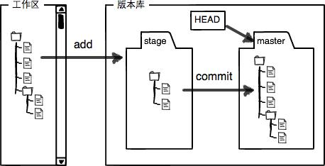

# Linux

### 系统目录结构


| 命令        | 说明                                                                                                                                                                                                                                     |
| ----------- | ---------------------------------------------------------------------------------------------------------------------------------------------------------------------------------------------------------------------------------------- |
| / (根目录)  | 在 Linux 下有且只有一个根目录.在终端里输入“/home”，意思是先从/（根目录）开始，再进入到 home 目录。                                                                                                                                       |
| /bin        | Binaries 的缩写，存放二进制可执行文件（ls、tar、mv、cat），常用命令一般都在这里。                                                                                                                                                        |
| /boot       | 放置 linux 系统启动时用到的一些文件，如 Linux 的内核文件：/boot/vmlinuz，系统引导管理器：/boot/grub。                                                                                                                                    |
| /dev        | Device 的缩写， 该目录下存放的是 Linux 的外部设备，在 Linux 中访问设备的方式和访问文件的方式是相同的。                                                                                                                                   |
| /etc        | 用来存放所有的系统管理所需要的配置文件和子目录，重要的配置文件有 /etc/inittab、/etc/fstab、/etc/init.d、/etc/X11、/etc/sysconfig、/etc/xinetd.d。                                                                                        |
| /home       | 用户的主目录。在 Linux 中，每个用户都有一个自己的目录，一般该目录名是以用户的账号命名的。                                                                                                                                                |
| /var        | 放置系统执行过程中经常变化的文件，如随时更改的日志文件 /var/log 等。                                                                                                                                                                     |
| /lib        | Library 的缩写，存放着系统最基本的动态连接共享库，其作用类似于 Windows 里的 DLL 文件。几乎所有的应用程序都需要用到这些共享库。                                                                                                           |
| /usr        | 应用程序存放目录，/usr/bin 存放应用程序，/usr/share 存放共享数据，/usr/lib 存放库文件。                                                                                                                                                  |
| /opt        | optional 的缩写，这是给主机额外安装软件所摆放的目录。                                                                                                                                                                                    |
| /proc       | Processes(进程) 的缩写，是一种伪文件系统（也即虚拟文件系统），存储的是当前内核运行状态的一系列特殊文件，这个目录是一个虚拟的目录，它是系统内存的映射，我们可以通过直接访问这个目录来获取系统信息。这个目录的内容不在硬盘上而是在内存里。 |
| /sbin       | 存放系统管理员使用的二进制可执行文件（只有 root 用户才能使用的系统级别管理命令和程序）。                                                                                                                                                 |
| /mnt        | 系统管理员安装临时文件系统的安装点，可以让用户临时挂载其他文件系统。                                                                                                                                                                     |
| /lost+found | 平时是空的，用于存放系统非正常关机留下的文件                                                                                                                                                                                             |

---

### 命令行中的 ctrl 组合键

```linux
Ctrl+c: 结束正在运行的程序

Ctrl+d: 结束输入或退出shell

Ctrl+s: 暂停屏幕输出【锁住终端】

Ctrl+q: 恢复屏幕输出【解锁终端】

Ctrl+l: 清屏，【是字母L的小写】等同于Clear

当前光标到行首：ctrl+a

当前光标到行尾：ctrl+e

删除当前光标到行首：ctrl+u

删除当前光标到行尾：ctrl+k

Ctrl+y: 在光标处粘贴剪切的内容

Ctrl+r: 查找历史命令【输入关键字，就能调出以前执行过的命令】

Ctrl+t: 调换光标所在处与其之前字符位置，并把光标移到下个字符

Ctrl+x+u: 撤销操作

Ctrl+z: 转入后台运行
```

---

### 文件与目录管理

> 绝对路径与相对路径

- **绝对路径：**
  路径的写法，由根目录 / 写起，例如： /usr/share/doc 这个目录。
- **相对路径：**
  路径的写法，不是由 / 写起，例如由 /usr/share/doc 要到 /usr/share/man 底下时，可以写成： cd ../man 。

> 处理目录的常用命令

- ls（英文全拼：list files）: 列出目录及文件名
- cd（英文全拼：change directory）：切换目录
- pwd（英文全拼：print work directory）：显示目前的目录
- mkdir（英文全拼：make directory）：创建一个新的目录
- rmdir（英文全拼：remove directory）：删除一个空的目录。`rmdir [-p] 目录名称  #-p:一次删除多级空目录`
- cp（英文全拼：copy file）: 复制文件或目录
- rm（英文全拼：remove）: 删除文件或目录
- mv（英文全拼：move file）: 移动文件与目录，或修改文件与目录的名称

---

#### ls (列出目录)

选项与参数：

- -a ：全部的文件，连同隐藏文件( 开头为 . 的文件) 一起列出来
- -d ：仅列出目录本身，而不是列出目录内的文件数据
- -l ：长数据串列出，包含文件的属性与权限等等数据

```shell
ls -al ~ #将当前目录下的所有文件列出来(含属性与隐藏档)
```

---

#### cd (切换目录)

```shell
cd [相对路径或绝对路径]

mkdir runoob #使用 mkdir 命令创建 runoob 目录
cd /root/runoob/ #使用绝对路径切换到 runoob 目录
cd ./runoob/ #使用相对路径切换到 runoob 目录
cd ~ # 表示回到自己的家目录，亦即是 /root 这个目录
cd .. # 表示去到目前的上一级目录，亦即是 /root 的上一级目录的意思
```

#### pwd (显示目前所在的目录)

```shell
pwd [-P] # -P:显示出确实的路径，而非使用连结 (link) 路径。
```

#### mkdir (创建新目录)

```shell
mkdir [-mp] 目录名称  #-p:帮助你直接将所需要的目录(包含上一级目录)递归创建起来  -m:配置文件的权限

mkdir -p test1/test2/test3/test4
mkdir -m 711 [目录名]
```

#### cp (复制文件或目录)

```shell
cp [-adfilprsu] 来源档(source) 目标档(destination)
cp [options] source1 source2 source3 .... directory
```

- **-a：**相当于 -pdr 的意思；(常用)
- **-i：**若目标档(destination)已经存在时，在覆盖时会先询问动作的进行
- **-p：**连同文件的属性一起复制过去，而非使用默认属性(备份常用)
- **-r：**递归持续复制，用于目录的复制行为

---

#### rm (移除文件或目录)

```shell
rm [-fir] 文件或目录
```

- -f ：就是 force 的意思，忽略不存在的文件，不会出现警告信息；
- -i ：互动模式，在删除前会询问使用者;
- -r ：递归删除，最常用在目录的删除。很危险！

```linux
find . -name "*.log"  | xargs rm -f
```

#### mv (移动或修改名称)

```shell
mv [-fiu] source destination
mv [options] source1 source2 source3 .... directory
```

- -f ：force 强制的意思，如果目标文件已经存在，不会询问而直接覆盖；
- -i ：若目标文件 (destination) 已经存在时，就会询问是否覆盖！
- -u ：若目标文件已经存在，且 source 比较新，才会升级 (update)

---

#### 查看进程杀死进程启动进程

1.查进程
ps 命令查找与进程相关的 PID 号：
ps a 显示现行终端机下的所有程序，包括其他用户的程序。
ps -A 显示所有程序。
ps c 列出程序时，显示每个程序真正的指令名称，而不包含路径，参数或常驻服务的标示。
ps -e 此参数的效果和指定"A"参数相同。
ps e 列出程序时，显示每个程序所使用的环境变量。
ps f 用 ASCII 字符显示树状结构，表达程序间的相互关系。
ps -H 显示树状结构，表示程序间的相互关系。
ps -N 显示所有的程序，除了执行 ps 指令终端机下的程序之外。
ps s 采用程序信号的格式显示程序状况。
ps S 列出程序时，包括已中断的子程序资料。
ps -t<终端机编号> 指定终端机编号，并列出属于该终端机的程序的状况。
ps u 以用户为主的格式来显示程序状况。
ps x 显示所有程序，不以终端机来区分。

2.杀进程
使用 kill 命令结束进程：kill xxx
常用：kill －9 324
Linux 下还提供了一个 killall 命令，可以直接使用进程的名字而不是进程标识号，例如：# killall -9 NAME

20. 查看自己的 IP 地址
    命令：ifconfig
    格式：ifconfig -a

21. 查看路由表
    命令：netstat
    格式：netstat -rn

### Linux 链接

Linux 链接分两种，一种被称为硬链接（Hard Link），另一种被称为符号链接（Symbolic Link）。默认情况下，ln 命令产生硬链接。

> 硬连接

​ 硬连接指通过<span style="background-color: yellow">索引节点来进行连接</span>。在 Linux 的文件系统中，保存在磁盘分区中的文件不管是什么类型都给它分配一个编号，称为索引节点号(Inode Index)。在 Linux 中，<span style="background-color: yellow">多个文件名指向同一索引节点是存在的</span>。比如：A 是 B 的硬链接（A 和 B 都是文件名），则 A 的目录项中的 inode 节点号与 B 的目录项中的 inode 节点号相同，即一个 inode 节点对应两个不同的文件名，两个文件名指向同一个文件，A 和 B 对文件系统来说是完全平等的。删除其中任何一个都不会影响另外一个的访问。

​ <span style="background-color: yellow">硬连接的作用是允许一个文件拥有多个有效路径名，这样用户就可以建立硬连接到重要文件，以防止“误删”的功能</span>。其原因如上所述，因为对应该目录的索引节点有一个以上的连接。只删除一个连接并不影响索引节点本身和其它的连接，只有当最后一个连接被删除后，文件的数据块及目录的连接才会被释放。也就是说，文件真正删除的条件是与之相关的所有硬连接文件均被删除。

> 软连接

​ 另外一种连接称之为符号连接（Symbolic Link），也叫软连接。软链接文件有类似于 Windows 的快捷方式。它实际上是一个特殊的文件。在符号连接中，文件实际上是一个文本文件，其中包含的有另一文件的位置信息。比如：A 是 B 的软链接（A 和 B 都是文件名），A 的目录项中的 inode 节点号与 B 的目录项中的 inode 节点号不相同，A 和 B 指向的是两个不同的 inode，继而指向两块不同的数据块。但是 A 的数据块中存放的只是 B 的路径名（可以根据这个找到 B 的目录项）。A 和 B 之间是“主从”关系，如果 B 被删除了，A 仍然存在（因为两个是不同的文件），但指向的是一个无效的链接。

---

### 文件内容查看

Linux 系统中使用以下命令来查看文件的内容：

- cat 由第一行开始显示文件内容。`cat [-AbEnTv] 目录/文件`
- tac 从最后一行开始显示，可以看出 tac 是 cat 的倒着写！
- nl 显示的时候，输出行号。 `nl [-bnw] 文件`
- more 一页一页的显示文件内容。
- less 与 more 类似，但是比 more 更好的是，可以往前翻页。
- head 只看头几行，`head [-n number] 文件 `。number 代表显示几行的意思，默认 10。
- tail 只看尾巴几行，`tail [-n number] 文件 `

---

#### more & less

**在 more 这个程序的运行过程中，你有几个按键可以按的：**

- 空格：代表向下翻一页；
- Enter ：代表向下翻『一行』；
- /字串 ：代表在这个显示的内容当中，向下搜寻『字串』这个关键字；
- :f ：立刻显示出档名以及目前显示的行数；
- q ：代表立刻离开 more ，不再显示该文件内容。
- b 或 [ctrl]-b ：代表往回翻页，不过这动作只对文件有用，对管线无用。

**less 运行时可以输入的命令有：**

- 空格 ：向下翻动一页；
- [pagedown]：向下翻动一页；
- [pageup] ：向上翻动一页；
- /字串 ：向下搜寻『字串』的功能；
- ?字串 ：向上搜寻『字串』的功能；
- n ：重复前一个搜寻 (与 / 或 ? 有关！)
- N ：反向的重复前一个搜寻 (与 / 或 ? 有关！)
- q ：离开 less 这个程序；

---

### 文件属性与权限

在 Linux 中第一个字符代表这个文件是目录、文件或链接文件等等。<span style="background-color: yellow">d：目录 -：文件 l：链接文档</span>

​ 接下来 的字符中，以三个为一组，且均为 rwx 的三个参数的组合。其中， r 代表可读(read)、 w 代表可写(write)、 x 代表可执行(execute，)。 要注意的是，这三个权限的位置不会改变，如果没有权限，就会出现减号 - 而已。

- 读权限 r（read） ：对于文件，具有读取文件内容的权限；对于目录，具有浏览目录的权限。
- 写权限 w（write） ：对于文件，具有修改文件内容的权限；对于目录，具有删除、移动目录内文件的权限。
- 可执行权限 x（execute）： 对于文件，具有执行文件的权限；对于目录，该用户具有进入目录的权限。


---

#### chgrp：更改文件属组

```shell
chgrp [-R] 属组名 文件名  #-R:递归更改文件属组。
```

#### chown：更改文件属主和属组

```shell
chown [–R] 属主名 文件名
chown [-R] 属主名：属组名 文件名
```

#### chmod：修改文件权限

chmod 修改文件权限有两种使用格式：<span style="background-color: yellow">字母法</span>与<span style="background-color: yellow">数字法</span>

- 字母法：`chmod u/g/o/a +/-/= rwx 文件`

  ```shell
  chmod u=rwx,g=rx,o=r 文件名  #设定权限
  chmod  a-x 文件名 #例如要拿掉全部人的可执行权限
  ```

  1. u：user ，所有者；g：group，用户组；o：other，其他用户；a：all 表示这三者皆是。
  2. +：增加权限；-：撤销权限；=：设定权限。

* 数字法：r：4；w：2；x：1；-：0 `chmod 751 file`

---

### 查找、搜索命令

```shell
find：在指定目录下查找文件

which：在环境变量 $PATH 设置的目录里查找符合条件的文件

whereis：查找二进制文件和源代码文件，如：whereis  redis-cli

locate：快速查找系统数据库中（var/lib/mlocate/mlocate.db）指定的内容

grep  <被查找的字符串>  <文件名>：查找文件里符合条件的字符串          默认不显示行号，-n 显示行号
```

---

### 网络命令

```shell
ifconfig：查看网络配置

ping：测试网络联通

netstat：显示各种网络相关信息
```

**应用场景**：

查询机器与哪些应用建立了 TCP 连接？

```shell
netstat  -anp                 //-a：显示所有连接和监听端口；-n：以数字方式显示地址和端口号；-p：显示进程的pid和名字
netstat  -anp|grep 8080  //查看该占用端口的进程
```

### 进程管理

```shell
free：查看内存使用情况

ps：显示当前运行的进程，常接 grep 命令查找程序，ps -ef | grep <进程关键字>

top：实时显示系统中各个进程的资源占用情况

kill  -9  [PID]：杀死进程      -9：立即杀死进程
```

---

### 压缩解压命令

```shell
tar -czvf test.tar.gz test1.txt test2.txt  //压缩文件
tar -xzvf test.tar.gz  //解压文件
tar -tzvf test.tar.gz  //列出解压文件内容
```

---

### Linux 管道命令：|

Linux 的管道命令是’|’，通过它可以对数据进行连续处理，其示意图如下：

---

### 统计命令：wc

wc 命令将计算指定文件的行数、字数，以及字节数。

```shell
$ wc testfile           # testfile文件的统计信息
3 92 598 testfile       # testfile文件的行数为3、单词数92、字节数598
```

---

### 监控系统性能

Linux 中需要监控的资源主要有：CPU、内存、硬盘空间、I/O 时间、网络时间、应用程序等。

影响系统性能的主要因素有：


下面的命令可以用来<font color='red'>监控系统性能并作出相应调整</font>：


---

### Linux 磁盘管理

- **df**（英文全称：disk full）：列出文件系统的整体磁盘使用量
- **du**（英文全称：disk used）：检查磁盘空间使用量，与 df 命令不同的是 du 命令是对文件和目录磁盘使用的空间的查看。
- **fdisk**：用于磁盘分区，`fdisk [-l] 装置名称`

```shell
df [-ahikHTm] [目录或文件名]   # -h ：以人们较易阅读的 GBytes, MBytes, KBytes 等格式自行显示
du [-ahskm] 文件或目录名称  #-a ：列出所有的文件与目录容量，因为默认仅统计目录底下的文件量而已。
```

#### du 和 ls 区别？

du 和 ls 都可以用来查看文件大小，但它们输出的值有可能不同。

- du （disk usage）：展示文件占用的磁盘空间

* ls：展示文件内容的大小

举一个形象的例子：中秋节时购买月饼礼盒，月饼体积可认为是文件内容大小，加上包装礼盒的总体积可认为是磁盘空间使用量。这种情况使得 du 往往会比 ls 展示的文件大小要大一些。

**为什么文件占用的磁盘空间比文件本身大？**

文件系统（FAT、NTFS、exFAT）将磁盘按照固定数据块（block）大小进行分割切块，默认分配单元大小是 4096 字节，即 4 KB。大部分文件系统规定：

1. 一个数据块中最多存放一个文件的内容，当没存满时，剩余的空间不得被其他文件使用
2. 当一个文件的内容较大时，则可以存储到多个数据块中

因此一个大小是 3 bytes 的文件，但限于 Linux 文件系统的限制，它需要占用一个数据块来存储这个文件，所以这个文件实际占用的磁盘空间就是 4 KB 了。

---

### 统计 /var/log/ 下所有文件个数

/var/log/ 下所有文件包括当前目录和子目录以及子目录的子目录下面的文件。

```java
[root@oldboy36 ~]# ll -R /var/log/ | grep "^[sl-][rwx-]{9}" | wc -l
74
```

ll：输出当前文件夹下的文件信息

grep：查找文件中符合条件的字符串，将输出信息过滤一部分

-R：递归子文件夹

wc -l：统计输出信息的行数

---

# Git

### Git 基础理论

​ Git 本地有三个工作区域：工作区（Working Directory）、暂存区（Stage/Index）、资源库（Repository 或 Git Directory）。如果加上远程的 Git 仓库则有四个工作区域：


- 工作区（Working Directory）：就是你在电脑里能看到的目录。<span style="background-color: yellow">平时存放代码的地方</span>。
- 版本库（Repository）：工作区有一个隐藏目录`.git`，这个不算工作区，而是 Git 的版本库。Git 的版本库里存了很多东西，其中最重要的就是称为`stage`（或者叫`index`）的**暂存区**，还有 Git 为我们自动创建的第一个分支`master`（主分支），以及指向`master`的一个指针叫`HEAD`。



### 新建仓库

```java
# 在当前目录新建一个Git代码库
$ git init

# 新建一个目录，将其初始化为Git代码库
$ git init [project-name]

# 下载一个项目和它的整个代码历史
$ git clone [url]
```

### 配置

```
# 显示当前的Git配置
$ git config --list

# 编辑Git配置文件
$ git config -e [--global]

# 设置提交代码时的用户信息
$ git config [--global] user.name "[name]"
$ git config [--global] user.email "[email address]"
```

### 增加/删除文件

```
# 添加指定文件到暂存区
$ git add [file1] [file2] ...

# 添加指定目录到暂存区，包括子目录
$ git add [dir]

# 添加当前目录的所有文件到暂存区
$ git add .

# 添加每个变化前，都会要求确认
# 对于同一个文件的多处变化，可以实现分次提交
$ git add -p

# 删除工作区文件，并且将这次删除放入暂存区
$ git rm [file1] [file2] ...

# 停止追踪指定文件，但该文件会保留在工作区
$ git rm --cached [file]

# 改名文件，并且将这个改名放入暂存区
$ git mv [file-original] [file-renamed]
```

为什么 Git 添加文件需要`add`，`commit`一共两步呢？

​ 因为`commit`可以一次提交很多文件，所以你可以多次`add`不同的文件。

### 代码提交

```
# 提交暂存区到仓库区
$ git commit -m [message]

# 提交暂存区的指定文件到仓库区
$ git commit [file1] [file2] ... -m [message]

# 提交工作区自上次commit之后的变化，直接到仓库区
$ git commit -a

# 提交时显示所有diff信息
$ git commit -v

# 使用一次新的commit，替代上一次提交
# 如果代码没有任何新变化，则用来改写上一次commit的提交信息
$ git commit --amend -m [message]

# 重做上一次commit，并包括指定文件的新变化
$ git commit --amend [file1] [file2] ...
```

### 查看信息

`git status [filename]`：显示文件当前的状态。文件的四种状态：


```
# 显示有变更的文件
$ git status

# 显示当前分支的版本历史
$ git log

# 显示commit历史，以及每次commit发生变更的文件
$ git log --stat

# 搜索提交历史，根据关键词
$ git log -S [keyword]

# 显示某个commit之后的所有变动，每个commit占据一行
$ git log [tag] HEAD --pretty=format:%s

# 显示某个commit之后的所有变动，其"提交说明"必须符合搜索条件
$ git log [tag] HEAD --grep feature

# 显示某个文件的版本历史，包括文件改名
$ git log --follow [file]
$ git whatchanged [file]

# 显示指定文件相关的每一次diff
$ git log -p [file]

# 显示过去5次提交
$ git log -5 --pretty --oneline

# 显示所有提交过的用户，按提交次数排序
$ git shortlog -sn

# 显示指定文件是什么人在什么时间修改过
$ git blame [file]

# 显示暂存区和工作区的差异
$ git diff

# 显示暂存区和上一个commit的差异
$ git diff --cached [file]

# 显示工作区与当前分支最新commit之间的差异
$ git diff HEAD

# 显示两次提交之间的差异
$ git diff [first-branch]...[second-branch]

# 显示今天你写了多少行代码
$ git diff --shortstat "@{0 day ago}"

# 显示某次提交的元数据和内容变化
$ git show [commit]

# 显示某次提交发生变化的文件
$ git show --name-only [commit]

# 显示某次提交时，某个文件的内容
$ git show [commit]:[filename]

# 显示当前分支的最近几次提交
$ git reflog
```

### Tag

​ 发布一个版本时，我们通常先在版本库中打一个标签（tag），这样，就唯一确定了打标签时刻的版本。将来无论什么时候，取某个标签的版本，就是把那个打标签的时刻的历史版本取出来。所以，标签也是版本库的一个快照，创建和删除标签都是瞬间完成的。

**Git 有 commit，为什么还要引入 tag？** tag 就是一个让人容易记住的有意义的名字，它跟某个 commit 绑在一起。

```
# 列出所有tag
$ git tag

# 新建一个tag在当前commit
$ git tag [tag]

# 新建一个tag在指定commit
$ git tag [tag] [commit]

# 删除本地tag
$ git tag -d [tag]

# 删除远程tag
$ git push origin :refs/tags/[tagName]

# 查看tag信息
$ git show [tag]

# 提交指定tag
$ git push [remote] [tag]

# 提交所有tag
$ git push [remote] --tags

# 新建一个分支，指向某个tag
$ git checkout -b [branch] [tag]
```

### 分支

```
# 列出所有本地分支
$ git branch

# 列出所有远程分支
$ git branch -r

# 列出所有本地分支和远程分支
$ git branch -a

# 新建一个分支，但依然停留在当前分支
$ git branch [branch-name]

# 新建一个分支，并切换到该分支
$ git checkout -b [branch]

# 新建一个分支，指向指定commit
$ git branch [branch] [commit]

# 新建一个分支，与指定的远程分支建立追踪关系
$ git branch --track [branch] [remote-branch]

# 切换到指定分支，并更新工作区
$ git checkout [branch-name]

# 切换到上一个分支
$ git checkout -

# 建立追踪关系，在现有分支与指定的远程分支之间
$ git branch --set-upstream [branch] [remote-branch]

# 合并指定分支到当前分支
$ git merge [branch]

# 选择一个commit，合并进当前分支
$ git cherry-pick [commit]

# 删除分支
$ git branch -d [branch-name]

# 删除远程分支
$ git push origin --delete [branch-name]
$ git branch -dr [remote/branch]
```

### 远程同步

​ 实际情况往往是这样，找一台电脑充当服务器的角色，每天 24 小时开机，其他每个人都从这个“服务器”仓库克隆一份到自己的电脑上，并且各自把各自的提交推送到服务器仓库里，也从服务器仓库中拉取别人的提交。

- 要关联一个远程库，使用命令`git remote add origin git@server-name:path/repo-name.git`；
- 关联一个远程库时必须给远程库指定一个名字，`origin`是默认习惯命名；
- 关联后，使用命令`git push -u origin master`第一次推送 master 分支的所有内容；
- 此后，每次本地提交后，只要有必要，就可以使用命令`git push origin master`推送最新修改；

```
# 下载远程仓库的所有变动
$ git fetch [remote]

# 显示所有远程仓库
$ git remote -v

# 显示某个远程仓库的信息
$ git remote show [remote]

# 增加一个新的远程仓库，并命名。也就是关联一个远程库
$ git remote add [库名] [url]

# 取回远程仓库的变化，并与本地分支合并
$ git pull [remote] [branch]

# 上传本地指定分支到远程仓库
$ git push [remote] [branch]

# 强行推送当前分支到远程仓库，即使有冲突
$ git push [remote] --force

# 推送所有分支到远程仓库
$ git push [remote] --all
```

### 撤销

```
# 恢复暂存区的指定文件到工作区
$ git checkout [file]

# 恢复某个commit的指定文件到暂存区和工作区
$ git checkout [commit] [file]

# 恢复暂存区的所有文件到工作区
$ git checkout .

# 重置暂存区的指定文件，与上一次commit保持一致，但工作区不变
$ git reset [file]

# 重置暂存区与工作区，与上一次commit保持一致
$ git reset --hard

# 重置当前分支的指针为指定commit，同时重置暂存区，但工作区不变
$ git reset [commit]

# 重置当前分支的HEAD为指定commit，同时重置暂存区和工作区，与指定commit一致
$ git reset --hard [commit]

# 重置当前HEAD为指定commit，但保持暂存区和工作区不变
$ git reset --keep [commit]

# 新建一个commit，用来撤销指定commit
# 后者的所有变化都将被前者抵消，并且应用到当前分支
$ git revert [commit]

暂时将未提交的变化移除，稍后再移入
$ git stash
$ git stash pop
```
