# 一、MySQL基础

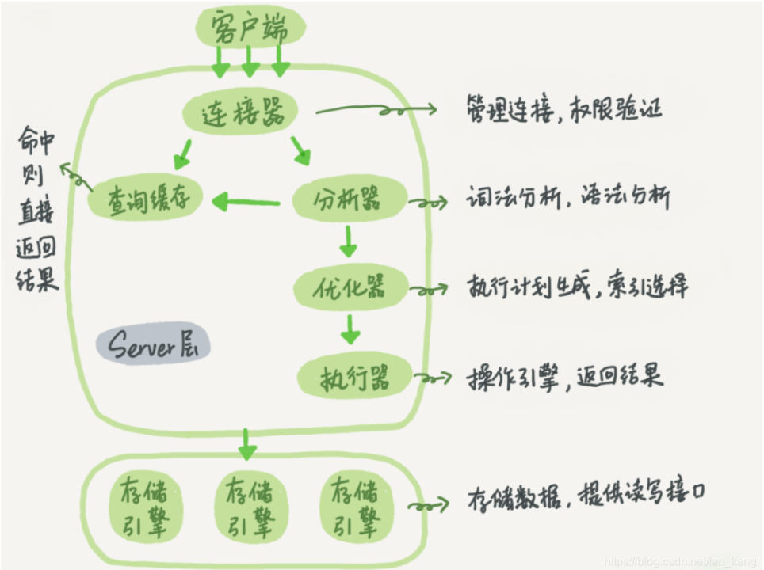

### 数据库的三大范式

+ 第一范式：**数据库表中不能出现重复记录，每个字段是原子性的不能再分**。关于第一范式，每一行必须唯一，也就是<span style="background-color: yellow">每个表必须有主键</span>，这是我们数据库设计的最基本要求，主要通常采用数值型或定长字符串表示，关于列不可再分，应该根据具体的情况来决定。如联系方式，为了开发上的便利行可能就采用一个字段了。
+ 第二范式：非主键字段要完全依赖主键字段，不能产生部分依赖。
+ 第三范式：<span style="background-color: yellow">非主键字段必须直接依赖于主键字段</span>，不能存在依赖传递。

**一对一设计**，有两种设计方案：（实际开发中有可能一张表数据太多，放不下，所以拆成两张表）

+ 第一种设计方案：**主键共享**。（这个用的少）

+ 第二种设计方案：**外键唯一**。（fk+unique，引用主表的主键列）

---

### 关系型数据库介绍

​		顾名思义，关系型数据库就是一种建立在关系模型的基础上的数据库。关系模型表明了数据库中所存储的数据之间的联系（一对一、一对多、多对多）。

关系型数据库中，我们的数据都被存放在了各种<span style="background-color: yellow">表</span>中（比如用户表），<span style="background-color: yellow">表中的每一行就存放着一条数据</span>（比如一个用户的信息）。

​		大部分关系型数据库都使用 SQL 来操作数据库中的数据。并且，大部分关系型数据库都支持事务的**四大特性(ACID)。**

### SQL、DBMS、DBS、DB

+ DB：数据库，存储数据的仓库。
+ DBMS：（软件）数据库管理系统，又称为数据库软件或者数据库产品，用于创建和管理数据库，常见的有MySQL、Oracle、SQL Server。
+ DBS：数据库系统，数据库系统是一个通称，包括数据库、数据库管理系统、数据库管理人员等，是最大的范畴。
+ SQL：结构化查询语言，用于和数据库通信的语言，不是某个数据库软件特有的，而是几乎所有的主流数据库软件通用的语言。

---

### MySQL 权限表

​		MySQL服务器通过权限表控制用户对数据库的访问，权限表存放在mysql数据库里，由**`mysql_install_db`**脚本初始化。这些权限表分别为user，db，table_priv，columns_priv和host。

- **user权限表**：记录允许连接到服务器的用户账号信息，里面的权限是全局级的
- **db权限表**：记录各个账号在各个数据库上的操作权限
- **table_priv权限表**：记录数据表级的操作权限
- **columns_priv权限表**：记录数据列级的操作权限
- **host权限表**：配合db权限表对给定主机上数据库级操作权限做更细致的控制。这个权限表不受GRANT和REVOKE语句的影响

---

### 常用命令

登录：`mysql -uroot -p123456`（mysql -uroot -p，不显示密码登录）

退出：`exit`

查看有哪些数据库`show databases`;（默认自带了四个数据库）

使用数据库：`use  库名`;

查看某个数据库下面有哪些表：`show tables`

MySQL启动：`net start MySQL`

MySQL关闭：`net stop MySQL`

查看表的结构：`desc 表名`

---

### SQL约束有哪几种

主键约束、唯一约束、默认约束、检查约束、外键约束

### #{ } 和 ${ } 区别？

<span style="background-color: yellow">#{}是预编译处理，${}是字符串替换。</span>

#{key}：获取参数的值，预编译到 SQL 中，可简单理解为一个占位符 “？”，有效防止 SQL 注入，<span style="background-color: yellow">安全</span>。

${key}：获取参数的值，拼接到 SQL 中，存在 SQL 注入问题，<span style="background-color: yellow">不安全</span>。

### 主键、外键和唯一的区别

**外键**：引用另外一个表中的一列或多列数据，被引用列应该具有主键约束或者唯一性约束。外键用来**建立和加强两个表数据之间的连接**。

```sql
alert table 表名 add constraint FK_ID foreign key(外键字段名) references 外表表名(主键字段名)   # 外键语法
```

<font color='red'>主键、外键、唯一键都会自动生成索引</font>，自增长列必须为一个 key，key 指索引，即：primary key、foreign key、unique key。

|      | 保证唯一性        | 是否允许为空 | 一个表中可以有多少个 |
| ---- | ----------------- | ------------ | -------------------- |
| 主键 | √                 | ×            | 只能有一个           |
| 唯一 | √                 | √            | 可以有多个           |
| 外键 | ×（可以有重复值） | √            | 可以有多个           |

#### 外键的作用

外键的主要作用是保证数据的一致性和完整性，并且减少数据冗余。主要体现在以下两个方面：

**阻止执行**

1. 从表插入新行，其外键值不是主表的主键值便阻止插入。
2. 从表修改外键值，新值不是主表的主键值便阻止修改。
3. 主表删除行，其主键值在从表里存在便阻止删除(要想删除，必须先删除从表的相关行，再删除主表)。
4. 主表修改主键值，旧值在从表里存在便阻止修改(要想修改，必须先删除从表的相关行)。

**级联执行**

1. 主表删除行，连带从表的相关行一起删除。
2. 主表修改主键值，连带从表相关行的外键值一起修改。

----

###  为什么一张表只能有一个主键

首先讲讲为什么要有主键？

有些数据库中虽然主键不是必须的，但是我们最好为每个表设置一个主键，<font color='red'>使用主键来唯一标识表中每一行</font>，它的作用：

1. 用于与其它表的外键关联以及本记录的修改与删除。
2. 保证实体完整性，表的记录有唯一区分的字段。
3. 增加检索速度。

另外，从数据库的三大范式来看，从第二范式起，要求表中的所有数据都要和主键有完全依赖关系，<font color='red'>主键可以由一个或多个字段组成，来确保数据的唯一性</font>。

​		按照我的理解来说，当设置主键时，MySQL 会自动添加一个与主键对应的唯一索引，如果表中有 100w 条数据，我们给多个字段添加主键，都会维护一个索引表，给数据库造成很大压力。实际上只需要 1 个主键就可以完成数据检索工作，所以一张表只能有一个主键。

---

### 自增id

#### 为什么建表使用自增 id 作为主键？

​		InnoDB 表中的数据是直接存储在主键聚簇索引的叶子节点中，每次插入新的记录，记录就会顺序添加到当前索引节点的后续位置，当一页写满，就会自动开辟一个新的页，总的来说就是可以提高查询和插入的性能。

​		<span style="background-color: yellow">若表的主键不是顺序的 id，而是无规律的数据，插入新的记录时，无法按顺序添加</span>，而是需要找一个合适的位置，可能产生大量的<span style="background-color: yellow">页分裂</span>，导致大量的内存碎片，并且在寻找合适位置插入时，目标页可能不在内存中，这也导致了大量的随机 IO，影响插入效率。

#### 自增id与UUID的区别

|        | 优点                                                         | 缺点                                                         |
| ------ | ------------------------------------------------------------ | ------------------------------------------------------------ |
| 自增id | 需要很小的数据存储空间，仅仅需要4 byte 。insert和update操作时使用自增id的性能比UUID好，所以使用int将会提高应用程序的性能。 | 如果经常有合并表的操作，就可能会出现主键重复的情况。使用INT数据范围有限制。如果存在大量的数据，可能会超出INT的取值范围。 |
| UUID   | 能够保证独立性，程序可以在不同的数据库间迁移，效果不受影响。保证生成的ID不仅是表独立的，而且是库独立的，这点在你想切分数据库的时候尤为重要。 | 比较占地方，和INT类型相比，存储一个UUID要花费更多的空间。 使用UUID后，URL显得冗长，不够友好。 |

#### 自增id用完了怎么办？

+ **表定义自增值 id**：表定义的自增值达到上限后的逻辑是：再申请下一个 id 时，得到的值保持不变。因此在建表的时候需要考察你的表是否有可能达到这个上限，如果有可能，就应该创建成 8 个字节的 bigint unsigned。
+ **InnoDB 系统自增 row_id**：如果你创建的 InnoDB 表没有指定主键，那么 InnoDB 会给你创建一个不可见的，<span style="background-color: yellow">长度为 6 个字节的 row_id</span>。在达到上限后，下一个值又变为0。且在 InnoDB 逻辑里，申请到 row_id=N 后，如果表中已经存在 row_id=N 的行，新写入的行就会覆盖原有的行。

---

### 主从复制的原理⭐

​	主从复制并不是复制磁盘上的数据库文件，而**是通过binlog日志复制到需要同步的从服务器上**。MySQL数据库支持单向、双向、链式级联等不同业务场景的复制。**在复制的过程中，一台服务器当主服务器（Master），接收来自用户的内容更新，而一个或多个其它的服务器来当从服务器（Slaver），接收来自Master上binlog文件的的日志内容，解析出SQL,重新更新到Slave，使得主从服务器的数据达到一致**。

①当Master节点进行insert、update、delete操作时，会按顺序写入到binlog中。

②salve从库连接master主库，Master有多少个slave就会创建多少个binlog dump线程。

③当Master节点的binlog发生变化时，binlog dump 线程会通知所有的salve节点，并将相应的binlog内容推送给slave节点。

④I/O线程接收到 binlog 内容后，将内容写入到本地的 relay-log。

⑤SQL线程读取I/O线程写入的relay-log，并且根据 relay-log 的内容对从数据库做对应的操作。

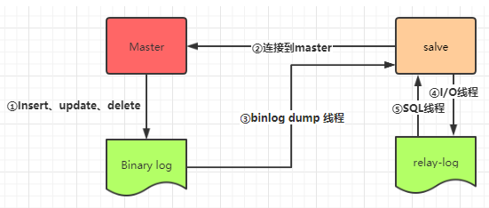

#### 主从复制涉及的线程

-   **binlog 线程**  ：负责将主服务器上的数据更改写入二进制日志（Binary log）中。
-   **I/O 线程**  ：负责从主服务器上读取二进制日志，并写入从服务器的中继日志（Relay log）。
-   **SQL 线程**  ：负责读取中继日志，解析出主服务器已经执行的数据更改并在从服务器中重放（Replay）。

### 数据类型 

#### 整型

​		TINYINT, SMALLINT, MEDIUMINT, INT, BIGINT 分别使用 8, 16, 24, 32, 64 位存储空间，一般情况下越小的列越好。


​		**INT(11) 中的数字只是规定了交互工具显示字符的个数，对于存储和计算来说是没有意义的。**

#### 浮点数

​		FLOAT 和 DOUBLE 为浮点类型，DECIMAL 为高精度小数类型。CPU 原生支持浮点运算，但是不支持 DECIMAl 类型的计算，因此 DECIMAL 的计算比浮点类型需要更高的代价。

​		FLOAT、DOUBLE 和 DECIMAL 都可以指定列宽，例如 DECIMAL(18, 9) 表示总共 18 位，取 9 位存储小数部分，剩下 9 位存储整数部分。


#### 字符型


#### 时间和日期

​		MySQL 提供了两种相似的日期时间类型：DATETIME 和 TIMESTAMP。


**DATETIME**

+ 能够保存从 1000 年到 9999 年的日期和时间，精度为秒，使用 8 字节的存储空间。**它与时区无关。**
+ 默认情况下，MySQL 以一种可排序的、无歧义的格式显示 DATETIME 值，例如“2008-01-16 22 <span>:</span>37 <span>:</span>08”，这是 ANSI 标准定义的日期和时间表示方法。

**TIMESTAMP**

+ 和 UNIX 时间戳相同，保存从 1970 年 1 月 1 日午夜（格林威治时间）以来的秒数，使用 4 个字节，只能表示从 1970 年到 2038 年。
+ 它**和时区有关**，也就是说一个时间戳在不同的时区所代表的具体时间是不同的。

+ MySQL 提供了` FROM_UNIXTIME() `函数把 UNIX 时间戳转换为日期，并提供了` UNIX_TIMESTAMP() `函数把日期转换为 UNIX 时间戳。默认情况下，如果插入时没有指定 TIMESTAMP 列的值，会将这个值设置为当前时间。<span style="background-color: yellow">应该尽量使用 TIMESTAMP，因为它比 DATETIME 空间效率更高</span>。

---

####  int(10) 中 10 指什么？

```javascript
INT[(M)] [UNSIGNED] [ZEROFILL]   M 默认为11
```

​		10 就是上述语句里的 M，指<font color='red'>最大显示宽度</font>，最大值为 255。

​		最大显示宽度意思是，如果是 int(10)，字段存的值是 10，则会自动在之前补 8 个 0，显示为 0000000010。


#### char、varchar和text的区别？

+ **char(n) ：**固定长度类型，比如：订阅 char(10)，当你输入”abc”三个字符的时候，它们占的空间还是 10 个字节，其他 7 个是空字节。char 优点：效率高；缺点：占用空间；适用场景：存储密码的 md5 值，固定长度的，使用 char 非常合适。
+ **varchar(n) ：**可变长度，存储的值是每个值占用的字节再加上一个用来记录其长度的字节。
+ **text**：不设长度，适用于不知道最大长度的字段，比如个性签名等。不过最大的存储空间和 varchar差不多，但是性能低，所以尽量用 varchar。

所以，从空间上考虑 varcahr 比较合适；从效率上考虑 char 比较合适，二者使用需要权衡。

#### varchar(10) 和 varchar(20) 的区别？

​		varchar(10) 中 10 的涵义最多存放 10 个字符，varchar(10) 和 varchar(20) 存储"hello"**所占磁盘空间一样**，但<span style="background-color: yellow">后者在排序时会消耗更多内存</span>，硬盘上的存储空间是根据实际字符长度来分配存储空间，但是对于内存则不一样，它是使用固定大小的内存块来保存值，就是使用字符类型定义的长度即10个字符空间与20个字符空间。尤其是使用临时表进行排序会操作时，会消耗更多的内存。在使用磁盘进行排序时，也是一样。

​		因为涉及到文件排序或者基于磁盘的临时表时，更长的列会消耗更多的内存，所以在使用时，我们不能太过浪费内存空间，还是需要评估实际使用的长度来设置字符的长度。**推荐冗余10%的长度**（因业务而异）。

---

### 关键字

#### UNION 与 UNION ALL 的区别？

UNION 用于把来自多个 SELECT 语句的结果组合到一个结果集合中，MySQL 会把结果集中重复的记录删掉，而使用 UNION ALL，MySQL 会把所有的记录返回，且效率高于 UNION 。


#### where 与 having 的区别

* **用的地方不一样**：having只能用于 select 语句中。

* <span style="background-color: yellow">having是从前面筛选的字段再筛选，而where是从数据表中的字段直接进行的筛选的</span>

  ```sql
  select goods_name,goods_number from sw_goods where goods_price > 100  #正确
  select goods_name,goods_number from sw_goods having goods_price > 100  # 报错！！！因为前面并没有筛选出goods_price
  ```


#### in 和 exists

- **exists**：EXISTS会对外查询的表每一行进行循环匹配，其中子查询可以使用索引，外查询全表扫描。

- **in**：常用于 where 表达式中，其作用是查询某个范围内的数据。IN中的SQL查询**只会查询一次**，然后把结果集存在临时文件中，然后再与外层查询sql进行匹配，其中外查询与子查询都可以使用索引。

```sql
select * from A where id in (select is from B)
```

<span style="background-color: yellow">外查询表大，子查询表小，选择IN；外查询表小，子查询表大，选择EXISTS；若两表差不多大，则差不多。</span>

---

#### DROP、DELETE 与 TRUNCATE 的区别？

|             | DROP                               | DELETE                                   | TRUNCATE                         |
| ----------- | ---------------------------------- | ---------------------------------------- | -------------------------------- |
| SQL语句类型 | DDL                                | DML                                      | DDL                              |
| 回滚        | 不可回滚                           | 可回滚                                   | 不可回滚                         |
| 删除内容    | <span style="background-color: yellow">从数据库中删除表</span>，所有都会被删 | <span style="background-color: yellow">删除表的全部或一部分数据</span>，表结构还在 | <span style="background-color: yellow">删除表的所有数据</span>，表结构还在 |
| 删除速度    | 最快                               | 慢，需要逐行删除                         | 快                               |

---

#### order by 是怎么工作的

```sql
select city,name,age from t where city='杭州' order by name limit 1000
```

1. 全字段排序（优先选择）

   1. 初始化 sort_buffer，确定放入 name、city、age 这三个字段；
   2. 从索引 city 找到第一个满足 city='杭州’条件的主键 id；
   3. 到主键 id 索引取出整行，取 name、city、age 三个字段的值，存入 sort_buffer 中；
   4. 从索引 city 取下一个记录的主键 id；
   5. 重复步骤 3、4 直到 city 的值不满足查询条件为止；
   6. 对 sort_buffer 中的数据按照字段 name 做快速排序；
   7. 按照排序结果取前 1000 行返回给客户端。

2. rowid排序

   1. 初始化 sort_buffer，确定放入两个字段，即 name 和 id；
   2. 从索引 city 找到第一个满足 city='杭州’条件的主键 id；
   3. 到主键 id 索引取出整行，取 name、id 这两个字段，存入 sort_buffer 中；
   4. 从索引 city 取下一个记录的主键 id；
   5. 重复步骤 3、4 直到不满足 city='杭州’条件为止；
   6. 对 sort_buffer 中的数据按照字段 name 进行排序；
   7. 遍历排序结果，取前 1000 行，并按照 id 的值回到原表中取出 city、name 和 age 三个字段返回给客户端。

   > 全字段排序 VS rowid 排序

   1. 如果 MySQL 实在是担心排序内存太小，会影响排序效率，才会采用 rowid 排序算法，这样排序过程中一次可以排序更多行，但是需要再回到原表去取数据。
   2. 如果 MySQL 认为内存足够大，会优先选择全字段排序，把需要的字段都放到 sort_buffer 中，这样排序后就会直接从内存里面返回查询结果了，不用再回到原表去取数据。
   3. 这也就体现了 MySQL 的一个设计思想：<span style="background-color: yellow">如果内存够，就要多利用内存，尽量减少磁盘访问。</span>
   4. 对于 InnoDB 表来说，rowid 排序会要求回表多造成磁盘读，因此不会被优先选择。

---

#### 关联查询(连接查询) join

+ left join：左连接，返回左表中所有的记录以及右表中连接字段相等的记录。

  如果从表中有和他匹配的，则显示匹配的值，如果从表中没有和他匹配的，则显示null

  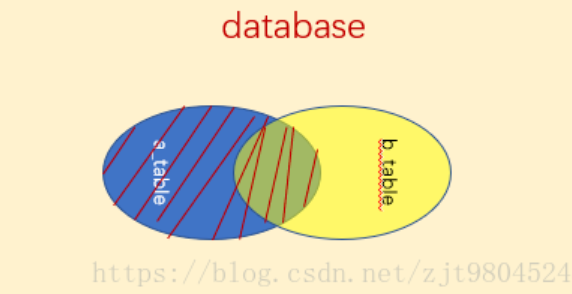

  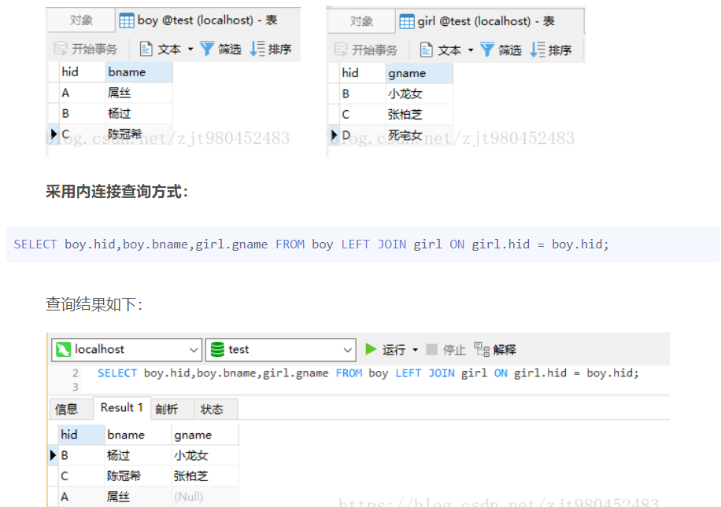

+ right join：右连接，返回右表中所有的记录以及左表中连接字段相等的记录。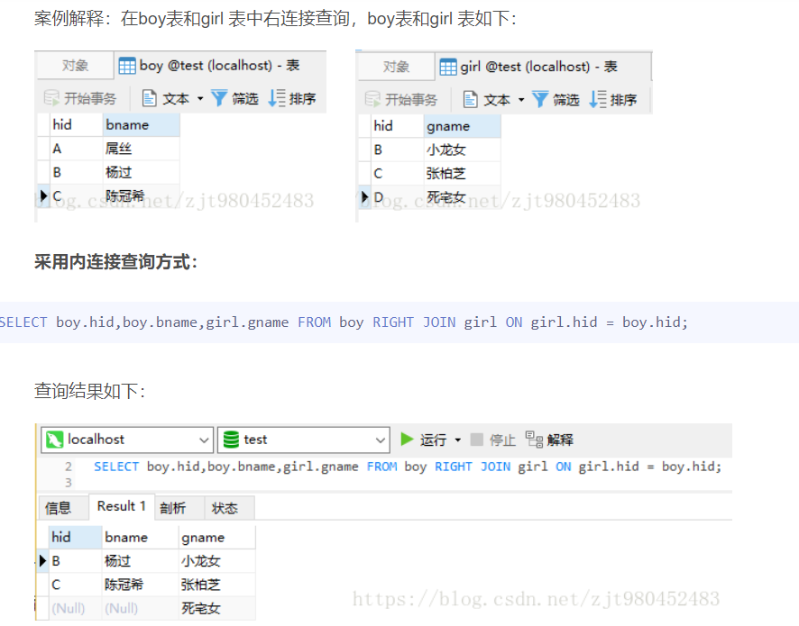

  

+ inner join：内连接，又叫等值连接，只返回两个表中连接字段相等的行。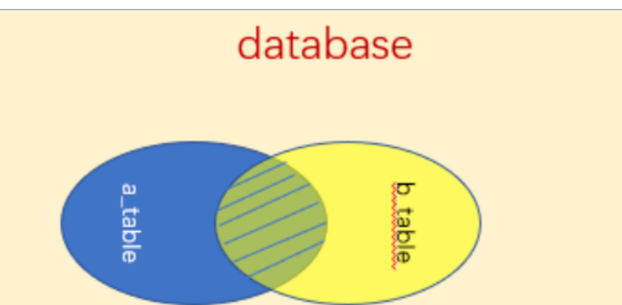

+ union：全连接

union语句注意事项：

```mysql
     1.通过union连接的SQL它们分别单独取出的列数必须相同；

     2.不要求合并的表列名称相同时，以第一个sql 表列名为准；

     3.使用union 时，完全相等的行，将会被合并，由于合并比较耗时，一般不直接使用 union 进行合并，而是通常采用union all 进行合并；

     4.被union 连接的sql 子句，单个子句中不用写order by ，因为不会有排序的效果。但可以对最终的结果集进行排序；
    (select id,name from A order by id) union all (select id,name from B order by id); //没有排序效果
	(select id,name from A ) union all (select id,name from B ) order by id; //有排序效果

```
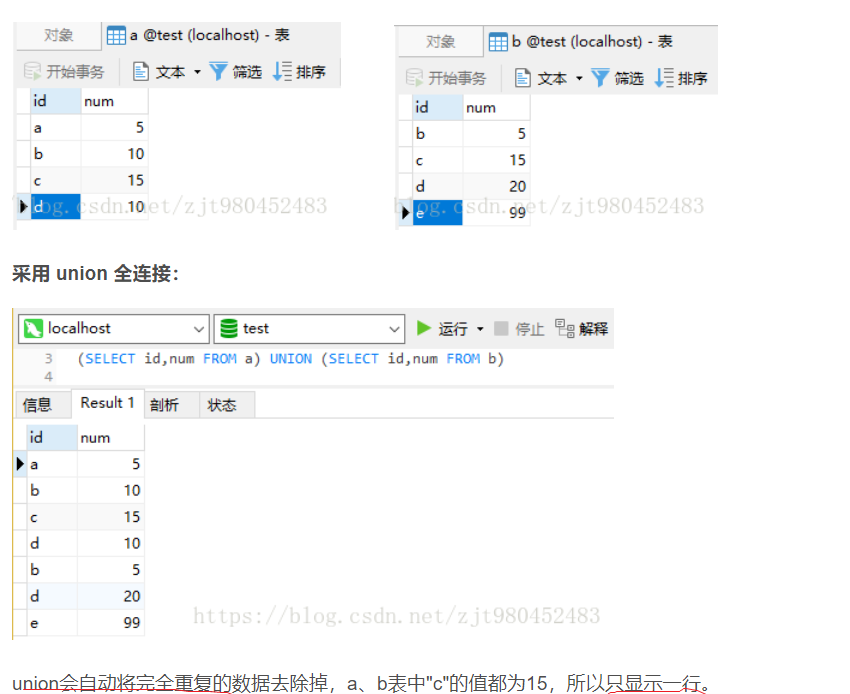

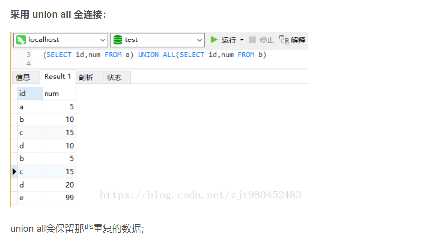

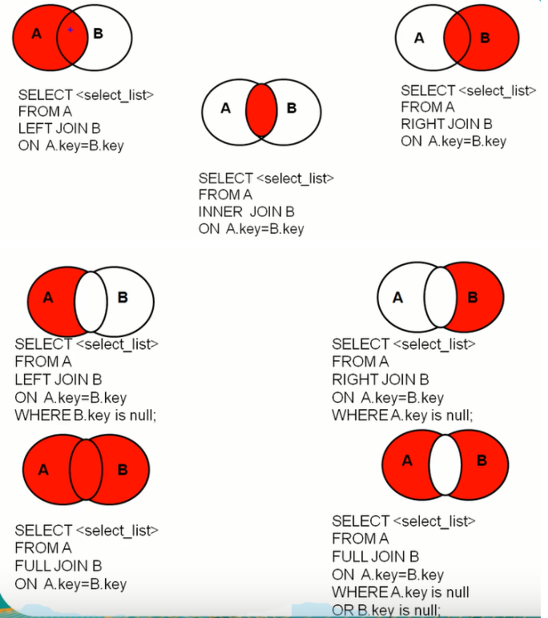

---

#### 分页查询 limit

​		当需要从数据库查询的表有上万条记录的时候，一次性查询所有结果会变得很慢，特别是随着数据量的增加特别明显，这时需要使用分页查询。

一般分页查询：使用简单的 limit 子句就可以实现

**两个重要参数**

​	pageNumber：当前页，PageSize：每页数据量

```sql
SELECT * FROM table LIMIT 1000 10;  # 第1001条到第1010条数据
```

- 第一个参数指定第一个返回记录行的偏移量，注意从`0`开始。
- 第二个参数指定返回记录行的最大数目，为 -1 表示检索从某一个偏移量到记录集的结束所有的记录行。
- 如果只给定一个参数：它表示返回最大的记录行数目。
- **这种分页查询方式会从数据库第一条记录开始扫描，所以越往后，查询速度越慢，而且查询的数据越多，也会拖慢总查询速度。**

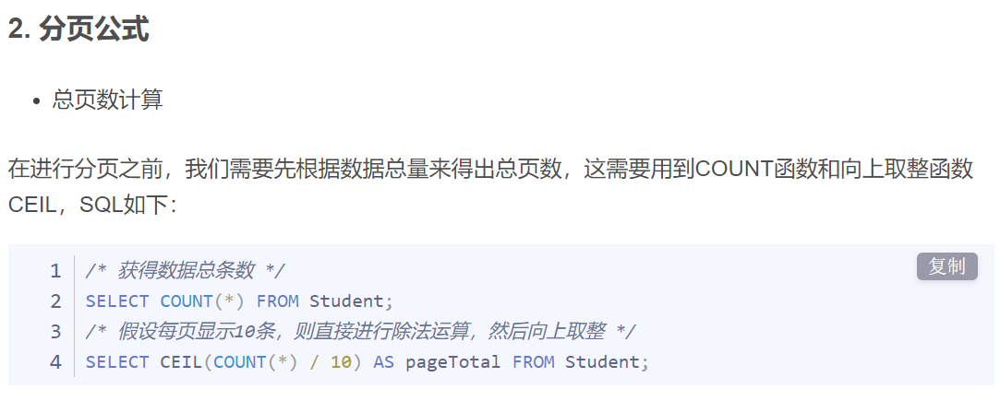

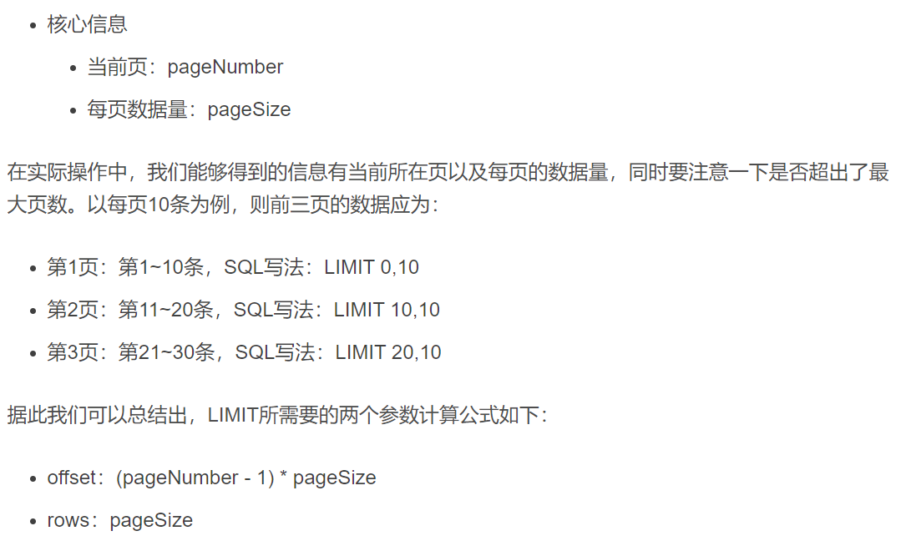

- 建立主键或者唯一索引优化

  

> 使用子查询优化

```sql
# 先定位偏移位置的 id，然后往后查询，这种方式适用于 id 递增的情况
select * from orders_table where gender = 1 and id >= (select id from orders_table where gender = 1 limit 100000, 1) limit 100
```

> 使用 id 限定优化

```sql
# 这种方式假设数据表的id是连续递增的，则我们根据查询的页数和查询的记录数可以算出查询的id的范围
select * from orders_history where type=2 and id between 1000000 and 1001000 limit 100;
# 或者
select * from orders_history where id >= 1000001 limit 100;
```

---


#### MySQL 关键字执行顺序

1. FROM ： 对FROM左边的表和右边的表计算笛卡尔积，产生虚表VT1；
2. ON ： 对虚拟表VT1进行ON筛选，只有那些符合条件的行才会被记录在虚拟表VT2中；
3. JOIN ：如果是OUT JOIN，那么将保留表中（如左表或者右表）未匹配的行作为外部行添加到虚拟表VT2中，从而产生虚拟表VT3；
4. WHERE ：对虚拟表VT3进行WHERE条件过滤，只有符合的记录才会被放入到虚拟表VT4；
5. GROUP BY：根据GROUP BY子句中的列，对虚拟表VT4进行分组操作，产生虚拟表VT5；
6. CUBE|ROLLUP：对虚拟表VT5进行CUBE或者ROLLUP操作，产生虚拟表VT6；
7. HAVING ：对虚拟表VT6进行 HAVING 条件过滤，只有符合的记录才会被插入到虚拟表VT7中；
8. SELECT ：执行SELECT操作，选择指定的列，插入到虚拟表VT8中；
9. DISTINCT ：对虚拟表VT8中的记录进行去重，产生虚拟表VT9；
10. ORDER BY ：将虚拟表VT9中的记录按照进行排序操作，产生虚拟表VT10；
11. LIMIT ：取出指定行的记录，产生虚拟表VT11，并将结果返回。

---

### MySQL基础架构⭐


简单来说 MySQL  主要分为 Server 层和存储引擎层：

- **Server 层**：主要包括连接器、查询缓存、分析器、优化器、执行器等，所有跨存储引擎的功能都在这一层实现，比如存储过程、触发器、视图，函数等，同时还有一个日志模块（binlog），这个日志模块所有执行引擎都可以共用，redolog 只有 InnoDB 有。
- **存储引擎**： 主要负责数据的存储和读取，采用可以替换的<span style="background-color: yellow">插件式架构</span>，支持 InnoDB、MyISAM、Memory 等多个存储引擎，其中 InnoDB 引擎有自有的日志模块 redo log 模块。**现在最常用的存储引擎是 InnoDB，它从 MySQL 5.5.5 版本开始就被当做默认存储引擎了。**

---

#### SQL 语句的执行流程？

1. 客户端与数据库server层建立 TCP 连接。客户端发送一条查询 SQL 请求给服务器；
2. 收到请求后，服务器先会查询缓存（目前已经弃用）。如果命中了缓存，则立即返回存储在缓存中的结果；
3. 如果未命中缓存，服务器端会进行查询优化处理，生成执行计划。这个阶段主要包括解析 SQL、预处理、优化 SQL 执行计划；
4. MySQL 根据执行计划调用存储引擎的 API 来执行查询；
5. 将结果返回给客户端。

<span style="background-color: yellow">查询语句</span>的执行流程如下：权限校验---> 分析器---> 优化器---> 执行器---> 存储引擎

<span style="background-color: yellow">更新语句</span>执行流程如下：连接器----> 分析器---> 优化器---->  执行器----> 权限校验---->存储引擎----> redo log(prepare 状态)----> binlog----> redo log(commit状态)

+ <span style="background-color: yellow">WAL</span> 的全称是 Write-Ahead Logging，它的关键点就是先写日志，再写磁盘。具体来说，当有一条记录需要更新的时候，InnoDB 引擎就会先把记录写到 redo  log里面，并更新内存，这个时候更新就算完成了。同时，InnoDB  引擎会在适当的时候，将这个操作记录更新到磁盘里面，而这个更新往往是在系统比较空闲的时候做。  


> 更新语句执行流程

```sql
mysql> update T set c=c+1 where ID=2;	
```

​		执行器先找引擎取 ID=2 这一行。ID 是主键，引擎直接用树搜索找到这一行。如果 ID=2 这一行所在的数据页本来就在内存中，就直接返回给执行器；否则，需要先从磁盘读入内存，然后再返回。
​		执行器拿到引擎给的行数据，把这个值加上 1，比如原来是 N，现在就是 N+1，得到新的一行数据，再调用引擎接口写入这行新数据。
​		引擎将这行新数据更新到内存中，同时将这个更新操作记录到 redo log 里面，此时 redo log 处于 prepare 状态。然后告知执行器执行完成了，随时可以提交事务。
​		执行器生成这个操作的 binlog，并把 binlog 写入磁盘。
​		执行器调用引擎的提交事务接口，引擎把刚刚写入的 redo log 改成提交（commit）状态，更新完成。

---

#### Server 层基本组件介绍

> 连接器

连接器主要和**身份认证和权限相关的功能相关**，就好比一个级别很高的门卫一样。

主要负责用户登录数据库，进行用户的身份认证，包括校验账户密码，权限等操作，如果用户账户密码已通过，连接器会到权限表中查询该用户的所有权限，之后在这个连接里的权限逻辑判断都是会依赖此时读取到的权限数据，也就是说，后续只要这个连接不断开，即时管理员修改了该用户的权限，该用户也是不受影响的。

> 查询缓存(以弃用)

查询缓存主要用来**缓存我们所执行的 SELECT 语句以及该语句的结果集**。

连接建立后，执行查询语句的时候，会先查询缓存，MySQL 会先校验这个 SQL 是否执行过，以 Key-Value 的形式缓存在内存中，Key 是查询预计，Value 是结果集。如果缓存 key 被命中，就会直接返回给客户端，如果没有命中，就会执行后续的操作，完成后也会把结果缓存起来，方便下一次调用。当然在真正执行缓存查询的时候还是会校验用户的权限，是否有该表的查询条件。

MySQL 查询<span style="background-color: yellow">不建议使用缓存</span>，因为<span style="background-color: yellow">查询缓存失效</span>在实际业务场景中可能会非常频繁，假如你对一个表更新的话，这个表上的所有的查询缓存都会被清空。对于不经常更新的数据来说，使用缓存还是可以的。

所以，一般在大多数情况下我们都是不推荐去使用查询缓存的。MySQL 8.0 版本后删除了缓存的功能，官方也是认为该功能在实际的应用场景比较少，所以干脆直接<span style="background-color: yellow">删掉</span>了。

> 分析器

MySQL 没有命中缓存，那么就会进入分析器，分析器主要是**用来分析 SQL 语句是来干嘛的**，分析器也会分为几步：

**第一步，词法分析**，一条 SQL 语句有多个字符串组成，首先要提取关键字，比如 select，提出查询的表，提出字段名，提出查询条件等等。做完这些操作后，就会进入第二步。

**第二步，语法分析**，主要就是判断你输入的 SQL 是否正确，是否符合 MySQL 的语法。

完成这 2 步之后，MySQL 就准备开始执行了，但是如何执行，怎么执行是最好的结果呢？这个时候就需要优化器上场了。

> 优化器 

​		优化器的作用就是**按照MySQL认为的最优的执行方案去执行**，比如多个索引的时候该如何选择索引，多表查询的时候如何选择关联顺序等。经过了优化器之后，可以说这个语句具体该如何执行就已经定下来。

> 执行器

​		当选择了执行方案后，MySQL 就准备开始执行了，首先执行前会校验该用户有没有权限，如果没有权限，就会返回错误信息，如果有权限，就会去调用引擎的接口，返回接口执行的结果。

---


# 二、存储引擎

​		<span style="background-color: yellow">存储引擎描述的是表的存储方式</span>，不同的存储引擎导致底层表在存储数据时采用不同方式存储。


### InnoDB

+ 是 <span style="background-color: yellow">MySQL 默认的事务型存储引擎</span>，只有在需要它不支持的特性时，才考虑使用其它存储引擎。实现了四个标准的隔离级别，<span style="background-color: yellow">默认级别是 RR</span>，并通过 MVCC + Next-Key Locking 防止幻读。
+ 内部做了很多优化，包括从磁盘读取数据时采用的可预测性读、能够加快读操作并且自动创建的自适应哈希索引、能够加速插入操作的插入缓冲区等。<span style="background-color: yellow">支持真正的在线热备份</span>。其它存储引擎不支持在线热备份，要获取一致性视图需要停止对所有表的写入，而在读写混合场景中，停止写入可能也意味着停止读取。
+ <span style="background-color: yellow">支持行锁、事务、外键、崩溃恢复</span>

### MyISAM

+ 设计简单，数据以紧密格式存储。**对于只读数据，或者表比较小、可以容忍修复操作**，则依然可以使用它。提供了大量的特性，包括压缩表、空间数据索引等。
+ 只能对整张表加锁，读取时会对需要读到的所有表加共享锁，写入时则对表加排它锁。但在表有读取操作的同时，也可以往表中插入新的记录，这被称为并发插入（CONCURRENT INSERT）。
+ 可以手工或者自动执行检查和修复操作，但是和事务恢复以及崩溃恢复不同，可能导致一些数据丢失，而且修复操作是非常慢的。
+ 如果指定了 `DELAY_KEY_WRITE` 选项，在每次修改执行完成时，不会立即将修改的索引数据写入磁盘，而是会写到内存中的键缓冲区，只有在清理键缓冲区或者关闭表的时候才会将对应的索引块写入磁盘。这种方式可以极大的提升写入性能，但是在数据库或者主机崩溃时会造成索引损坏，需要执行修复操作。

----

### MyISAM 和 InnoDB 的区别

|                            | InnoDB                                                       | MyISAM                                                   |
| -------------------------- | ------------------------------------------------------------ | -------------------------------------------------------- |
| 存储结构                   | 采用两个文件组织一张表：frm（定义表结构），idb（索引和数据） | 采用三个文件组织一张表：表结构文件、索引文件、数据文件   |
| 事务                       | 支持事务，具有提交(commit)和回滚(rollback)事务的能力         | 不支持事务                                               |
| 锁机制                     | 支持行级锁和表级锁，行级锁操作时只锁某一行，<span style="background-color: yellow">适合高并发操作</span> | 表级锁，即使操作一条记录也会锁住整个表，不适合高并发操作 |
| 缓存                       | 不仅缓存索引还要缓存真实数据，对内存要求较高                 | 只缓存索引，不缓存真实数据                               |
| 外键                       | 支持                                                         | 不支持                                                   |
| MVCC                       | 支持                                                         | 不支持                                                   |
| 数据库异常崩溃后的安全恢复 | InnoDB 在异常崩溃后，数据库重新启动的时候会保证数据库恢复到崩溃前的状态。这个恢复的过程依赖于 redo log。 | 不支持                                                   |

---

### MEMORY 

+ MEMORY 存储引擎使用在内存中的数据来创建表，而且<span style="background-color: yellow">所有数据都存在内存中</span>。
+ 每个基于 memory 存储引擎的表实际对应一个磁盘文件，该文件的文件名和表名是相同的，类型为` .frm`。该文件只存储表的结构，而其数据文件都是存储在内存中，这样有利于对数据的快速处理，提高整个表的处理能力。

+ memory 存储引擎<span style="background-color: yellow">默认使用哈希 hash 索引</span>，其速度比使用 B+Tree 型要快。

<font color='red'>注意</font>：MEMORY 存储引擎用到的很少，因为它是把数据存到内存中，如果内存出现异常就会影响数据。如果重启或者关机，所有数据都会消失。因此，基于 MEMORY 的表的生命周期很短，一般是一次性的。  

---

### buffer pool 缓冲池

1. 缓冲池是一种常见的<span style="background-color: yellow">降低磁盘访问</span>的机制；
2. 缓冲池通常**以页(page)为单位缓存数据；**
3. 缓冲池的**常见管理算法是LRU**，memecache，OS，InnoDB都使用了这种算法；
4. InnoDB对普通 LRU 进行了优化：[MySQL缓冲池](https://blog.csdn.net/wuhenyouyuyouyu/article/details/93377605?ops_request_misc=&request_id=&biz_id=102&utm_term=buffer%20pool&utm_medium=distribute.pc_search_result.none-task-blog-2~all~sobaiduweb~default-0-93377605.first_rank_v2_pc_rank_v29&spm=1018.2226.3001.4187)
   + 将缓冲池分为**老年代和新生代**，入缓冲池的页，优先进入老年代，页被访问，才进入新生代，以解决**预读失效**的问题；
   + 另一种情况就是，页在老年代中的**停留时间超过配置阈值**的，也会进入新生代，以解决批量数据访问，大量热数据淘汰（缓冲池污染）的问题。

---

### InnoDB引擎的关键特性

- **插入缓冲(insert buffer)**：

  ​		对于**非聚集索引**的插入或者更新操作，不是每一次都直接插入到索引页中，而是先判断插入的非聚集索引页是否在缓冲池中，若在，则直接插入；若不在，则先放入到一个**Insert Buffer对象**中，然后再以一定的频率和情况**进行Insert Buffer和辅助索引叶子节点的合并操作**，这时通常将多个插入合并到一个操作中(因为在一个索引页中)，这就大大提高了对于非聚集索引插入的性能。需要满足**非唯一的辅助索引**条件。

- **二次写(double write)**：

  ​		double write由两部分组成，一部分是**内存中的doublewrite buffer**，大小为**2MB**，另一部分是物理磁盘上共享表空间**连续的128个页**，即两个区，大小同样为2MB。在对缓冲池的脏页进行刷新时，并不直接写磁盘，而是会通过**memcpy函数**将脏页先复制到内存中的doublewrite buffer，之后通过doublewrite buffer再分两次，**每次1MB顺序**的写入到共享表空间的物理磁盘上，然后马上调用**fsync函数**，同步磁盘，避免缓冲写带来的问题，在完成double write页的写入后，再将doublewrite buffer中的页写入到各个表空间文件中，此时的写入是离散的。

- **自适应哈希索引**：

  ​		InnoDB会监控对表上各索引页的查询，如果观察到建立哈希索引可以带来速度提升，则建立哈希索引，称为自适应哈希索引。

- **异步IO**:

  ​		用户可以在发出一个IO请求后立即再发出另一个IO请求，当全部IO请求发送完毕后，等待所有IO操作的完成，这就是AIO。

- **刷新邻接页**：

  ​		当刷新一个脏页时，InnoDB会**检测该页所在区的所有页**，如果是脏页，那么一起进行刷新，这样做的好处是通过AIO可以将多个IO写入操作合并为一个IO操作。

---

### InnoDB索引的后台线程


---

### InnoDB的逻辑存储结构

从InnoDB存储引擎的逻辑存储结构来看，所有数据都被逻辑的存放在一个空间中，称之为**表空间**。<span style="background-color: yellow">表空间由段、区、页</span>组成。

- **段**：表空间是由各个段组成的，常见的段有**数据段**、**索引段**、**回滚段**等。数据段即B+树的叶子节点，索引段即B+树的非叶子节点。
- **区**：区是由连续页组成的空间，在任何情况下每个区的大小都为**1MB**，为了保证区中页的连续性，InnoDB存储引擎一次从磁盘申请4~5个区，在默认情况下，InnoDB存储引擎页的大小为**16KB**，即一个区中一共有**64个**连续的页
- **页**：页是InnoDB磁盘管理的最小单位，在InnoDB存储引擎中，默认每个页的大小为**16KB**，而从InnoDB 1.2x版本开始，可以通过参数**`innodb_page_size`**将页的大小设置为4k，8k，16k。
- **行**：InnoDB是面向列的，即数据是按行进行存放的

---

### MVCC多版本并发控制⭐

​		MVCC主要是为了提高数据库并发性能，<span style="background-color: yellow">其目的是用于处理读写冲突</span>，做到即使有读写冲突时，也能做到不加锁，**非阻塞并发读**。


​		它的实现原理主要是**版本链(3个隐式字段)，undo log ，Read View 来实现的**。它为事务分配单向增长的时间戳，为每个修改保存一个版本，版本与事务时间戳关联，读操作只读该事务开始前的数据库快照。**MVCC的本质就是对比版本**。

​	三个隐式字段`DB_TRX_ID`最近插入的事务ID、 `DB_ROLL_PTR`回滚指针, `DB_ROW_ID`隐藏主键等字段。

​	read view中的重要字段分别是： trx_list（尚未提交commit的事务版本号集合，正在活跃的事务ID列表）， up_limit_id（trx_list列表中事务ID最小的ID）， low_limit_id（目前已出现事务ID的最大值+1）以及creator_trx_id（当前的事务版本号）。

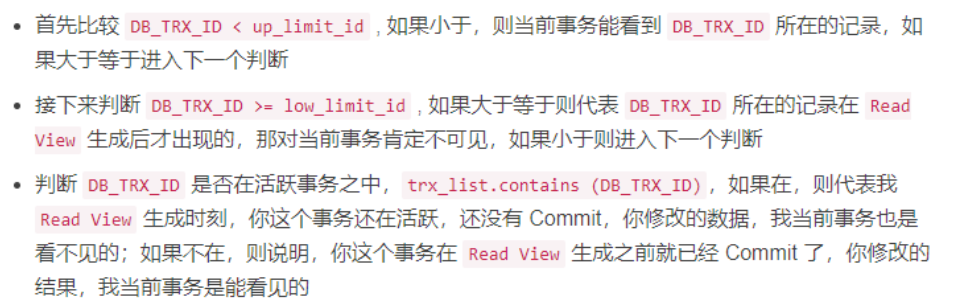

​	铺垫到这了，很容易就发现， MVCC其实就是靠「⽐对版本」来实现读写不阻塞，⽽版本的数据存在于undo log中。  ⽽针对于不同的隔离级别（read commit和repeatable read），⽆⾮就是**read commit隔离级别下，每次都获取⼀个新的read view**， **repeatable read隔离级别则每次事务只获取⼀个read view**。

> 当前读 & 快照读

- 当前读：**读取的是记录的最新版本，读取时还要保证其他并发事务不能修改当前记录，会对读取的记录进行加锁**。
- 快照读：**像不加锁的 select 操作就是快照读**，即不加锁的非阻塞读；快照读的前提是隔离级别不是串行级别，串行级别下的快照读会退化成当前读；之所以出现快照读的情况，是基于提高并发性能的考虑，快照读的实现是基于多版本并发控制 ,可以认为 MVCC 是行锁的一个变种，但它在很多情况下，避免了加锁操作，降低了开销；既然是基于多版本，**即快照读可能读到的并不一定是数据的最新版本，而有可能是之前的历史版本**。

<span style="background-color: yellow">只有select语句才会走MVCC机制，增删改都是走当前读</span>

> 数据库并发场景

1. 读-读：不存在任何问题，也不需要并发控制；
2. 读-写：有线程安全问题，可能会造成事务隔离性问题，可能遇到**脏读，幻读，不可重复读**；
3. 写-写：有线程安全问题，可能会存在**更新丢失**问题。

> MVCC的好处
>

1. 在并发读写数据库时，可以做到在读操作时不用阻塞写操作，写操作也不用阻塞读操作，提高了数据库并发读写的性能；
2. 同时还可以解决脏读、幻读、不可重复读，但不能解决**更新**丢失问题。

---


# 三、锁机制

​		<span style="background-color: yellow">数据库的隔离等级，SQL 语句和当前数据库数据会共同影响该条 SQL 执行时数据库生成的锁模式，锁类型和锁数量。</span>

### 锁的分类

* 在当前读的情况下，MySQL 锁分为<span style="background-color: yellow">共享锁（S 锁/读锁）、排他锁（X 锁/写锁）</span>，共享锁与排他锁之间互相排斥(读写互斥)，共享锁与共享锁之间不排斥(读读共享)，排他锁与排他锁之间互相排斥(写写互斥)。

  ```sql
  select ... lock in share mode     //加共享锁，可用于读锁
  select ... for update            //加排他锁，可用于写锁
  ```

* 按照锁粒度来区分，可以分为：<font color='red'>行锁、表锁、页锁</font>。

* 按照锁的实现分为：<font color='red'>乐观锁和悲观锁</font>。

---

### 不同SQL语句对加锁的影响

不同的 SQL 语句会加不同的锁，总结起来主要分为五种情况：

1. SELECT 语句：正常情况下为**快照读，不加锁**；
2. SELECT … LOCK IN SHARE MODE ：为**当前读，加 S 锁**；
3. SELECT … FOR UPDATE ：为当前读，加 X 锁；
4. 常见的 DML(数据操作语句) 语句（如 INSERT、DELETE、UPDATE）**为当前读**，加 X 锁；
5. 常见的 DDL(数据定义语句，库和表的管理) 语句（如 ALTER、CREATE 等）加表级锁，且这些语句为隐式提交，不能回滚。

​	其中，当前读的 SQL 语句的 where 从句的不同也会影响加锁，包括是否使用索引，索引是否是唯一索引等等。

​	SQL：delete from t1 where id = 10;

​	**在RC的隔离级别下：**

- **id为为主键**时，sql是需要在id = 10这条记录上加X锁即可
- **id为唯一索引**时，加两把X锁，一把写锁加在id索引上id = 10的这个记录上，同时找到聚簇索引另一把x锁加到聚簇索引(假设聚簇索引为name)(name = 'd',id = 10)的记录
- **id为非唯一索引**时，在id索引上满足条件的列，均会加锁，同时这些记录在主键索引上的记录也会被加锁。
- **id无索引**时，sql会走聚簇索引的全扫描进行过滤，由于过滤是由MySQL Server层面进行的。因此每条记录，无论是否满足条件，都会被加上X锁。但是，为了效率考量，MySQL做了优化，对于不满足条件的记录，会在判断后放锁，最终持有的，是满足条件的记录上的锁，但是不满足条件的记录上的加锁/放锁动作不会省略。同时，优化也违背了2PL的约束。

​	**在RR隔离级别下：**

- **id为主键时**，sql是需要在id = 10这条记录上加X锁即可
- **id为唯一索引**时，加两把X锁，一把写锁加在id索引上id = 10的这个记录上，同时找到聚簇索引另一把x锁加到聚簇索引(假设聚簇索引为name)(name = 'd',id = 10)的记录
- **id为非唯一索引**时(**重点**加**gap锁**)，id列上有一个非唯一索引，对应SQL：delete from t1 where id = 10; 首先，通过id索引定位到第一条满足查询条件的记录，加记录上的X锁，在GAP上的GAP锁，然后加主键聚簇索引上的记录X锁，然后返回；然后读取下一条，重复进行。直至进行到第一条不满足条件的记录[11,f]，此时，不需要加记录X锁，**但是仍旧需要加GAP锁**，最后返回结束。(为什么id为主键或者唯一索引时不需要加gap锁：因为gap锁的目的是防止同一事物两次当前读出现幻读(插入使两次读不一样)但一个等值查询(因为其唯一)最多只会返回一条记录(不会有新的插入进来)所以不需要加gap锁)
- **id无索引**时，在Repeatable Read隔离级别下，如果进行全表扫描的当前读，那么会锁上表中的所有记录，同时会锁上聚簇索引内的所有GAP，杜绝所有的并发 更新/删除/插入 操作。当然，也可以通过触发semi-consistent read，来缓解加锁开销与并发影响，但是semi-consistent read本身也会带来其他问题，不建议使用因为gap锁会被释放。

​	**在Serializable隔离级别下**

​		select * from t1 where id = 10

- 快照读不复存在都是当前读，加读锁，也就是MVCC也不存在。

---

### InnoDB 的三种行级锁⭐

#### Record lock(记录锁)

​		RC 和 RR 隔离级别都有。

​		单条索引上加锁，<span style="background-color: yellow">记录锁永远锁的是索引，锁住的是key</span>，而非数据本身，如果innodb表中没有索引，那么会自动创建一个隐藏的聚簇索引，锁住的就是这个聚簇索引。所以说当一条 sql 没有走任何索引时，那么将会在每一条聚簇索引后面加 X 锁。

#### Gap lock(间隙锁)

​		只有 RR 可重复读隔离级别才有，<span style="background-color: yellow">主要是为了解决幻读问题</span>，因为即使你把所有的行都加上Record lock锁，**一旦有别的会话插入新的记录**，还有会发生幻读。

​		间隙锁，是在索引的间隙之间加上锁，锁定一个范围，不包括记录本身。

#### Next-key lock(行锁和间隙锁组合起来)

​		只有 RR 隔离级别才有。<span style="background-color: yellow">前开后闭区间</span>。

​		Record Lock+Gap Lock 可以锁定一个范围，包含记录本身。**innoDB用它(Next-key lock)来解决 RR 级别下当前读存在的幻读问题**。（**快照读的幻读问题由 MVCC 解决**）

​	默认情况下，InnoDB工作在可重复读隔离级别下，并且会以Next-Key Lock的方式对数据行进行加锁，这样可以有效防止幻读的发生。Next-Key Lock是行锁和间隙锁的组合，当InnoDB扫描索引记录的时候，**会首先对索引记录加上行锁（Record Lock），再对索引记录两边的间隙加上间隙锁（Gap Lock）。加上间隙锁之后，其他事务就不能在这个间隙修改或者插入记录**。

#### 行锁的选择

​	主要是根据索引加锁。

- 如果**更新条件没走索引**，此时会进入全表扫描，扫表的时候，要阻止其他任何的更新操作，所以会**上升为表锁**。
- 如果更新条件为索引字段，**但是并非唯一索引(包括主键索引)**，此时更新会使用Next-Key Lock。使用Next_key Lock的原因：
  - 首先保证符合条件的记录上加上排它锁，会锁定当前非唯一索引对应的主键索引的值
  - 还要保证锁定的区间不能插入新的数据(间隙锁)
  - 如果更新条件是唯一索引，就使用Record Lock(不用这个Next-Key Lock)
- InnoDB根据唯一索引，找到相应记录，将主键索引值和唯一索引值加上记录锁，但不使用GapLock

----

### 按锁粒度划分

#### 全局锁

刚刚那个说的不对，是全局锁

​		顾名思义，全局锁就是对整个数据库实例加锁。MySQL 提供了一个加全局读锁的方法：

```sql
Flush tables with read lock (FTWRL)
```

​		当你需要让整个库处于**只读**状态的时候，可以使用这个命令。全局锁的典型使用场景是，<span style="background-color: yellow">做全库逻辑备份</span>。


​	⾏锁实际上是作⽤在索引之上的（索引上次已经说过了，这⾥就不赘述了）。当我们的SQL命中了索引，那锁住的就是命中条件内的索引节点（这种就是⾏锁），如果没有命中索引，那我们锁的就是整个索引树（表锁）。

#### 行锁(会出现死锁)

​		行级锁是 Mysql 中锁定粒度最细的一种锁，加锁开销也最大，表示只针对当前操作的行进行加锁。分为：<span style="background-color: yellow">S锁、X锁</span>

> 读锁(共享锁、S锁)

​		若事务 T 对数据对象 A 加上 S 锁，则事务 T **可以读 A 但不能修改 A **，其他事务只能再对 A 加 S 锁，而不能加 X 锁，直到 T 释放A上的S锁。这保证了其他事务可以读A，但在T释放A上的S锁之前不能对A做任何修改。

```sql
select ... lock in share mode;
```

> 写锁(排它锁、X锁)

​		若事务T对数据对象A加上X锁，事务T**可以读A也可以修改A**，其他事务不能再对A加任何锁，直到T释放A上的锁。这保证了其他事务在T释放A上的锁之前不能再读取和修改A。

```sql
select ... for update
```

---

#### 表锁

​		表示当前的操作对整张表加锁，资源开销比行锁少，<span style="background-color: yellow">不会出现死锁的情况，但是发生锁冲突的概率很大</span>。

```sql
共享锁： LOCK TABLE table_name [ AS alias_name ] READ    
排它锁： LOCK TABLE table_name [AS alias_name][ LOW_PRIORITY ] WRITE
解锁： unlock tables; //除了主动释放锁，在客户端断开时会自动释放，lock tables语法除了会限制别的线程的读写外，也限定了本线程接下来的操作对象。
```

#### 元数据锁 MDL(表级锁)

​		**MDL 不需要显式使用**，在访问一个表的时候会被自动加上。MDL 的作用是<span style="background-color: yellow">保证读写的正确性</span>。可以想象一下，如果一个查询正在遍历一个表中的数据，而执行期间另一个线程对这个表结构做变更，删了一列，那么查询线程拿到的结果跟表结构对不上，肯定是不行的。因此，在 MySQL 5.5 版本中引入了 MDL，**当对一个表做增删改查(DML)操作的时候，加 MDL 读锁；当要对表做结构变更操作(DDL)的时候，加 MDL 写锁。**

- **读锁之间不互斥，因此可以有多个线程同时对一张表增删改查。**
- **读写锁之间，写锁之间是互斥的。以此来保证变更表结构操作的安全性。因此，如果有两个线程要同时给一个表加字段，其中一个要等另一个执行完才能开始执行**。

#### **页锁**

​		页级锁的锁定粒度介于行级锁和表级锁中间，一次锁定相邻的一组记录。

---

### 悲观锁与乐观锁

> 悲观锁

​		在对任意记录进行修改前，先尝试为该记录加上 X 锁。如果加锁失败，说明该记录正在被修改，那么当前查询可能要等待或者抛出异常。如果成功加锁，那么就可以对记录做修改，事务完成后就会解锁了。<span style="background-color: yellow">一般通过数据库的锁机制实现</span>

**优缺点**：

​		悲观锁实际上是采取了“先取锁再访问”的策略，为数据的处理安全提供了保证，但是在效率方面，由于额外的加锁机制产生了额外的开销，并且增加了死锁的机会。并且降低了并发性；当一个事物所以一行数据的时候，其他事物必须等待该事务提交之后，才能操作这行数据。

**使用场景**：主要用于数据争用激烈的环境，以及发生并发冲突时使用锁保护数据的成本要低于回滚事务的成本的环境中。

> 乐观锁

​		乐观锁认为数据一般情况下不会造成冲突，所以在数据进行提交更新的时候，才会正式对数据的冲突与否进行检测，如果发现冲突了，则给用户返回错误的信息，让用户决定如何去做。相对于悲观锁，在对数据库进行处理的时候，乐观锁并不会使用数据库提供的锁机制。一般通过<span style="background-color: yellow">记录数据版本、CAS</span>来实现。

**优缺点**：

​		乐观并发控制相信事务之间的数据竞争的概率是比较小的，因此尽可能直接做下去，直到提交的时候才去锁定，所以不会产生任何锁和死锁。但如果直接简单这么做，还是有可能会遇到不可预期的结果，例如两个事务都读取了数据库的某一行，经过修改以后写回数据库，这时就遇到了问题。

**使用场景**：

​		多数用于数据争用不大、冲突较少的环境中，这种环境中，偶尔回滚事务的成本会低于读取数据时锁定数据的成本，因此可以获得比其他并发控制方法更高的吞吐量。  

---

### 意向锁

InnoDB 支持多粒度锁，它允许行级锁与表级锁共存。**意向锁就是其中一种不与行级锁冲突的表级锁**，分为两种：

1. **意向共享锁（IS）**：事务有意向对表中的某些行加 S 锁。

2. **意向排他锁（IX）**：事务有意向对表中的某些行加 X 锁。

   ```sql
   //事务要获取某些行的 S 锁，必须先获得表的 IS 锁。
   SELECT column FROM table ... LOCK IN SHARE MODE;
   //事务要获取某些行的 X 锁，必须先获得表的 IX 锁。
   SELECT column FROM table ... FOR UPDATE;
   ```

<span style="background-color: yellow">意向锁是由存储引擎自己维护的，用户无法手动操作意向锁</span>，在为数据行加 S 锁或 X 锁 之前，InnoDB 会先获取该数据行所在数据表的对应意向锁。

> 意向锁的作用？

​		举个例子，如果表中记录1亿，事务 A 把其中有几条记录上了行锁了，这时事务 B 需要给这个表加表锁，那么就需要去表中查找这1亿条记录是否上锁了。意向锁的作用就是，事务Ａ在加行锁之前，先加意向锁，再加Ｘ锁。事务 B 会检查该表上是否存在意向锁，存在的意向锁是否与自己准备加的锁冲突，如果有冲突，则等待直到事务Ａ释放，而无须逐条记录去检测。事务Ｂ更新表时，其实无须知道到底哪一行被锁了，它只要知道反正有一行被锁了就行了。

---

### InnoDB加锁规则

**两个原则，两个优化，一个BUG：**

1. 原则一：加锁的单位是 next-key lock，是<span style="background-color: yellow">前开后闭</span>的区间。
2. 原则二：查询过程中访问到的对象才会加锁。
3. 优化一：索引上的等值查询，给唯一索引加锁的时候，next-key lock退化为行锁(record Lock)。
4. 优化二：索引上的等值查询，向右遍历时且最后一个值不满足等值条件的时候，next-key lock退化为间隙锁。
5. bug：唯一索引上的范围查询会访问到不满足条件的第一个值为止。

---

### 死锁⭐

> 死锁现象

​		在 MySQL 的并发读写场景中，当两个及以上的事务，各事务都在等待对方释放已经持有的锁或因为加锁顺序不一致造成循环等待锁资源，就会出现 “死锁”。

当出现死锁以后，有两种策略：

+ 锁超时等待。这个超时时间可以通过参数` innodb_lock_wait_timeout` 来设置。
+ <span style="background-color: yellow">死锁检测(常用)</span>：发现死锁后，<span style="background-color: yellow">主动回滚</span>某一个事务，让其他事务得以继续执行。将参数 `innodb_deadlock_detect` 设置为 on，表示开启这个逻辑。InnoDB 目前处理死锁的方法是<span style="background-color: yellow">将持有最少行级 X 锁的事务进行回滚</span>。

> 避免死锁

1. 合理设计索引，区分度高的列放到组合索引前面，使业务 SQL 尽可能通过索引定位更少的行，减少锁竞争；
2. 调整业务逻辑 SQL 执行顺序，避免 update/delete 长时间持有锁的 SQL 在事务前面；
3. 避免大事务，尽量将大事务拆成多个小事务来处理，小事务发生锁冲突的概率也更小；优化 SQL 和表设计，减少同时占用太多资源的情况，如：减少连接的表，将复杂 SQL 分解为多个简单的 SQL；
4. 如果不同程序会并发存取多个表，尽量约定以相同的顺序访问表，可以大大降低死锁机会；
5. 在同一个事务中，尽可能做到一次锁定所需要的所有资源，减少死锁产生概率；
6. 对于非常容易产生死锁的业务部分，可以尝试使用表锁；
7. 设置 ` innodb_lock_wait_timeout` 。

---

### 分布式锁

MySQL 中提供了两个函数来实现分布式锁：

```java
get_lock('key',timeout)  // 加锁，在timeout时间内获取锁
release_lock('key')  // 释放锁
```

可以根据 key 来加锁，这是一个字符串，可以设置超时时间，当调用 `release_lock('key')` 或者客户端断开连接时释放锁。

使用方法如下：

```java
//如果 10s 之内获取到锁则返回 1，否则返回 0
mysql> select get_lock('user_1', 10);     
    -> 1
//如果该锁是当前客户端持有的则返回 1，如果该锁被其它客户端持有着则返回 0，如果该锁没有被任何客户端持有则返回 null
mysql> select release_lock('user_1');	   
    -> 1
```

---


# 四、事务

### 何为数据库事务？

​		平时，我们在谈论事务的时候，如果没有特指**分布式事务**，往往指的就是**数据库事务**。

**数据库事务有什么作用呢？**

​		简单来说：数据库事务可以保证多个对数据库的操作（也就是 SQL 语句）构成一个逻辑上的整体。构成这个逻辑上的整体的这些数据库操作遵循：**要么全部执行成功,要么全部不执行** 。

---

### 事务的 ACID 特性

1. **原子性**（`Atomicity`） ： 事务是最小的执行单位，不允许分割。事务的原子性确保动作要么全部完成，要么完全不起作用；原⼦性由**undo log⽇志**来保证，因为undo log记载着数据修改前的信息。  
2. **一致性**（`Consistency`）： **执行事务前后，数据保持一致**，例如转账业务中，无论事务是否成功，转账者和收款人的总额应该是不变的；一致性可以理解为我们使用事务的目的，而隔离性、原子性、持久性是为了保障一致性的手段。比如在事务发生过程中出现了异常，此时就得回滚事务而不是强行提交事务来导致数据不一致。
3. **隔离性**（`Isolation`）： 并发访问数据库时，一个用户的事务不被其他事务所干扰，各并发事务之间数据库是独立的；
4. **持久性**（`Durabilily`）： 一个事务被提交之后。它对数据库中数据的改变是持久的，即使数据库发生故障也不应该对其有任何影响。就是数据持久化在硬盘上。
5. **InnoDB 是怎么保证 ACID 特性的？**
   - InnoDB 引擎使用 **redo log**（WAL方式）保证事务的**持久性**，使用 **undo log(回滚日志)** ，以及**两阶段提交机制**来保证事务的**原子性**。
   - InnoDB 引擎通过 **锁机制**、**MVCC** 等手段来保证事务的隔离性（ 默认支持的隔离级别是 **`REPEATABLE-READ`** ）。
   - 保证了事务的持久性、原子性、隔离性之后，一致性才能得到保障。

---

### 事务状态

+ **活跃状态**：事务的第一个状态，任何正在执行的事务都处于此状态，所做的更改存储在主内存的缓冲区中。

+ **部分提交状态**：执行上次操作后，事务进入部分提交状态。之所以是部分提交，是因为所做的更改仍然在主内存的缓冲区中。

+ **失败状态**：如果某个检查在活动状态下失败，在活动状态或部分提交状态发生一些错误，并且事务无法进一步执行，则事务进入失败状态。

+ **中止状态**：如果任何事务已达到失败状态，则恢复管理器将数据库回滚到开始执行的原始状态。

+ **提交状态**：如果所有操作成功执行，则来自部分提交状态的事务进入提交状态。无法从此状态回滚，它是一个新的一致状态。

---

### 并发事务的问题⭐

- **脏读（Dirty read）:** A 事务读取 B 事务尚未提交的数据，此时如果 B 事务发生错误并执行回滚操作，那么 A 事务读取到的数据就是脏数据。
- **丢失修改（Lost to modify）:** 当两个或多个事务选择同一行，最初的事务修改值，会被后面的事务修改的值覆盖。
- **不可重复读（Unrepeatableread）:** 指在一个事务内多次读同一数据。在这个事务还没有结束时，另一个事务修改了该数据，导致事务 A 两次读到的数据是不一样的。
- **幻读（Phantom read）:** 幻读与不可重复读类似。它发生在一个事务（T1）读取了几行数据，接着另一个并发事务（T2）**插入了一些数据时**。在随后的查询中，第一个事务（T1）就会发现多了一些原本不存在的记录，就好像发生了幻觉一样，所以称为幻读。

---

### 事务的四个隔离级别⭐

- **READ-UNCOMMITTED(读取未提交)：** 最低的隔离级别，允许读取尚未提交的数据变更，**可能会导致脏读、幻读或不可重复读**。数据库一般都不会用，而且任何操作都不会加锁。
- **READ-COMMITTED(读取已提交)：** 允许读取并发事务已经提交的数据，**可以阻止脏读，但是幻读或不可重复读仍有可能发生**。数据的读取都是不加锁的，但是数据的写入、修改和删除是需要加锁的。
- **REPEATABLE-READ(可重复读)：** 对同一字段的多次读取结果都是一致的，除非数据是被本身事务自己所修改，**可以阻止脏读和不可重复读，但幻读仍有可能发生**。<span style="background-color: yellow">MySQL默认采用 RR 隔离级别。</span>
- **SERIALIZABLE(可串行化)：** 最高的隔离级别，完全服从 ACID 的隔离级别。所有的事务依次逐个执行，这样事务之间就完全不可能产生干扰，也就是说，**该级别可以防止脏读、不可重复读以及幻读**。读加共享锁，写加排他锁，读写互斥。

|         隔离级别          | 脏读 | 不可重复读 | 幻读 |
| :-----------------------: | :--: | :--------: | :--: |
| READ-UNCOMMITTED 读未提交 |  √   |     √      |  √   |
|  READ-COMMITTED 读已提交  |  ×   |     √      |  √   |
| REPEATABLE-READ 可重复读  |  ×   |     ×      |  √   |
|   SERIALIZABLE 可串行化   |  ×   |     ×      |  ×   |

----

### RR 级别下如何解决幻读

在 RR 和 RC 级别下，数据库的读分为**快照读**和**当前读**。

- 快照读：不加锁的 select 操作（连 S读 锁都不加），读取的是快照（ReadView）中的数据，可能是历史数据。
- 当前读：增删改以及加了 S 锁的查，读取的总是当前的最新数据。

RR 级别下幻读的问题，我觉得要分快照读和当前读两种情况来讨论：

​		对于快照读，RR 中一个事务的所有快照读，读取的都是同一份快照（MVCC 机制），所以无论其他的事务怎么修改，无论是更新还是插入删除，都不会影响当前事务的快照读结果，也就不会出现不可重复读、幻读的情形。

​		对于当前读，你读取的行，以及行的间隙都会被加锁，直到事务提交时才会释放，其他的事务无法进行修改，所以也不会出现不可重复读、幻读的情形。

​		<span style="background-color: yellow">快照读，通过 MVCC 来避免幻读；当前读，通过 "Next-key lock" 来避免幻读。</span>

​		**事务之所以会出现 "幻读"，是因为先进行了一次快照读，读取了历史数据，再进行了一次当前读（insert row with id = 1)，读取最新数据，这样当然会出现幻读了**。

---

### 事务的隔离级别都是如何实现的

在实现上，数据库里面会创建一个视图，访问的时候以视图的逻辑结果为准。

1. 读未提交：直接返回记录上的最新值，没有视图概念。
2. 读已提交：这个视图是在每个 SQL 语句开始执行的时候创建的。
3. 可重复读：这个视图是在事务启动时创建的，整个事务存在期间都用这个视图。
4. 串行化：直接用加锁的方式来避免并行访问。

---

### 为什么尽量不要使用长事务？

​		长事务意味着系统里面会存在很老的事务视图。由于这些事务随时可能访问数据库里面的任何数据，所以这个事务提交之前，数据库里面它可能用到的回滚记录都必须保留，这就会导致大量占用存储空间。

​		在 MySQL 5.5 及以前的版本，回滚日志是跟数据字典一起放在 `ibdata` 文件里的，即使长事务最终提交，回滚段被清理，文件也不会变小。当时看《MySQL45讲》里面有个例子说是数据只有 20GB，而回滚段有 200GB 的库。最终只好为了清理回滚段，重建整个库。除了对回滚段的影响，长事务还占用锁资源，也可能拖垮整个库。

---

### 事务的启动方式

MySQL 的事务启动方式有以下几种：

+ 显式启动事务语句， `begin transaction` 或 `start transaction `。配套的提交语句是 commit，回滚语句是 rollback。
+ `set autocommit=0`，这个命令会将这个线程的自动提交关掉。有些客户端连接框架会默认连接成功后先执行一个 ` set autocommit=0` 的命令。这就导致接下来的查询都在事务中，如果是长连接，就导致了意外的长事务。因此，建议总是使用 `set autocommit=1`, 通过显式语句的方式来启动事务。

---


# 五、索引

### 索引相关语法

```sql
ALTER TABLE 表名 ADD 索引类型(index/unique/primary key) 索引名(可以省略) (字段名, 字段名)
create index <索引名称> on 表名(要建立索引的字段)   #可用于对表增加普通索引或唯一索引
show index from table_name  #查看索引
drop index index_name on table_name   #删除索引
```

​	**添加索引**

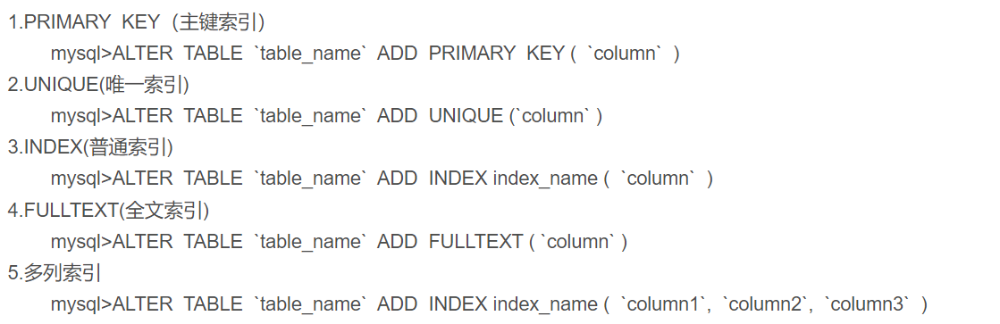


​	**删除索引**


---

### 何为索引

+ **索引**是一种用于**快速查询和检索数据**的**数据结构**。索引的作用就相当于目录的作用。
+ 常见的索引结构有：B树、B+树和Hash。**MySQL默认是B+树**（包括MyISAM 引擎和 InnoDB 引擎）。

**优点**：

+ 使用索引可以**大大加快数据的检索速度**（大大减少检索的数据量）, 这也是创建索引的最主要的原因。
+ 通过创建唯一性索引，可以**保证数据库表中每一行数据的唯一性**。
+ 在使用分组和排序子句进行数据检索时，同样可以显著减少查询中分组和排序的时间。
+ 可以加速表和表之间的连接，一般是在外键上创建索引。

**缺点**：

- 创建索引和维护索引需要耗费许多时间。当对表中的数据进行增删改的时候，如果数据有索引，那么索引也需要动态的修改，会**降低 SQL 执行效率**。
- 索引需要使用物理文件存储，也会**耗费一定空间**。

#### 为啥加了索引，查询会变快

​	**因为索引使用了B+树数据结构来存储，利用二分查找二等原理，有效减少了磁盘IO的次数，所以查询会变快**。

### 索引应该何时使用

#### 需要创建索引的情况：

1.主键，自动建立唯一索引
2.频繁作为查询的条件的字段
3.查询中与其他表关联的字段存在外键关系
4.查询中排序的字段，排序字段若通过索引去访问将大大提高排序的速度
5.查询中统计或者分组字段

#### 避免创建索引的情况：

1.数据唯一性差的字段不要使用索引
比如性别，只有两种可能数据。意味着索引的二叉树级别少，多是平级。这样的二叉树查找无异于全表扫描。

2.频繁更新的字段不要使用索引
比如登录次数，频繁变化导致索引也频繁变化，增大数据库工作量，降低效率。

3.字段不在where语句出现时不要添加索引
只有在where语句出现，mysql才会去使用索引

4.数据量少的表不要使用索引
使用了改善也不大

---


---

### 建立索引的几大原则⭐

1. （复合索引）**最左前缀匹配原则**：
   + mysql会一直向右匹配直到遇到**范围查询**(>、<、between、like)就停止匹配，比如`a=1 and b=2 and c>3 and d=4`  如果建立(a,b,c,d)顺序的索引，d是用不到索引的（**但是可以索引下推优化**），如果建立(a,b,d,c)的索引则都可以用到，a,b,d的顺序可以任意调整。
   + **= 和 in可以乱序**，比如`b=1 and a=2 and c=3 `建立(a,b,c)索引可以任意顺序，mysql 的查询优化器会帮你优化成索引可以识别的形式。
2. **尽量选择区分度高的列作为索引**。
3. **索引列不能参与计算**，保持列“干净”，比如`from_unixtime(create_time) = ’2014-05-29’`就不能使用到索引，原因很简单，b+树中存的都是数据表中的字段值，但进行检索时，需要把所有元素都应用函数才能比较，显然成本太大。所以语句应该写成`create_time = unix_timestamp(’2014-05-29’)`。
4. **尽量的扩展索引，不要新建索引**。比如表中已经有a的索引，现在要加(a,b)的索引，那么只需要修改原来的索引即可。

---

### 不走索引(索引失效)

- 复合索引未用左列字段，索引文件具有 B-Tree 的最左前缀匹配特性，如果左边的值未确定，那么无法使用此索引。
- 对于多个范围条件查询，MySQL 无法使用第一个范围列后面的其他索引列，对于多个等值查询则没有这种限制。
- like，以%开头
- 隐式类型转换、隐式字符编码转换
- where中索引列有运算、使用了函数
- mysql觉得全表扫描更快时

### 索引优化

1. 为索引列选择合适的数据类型

   * 越小的数据类型通常更好：越小的数据类型通常在磁盘、内存和 CPU 缓存中占用空间更少，处理起来更快

   * 简单的数据类型更好：整形数据比起字符，处理开销更小

   * 主键整型最好

   * 尽量避免 NULL，含有 NULL  的列做统计和查询优化很麻烦

2. 一般原则

   * 经常同时存储多列，且每列都含有重复值可考虑建组合索引，其前导列一定是使用最频繁的列

   * 建立索引的列不为 NULL

     只要列中包含有 NULL 值都将不会被包含在索引中，因此，在数据库设计时尽量不要让字段的默认值为 NULL

   * 使用短索引，如果对长字符串列进行索引，应该指定一个前缀长度，这样能够节省大量磁盘空间和 I/O 操作

   * 明确知道只会返回一条记录，加上 limit 1，存储引擎会在找到 1 条结果停止搜索，而不是继续查询下一条是否符合标准，提高了性能

   * 建立了联合索引，查询条件一定要符合最左前缀原则才能使用到索引

   * 不要在索引列上进行运算或使用函数，否则会使索引失效，从而进行全表扫描

   * 前导模糊查询不会使用索引

   * 更新太频繁的字段不适合创建索引

---

### 选错索引

> 优化器选择索引的逻辑

​		优化器选择索引的目的，是找到一个最优的执行方案，并用最小的代价去执行语句，在数据库里面，<span style="background-color: yellow">扫描行数</span>是影响执行代价的因素之一。（当然，扫描行数并不是唯一的判断标准，优化器还会结合是否使用临时表、是否排序等因素进行综合判断。）扫描行数是怎么判断的呢？

​		MySQL在真正开始执行语句之前，并不能精确地知道满足这个条件的记录有多少条，而只能根据统计信息来估算记录数。这个统计信息就是索引的“区分度”，**一个索引上不同的值越多，区分度就越好，而一个索引上不同的值的个数称之为“基数”，这个基数越大，索引的区分度越好。**（使用`show index`可以看到一个索引的基数）MySQL 是怎样得到索引的基数的呢？MySQL中InnoDB 默认会选择 N 个数据页，统计这些页面上的不同值，得到一个平均值，然后乘以这个索引的页面数，就得到了这个索引的基数。

​		<span style="background-color: yellow">归根结底，MySQL选错索引是因为没能准确判断出扫描行数。</span>

> 索引选择异常的处理

- 第一种方式是，采用`force index`强行选择一个索引。问题是一旦索引改了名字，这个语句也得改。
- 第二种方式是，可以考虑修改语句，引导MySQL使用我们期望的索引。
- 第三种方式是，在有些场景下，我们可以新建一个更合适的索引，来提供给优化器做选择，或删掉误用的索引。

---

### 哈希索引

​		基于哈希表实现。哈希索引将所有数据行的 hash 值存储在索引表中，同时在哈希表中保存指向每个数据行的指针。对于 hash 值相同的，采用**链表**的方式解决哈希冲突，类似于 HashMap。

哈希索引能以 O(1) 时间进行查找，但是失去了有序性：

- 哈希索引数据并不是按照索引值顺序存储的，所以也就无法用于**排序**
- 只支持**精确查找**，无法用于模糊查找和范围查找。
- 如果哈希冲突很多，索引维护代价很高。

```sql
查询流程如下：
SELECT lname FROM testhash WHERE fname='Peter';
MySQL 先计算 'Peter' 的哈希值，并使用该值寻找对应的记录指针。因为 f('Peter')=8784，所以 MySQL 在索引中查找 8784，可以找到指向第三行的指针，最后一步是比较第三行的值是否是 'Peter'，以确保就是要查找的行。
```

> 自适应 哈希索引

​		InnoDB 存储引擎有一个特殊的功能叫“自适应哈希索引”，当某个索引值被使用的非常频繁时，会在 B+ 树索引之上再创建一个哈希索引，这样就让 B+Tree 索引具有哈希索引的一些优点，比如：O(1) 的查找。

---

### B+ Tree索引

​		B+ Tree 是基于 B Tree 和叶子节点顺序访问指针进行实现，通过顺序访问指针来提高区间查询的性能。

​		MySQL 索引的数据结构对经典的 B+ 树进行了优化。在原来 B+ 树的基础上，增加一个指向相邻叶子节点的链表指针，就形成了带有顺序指针的 B+ 树，<span style="background-color: yellow">提高区间访问的性能</span>。


> 操作

​		进行查找操作时，首先在根节点进行<span style="background-color: yellow">二分查找</span>，找到一个 key 所在的指针，然后递归地在指针所指向的节点进行查找。直到查找到叶子节点，然后在叶子节点上进行二分查找，找出 key 所对应的 data。

​		插入删除操作会破坏平衡树的平衡性，因此在插入删除操作之后，需要对树进行一个分裂、合并、旋转等操作来维护平衡性。		

---

#### B+ 树能存多少数据

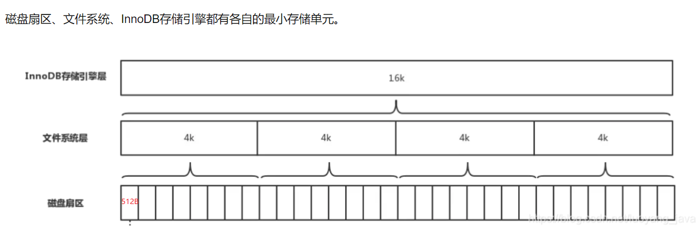

​		这里我们先假设 B+ 树高为2，即存在一个根节点和若干个叶子节点，那么这棵 <font color='green'>B+ 树的存放总记录数为：根节点指针数 * 单个叶子节点记录行数</font>。

<font color='blue'>单个叶子节点（页）中的记录数=16K / 1K = 16</font>（这里假设一行记录的数据大小为 1K，实际上现在很多互联网业务数据记录大小通常就是 1K 左右）。

​		我们假设主键 ID 为 int 类型，长度为 4 字节，而指针大小在 InnoDB 源码中设置为 6 字节，这样一共 10 字节，一个非叶子节点可以存放 16384/10 = 1638个指针记录。那么可以算出一棵**高度为 2**的 B+ 树，能存放 1638*16 = 26208 条这样的数据记录。

​		根据同样的原理我们可以算出一个**高度为 3** 的 B+ 树可以存放：1638 × 1638 × 16 = 42928704 条这样的记录。<font color='red'>所以在 InnoDB 中 B+ 树高度一般为 1~3 层，它就能满足千万级的数据存储</font>。

​		在查找数据时一次页的查找代表一次 IO，所以通过主键索引查询通常只需要 1~3 次 IO 操作即可查找到数据。

> B+ 树可存多少行数据？

​		计算机中磁盘最小存储单元是扇区，一个扇区的大小是 512 字节，文件系统最小存储单元是块，一个块的大小是 4K，InnoDB 存储引擎最小存储单元是页，一个页的大小是 16 K。数据表中的数据都是存储在页中的，所以一个页中能存储多少行数据呢？假设一行数据的大小是 1K，那么**一个页可以存放 16 行这样的数据**。

---

#### B+树和其它的比较

##### 为什么使用B+树

1.**B+树的层级更少**：相较于B树B+每个非叶子节点存储的关键字数更多，树的层级更少所以查询数据更快
2.**B+树查询速度更稳定**：B+所有关键字数据地址都存储在叶子节点上，所以每次查找的次数都相同，所以查询速度要比B树更稳定
3.**B+树天然具备排序功能**：B+树所有的叶子节点数据构成了一个有序链表，在查询大小区间的数据时更方便，数据紧密型很高，缓存的命中率也会比B树高。
4.**B+树全节点遍历更快**：B+树遍历整棵树只需要遍历所有的叶子节点即可，而不需要像B树一样需要对每一层进行遍历，这有利于数据库做全表扫描

为什么索引不使用<span style="background-color: yellow">二叉树</span>结构？

​		我们对自增长列建立索引，它是单边增长结构，就相当于链表，查询仍然是从头到尾，与整表扫描没有区别。

为什么索引不使用<span style="background-color: yellow">红黑树</span>？

​		红黑树每个节点出度最多为2，假设一张表几十w，几百w的数据，随着数据量越大，树的高度越来越高，效率很低。<span style="background-color: yellow">一般来说，一次IO能存入一个节点</span>(因为一次IO只能访问一个数据块)

为什么索引不使用 <span style="background-color: yellow">Hash 索引</span>？

1. **哈希索引数据并不是按照索引值顺序存储的，所以也就无法用于排序**
2. 仅仅适用于精确查找，不支持范围查询和模糊查询
3. **如果发生 hash 冲突，索引维护代价很高，效率可能极差**

为什么索引不使用 <span style="background-color: yellow">B 树</span>？

2. **B+ 树内节点不存储 data**，使得每个节点中**能够存放更多的 key**，可以使得树更矮，IO 操作次数更少
3. **B+ 树的查询效率更加稳定**，B 树搜索有可能会在非叶子结点结束，越靠近根节点的记录查找时间越短
4. B+ 树的叶子节点使用指针顺序连接在一起，提高了**区间访问**性能，B+树所有叶子节点构成了一个有序链表，在查询大小区间的数据时候更方便

##### B+树叶子结点数目是确定的吗？

​	因为索引是以B+树节点的形式存储在硬盘的每个页中的，而硬盘的最小存储单位`页`的大小通常是固定的（约4KB），因此用页的大小除每个节点的大小，就可以得出每个节点的子节点数的近似值（对于非叶子结点，每个节点只存储了主键和一个存储了子节点指针的列表，因此大小是已知的，而叶子节点就很难确定了）。

---

### 磁盘IO与预读 & 局部性原理

​	数据库磁盘IO，访问数据文件，数据文件由多个数据块(数据库访问磁盘数据的基本单位)组成，**一次IO只能访问一个数据块**。

+ 磁盘读取数据靠的是机械运动，每次读取数据花费的时间可以分为**寻道时间、旋转延迟、传输时间**三个部分。
  1. 寻道时间指的是磁臂移动到指定磁道所需要的时间，主流磁盘一般在5ms以下。
  2. 旋转延迟就是我们经常听说的磁盘转速，比如一个磁盘7200转，表示每分钟能转7200次，也就是说1秒钟能转120次，旋转延迟就是1/120/2 = 4.17ms。
  3. 传输时间指的是从磁盘读出或将数据写入磁盘的时间，一般在零点几毫秒，相比前两个可忽略不计。
+ 那么**一次磁盘IO的时间**大概是9ms左右，一台500-MIPS的机器同时间可以执行40万条指令。所以磁盘IO是非常高昂的操作，计算机操作系统做了一些优化，当一次IO时，不光把当前磁盘地址的数据，而是把<span style="background-color: yellow">相邻的数据也都读取到内存缓冲区内</span>，因为<span style="background-color: yellow">局部预读性原理</span>告诉我们，当计算机访问一个地址的数据的时候，与其相邻的数据也会很快被访问到。每一次IO读取的数据我们称之为一页(page)。具体一页有多大数据跟操作系统有关，一般为4k或8k，也就是我们读取一页内的数据时候，实际上才发生了一次IO，这个理论对于索引的数据结构设计非常有帮助。

### 索引分类

#### 主索引和辅助索引

InnoDB 存储引擎有两大类索引：

* 主索引/聚簇索引：InnoDB 聚簇索引的叶子节点保存了行数据，<span style="background-color: yellow">InnoDB 有且只有一个聚簇索引</span>。

* 普通索引/辅助索引：InnoDB 普通索引的叶子节点存储主键值，以及指向主键的指针。

#### 聚簇索引和非聚簇索引

* 聚簇索引：**索引字段+全部其他表字段保存在一个文件中**，将索引结构与数据放到了一块，索引表的叶子节点保存了行数据，索引项的顺序与表中记录的物理顺序一致。
  1. <span style="background-color: yellow">聚簇索引不是人为创建的，默认是主键，一个表只能有一个</span>。
  2. 如果表中没有定义主键，InnoDB 会选择一个唯一的非空索引代替。
  3. 如果没有这样的索引，InnoDB 会在内部生成一个名为` GEN_CLUST_INDEX` 的隐式的聚簇索引。
* 非聚簇索引：**索引字段和表中全量字段分两个文件进行保存**，索引树的叶子节点(存放的不是数据本身，而是存放数据的地址)中存储对应全量数值在磁盘上的地址；将索引结构与数据分开存储，<span style="background-color: yellow">索引表的叶子节点保存了行的物理地址</span>，它指向了对应的行数据，<span style="background-color: yellow">表数据存储顺序与索引顺序无关</span>。

#### 索引类型(按物理分类)

在Innodb下主键索引是聚集索引，在Myisam下主键索引是非聚集索引

**聚簇索引：**
	聚簇索引就是按照每张表的主键构造一颗B+树，同时[叶子节点](https://so.csdn.net/so/search?q=叶子节点&spm=1001.2101.3001.7020)中存放的就是整张表的行记录数据，也将聚集索引的叶子节点称为数据页。	将数据存储与索引放到了一块，找到索引也就找到了数据，**不需要根据主键或行号去进行回表查询**。

​	一般是表中的主键索引，如果表中没有显示指定主键，则会选择表中的第一个不允许为 NULL 的唯一索引，如果还是没有的话，就采用 Innodb 存储引擎为每行数据内置的 6 字节 ROWID 作为聚集索引。

​	InnoDB中的**辅助索引**： 在**聚簇索引之上创建的索引称之为辅助索引**，辅助索引访问数据总是**需要二次查找**。辅助索引叶子节点存储的不再是行的物理位置，**而是主键值**，以及指向主键值的指针；通过辅助索引首先找到的是主键值，再通过主键值找到数据行的数据页，再通过数据页中的Page Directory找到数据行。

**非聚簇索引：**

​	MyISAM存储引擎中：**非聚簇索引**就是指B+Tree的叶子节点上的data，并不是数据本身，**而是数据存放的地址**。主索引和辅助索引没啥区别，只是主索引中的key一定得是唯一的。主要用在MyISAM存储引擎中**.MyISAM引擎使用B+Tree作为索引结构，叶子节点的data域存放的是数据记录的地址**。**MyISAM(使用的是非聚簇索引)的主键索引与辅助键索引的区别就是，主键索引是唯一的，辅助索引可以不是。**

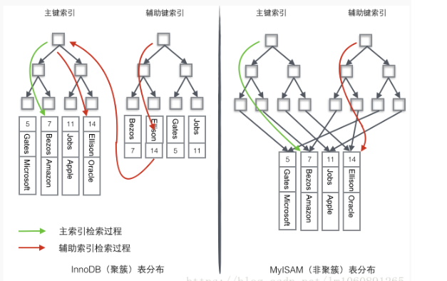

#### 索引类型(按常规功能/逻辑分类)

普通索引：仅加速查询

唯一索引：加速查询 + 列值唯一（可以有null）

主键索引：加速查询 + 列值唯一（不可以有null）+ 表中只有一个

全文索引：对文本的内容进行分词，进行搜索

索引类型(按是否建立在主键上分类)

**主键索引：**

​	在MySQL的主键上创建的索引就是主键索引，主键索引会自动创建，一个表只能有一个主键索引，同时主键索引也是唯一索引。**一个没加主键的表，它的数据无序的放置在磁盘的存储器上，一行一行排列的很整齐，如果给表加上了主键，表在磁盘上的存储结构就变成了树状结构(B+树)，换句话说，整个表就变成了一个索引。**主键的作用就是把表的数据格式转换为”树(索引)“的格式。

**辅助索引：**
	在聚簇索引**之上**创建的索引称之为辅助索引，辅助索引访问数据总是需要二次查找，**非聚簇索引都是辅助索引**，像复合索引、前缀索引、唯一索引，innodb中辅助索引叶子节点存储的不再是行的物理位置，而是键值和主键 ID。

索引类型(按底层数据结构分类)

**哈希索引**

**B+树索引**

#### 回表查询

普通索引无法直接定位行记录，通常情况下，需要扫描两遍索引树，这样的查询叫 “二级索引“ 或 “回表查询”：

1. 先通过普通索引定位到主键值

2. 再由主键值通过聚簇索引定位到行记录

<span style="background-color: yellow">缺点：需要扫描两次 B+ 树，性能较扫一遍索引树更低</span>

​		辅助/二级索引属于非聚簇索引，**叶子节点存储主键值**，每次查找数据时，根据索引找到叶子中的主键值，根据主键值再到聚簇索引中得到完整的行记录，也就是回表查询。

<font color='red'>InnoDB 有了聚簇索引，为什么还要二级索引呢？</font>

​		聚簇索引的叶子节点存储了一行完整的数据，而二级索引只存储了主键值，相比于聚簇索引，占用的空间更少。当我们为表建立多个索引时，如果都是聚簇索引，那将占用大量内存空间，所以 InnoDB 中<span style="background-color: yellow">主键所建立的是聚簇索引，而唯一索引、普通索引等都是二级索引</span>。

#### 覆盖索引

​		即从辅助索引中就可以得到查询的记录，而不需要查询聚集索引中的记录，称为<span style="background-color: yellow">覆盖索引，即只需扫描索引而无须回表</span>。覆盖索引必须要存储索引列的值，而哈希索引、空间索引和全文索引不存储索引列的值，所以mysql**只能用B+tree索引**做覆盖索引。

​		如何实现覆盖索引？常见的方法是：将被查询的字段，建立到<span style="background-color: yellow">联合索引</span>里去。

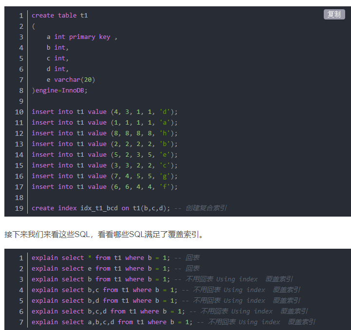

​	因为我们建立的是联(复)合索引，所以就是非聚簇索引，非聚簇索引的叶子节点上会存放键的值，也就是我们的(b,c,d) 这三个字段，还会存放主键a字段用于回表操作。

> 是不是覆盖索引失效一定会做回表查询？

​	不一定，因为回表是因为在聚簇索引的叶子节点里才有数据，如果存储引擎使用的是MyISAM，就不用回表，直接根据对应的叶子地址去查询数据。  

---

#### 联合索引

​		对多个字段同时建立的索引。以联合索引 (a，b，c) 为例，将相当于创建了三个索引 a | a,b| a,b,c，减少开销，但不支持 b,c 进行查找。<span style="background-color: yellow">正因为联合索引的b值可能没有顺序，所以用联合索引的时候很容易写出索引失效的语句</span>。


##### 最左前缀原则

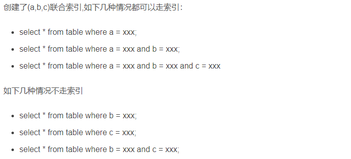

#### 索引下推 

```sql
mysql> select * from tuser where name like '张 %' and age=10 and ismale=1; //name和age建立了联合索引
```

假如在5.6版本之前，会忽略 age 字段，直接通过 name 进行查询，假如在(name, age)上查到了两条结果，id分别为1、2，然后拿着这两个id一次次的回表查询。

MySQL 5.6 引入的索引下推优化，不会忽略age字段，而是直接在索引内部对 age 进行判断，直接过滤掉不满足条件的记录，减少回表次数。<span style="background-color: yellow">主要是针对不满足最左前缀的部分</span>。

---

#### 前缀索引

MySQL是支持前缀索引的，也就是说，可以定义字符串的一部分作为索引。如果不指定前缀索引，那么索引就是整个字符串。

```sql
alter table User add index index1(email);  #整个email字符串作为索引
alter table User add index index2(email(6));  #只取前6位字符作为索引
```

+ 优点：占用的空间更小
+ 缺点：可能会额外增加记录扫描的次数

---

### 唯一索引与普通索引的速度比较

​		假设，执行查询的语句是 `select id from T where k=5`。这个查询语句在索引树上查找的过程，先是通过 B+ 树从树根开始，按层搜索到叶子节点，然后可以认为数据页内部通过二分法来定位记录。

+ 对于普通索引来说，查找到满足条件的第一个记录 (5,500) 后，需要查找下一个记录，直到碰到第一个不满足 k=5 条件的记录。
+ 对于唯一索引来说，由于索引定义了唯一性，查找到第一个满足条件的记录后，就会停止继续检索。

​        那么，这个不同带来的性能差距会有多少呢？答案是，微乎其微。而且由于唯一索引用不上 change buffer 的优化机制，因此如果业务可以接受，从性能角度出发<span style="background-color: yellow">优先考虑非唯一索引</span>。

---


# 六、性能优化

### Explain 查看执行计划⭐

​		使用 Explain 命令来查看语句的**执行计划**，MySQL 在执行某个语句之前，会将该语句过一遍查询优化器，之后会拿到对语句的分析，也就是执行计划，其中包含了许多信息。可以通过其中和索引有关的信息来分析是否命中了索引。


| 字段                          | 含义                                                         |
| ----------------------------- | ------------------------------------------------------------ |
| id                            | 操作表的顺序，id 值越大，优先级越高，越先执行                |
| select_type                   | 查询类型，**主要用于区别普通查询，联合查询，子查询等的复杂查询**。常见取值：SIMPLIE（单表查询，不使用表连接或子查询）、PRIMARY（查询中若包含任何复杂的子查询，最外层查询标记为该标识）、SUBQUERY（select 或 where 列表中包含了子查询）、DERIVED（from 列表中的子查询，把结果放在临时表中） |
| <font color='red'>type</font> | 显示访问类型，显示查询使用了何种类型                         |
| possible_key                  | 查询时可能使用到的索引                                       |
| key                           | **查询时实际使用到的索引**                                   |
| ref                           | 显示索引的哪一列被使用了，如果有可能是一个常数，哪些列或常量被用于查询索引列上的值 |
| <font color='red'>rows</font> | 根据表统计信息以及索引选用情况，大致估算出找到所需的记录所需要读取的行数 |
| Extra                         | Using index：使用覆盖索引会出现；Using index condition：查找使用了索引，但还需要回表查询 |

<h5><font color='red'>type 常见类型</font></h5>

一般来说， 我们需要保证**查询至少达到 range 级别， 最好达到 ref**。按照从最佳到最坏类型排序：

* const：使用主键或非 NULL 的唯一索引，查询结果只有一条，同时优化过程中查询列值会转成常量
* eq_ref：使用唯一索引，多表关联查询出的记录只有一条
* ref：非唯一性索引查询出一条或多条记录
* range：使用索引进行行范围查询，where 后面出现 between、<、>、in、or 等操作
* index：遍历索引树，如：`explain select id from t_user`。通常比all快，因为索引文件比数据文件小很多。
* ALL：未使用索引，全表扫描

---

### MySQL 问题排查的手段

1. <span style="background-color: yellow">慢查询日志</span>：将执行时间超过设定时间的 SQL 语句写到慢查询日志中，然后分析慢查询日志；

   ```sql
   show variables like '%quer%'; #查询慢查询是否开启以及日志存储位置等
   set global slow_query_log=1; #开启慢查询-- 这不是永久开启 重启mysql回到原来设置
   set global long_query_time=3; # 修改慢查询时间为3秒
   ```

2. <span style="background-color: yellow">show profiles</span>：分析出最近几次执行的 SQL 语句**耗时**情况，可以进一步根据 `Query_ID` 来查看 sql 具体执行步骤；

   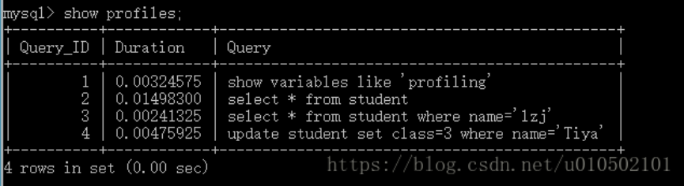

3. <span style="background-color: yellow">show processlist</span>：实时查看 SQL 执行情况。这个没用过。

---

### show profiles

​		`show profile` 用来分析 **sql 性能的消耗** 。例如查询到 SQL 会执行多少时间，并显示 CPU、内存使用量，执行过程中系统锁及表锁的花费时间等信息。例如 `SHOW PROFILE CPU/MEMORY/BLOCK IO FOR QUERY N` 分别查询 id 为 N 的 SQL 语句的 CPU、内存以及 IO 的消耗情况。

​		当用 explain 无法解决慢 SQL 的时候，需要用`shwo profile` 来对 sql 进行更细致的分析，找出 sql 所花的时间大部分消耗在哪个部分，确认 sql的性能瓶颈。

---

### 慢查询

[为什么我只查一行的语句，也执行这么慢？      ](file:///C:/Users/Administrator/Desktop/%E5%B0%8F%E7%B1%B3%E4%BA%91%E7%9B%98/Java/Java%E9%9D%A2%E8%AF%95%E8%B5%84%E6%96%99/mysql%20%E6%9E%81%E5%AE%A245%E8%AE%B2/mysql/%E5%AE%9E%E8%B7%B5%E7%AF%87/19%E4%B8%A8%E4%B8%BA%E4%BB%80%E4%B9%88%E6%88%91%E5%8F%AA%E6%9F%A5%E4%B8%80%E8%A1%8C%E7%9A%84%E8%AF%AD%E5%8F%A5%EF%BC%8C%E4%B9%9F%E6%89%A7%E8%A1%8C%E8%BF%99%E4%B9%88%E6%85%A2%EF%BC%9F.html)

> 原因

1. **等刷脏页**：InnoDB在处理更新语句时，先写内存再写redo log，并不会立即将数据页的更新落地到磁盘（WAL机制），这就会产生升内存数据页和磁盘数据页的数据不一致的情况，这种数据不一致的数据页称为**脏页**，当脏页写入到磁盘（这个操作称为flush）后，数据一致后称为干净页

2. **等行锁**：由于访问 id=1 这个记录时要加读锁，如果这时候已经有一个事务在这行记录上持有一个写锁，我们的 select 语句就会被堵住

3. **undo log**：

   ```sql
   select * from t where id = 1;  # session A
   update t set c=c+1 where id = 1;  # session B ,执行100000次
   select * from t where id = 1 lock in share mode; # session C
   # 假如 B 在事务之间执行，那么：
   # C 会执行很快，因为 C 是当前读，会直接读到 100001 这个结果
   # A 是执行性读，因此需要从 100001 开始，依次执行 B 生成的100000个 undolog，执行了100000次之后才将 1 返回，所以很慢
   ```

4. **没加索引、选错索引**

> 思路

1. 通过**慢查询日志**去寻找哪些 SQL 执行效率低

2. 使用 **explain** 获取低效率 SQL 执行计划

> 引起 SQL 很慢的原因与解决办法

1. **首先分析语句，看看是否加载了额外的数据**，可能是查询了多余的行并且抛弃掉了,  可能是加载了许多结果中并不需要的列,  以此对语句进行分析以及重写
2. **分析语句的执行计划**,  **然后获得其使用索引的情况**,  之后修改语句或者修改索引,  使得语句可以尽可能的命中索引
3. 如果对语句的优化已经无法进行,  **可以考虑表中的数据量是否太大**,  如果是的话可以进行横向或者纵向的分表


---

### SQL 优化

SQL 优化我们抓住 3 个点：<span style="background-color: yellow">最大化利用索引，尽可能避免全表扫描，减少无效数据的查询</span>

1. 为搜索字段创建索引

2. 避免使用 select *，列出需要查询的字段

3. 单表数据量过大，分库分表

4. 尽量避免使用 in 和 not in，导致引擎走全表扫描

5. 尽量避免在字段开头模糊查询，导致索引失效

   如果是子查询，可以用 exists 代替；如果是连续数值，可以用 between 代替

6. 尽量避免使用 or，可能会导致索引失效。可以用 union 代替 or

7. 在一条 SQL 语句插入多条数据，减少 SQL 语句解析次数，减少 IO 次数，提高效率

8. 优化 order by，我们要尽量减少额外的排序，通过索引覆盖方式直接返回有序数据    

---

### 千万级大表的优化

​		除非单表数据未来会一直不断上涨，否则不要一开始就考虑分库分表，拆分会带来逻辑、部署、运维的各种复杂度，一般以整型值为主的表在千万级以下，字符串为主的表在五百万以下是没有太大问题的。事实上很多时候 MySQL 单表的性能依然有不少优化空间。                                                                                                                                                                                                                                                                                                                                                                                                                                                                                                                                                                                                                                                                                                                                                                                                                                                                                                                                                                                                                                                                                                                                                                                                                                                                                                                                                                                                                                                        

优化顺序：

1. 优化 sql 和索引

2. 加缓存：redis

3. 主从复制 & 读写分离

4. mysql 分区表

5. 垂直拆分：先垂直拆分，按照业务将表进行分类，分布到不同的数据库上面，这样使得数据库更加合理，如果一开始使用水平拆分，那么后面会增加垂直拆分的复杂度。

6. 水平拆分

---

### CPU 使用率飙升

**第一步**：使用`top -h`查看 cpu 的使用情况，观察是不是 mysql 占用导致的。

**第二步**：如果是mysql导致的，查看当前所有连接信息，看是不是有消耗资源的sql在运行。

**第三步**：找出消耗高的sql，利用`explain`看看执行计划是否准确，index是否缺失，或者是数据量太大造成的。

**第四步**：**开启慢查询日志**，查看慢查询的 SQL。

**第五步**：优化处理

​		一般肯定要`kill`掉这些线程，同时观察CPU使用率是否下降，进行相应调整之后，再重新跑这些 sql。

​		也有可能是每个 sql 消耗资源并不多，但是突然中间，有大量的 session 连进来导致 cpu 飙升，这种情况就需要跟应用一起分析为何连接数会激增，再做出相应的调整，比如限制连接数等等。

---

### IO性能瓶颈怎么解决

可以考虑以下三种方法：

1. 设置 binlog_group_commit_sync_delay 和  binlog_group_commit_sync_no_delay_count 参数，减少 binlog  的写盘次数。这个方法是基于“额外的故意等待”来实现的，因此可能会增加语句的响应时间，但没有丢失数据的风险。
2. 将 sync_binlog 设置为大于 1 的值（比较常见是 100~1000）。这样做的风险是，主机掉电时会丢 binlog 日志。
3. 将 innodb_flush_log_at_trx_commit 设置为 2。这样做的风险是，主机掉电的时候会丢数据。

---

### 批量导入1000万数据？

* 减少IO次数

* SQL写法优化，一条SQL语句插入多条数据   

* 合理设置批量大小

* 尽量顺序插入， 减少索引的维护压力 

---

### 怎么加快插入速度

1. **一次插入多条数据**

   ```mysql
   insert into table values('11','11'),('22','22'),('33','33')...;
   ```

2. 改写所有 `insert into` 语句为 `insert delayed into`

   这个insert delayed不同之处在于：立即返回结果，后台进行处理插入。

3. 加大 mysql 配置中的 `bulk_insert_buffer_size`，这个参数默认为 8M

4. **自动事务提交关掉**，批量提交后再提交事务。

---


# 七、日志

###  MySQL 普通日志

* 错误日志（error_log）        

  记录 MySQL 服务器运行过程中的错误信息。

* 二进制日志（bin log） 

  记录了所有 DML 和 DDL 语句，但不包括查询语句，此日志对于<font color='green'>灾难时数据恢复和 MySQL 主从复制</font>非常重要。

  由于日志以二进制方式存储，不能直接读取，需要使用 mysqlbinlog 工具查看。

| 日志格式                              | 说明                                                   |
| ------------------------------------- | ------------------------------------------------------ |
| STATEMENT                             | 每一条对数据进行修改的 SQL 都会记录在日志文件中        |
| ROW                                   | 记录的是每一行的数据变更，而不是记录 SQL 语句          |
| MIXED   <font color='red'>默认</font> | 混合了 STATEMENT 和 ROW 两种格式，能够综合利用两者优点 |

* 查询日志（general_log）    	

  记录了客户端所有的查询语句，而二进制日志不包含查询数据的 SQL 语句。

* 慢查询日志（slow_query_log）

  记录了所有执行时间超过参数 long_query_time 值的 SQL 语句，long_query_time 默认为 10s。

* 中继日志（relay_log）

  主从复制时使用的日志。

---

### MySQL 事务日志⭐

InnoDB 事务日志包括 redo log 和 undo log，redo log 是重做日志，undo log 是回滚日志。

#### redo log		               

​		redo log 包括两部分：内存中的日志缓存（redo log buffer）和磁盘上的日志文件（redo log file）。<span style="background-color: yellow">redo log 会把事务执行过程中对表的修改操作都记录下来，系统崩溃后可以把事务所做的任何操作都恢复出来</span>。有了redo log，InnoDB就可以保证即使数据库发生异常重启，之前提交的记录都不会丢失，这个能力成为**crash-safe**。

1. engine层物理日志，<span style="background-color: yellow">innodb特有</span>
2. 记录对数据的更改内容。固定大小的几个文件，<span style="background-color: yellow">循环写。</span>
3. 对于数据的修改，先统一在redo log中记录下来，不管是否页在内存中，都暂时不需要写入磁盘。（WAL）
4. 日志满了时，将前一部分同步到磁盘，然后擦除该部分后继续使用。

​		<span style="background-color: yellow">当我们在事务中尝试对数据进行更改，并不是马上写入磁盘，而是先将记录写入 redo log buffer</span>，根据刷新机制，再将重做日志缓冲刷新到磁盘上的重做日志文件，最后再把内存中的数据变动同步到磁盘上。

> redo log 可能存在的三种状态


1. 存在 redo log buffer 中，物理上是在 MySQL 进程内存中，就是图中的红色部分；
2. 写到磁盘 (write)，但是没有持久化（fsync)，物理上是<span style="background-color: yellow">在文件系统的 page cache 里面</span>，也就是图中的黄色部分；
3. 持久化到磁盘，对应的是 hard disk，也就是图中的绿色部分。

> redo log 的写入机制

​		日志写到 redo log buffer 是很快的，wirte 到 page cache 也差不多，但是持久化到磁盘的速度就慢多了。为了控制 redo log 的写入策略，InnoDB 提供了 `innodb_flush_log_at_trx_commit` 参数：

1. 设置为 0 的时候，表示每次事务提交时都只是把 redo log 留在 redo log buffer 中 ;
2. 设置为 1 的时候，表示每次事务提交时都将 redo log 直接持久化到磁盘；
3. 设置为 2 的时候，表示每次事务提交时都只是把 redo log 写到 page cache。

​        InnoDB 有一个<span style="background-color: yellow">后台线程，每隔 1 秒</span>，就会把 redo log buffer 中的日志，调用 write 写到文件系统的 page cache，然后调用 fsync 持久化到磁盘。注意，事务执行中间过程的 redo log 也是直接写在 redo log buffer 中的，这些 redo log 也会被后台线程一起持久化到磁盘。也就是说，<span style="background-color: yellow">一个没有提交的事务的 redo log，也是可能已经持久化到磁盘的</span>。实际上，除了后台线程每秒一次的轮询操作外，还有两种场景会让一个没有提交的事务的 redo log 写入到磁盘中。

1. **一种是，redo log buffer 占用的空间即将达到 innodb_log_buffer_size 一半的时候，后台线程会主动写盘。**
2. **另一种是，并行的事务提交的时候，顺带将这个事务的 redo log buffer 持久化到磁盘。**

---

#### WAL

​		<span style="background-color: yellow">WAL</span> 的全称是 Write-Ahead Logging，它的关键点就是**先写日志，再写磁盘**。具体来说，当有一条记录需要更新的时候，InnoDB 引擎就会先把记录写到 redo  log里面，并更新内存，这个时候更新就算完成了。同时，InnoDB  引擎会在适当的时候，将这个操作记录更新到磁盘里面，而这个更新往往是在系统比较空闲的时候做。

---

#### undo log

​		<span style="background-color: yellow">engine层逻辑日志</span>，innodb特有。用于数据库的回滚操作以及 MVCC 查询老版本数据。<span style="background-color: yellow">undo log 保存数据提交之前的版本，即存储的是老版本数据</span>。这样在发生错误时，就能回滚到事务之前的数据状态。

​		<span style="background-color: yellow">在数据修改时，不仅记录了 redo，还记录了相对应的 undo</span>，当由于某些原因导致事务执行失败，则可以根据 undo log 日志恢复到更改之前的状态。

---

#### bin log

​		binlog，即**二进制日志，它记录了数据库上的所有改变**，并以二进制的形式保存在磁盘中，<span style="background-color: yellow">追加写</span>。是<span style="background-color: yellow">server层逻辑日志</span>，各个引擎都能用。它可以用来查看数据库的变更历史、数据库增量备份和恢复、Mysql的复制（主从数据库的复制）。

**binlog的写入机制**：

​		事务执行过程中，先把日志写到 binlog cache，事务提交的时候，再把 binlog cache 写到 binlog 文件中。**一个事务的 bin log 是不能被拆开的，因此不论这个事务多大，也要确保一次性写入。**

​		系统给 binlog cache 分配了一片内存，每个线程一个，参数`binlog_cache_size`用于控制单个线程内binlog cache所占内存的大小，如果超过这个参数规定的大小，就要暂存到磁盘。事务提交的时候，执行器把 binlog cache 里的完整事务写入到 binlog 中，并清空 binlog cache。


可以看到：<span style="background-color: yellow">每个线程有自己 binlog cache，但是共用同一份 binlog 文件。</span>

**write 和fsync的时机，是由参数`sync_binlog`控制的：**

+ sync_binlog=0的时候，表示每次提交事务都只write，不fsync(持久化)；

+ sync_binlog=1的时候，表示每次提交事务都会执行fsync；

+ sync_binlog=N(N>1)的时候，表示每次提交事务都write，但累积N个事务后才fsync。

  在出现 IO 瓶颈的场景里，将 sync_binlog 设置成一个比较大的值，可以提升性能。在实际的业务场景中，考虑到丢失日志量的可控性，一般不建议将这个参数设成 0，比较常见的是将其设置为 100~1000 中的某个数值。但是，将 sync_binlog 设置为 N，对应的风险是：如果主机发生异常重启，会丢失最近 N 个事务的 binlog 日志。

#### bin log的三种格式

**三种格式**：

- **Statement：每一条会修改数据的sql都会记录在binlog中。**

  **优点：**不需要记录每一行的变化，减少了binlog日志量，节约了IO，提高性能。

  **缺点：**由于记录的只是执行语句，为了这些语句能在slave上正确运行，因此还必须记录每条语句在执行的时候的一些相关信息，以保证所有语句能在slave得到和在master端执行时候相同的结果。

- **Row:不记录sql语句上下文相关信息，仅保存哪条记录被修改。**

  **优点：**binlog中可以不记录执行的sql语句的上下文相关的信息，仅需要记录那一条记录被修改成什么了。

  **缺点：**所有的执行的语句当记录到日志中的时候，都将以每行记录的修改来记录，这样可能会产生大量的日志内容。特别是当执行alter table之类的语句的时候，由于表结构修改，每条记录都发生改变，那么该表每一条记录都会记录到日志中。

- **Mixedlevel: 以上两种level的混合使用。**

  一般的语句修改使用statment格式保存binlog，如一些函数，statement无法完成主从复制的操作，则采用row格式保存binlog,MySQL会根据执行的每一条具体的sql语句来区分对待记录的日志形式，也就是在Statement和Row之间选择一种。

  新版本的MySQL中对row level模式也被做了优化，并不是所有的修改都会以row level来记录，像遇到表结构变更的时候就会以statement模式来记录。至于update或者delete等修改数据的语句，还是会记录所有行的变更。

#### redo log 与 bin log 的区别

+ <span style="background-color: yellow">redo log是InnoDB引擎特有的</span>，只记录该引擎中表的修改记录。<span style="background-color: yellow">binlog是MySQL的Server层实现的</span>，会记录所有引擎对数据库的修改。

+ redo log是物理日志，记录的是在具体某个数据页上做了什么修改；binlog是逻辑日志，记录的是这个语句的原始逻辑，比如“给 ID=2 这一行的 c 字段加 1 ”。

+ redo log是循环写的，空间固定会用完；binlog是可以追加写入的，binlog文件写到一定大小后会切换到下一个，并不会覆盖以前的日志。

---

#### change buffer

​		当需要更新一个数据页时，**如果数据页在内存中就直接更新**，而**如果这个数据页还没有在内存中**的话，在不影响数据一致性的前提下，InnoDB会将这些更新操作**缓存在change buffer中**，这样就不需要从磁盘中读入这个数据页了。**在下次查询需要访问这个数据页的时候，将数据页读入内存，然后执行change buffer中与这个页有关的操作**。通过这种方式就能保证这个数据逻辑的正确性。

​		<span style="background-color: yellow">需要说明的是，虽然名字叫做change buffer，实际上它是可以持久化的数据，也就是说change buffer在内存中有拷贝，也会被写入到磁盘上。</span>

​		将 change buffer 中的操作应用到原数据页，得到最新结果的过程称为`merge`。除了访问这个数据页会触发`merge`外，系统有后台线程会定期`merge`，在数据库正常关闭的过程中，也会执行`merge`操作。

​		<span style="background-color: yellow">唯一索引的更新就不能使用 change buffer，实际上也只有普通索引可以使用。</span>

> 唯一索引和普通索引对数据的更新过程
>

1. 这个记录要更新的目标页就在内存中
   1. 对于唯一索引来说，找到位置之后，判断有没有冲突，插入这个值，语句执行结束。
   2. 对于普通索引来说，找到位置之后，直接插入这个值，语句执行结束。
2. 这个记录要更新的目标页不在内存中
   1. 对于唯一索引来说，需要将数据页读入内存，判断有没有冲突，插入这个值，语句执行结束。
   2. 对于普通索引来说，则是将更新记录在change buffer中，语句执行就结束了。

**change buffer的使用场景**

​		因为merge的时候是真正进行数据更新的时刻，而change buffer的主要目的就是将记录的变更动作缓存下来，所在一个数据页做merge之前，change buffer记录的变更越多，收益就越大。

​		因此对于<span style="background-color: yellow">写多读少</span>的业务来说，页面在写完以后马上被访问到的概率比较小，此时change buffer的使用效果最好；反之，假设一个业务的更新模式是写入之后马上会做查询，那么即时满足了条件，将更新先记录到change buffer，但之后由于马上要访问这个数据页，会立刻触发merge过程，这样随机IO的次数不会减少，反而增加了change buffer的维护代价。

**Insert Buffer**

非唯一辅助索引的插入操作，不是每一次直接插入到索引页中，而是先判断插入的非聚集索引页是否在缓冲池中，若在，则直接插入；若不在，则先放入到一个 Insert buffer 对象中，然后再以一定的频率和情况进行 Insert buffer 和辅助索引页子节点的 merge 操作，这样能将多个插入合并到一个操作中，提高了性能。

---

#### 区分redo log和change buffer

1. <span style="background-color: yellow">redo log主要节省的是随机写磁盘的IO消耗（转成顺序写），而change buffer主要节省的则是随机读磁盘的IO消耗。</span>
2. 前者是日志文件，后者主要是内存中
3. 修改数据时，如果数据页已经在内存中，只写redo log。不在内存中，才会同时写change buffer和redo log

---

### 怎样让数据库恢复某时刻状态

​		binlog 会记录所有的逻辑操作，并且是采用“追加写”的形式。如果你的 DBA 承诺说半个月内可以恢复，那么备份系统中一定会保存最近半个月的所有 binlog，同时系统会定期做整库备份。这里的“定期”取决于系统的重要性，可以是一天一备，也可以是一周一备。

​		当需要恢复到指定的某一秒时，比如某天下午两点发现中午十二点有一次误删表，需要找回数据，那你可以这么做：首先，找到最近的一次全量备份，如果你运气好，可能就是昨天晚上的一个备份，从这个备份恢复到临时库；然后，从备份的时间点开始，将备份的 binlog 依次取出来，重放到中午误删表之前的那个时刻。

---

### 为什么同时需要binlog/redo log

​		Crash-Safe是指：数据库在宕机重启后能够保证：所以已经提交的事务的数据依然存在，所有没有提交的事务的数据自动回滚。

​		因为最开始 MySQL 里并没有 InnoDB 引擎。MySQL 自带的引擎是 MyISAM，但是 MyISAM 没有 crash-safe 的能力，binlog 日志只能用于归档。而 InnoDB 是另一个公司以插件形式引入 MySQL 的，既然只依靠 binlog 是没有 crash-safe 能力的，所以 InnoDB 使用另外一套日志系统——也就是 redo log 来实现 crash-safe 能力。

### 为什么日志需要“两二阶段提交”？


​		这里不妨用反证法来进行解释。由于 redo log 和 binlog 是两个独立的逻辑，如果不用两阶段提交，要么就是先写完 redo log 再写 binlog，或者采用反过来的顺序。我们看看这两种方式会有什么问题。<span style="background-color: yellow">用于解决了数据一致性的问题。</span>

* **先写 redo log 直接提交，然后写 binlog**，假设写完 redo log 后，机器挂了，binlog 日志没有被写入，那么机器重启后，这台机器会通过 redo log 恢复数据，但是这个时候 binlog 并没有记录该数据，**后续进行机器备份的时候，就会丢失这一条数据，同时主从同步也会丢失这一条数据**。
* **先写 binlog，然后写 redo log**，假设写完了 binlog，机器异常重启了，由于没有 redo log，本机是无法恢复这一条记录的，但是 binlog 又有记录，那么和上面同样的道理，就会产生数据与原库不一样，出现数据不一致的情况。

​       如果采用 redo log 两阶段提交的方式就不一样了，写完 binlog 后，然后再提交 事务 就会防止出现上述的问题，从而保证了数据的一致性。那么问题来了，有没有一个极端的情况呢？假设事务 处于预提交状态，binlog 也已经写完了，这个时候发生了异常重启会怎么样呢？这个就要依赖于 MySQL 的处理机制了，MySQL 的处理过程如下：

* 判断 redo log 是否完整，如果判断是完整的，就立即提交。
* 如果 事务 只是预提交但不是 commit 状态，这个时候就会去判断 binlog 是否完整，如果完整就提交 事务, 不完整就回滚事务。

---


# 八、复制与读取

### 主从复制、读写分离的优点

​		主从复制、读写分离一般是一起使用的。目的很简单，就是**为了提高数据库的并发性能**。你想，假设是单机，读写都在一台MySQL上面完成，性能肯定不高。如果有三台MySQL，一台mater只负责写操作，两台salve只负责读操作，性能不就能大大提高了吗？

​		所以主从复制、读写分离就是为了**数据库能支持更大的并发。随着业务量的扩展、如果是单机部署的MySQL，会导致I/O频率过高。采用主从复制、读写分离可以提高数据库的可用性。**

---

### 主从复制的原理

​	主从复制并不是复制磁盘上的数据库文件，而**是通过binlog日志复制到需要同步的从服务器上**。MySQL数据库支持单向、双向、链式级联等不同业务场景的复制。**在复制的过程中，一台服务器当主服务器（Master），接收来自用户的内容更新，而一个或多个其它的服务器来当从服务器（Slaver），接收来自Master上binlog文件的的日志内容，解析出SQL,重新更新到Slave，使得主从服务器的数据达到一致**。

①当Master节点进行insert、update、delete操作时，会按顺序写入到binlog中。

②salve从库连接master主库，Master有多少个slave就会创建多少个binlog dump线程。

③当Master节点的binlog发生变化时，binlog dump 线程会通知所有的salve节点，并将相应的binlog内容推送给slave节点。

④I/O线程接收到 binlog 内容后，将内容写入到本地的 relay-log。

⑤SQL线程读取I/O线程写入的relay-log，并且根据 relay-log 的内容对从数据库做对应的操作。


#### 涉及的线程

-   **binlog 线程**  ：负责将主服务器上的数据更改写入二进制日志（Binary log）中。
-   **I/O 线程**  ：负责从主服务器上读取二进制日志，并写入从服务器的中继日志（Relay log）。
-   **SQL 线程**  ：负责读取中继日志，解析出主服务器已经执行的数据更改并在从服务器中重放（Replay）。

---

#### 主从同步的延迟原因

**原因**：

​		假如一个服务器开放 Ｎ 个连接给客户端，这样有会有大并发的更新操作, **但是从服务器的里面读取 binlog 的线程仅有一个**， **当某个 SQL 在从服务器上执行的时间稍长或者由于某个 SQL 要进行锁表就会导致主服务器的 SQL 大量积压，未被同步到 slave 里。这就导致了主从不一致， 也就是主从延迟**。

**主从同步延迟的解决办法：**

​		实际上主从同步延迟根本没有什么一招制敌的办法， 因为所有的 SQL 必须都要在从服务器里面执行一遍，但是主服务器如果不断的有更新操作源源不断的写入，那么一旦有延迟产生，那么延迟加重的可能性就会原来越大。当然我们可以做一些缓解的措施。

+ 我们知道因为主服务器要负责更新操作， 它对安全性的要求比从服务器高，所有有些设置可以修改，比如sync_binlog=1，innodb_flush_log_at_trx_commit = 1 之类的设置，而 slave 则不需要这么高的数据安全，完全可以将 sync_binlog 设置为 0 (不持久化)或者关闭 binlog、innodb_flushlog、innodb_flush_log_at_trx_commit 也 可以设置为 0 来提高 SQL 的执行效率。
+ 增加从服务器，这个目的还是分散读的压力， 从而降低服务器负载。

---


# 九、页面与库表

### 分库分表

​		数据库中的数据量不一定是可控的，随着时间和业务的发展，库中的表会越来越多，表中的数据量也会越来越大，相应地数据操作，例如 **增删改查的开销** 也会越来越大；另外，若不进行分布式部署，而一台服务器的 **资源** （CPU、磁盘、内存、IO 等）是有限的，最终数据库所能承载的数据量、数据处理能力都将遭遇瓶颈。所以，从 **性能** 和 **可用性** 角度考虑，会进行数据库拆分处理，具体地说，把原本存储于一个库的数据分块存储到多个库上，把原本存储于一个表的数据分块存储到多个表上，即 分库分表。

---

#### 分库与分表的选择

​		不管是IO瓶颈，还是CPU瓶颈，最终都会导致数据库的活跃连接数增加，进而逼近甚至达到数据库可承载活跃连接数的阈值。在业务Service来看就是，可用数据库连接少甚至无连接可用。接下来就可以想象了吧（并发量、吞吐量、崩溃）。

1. **IO瓶颈**
   - 第一种：磁盘读IO瓶颈，热点数据太多，数据库缓存放不下，每次查询时会产生大量的IO，降低查询速度 -> **分库和垂直分表**。
   - 第二种：网络IO瓶颈，请求的数据太多，网络带宽不够 -> **分库**。
2. **CPU瓶颈**
   - 第一种：SQL问题，如SQL中包含 join，group by，order by，非索引字段条件查询等，增加CPU运算的操作 -> SQL优化，建立合适的索引，在业务Service层进行业务计算。
   - 第二种：单表数据量太大，查询时扫描的行太多，SQL效率低，CPU率先出现瓶颈 -> **水平分表**。

---

#### 水平切分和垂直切分？

​	切分的目的：减少数据库负担，缩短查询时间

​	数据库分布式核心内容无非就是**数据切分**，以及切分后对数据的定位、整合。数据切分就是将数据分散存储到多个数据库中，使得单一数据库中的数据量变小，**通过扩充主机的数量缓解单一数据库的性能问题，从而达到提升数据库操作性能的目的**。

- **水平切分(IO瓶颈)**

  ​	水平切分是<span style="background-color: yellow">将同一个表中的记录拆分到多个结构相同的表中</span>。当一个表的数据不断增多时，水平切分是必然的选择，它可以将数据分布到集群的不同节点上，从而缓解单个数据库的压力。

  ​	水平切分分为**库内分表**和**分库分表**，根据表内数据内在的逻辑关系，将同一个表按不同的条件分散到多个数据库或多个表中，每个表中只包含一部分数据，从而使得单个表的数据量变小，达到分布式的效果。

  - **水平分表**

    ​	和垂直分表有一点类似，不过垂直分表是基于列的，而水平分表是基于全表的。水平拆分可以大大减少单表数据量，提升查询效率。这里的水平分表指的是在一个数据库进行的**库内分表**。

    ​	库内分表只解决了单一表数据量过大的问题，但没有将表分布到不同机器的库上，因此对于减轻MySQL数据库的压力来说，帮助不是很大，大家还是竞争同一个物理机的CPU、内存、网络IO，最好通过分库分表解决。

  - **水平分库分表**

    ​	**将单张表的数据切分到多个服务器上去，每个服务器具有相同的库和表，只是表中数据集合不同**。水平分库分表能够有效的缓解单机和单库的性能瓶颈和压力，突破IO、连接数、硬件资源等的瓶颈。

  - **水平拆分的优缺点**

    - **优点：**
      1. 不存在单库数据量过大，高并发的性能瓶颈，提升系统稳定性和负载能力
      2. 应用端改造较小，不需要拆分业务模块
    - **缺点：**
      1. ACID被打破，跨分片的事务一致性难以保证
      2. 跨库的join关联查询性能较差
      3. 数据多次扩展难度和维护量极大
      4. 靠外键进行约束的场景会受到影响
      5. 依靠单库的自增ID会受到影响

- **垂直切分(CPU瓶颈)**

  ​	**垂直切分**常见的有两种**垂直分库**和**垂直分表**
  
  - **垂直分库**：**将系统中的不同业务进行拆分，**例如商品一个库，订单一个库，用户一个库。若不拆分，每次访问都是落到单一的库上，这使得单库的处理能力成为瓶颈。若分库后将他们放到一个服务器上，这样虽然会减少单库的压力，但随着用户量增大，还是会让整个数据库处理能力成为瓶颈，还有单个服务器的磁盘空间、内存也会受非常大的影响。将其拆分到多个服务器上，问题便可解决。
  
  - **垂直分表**：也就是大表拆小表，是基于**列字段**进行的。一般将不常用的，数据较大，长度较长(比如text类型字段)的字段数据差分到扩展表。**Mysql底层是通过数据页存储的，一条记录占用空间过大会导致跨页(页溢出)，造成额外的性能开销(IO操作变多)**。另外数据库以页为单位将数据加载到内存中，而页中存储的是行数据，页大小固定，一行占用空间越小，页中存储的数据就越多。这样表中字段长度较短且访问频率较高，内存能加载更多的数据，内存命中率更高，减少了磁盘IO提升数据库性能。
  
    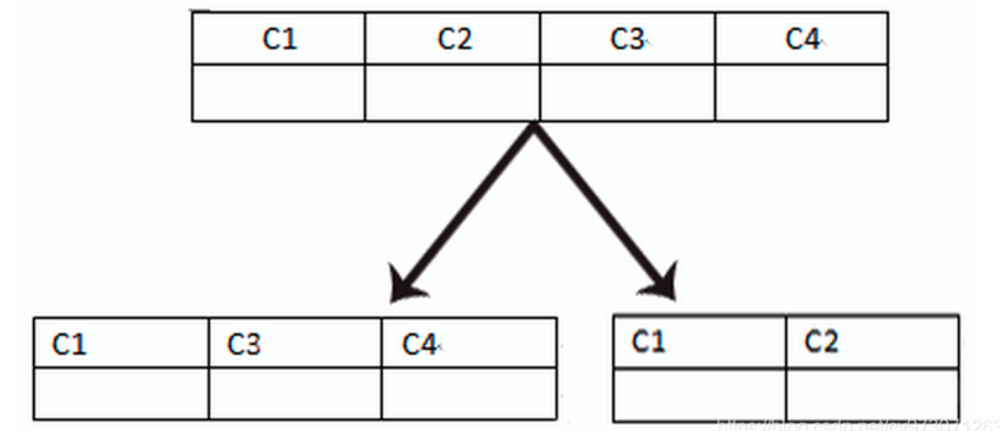
  
  - **垂直拆分的优缺点**：
  
    - **优点**：
      1. 解决业务系统层面的耦合，业务清晰
      2. 与微服务的治理类似，也能对不同的业务的数据进行分级管理、维护、监控、扩展等
      3. 高并发情况下，垂直切分一定程度的提升IO、数据库连接数、单机硬件资源的瓶颈
    - **缺点**：
      1. 部分表无法join(拆分后，数据库可能是分布式在不同的实例和不同的主机上，join将会很麻烦)，只能通过接口聚合方式解决，提高了开发的复杂度
      2. 单机的ACID被打破，需要引入分布式事务，而分布式事务处理比较复杂
      3. 依然存在单表数据量过大的问题(需要水平切分)
      4. 靠  外键约束的场景会受到影响

---

#### 数据库分片的两种常见方案

- **客户端代理：分片逻辑在应用端，封装在jar包中，通过修改或者封装JDBC层来实现。** 当当网的 **Sharding-JDBC** 、阿里的TDDL是两种比较常用的实现。
- **中间件代理：在应用和数据中间加了一个代理层。分片逻辑统一维护在中间件服务中。** 我们现在谈的 **Mycat** 、360的Atlas、网易的DDB等等都是这种架构的实现

#### 常见的分库分表的策略

- **根据数据范围切分**

  按照时间区间或ID区间来切分。例如：按日期将不同月甚至是日的数据分散到不同的库中；将userId为1~9999的记录分到第一个库，10000~20000的分到第二个库，以此类推。某种意义上，某些系统中使用的"冷热数据分离"，将一些使用较少的历史数据迁移到其他库中，业务功能上只提供热点数据的查询，也是类似的实践。**围路由设计的复杂点主要体现在分段大小的选取上**，分段太小会导致切分后子表数量过多增加维护复杂度，分段太大可能会导致单表依然存在性能问题，按一般大老们的经验，**分段大小100W至2000W**之间，具体需要根据业务选 取合适的分段大小。

  - 优点：
    - **单表大小可控**
    - **天然便于水平扩展**，后期如果想对整个分片集群扩容时，只需要添加节点即可，无需对其他分片的数据进行迁移
    - 使用分片字段进行范围查找时，连续分片可快速定位分片进行快速查询，有效避免跨分片查询的问题。
  - 缺点：
    - **热点数据**成为性能瓶颈。连续分片可能存在数据热点，例如按时间字段分片，有些分片存储最近时间段内的数据，可能会被频繁的读写，而有些分片存储的历史数据，则很少被查询。有些时候会猛访问个别服务器上的库，导致其性能瓶颈。

- **hash切分**

  一般采用hash取模mod的切分方式，例如：将 Customer 表根据 cusNo 字段切分到4个库中，余数为0的放到第一个库，余数为1的放到第二个库，以此类推。这样同一个用户的数据会分散到同一个库中，如果查询条件带有cusno字段，则可明确定位到相应库去查询。再比如说有用户表user,将其分成3个表user0,user1,user2.路由规则是对3取模,当uid=1时,对应到的是user1,uid=2时,对应的是user2.

  - 优点：
    - 数据分片相对比较均匀，不容易出现热点和并发访问的瓶颈
  - 缺点：
    - 后期分片集群扩容时，需要迁移旧的数据（使用**一致性hash算法**(一致性Hash算法对于节点的增减都只需重定位环空间中的一小部分数据，只有部分缓存会失效，不至于将所有压力都在同一时间集中到后端服务器上，具有较好的容错性和可扩展性)能较好的避免这个问题），否则会导致历史数据失效。
    - 容易面临跨分片查询的复杂问题。比如上例中，如果频繁用到的查询条件中不带cusno时，将会导致无法定位数据库，从而需要同时向4个库发起查询，再在内存中合并数据，取最小集返回给应用，分库反而成为拖累。

#### 数据库分片常用的分片的方法

1. **查询切分**

   将ID和库的Mapping关系记录在一个单独的库中。 

   优点：ID 和库的 Mapping 算法可以随意更改。
   缺点：引入额外的单点

2. **范围切分**

   比如按照时间区间或ID区间来切分  

   优点：单表大小可控，天然水平扩展。
   缺点：无法解决集中写入瓶颈的问题。  

3. **hash切分**

   一般采用Mod来切分 ，易于水平扩展

#### 分库分表后带来的问题

1. 当更新内容同时分布在不同库中，不可避免会带来跨库事务问题。**跨分片事务也是分布式事务**，没有简单的方案，一般可使用"XA协议"和"两阶段提交"处理。
   - 解决方案：
     - 使用分布式事务中间件
     - 使用MySQL自带的针对跨库的事务一致性方案(XA)不过性能要比单库的慢10倍左右

2. 跨库跨表的join
3. 跨节点的count，order by，group by以及聚合函数的问题
4. 数据迁移，容量规划，扩容等问题
5. ID问题：不能再依赖数据库自身的主键生成机制，无法保证全局唯一，**使用UUID做主键**

---

### 页面

#### 页

​	**页是InnoDB管理存储空间的基本单位，一个页的大小一般是16KB**。存放我们常用的表中记录的那种类型的页，官方称这种存放记录的页为 **索引（ INDEX ）页**，而这些表中的记录就是我们日常所称的 **数据** ，所以目前还是叫这种存放记录（数据）的页为 **数据页**。InnoDB 都是以页为单位存放数据的。

#### 脏页与干净页

​		当内存数据页跟磁盘数据页内容不一致的时候，我们称这个内存页为“脏页”。内存数据写入到磁盘后，内存和磁盘上的内容就一致了，成为“干净页”。<span style="background-color: yellow">不论是脏页还是干净页，都在内存中。</span>平时执行很快的更新操作，其实就是在写内存和日志，而MySQL偶尔“抖”一下的那个瞬间，可能就是在刷页（flush）。

#### 刷页（两次写）

​		在刷脏页时，并不是直接刷入磁盘，而是copy到内存中的Doublewrite Buffer中，然后再拷贝至磁盘共享表空间（可以理解为磁盘）中，每次写入1M，等copy完成后，再将Doublewrite Buffer中的页写入磁盘文件。

​		有了两次写机制，即使在刷脏页时宕机了，在实例恢复的时候也可以从共享表空间中找到Doublewrite Buffer的页副本，直接将其覆盖原来的数据页即可。

#### 什么时候会引发数据库刷页

1. 第一种情况：InnoDB的redo log写满了，这时候系统会停止所有更新操作，把checkpoint往前推进，redo log留出空间可以继续写。
2. 第二种情况：系统内存不足，当需要新的内存页，而内存不够用的时候，就要淘汰一些数据页，空出内存给别的数据页使用。
3. 第三种情况：MySQL认为系统“空闲”的时候。
4. 第四种情况：MySQL正常关闭的时候。

**上述场景对性能的影响**

1. 第一种：出现这种情况，整个系统就不能再接受更新了，所有的更新都必须堵住。

2. 第二种：这种情况其实是常态。

   **InnoDB用缓冲池（buffer pool）管理内存，缓冲池中的内存页有三种状态：**

   1. 还没有使用的。
   2. 使用了并且是干净页。
   3. 使用了并且是脏页。

   InnoDB的策略是**尽量使用内存**，因此对于一个长时间运行的库来说，未被使用的页面很少。

   而当要读入的数据页没有再内存的时候，就必须到缓冲池中申请一个数据页，这时候只能把最久不使用的数据页从内存中淘汰掉；如果要淘汰的是一个干净页，就直接释放出来复用；但如果是脏页，就必须先刷到磁盘，变成干净页之后才能复用。

3. 第三种和第四种：这两种情况系统的压力都没有。

### sql注入

[SQL注入](https://so.csdn.net/so/search?q=SQL注入&spm=1001.2101.3001.7020)攻击指的是通过构建特殊的输入作为参数传入Web应用程序，而这些输入大都是SQL语法里的一些组合，通过执行SQL语句进而执行攻击者所要的操作，其主要原因是程序没有**细致地过滤用户输入的数据，致使非法数据侵入系统**。

#### #{ } 和 ${ } 区别？

<span style="background-color: yellow">#{}是jdbc预编译处理，变量替换在DBMS中，${}是字符串替换，替换阶段是SQL解析阶段。</span>

#{key}：获取参数的值，预编译到 SQL 中，可简单理解为一个**占位符 “？”**，有效防止 SQL 注入，<span style="background-color: yellow">安全</span>。

${key}：获取参数的值，拼接到 SQL 中，存在 SQL 注入问题，<span style="background-color: yellow">不安全</span>。表名作为变量时，必须使用${ }，因为占位符进行替换变量后会加上单引号(表名为字符串，sql占位符替换字符串时会带上单引号’ ‘)，而表名是不能加单引号的(``反引号可以)

#### sql预编译

​	**定义**: sql预编译是指数据库驱动在发送sql语句和参数给DBMS之前会对sql语句进行编译，这样DBMS执行sql时，就不需要重新编译。

​	**为什么需要预编译**：JDBC中使用对象PreparedStatement来抽象预编译语句，使用预编译。预编译阶段可以优化sql的执行，预编译之后的sql多数情况下可以直接执行，DBMS不需要再次编译，越复杂的sql，编译复杂度将越大，预编译阶段可以合并多次操作作为一个操作。预编译语句对象可以重复利用。把一个 sql 预编译后产生的 PreparedStatement 对象缓存下来，下次对于同一个sql，可以直接使用这个缓存的 PreparedState 对象。mybatis 默认情况下，将对所有的 sql 进行预编译。

---

### 查询语句


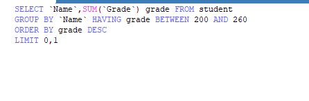


### 创建表(插入语句)

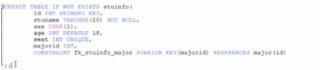

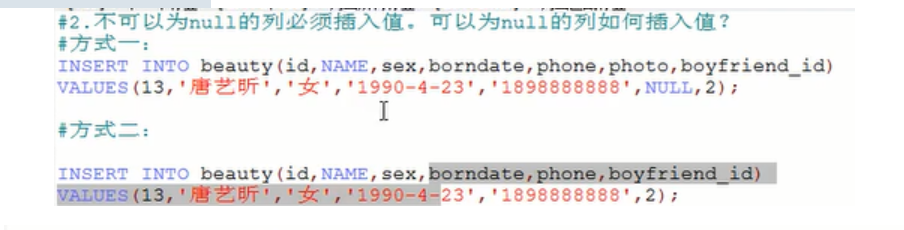


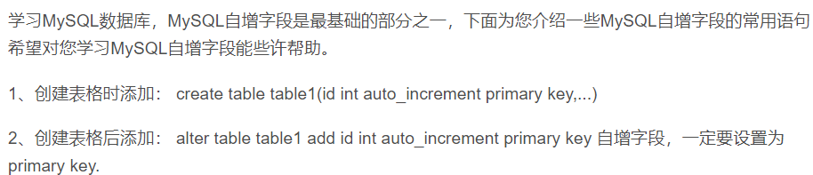

#### 分支结构中的case when


# 设计题

## 一、评论系统设计

[评价系统数据库设计与实现](https://www.cnblogs.com/godlovesme/p/10708358.html)

​		在以评论为主的<span style="background-color: yellow">树形结构</span>中，数据库的设计非常灵活，可以是单表设计，每个评论都有一个parent_id指向父评论。还可以分开为两个表，评论一张表，对评论的回复是另一张表。

假如使用的是单表设计，以新闻系统举例：

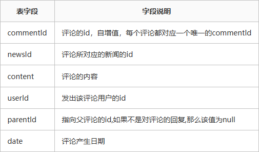

**评价表：**

```sql
create table if not exists comments
(
    commentId bigint auto_increment primary key,
    newsId    bigint not null,
    parentId  bigint,
    content   text   not null,
    userId    bigint not null,
    date      timestamp default current_timestamp(),
    foreign key (parentID) references comments (commentId),  # parentID 指向父评论
    foreign key (userID) references users (userId),		# userID 指向users表 
    foreign key (newsID) references news (newsId)		# newsID 指向news表
) charset = utf8mb4;
```

**查询语句：**

```sql
#从 comments 和 users 表中通过 newsId 查找信息
SELECT a.commentId,a.newsId,a.parentId,a.newsId,a.content,a.date
        FROM comments AS a, users AS b WHERE a.newsId=#{newsId} AND a.userId=b.userId
```

