### Redis 应用场景

​ Redis (Remote Dictionary Server )，即远程字典服务，是一个开源的使用 ANSIC 语言编写、支持网络、可基于内存亦可持久化的日志型、Key-Value 数据库并提供多种语言的 API。

> 应用场景

- ==缓存热点数据==：将热点数据放到内存中，设置内存的最大使用量以及淘汰策略来保证缓存的命中率。
- ==限时业务==的运行使用：使用 `expire` 设置键的过期时间。利用这一特性可以运用在==手机验证码、限时优惠活动信息==等业务场景。
- ==计数器==：Redis 由于`incrby`命令可以实现原子性的递增，所以可以运用于高并发的秒杀活动，分布式序列号的生成。
- ==分布式锁==：在分布式场景下，无法使用单机环境下的锁来对多个节点上的进程进行同步。可以借助 Redis 的 `setnx` 命令，来保证不同节点的线程同步执行。
- ==查找表、会话缓存==：例如 DNS 记录就很适合使用 Redis 进行存储。查找表和缓存类似，也是利用了 Redis 快速的查找特性。但是查找表的内容不能失效，而缓存的内容可以失效，因为缓存不作为可靠的数据来源。
- 消息队列（list）、共同推荐好友（放在 set 中，取交集）、排行榜（zset）、聊天室（发布订阅）。

---

### Redis 为什么这么快 ⭐

- 完全==基于内存==，绝大多数的请求都是纯内存操作。
- 采用了==单线程==（因为 Redis 的性能瓶颈不在于 CPU，而是内存和网络带宽），从而避免了不必要的上下文切换和竞争条件。不用去考虑各种锁的问题，不存在加锁释放锁操作，没有因为可能出现死锁而导致的性能消耗。(**Redis 的网络 IO 和键值对读写是由一个线程来完成的**，这也是 Redis 对外提供键值存储服务的主要流程。**但 Redis 的其他功能比如持久化、异步删除、集群数据同步等是由额外线程执行的**)
- ==数据结构优化很好==，包括结构本身以及操作的时间空间复杂度。数据结构简单，对数据操作也简单，Redis 中的数据结构是专门进行设计的。
- 采用非阻塞-I/O 多路复用机制，提高了网络 IO 的并发性(再说一下 IO，Redis 使用的是非阻塞 IO，IO 多路复用，使用了单线程来[轮询](https://so.csdn.net/so/search?q=轮询&spm=1001.2101.3001.7020)描述符，将数据库的开、关、读、写都转换成了事件，减少了线程切换时上下文的切换和竞争)。在 Redis 只运行单线程的情况下，**该机制允许内核中，同时存在多个监听套接字和已连接套接字**，内核会一直监听这些套接字上的连接请求和数据请求，一旦有请求到达，在交给 Redis 线程处理，从而实现一个 Redis 线程处理多个 IO 流的效果。
- 使用底层模型不同，其底层实现方式，以及与客户端通信的应用协议不一样，Redis 直接自己构建了 VM 机制 ，普通情况下的系统调用，会浪费一定的时间去移动和请求。

---

### 为什么要用 Redis

#### 为什么要用 Redis/为什么要用缓存

1. **提一下现在 web 应用的现状**

   二八定律：80%的业务集中在 20%的数据上

   在日常的 Web 应用对数据库的访问中，**读操作的次数远超写操作**，所以需要读的可能性是比写的可能大得多的。当我们使用 SQL 语句去数据库进行读写操作时，数据库就会 **去磁盘把对应的数据索引取回来**，这是一个相对较慢的过程。

2. **使用 Redis 缓存带来的优势**

   主要从“高性能''和”高并发“两点来看这个事情

   **高性能**

   1. 假如用户第一次访问数据库中的某些数据，这个过程会比较慢，因为是从硬盘上读取的
   2. 将该用户要访问的数据存在缓存中，这样下一次再访问这些数据的时候就可以直接从缓存中获取了。操作缓存就是直接操作内存，所以速度比较快
   3. 如果数据库中的对应数据改变之后，同步改变缓存中相应的数据即可

   **高并发**

   直接操作缓存能够承受的请求是远远大于直接访问数据库的，所以我们可以考虑把数据库中的部分数据转移到缓存中去，这样用户的一部分请求就会到缓存这里而不用经过数据库。

3. **也要提一下使用缓存的考虑**

   但是使用内存进行数据存储开销也是比较大的，**限于成本** 的原因，一般我们只是使用 Redis 存储一些 **常用和主要的数据**，比如用户登录的信息等。

   一般而言在使用 Redis 进行存储的时候，我们需要从以下几个方面来考虑：

   - **业务数据常用吗？命中率如何？** 如果命中率很低，就没有必要写入缓存；
   - **该业务数据是读操作多，还是写操作多？** 如果写操作多，频繁需要写入数据库，也没有必要使用缓存；
   - **业务数据大小如何？** 如果要存储几百兆字节的文件，会给缓存带来很大的压力，这样也没有必要；

   在考虑了这些问题之后，如果觉得有必要使用缓存，那么就使用它！

---

#### 说说有哪些本地缓存解决方案

**1. JDK 自带的 `HashMap` 和 `ConcurrentHashMap`了。**

`ConcurrentHashMap` 可以看作是线程安全版本的 `HashMap` ，两者都是存放 key/value 形式的键值对。但是，大部分场景来说不会使用这两者当做缓存，因为只提供了缓存的功能，并没有提供其他诸如过期时间之类的功能。

一个稍微完善一点的缓存框架至少要提供：**过期时间、淘汰机制、命中率统计**这三点。

**2. `Ehcache` 、 `Guava Cache` 、`Spring Cache`这三者是使用的比较多的本地缓存框架。**

`Ehcache` 的话相比于其他两者更加重量。不过，相比于 `Guava Cache` 、`Spring Cache`来说， `Ehcache` 支持可以嵌入到 hibernate 和 mybatis 作为多级缓存，并且可以将缓存的数据持久化到本地磁盘中、同时也提供了集群方案（比较鸡肋，可忽略）。

`Guava Cache` 和`Spring Cache`两者的话比较像。

`Guava` 相比于 `Spring Cache` 的话使用的更多一点，它提供了 API 非常方便我们使用，同时也提供了设置缓存有效时间等功能。它的内部实现也比较干净，很多地方都和`ConcurrentHashMap`的思想有异曲同工之妙。

使用 `Spring Cache` 的注解实现缓存的话，代码会看着很干净和优雅，但是很容易出现问题比如缓存穿透、内存溢出。

**3.`Caffeine`**

相比于 `Guava`来说 `Caffeine` 在各个方面比如性能要更加优秀，一般建议使用其来替代 `Guava`。并且， `Guava` 和 `Caffeine` 的使用方式很像！

==本地缓存固然好，但是缺陷也很明显，比如多个相同服务之间的本地缓存的数据无法共享。==

---

#### Redis 和 Guava Cache 的缓存是深拷贝还是浅拷贝

1. **Redis 缓存是深拷贝**

   从 Redis 中获取缓存时，系统中的数据对象是 Redis 缓存的副本。
   对该对象的任何操作都不会影响 Redis 中的缓存，后续再次获取还是修改之前的数据。除非执行 Redis 的更新操作。

2. **Guava 本地缓存直接获取则是浅拷贝**

   以获取一个 MAP 为例：如果直接从缓存中取，则是浅拷贝。
   对缓存数据的任何操作都会同时修改缓存中的数据，下次从缓存中获取则是修改之后的数据。

---

#### 为什么不用本地缓存？

​ 缓存分为本地缓存和分布式缓存，自带的 map 或 guava 实现的是本地缓存，最主要的特点是轻量以及快速，生命周期随着 jvm 的销毁而结束，而且在多实例的情况下，每个实例都保存了一份缓存，缓存不具有一致性，即有以下两点局限性：

1. **本地缓存对分布式架构支持不友好**，比如同一个相同的服务部署在多台机器上的时候，各个服务之间的缓存是无法共享的，因为本地缓存只在当前机器上有。
2. 容量跟随服务器限制明显。

---

#### Redis 和 Memcached 比较

**共同点** ：

1. 都是基于**内存**的缓存。
2. 都有**过期策略**。
3. 两者的**性能**都非常高。

**区别** ：

1. **Redis 支持更丰富的数据类型（支持更复杂的应用场景）**。Redis 不仅仅支持简单的 k/v 类型的数据，同时还提供 list，set，zset，hash 等数据结构的存储。Memcached 只支持最简单的 k/v 数据类型。

2. **Redis 支持数据的持久化，可以将内存中的数据保持在磁盘中，重启的时候可以再次加载进行使用，而 Memecache 把数据全部存在内存之中。**

3. **Redis 在服务器内存使用完之后，可以将不用的数据放到磁盘上。但是，Memcached 在服务器内存使用完之后，就会直接报异常。**

4. **Memcached 没有原生的集群模式，需要依靠客户端来实现往集群中分片写入数据；但是 Redis 目前是原生支持 cluster 模式的.**

5. **Memcached 是多线程，非阻塞 IO 复用的网络模型；Redis 使用单线程的多路 IO 复用模型。** （Redis 6.0 引入了多线程 IO ）

6. **Redis 支持发布订阅模型、Lua 脚本、事务等功能，而 Memcached 不支持。并且，Redis 支持更多的编程语言。**

7. value 大小：Redis 可以达到 1GB，而 memcache 只有 1MB

---

### 多路 IO 复用/Redis 线程模型

​ Redis 内部使用**文件事件处理器** `file event handler`。这个文件事件处理器是单线程的，所以 Redis 才叫做单线程的模型。它采用 IO 多路复用机制同时监听多个 socket，根据 socket 上的事件来选择对应的事件处理器进行处理。事件分派器每次从事件队列中取出一个事件，把该事件交给对应的事件处理器进行处理。

文件事件处理器的结构包含 4 个部分：

- 多个 socket 套接字
- IO 多路复用程序
- 文件事件分派器
- 事件处理器（连接应答处理器、命令请求处理器、命令回复处理器）

#### epoll

1/29

socket 一般不支持重复读取，当有数据被读之后，接受缓冲区就会将其移出。

socket 利用 ip 地址和端口号，使用 tcp/udp 协议进行通信，在通信两端分别有文件描述符来描述接收和发送缓冲区管道，fifo 利用文件描述符。管道主要应用于本地进程间通信，而套接字多应用于网络进程间数据的传递

socket 有一个文件描述符，两个缓冲区。管道有两个文件描述符，分别对应一个缓冲区的读端和写端。

1/29

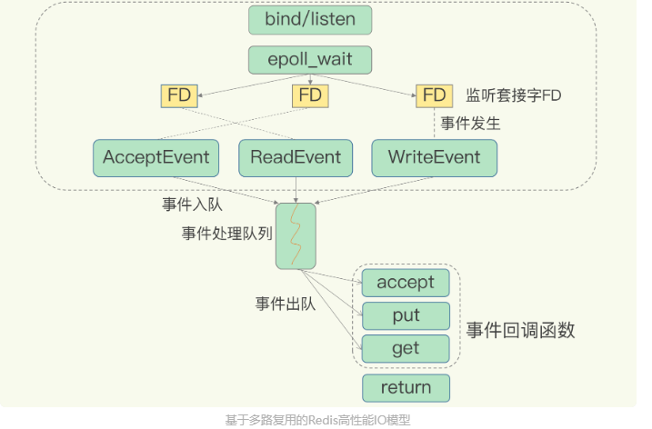

​ epoll 通过两个方面，很好解决了 select/poll 的问题

1. epoll 在内核里使用**红黑树来跟踪进程所有待检测的文件描述字**，把需要监控的 Socket 通过 epoll_ctl()函数加入内核中的红黑树里，红黑树是个高效的数据结构，增删查的时间复杂度为 O(logn)，通过对这颗红黑树进行操作，就不需要像 select/poll 每次操作时都传入整个 Socket 集，只需传入一个待检测的 socket，减少了内核和用户空间大量的数据拷贝和内存分配。
2. epoll 使用事件驱动的机制，**内核里维护了一个链表来记录就绪事件，当某个 socket 有事件发生时，通过回调函数内核会将其加入到这个就绪事件列表中**，当用户调用 epoll_wait() 函数时，只会返回有事件发⽣的⽂件描述符的个数，不需要像 select/poll 那样轮询扫描整个 socket 集合，⼤⼤提⾼了检测的效率。

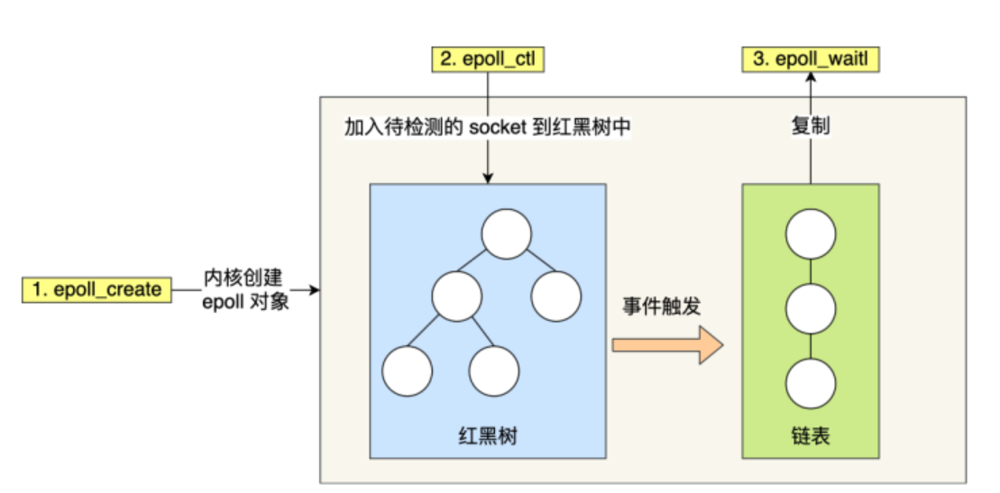

##### 边缘触发和水平触发

- 使⽤边缘触发(epoll 特有)模式时，当被监控的 Socket 描述符上有可读事件发⽣时， 服务器端只会从 epoll_wait 中苏醒⼀次，即使进程没有调⽤ read 函数从内核读取数据，也依然只苏醒⼀次，因此我们程序要保证⼀次性将内核缓冲区的数据读取完； 搭配非阻塞 IO 使用。效率高，因为减少 epoll_wait 的系统调用次数，系统调用是有一定开销的(毕竟有上下文的切换)

  ET 是高速工作方式，只支持 no-block socket。

- 使⽤⽔平触发模式时，当被监控的 Socket 上有可读事件发⽣时， 服务器端不断地从 epoll_wait 中苏醒，直到内核缓冲区数据被 read 函数读完才结束，⽬的是告诉我们有数据需要读取；

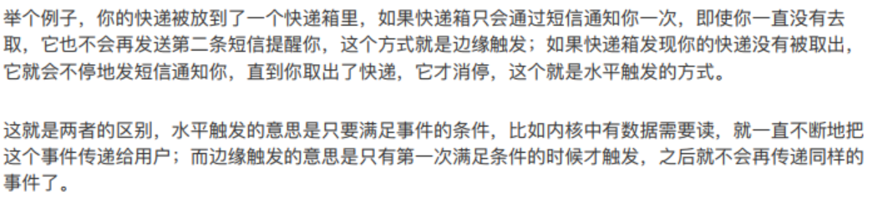

---

### Redis 键值对结构组织(全局哈希表)

​ 为了实现键到值的快速访问，Redis 使用了与一个哈希表(全局哈希表)来保存所有键值对。哈希桶中的键值对元素保存了 key 和 value 指针，分别指向了实际的键和值，这样一来，即使是一个集合，也可以通过 value 指针被查找到。

​ 哈希表的最大好处，就是让我们可以用 O（1）的时间复杂度来快速查找到键值对--我们可以通过计算键的哈希值，就可以知道它所对应的哈希桶的位置，就可以访问响应的 entry 元素。

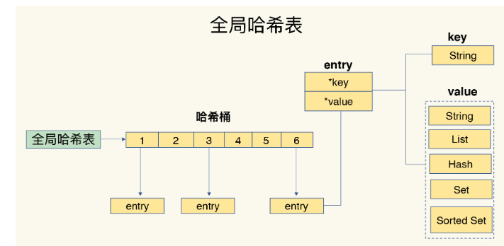

#### 哈希 hash 冲突(渐进式 rehash)

​ 使用两个全局哈希表，哈希表 1 和哈希表 2，一开始插入数据时，默认使用哈希表 1，此时哈希表 2 没有被分配空间，随着数据逐步增多：

1. 给哈希表 2 分配更大的空间，例如是当前哈希表 1 大小的两倍；
2. 把哈希表 1 的数据重新映射到哈希表 2 中(**不是一下子全复制**)，此时 Redis 仍然正常处理客户端请求，每处理一个请求时，**从哈希表 1 中的第一个索引位置开始，顺带将这个索引位置上的所有键值对拷贝到哈希表 2 中，等处理下一个请求时，再顺带拷贝哈希表 1 中下一个索引位置的键值对。**
3. 直到拷贝完毕，释放哈希表 1 空间

​ 这样**巧妙地把一次性大量的拷贝开销，分摊到了多次处理请求的过程中，避免了耗时操作，保证了数据的快速访问。**

### Redis5 种基本数据类型(数据结构)

Redis 主要有 5 种基本数据类型，包括 String，List，Set，Zset，Hash。

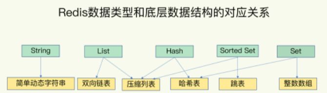

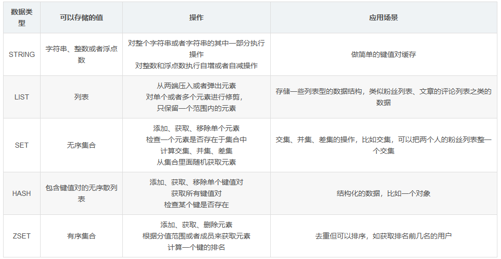

#### String

String 有三种不同的编码方式：

- **基本编码方式是 RAW**，是基于 SDS 实现，他会申请两次内存空间，**第一次是申请 redisobject**，**第二次是申请 SDS 的内存空间**
- **存储的 SDS 长度小于 44 字节，会采用 EMBSTR**编码，此时对象头(RedisObject)与 SDS 是一段**连续空间**，申请内存时**只需要调用一次内存分配函数**，效率更高。
- 如果**存储的字符串时整数**，并且大小在 Long_MAX 范围内，采用**INT 编码**：直接将数据保存在 RedisObject 的 ptr 指针位置(刚好 8 字节)，不再需要 SDS 了。

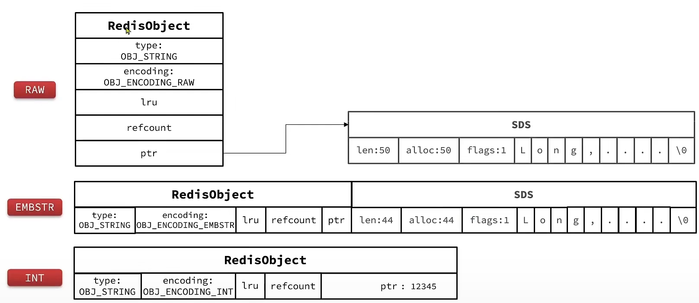

#### List


​ 3.2 版本以前当元素数量小于 512 并且元素大小小于 64 字节时采用 ZipList 编码，超过则采用 LinkedList 编码。

​ **3.2 版本以后 List 采用的是 QuickList 也就是双向链表(LinkedList)+压缩链表(ZipList)结合来实现 List**。

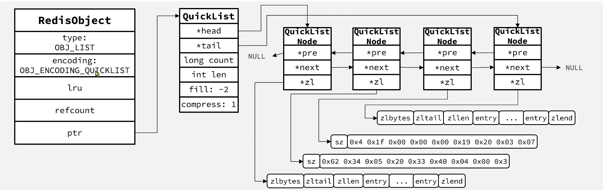

---

#### Set

​ Set 是 Redis 中的集合，不一定确保元素有序，可以满足元素唯一、查询效率要求极高。

- 为了查询效率和唯一性，**set 采用 Dict 实现**。Dict 的 key 用来存储元素，value 统一为 null
- **当存储的所有数据都是整数**，并且元素数量不超过 set-max-IntSet-entries 时，**Set 会采用 Intset 实现**，以节省内存(基于数组实现，内存空间连续节省内存)。

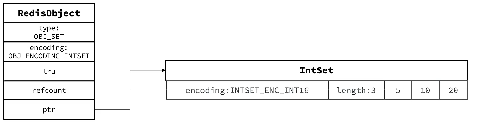

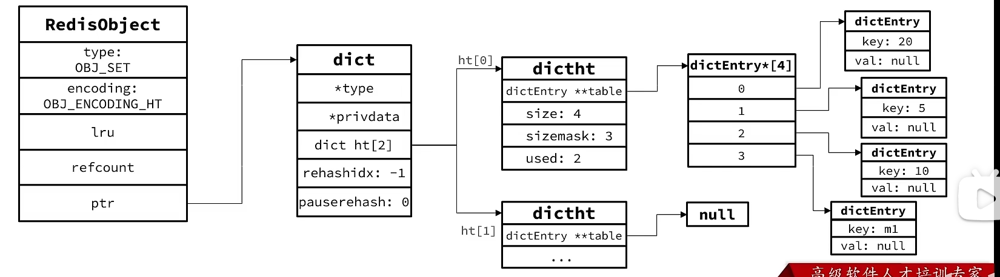

#### ZSet(Sorted Set)

​ ZSet 也就是 SortedSet，其中每一个元素都需要制定一个 score 值和 member 值：

- 可以根据 score 值排序
- member 必须唯一
- 可以根据 member 查询分数

​ Zset 底层数据结构必须满足键值存储、键必须唯一和可排序这三个需求。**使用 SkipList+hash(Dict)来实现**。

### 底层数据结构

#### hash

​ hash 的**底层主要采用字典 dict 的结构，整体呈现层层封装。**

​ dict 有四部分组成，分别是 dictType(类型，不咋重要),dictht（核心），rehashidx(渐进式 hash 的标志)，iterators（迭代器），这里面最重要的就是 dictht 和 rehashidx。

​ dictht，**其有两个数组构成**，**一个是真正的数据存储位置，还有一个用于 hash 过程，包括的变量分别是真正的数据 table 和一些常见变量。关于数据节点，每个节点都有 next 指针，方便指向下一个节点，这样目的是为了解决 hash 碰撞。**具体的可以看下图。

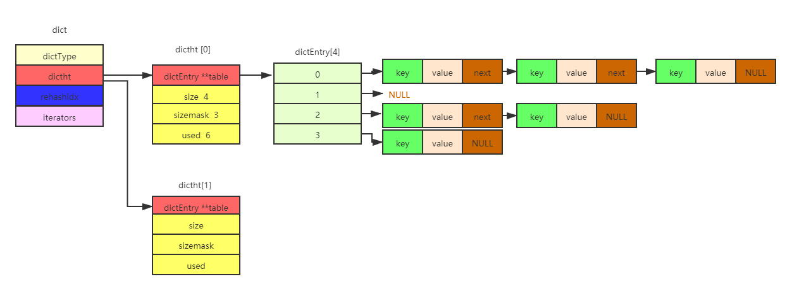

- Redis hash 是一个==string 类型的 filed 和 value 的映射表==。其添加、删除操作都是 O(1)。
- hash 适合用于**存储对象**。相较于把对象的每个字段存成单个 string 类型，将一个对象存储在 hash 类型中会**占用更少的内存**，且可以更方便的存取整个对象。
- **省内存的原因**：新建一个 hash 对象时开始是用**zipmap（又称 small hash）**来存储的。zipmap 并不是 hash table，但是相比正常的 hash 实现可以节省不少 hash 本身需要的一些元数据存储开销。zipmap 的添加、删除、查找都是 O(n)，所以如果 field 或者 value 的大小超出一定限制后，Redis 会在内部自动将 zipmap 替换成正常的 hash 实现。这个限制可以在配置文件中指定：`hash-max-zipmap-entries 64 #配置字段最多64个`、`hash-max-zipmap-value 512#配置value最大为512字节`。

#### 字典(Dict)


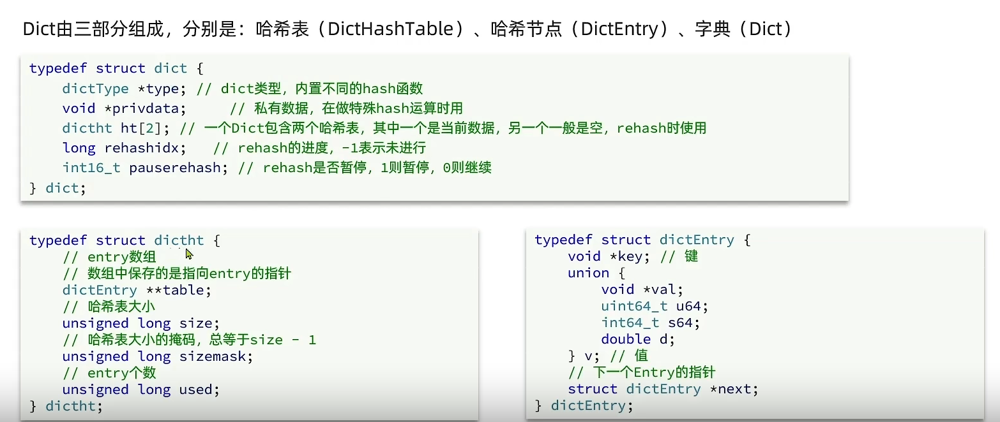

​ Dict 由三部分组成，分别是：哈希表(DictHashTable)(哈希表中有存放哈希节点的数组 dictEntry[])、哈希节点(DictEntry)、字典(Dict)。其中有两个哈希表 ht[0]用来平常存储，ht[1]用来 rehash。

​ 在 Redis 中，字典是用于保存键值对的抽象数据结构，==所有数据都保存在字典中==。除此之外，==字典还是哈希键的底层实现==。

Redis 哈希表使用==链地址法==解决哈希冲突，总是将新节点添加到链表的表头位置（==头插==）。

**渐进式 rehash**

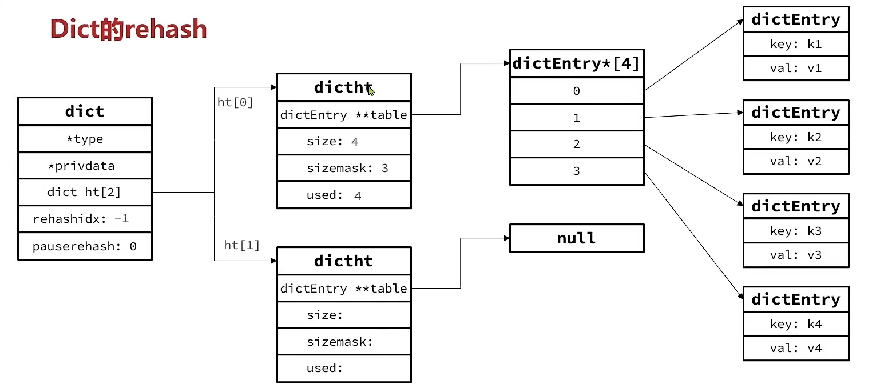

​ rehash 操作不是一次性完成，而是采用渐进方式（每次增删改查(访问)dict 时执行一次 rehash），这是为了避免一次性执行过多的 rehash 操作给服务器带来过大的负担。

​ 不管是扩容还是收缩，必定会创建新的哈希表，导致哈希表的 size 和 sizemask 变化，而 key 的查询会与 sizemask 有关，因此必须对哈希表中的每一个 key 重新计算索引，插入新的哈希表，这个过程叫**rehash**。按照新的 realsize 申请空间(扩容大小为第一个大于等于 used+1 的 2^n/收缩大小为第一个大于 used 的 2^n)，创建 dictht，并赋值给 dictht[1]，设置 dict.rehashidx = 0，标志开始 rehash

​ 渐进式 rehash 通过记录 dict 的 **rehashidx** 完成；**每次执行增删改查查操作时，都检查一下 dict.rehashidx 是否大于-1，如果是则将 dictht[0].dictEntry table[0]的(enrty)键值对链表 rehash 到 dictht[1]的键值对数组上，然后 rehashidx++，直到 dictht[0]的所有数据都 rehash 到 dictht[1]**。

​ 最后将 dictht[1]赋值给 dictht[0]，给 dictht[1]初始化为空哈希表释放原来的 dictht[0]的内存。

​ 在 rehash 期间，每次对字典执行添加、删除、查找或者更新操作时，都会执行一次渐进式 rehash，**在 rehash 过程中，新增操作，则直接写入 ht[1]**，查询、修改和删除会在 dictht[0]和 dictht[1]中一次查找并执行，**这样可以确保 dictht[0]的数据只增不减，随着 rehash 的过程最终 dictht[0]变为空**。

​ 采用渐进式 rehash **会导致字典中的数据分散在两个 dictht 上**，因此对字典的查找操作也需要到对应的 dictht 去执行。(不会存在两个 dictht 中都有的情况)

**扩缩容的条件**⭐

​ Dict 在每次新增键值对时都会检查负载因子(LoadFactor=used/size)，满足以下两种情况时会触发哈希扩容

- 哈希表的负载因子>=1，并且服务器没有执行 bgsave 或者 bgwriteof 等后台程序；
- 哈希表的负载因子>5；

​ Dict 除了扩容以外，每次删除元素时，也会对负载因子做检查，**当负载因子<0.1 时，会做哈希表收缩**。

​ 正常情况下，当 hash 表中 <span style = "color:red">**元素的个数等于第一维数组的长度时**</span>，就会开始扩容，扩容的新数组是 <span style = "color:red">**原数组大小的 2 倍**</span>。不过如果 Redis 正在做 `bgsave(持久化命令)`，为了减少内存也得过多分离，Redis 尽量不去扩容，但是如果 hash 表非常满了，<span style = "color:red">**达到了第一维数组长度的 5 倍了**</span>，这个时候就会 <span style = "color:red">**强制扩容**</span>。

​ 当 hash 表因为元素逐渐被删除变得越来越稀疏时，Redis 会对 hash 表进行缩容来减少 hash 表的第一维数组空间占用。所用的条件是 <span style = "color:red">**元素个数低于数组长度的 10%**</span>，缩容不会考虑 Redis 是否在做 `bgsave`。

#### SDS(动态字符串)

​ Redis 是 C 语言写的，但对于 Redis 的字符串，却不是 C 语言中的字符串（即以 '\0' 结尾的字符串）。凡是在 Redis 中需要一个可变的字符串值时，就会使用 SDS 来表示字符串值。SDS 的定义：

```c
struct sdshdr {
    int len; //记录duf数组中已使用字节的数量，等于sds所保存字符串的长度
    int free; //记录buf数组中未使用字节的数量
    char buf[]; //字节数组，用于保存字符串
}
```

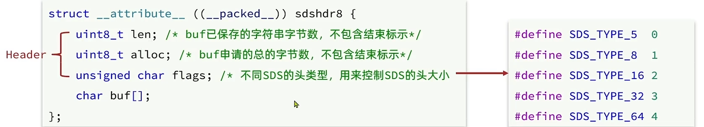

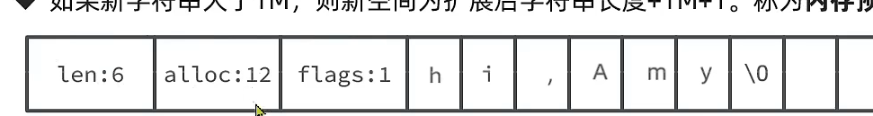

**与 c 语言字符串的差别**：

| C 语言字符串                                                   | SDS                                 | 解释                                           |
| -------------------------------------------------------------- | ----------------------------------- | ---------------------------------------------- |
| 获取长度的时间复杂度为 O(n)                                    | ==获取长度的时间复杂度为 O(1)==     | SDS 中 len 属性保存了字符串的长度              |
| 修改字符串 n 次**必定**执行 n 次内存分配                       | 修改字符串**最多**执行 n 次内存分配 | SDS 会分配额外的空间，额外空间大小由 free 记录 |
| 只能保存文本数据，非二进制安全，例如无法保存数组的结束字符‘\0’ | 可以保存文本数据或者二进制数据      | SDS 使用 buf 来保存一系列二进制数据            |
| 可以使用<string.h>库中所有的函数                               | 可以使用<string.h>中部分函数        | SDS 中的 buf 相当于字符串                      |

​ **动态字符串的优点：**

- 获取字符串长度的时间复杂度为 O(1)，因为通过结构体中的 len 便可获得字符串长度

* ==杜绝缓冲区溢出==：在 C 语言中使用 strcat 函数来进行两个字符串的拼接，一旦未分配足够长度的内存空间，就会造成缓冲区溢出。对于 SDS 数据类型，进行字符修改时，<font color='red'>首先会根据 len 属性检查内存空间是否满足需求，如果不满足，会自动将 SDS 空间扩展至修改所需大小</font>，所以不会出现缓冲区溢出。
* ==减少修改字符串长度时所需的内存重分配次数==：对于 SDS，由于 len 属性和 free 属性的存在，对于修改字符串 SDS 实现了==空间预分配和惰性空间释放==两种策略：
  1. 空间预分配： <font color='red'>优化 SDS 字符串增长操作</font>，对 SDS 进行空间扩展时，不仅会为 SDS 分配修改所必须的空间，还会分配额外未使用的空间，这样可以减少连续执行字符串增长操作所需的内存重分配次数。
  2. 惰性空间： <font color='red'>优化 SDS 字符串缩短操作</font>，对 SDS 进行缩短操作时，程序不会立即回收缩短后多余的字节，而是使用 free 属性将这些字节的数量记录下来，等待将来使用，避免了缩短字符串时所需的内存重分配次数。
* ==二进制安全==：C 语言字符串以空字符（'\0'）作为字符串结束的标识，只要读到空字符就表明字符串结束。而对于一些二进制文件（如：图片、视频等），内容可能包括空字符串，因此 C 字符串无法正确存取。所有 SDS 的 API 都是以处理二进制方式来处理 buf 里面的元素，并且 SDS 不是以空字符串来判断是否结束，而是以 len 属性表示的长度来判断字符串是否结束。

#### IntSet(基于整数数组实现)

​ Inset 是 Redis 中 set 集合的一种实现方式，基于整数数组来实现，并且具备长度可变、有序等特征

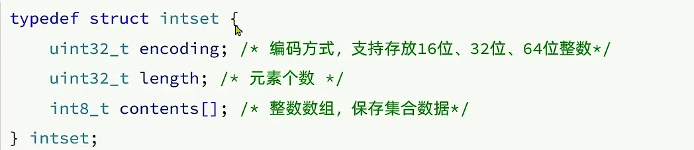

**IntSet 升级(扩容)**

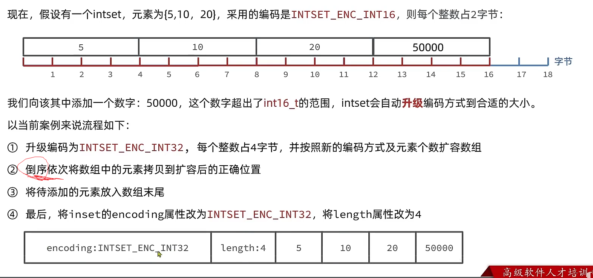

​ InSet 推荐在数据量不多的时候使用。

#### 链表

==Redis3.2 以后已经不再使用==

链表是 list（列表）的底层实现，Redis 链表实现是双端、无环链表。

| Redis 链表特性   | 说明                                                                |
| ---------------- | ------------------------------------------------------------------- |
| 双端             | 链表具有前置节点和后置节点的引用，获取这两个节点时间复杂度都为 O(1) |
| 无环             | 表头节点的 prev 指针和表尾节点的 next 指针都指向 NULL               |
| 带链表长度计数器 | 通过 len 属性获取链表长度的时间复杂度为 O(1)                        |
| 多态             | 链表节点使用 void\* 指针来保存节点值，可以保存各种不同类型的值      |

---

#### ZipList 压缩列表(ZipList)(内存空间连续)

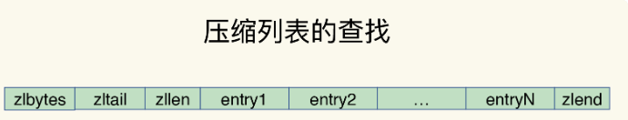

​ **entry 的结构**：


​ **previous_entry_lenth**用于记录前一个 entry 的长度，当前一节点的**长度小于 254 字节，则采用 1 个字节保存这个长度值**，**如果前一节点的长度大于等于 254 字节，则采用 5 个字节来保存这个长度值**，第一个字节是 0xfe，后面四个字节才是前一个节点的真实长度数据。

​ 压缩列表实际上类似于一个数组，数组的每一个元素对应保存一个数据。**和数组不同的是，压缩列表在表头有三个字段 zlbytes、zltail 和 zllen，分别表示列表长度、列表尾的偏移量和列表中的 entry 个数；压缩列表在表尾还有 zlend**，表示列表结束。**列表的节点之间不是通过指针连接，而是记录上一届点和本节点的长度来寻址(内存空间连续)，内存占用较低**。

​ 在压缩列表中，如果我们要查找定位第一个和最后一个元素，可以通过表头的三个字段的长度直接定位，时间复杂度是 O(1)。而查找其他元素时，就没有那么高效了，只能逐个查找，此时的时间复杂度就是 O(n)了。当数据量大时，效率下降，因此存储上限低。

##### **ZipList 的连锁更新问题**

​ 当有 N 个连续的长度为 250-253 字节之间的 entry(之后的假设用的 250 个字节)，因此 entry 的 previous_entry_length 属性是用一个字节，但如果此时突然在队首添加一个 254 字节的 entry，此时原队首的 previous_entry_length(原本是 1 个字节，现在由于前一个 entry 是 254 字节)变为 5 个字节，那么第二个 entry(原队首也就是第一个 entry)也变成了 254 个字节，这又会导致后面一系列的更新，这种连续多次空间扩展操作称之为**连锁更新**。

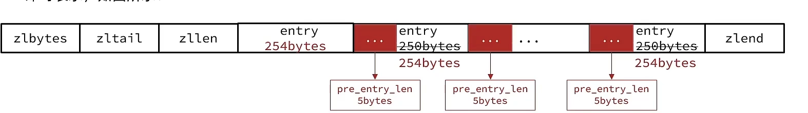

#### QuickList

​ QuickList 是一个双端链表，只不过**链表中的每个节点都是一个 ZipList**。(通过创建多个 ZipList 来分片存储数据，以防存储大量数据时超出 ZipList 最佳的上限)


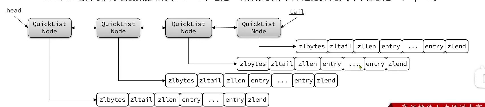

---

#### 跳表(SkipList)

​ 跳跃表是有序集合的底层实现，通过在每个节点中维持多个指向其它节点的指针，从而达到快速访问节点的目的。 跳跃表支持平均 O(logN)、最坏 O(N) 复杂度的节点查找。==跳表在 Redis 中用在了两个地方，一是实现有序集合键，二是集群节点中用作内部数据结构==。

**结构**：

- 跳表是一个双向链表，每个节点都包含**score(用于排序)和 element 值**
- 节点按照 score 值排序，如果 score 值一样按照 element 字典排序
- 每个节点都可以包含多层指针，层数是 1-32 之间的随机数
- 不同层指针到下一个节点的跨度不同，层级越高，跨度越大
- 增删改查效率与红黑树基本一致，实现却更简单

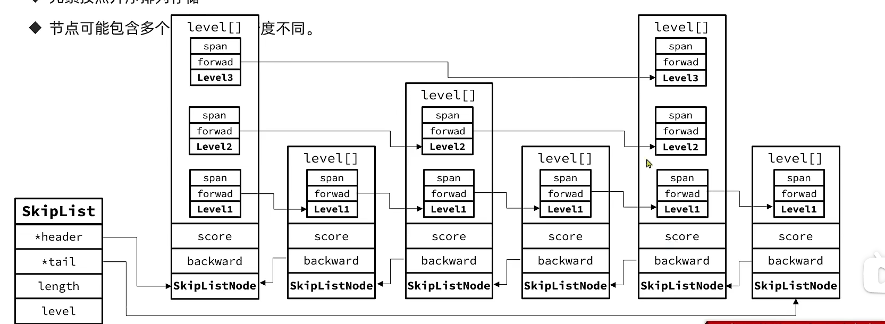

**zskiplist** **结构构成：**

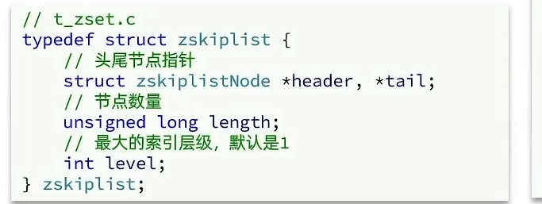

1. header：指向跳跃表的头节点，通过它定位到表头节点的时间复杂度为 O(1)。

2. tail：指向跳跃表的表尾节点，通过它定位到表尾节点的时间复杂度为 O(1)。

3. level：记录目前跳跃表内，层数最大的那个节点的层数。

4. length：记录跳跃表的长度，也即是跳跃表目前包含节点的数量。

**跳跃表节点（zskiplistNode）构成**

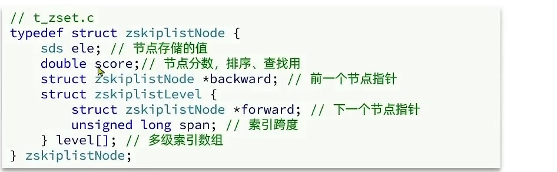

1. 层：每个层都带有两个属性，前进指针和跨度

   - 前进指针：指向表尾方向，用于从表头向表尾方向访问节点，==查询数据只使用前进指针就可以了==
   - 跨度：用于记录两个节点间的距离，用来计算节点的排位

2. 后退指针（BW）：指向当前节点的前一个节点，==用于表尾向表头遍历，但查询数据时不会用到后退指针==

3. 分值：节点保存的分值，按从小到大排列，分值相同的节点按照成员对象在字典序中的大小来进行排序

4. 成员对象：在同一个跳跃表中，各个节点保存的成员对象必须是唯一的，但是多个节点保存的分值却可以是相同的。分值相同的节点将按照成员对象在字典序中的大小来进行排序，成员对象较小的节点会排在前面（靠近表头方向），而成员对象较大的节点则会排在后面（靠近表尾的方向）。

> 为什么使用跳表？

首先，因为 zset 要支持随机的插入和删除，所以它 **不宜使用数组来实现**，关于排序问题，我们也很容易就想到 **红黑树/ 平衡树** 这样的树形结构，为什么 Redis 不使用这样一些结构呢？

1. **性能考虑：**插入速度非常快速，相比不需要进行旋转等操作来维护平衡性；
2. **实现考虑：**在复杂度与红黑树相同（O(logN)）的情况下，跳跃表实现起来更简单，看起来也更加直观；
3. 跳表在**范围查询**的时候的效率是高于红黑树的，因为跳表是从上层往下层查找的，上层的区域范围更广，可以快速定位到查询的范围。

#### RedisObject

​ **redis 对象的对象头占 16 字节**(不包含指向的内存空间，也就是真正的对象存储的空间)

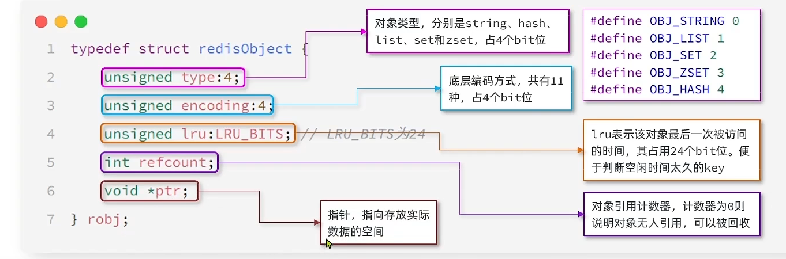

---

### Redis 过期键的删除策略

我们 set key 的时候，都可以给一个 expire time，通过过期时间我们可以指定这个 key 可以存活的时间。过期策略通常有以下两种：

- **惰性过期**：**只有当访问一个 key 时，才会判断该 key 是否已过期，过期则清除**。该策略可以最大化地节省 CPU 资源，却对内存非常不友好。**极端情况可能出现大量的过期 key 没有再次被访问，从而不会被清除，占用大量内存**。

- **定期过期**：redis 会将每个设置了过期时间的 key 放入到一个独立的字典中，以后会定期遍历这个字典来删除到期的 key，Redis 默认会每秒进行十次过期扫描（100ms 一次），过期扫描不会遍历过期字典中所有的 key，而是采用了一种简单的贪心策略

  - 1.从过期字典中随机 20 个 key；

    2.删除这 20 个 key 中已经过期的 key；

    3.如果过期的 key 比率超过 1/4，那就重复步骤 1；

  每隔一定的时间，会扫描一定数量的数据库的 expires 字典中一定数量的 key，并清除其中已过期的 key。该策略是前两者的一个折中方案。通过调整定时扫描的时间间隔和每次扫描的限定耗时，可以在不同情况下使得 CPU 和内存资源达到最优的平衡效果。

- **定时过期**：每个设置过期时间的 key 都需要创建一个定时器，到过期时间就会立即清除。该策略可以立即清除过期的数据，对内存很友好；但是会占用大量的 CPU 资源去处理过期的数据，从而影响缓存的响应时间和吞吐量。(没问不说)

Redis 中同时使用了==惰性过期和定期过期==两种过期策略。

#### Redis 内存淘汰机制

LRU(Least Recently Used)最近最少使用算法

LFU(Least Frequently Used)最不经常使用

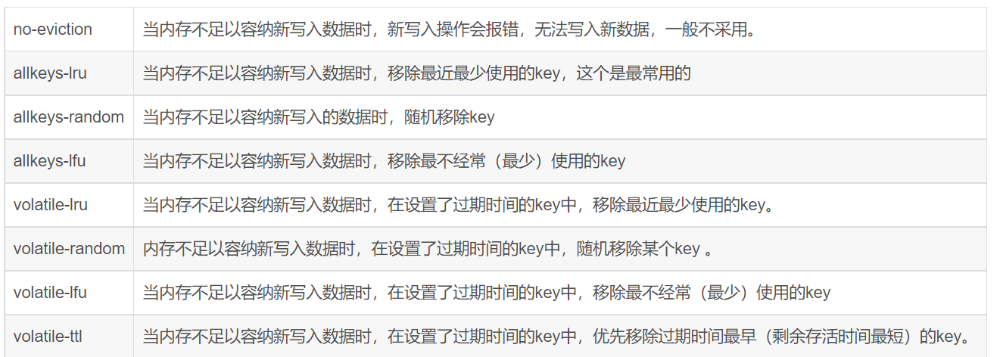

---

### 内存相关

#### 怎么保证 redis 中的数据都是热点数据？

​ 当 redis 内存数据集大小上升到一定大小后，就会施行==内存淘汰策略==。

---

#### redis 的内存淘汰策略有哪些？

- **全局的键空间选择性移除**：

  1. noeviction：当内存不足以容纳新写入数据时，新写入操作会报错。
  2. allkeys-lru：当内存不足以容纳新写入数据时，在键空间中，移除最近最少使用的 key。（这个是**最常用**的）
  3. allkeys-random：当内存不足以容纳新写入数据时，在键空间中，随机移除某个 key。

- **设置过期时间的键空间选择性移除**： 4. volatile-lru：当内存不足以容纳新写入数据时，在设置了过期时间的键空间中，移除最近最少使用的 key。 5. volatile-random：当内存不足以容纳新写入数据时，在设置了过期时间的键空间中，随机移除某个 key。 6. volatile-ttl：当内存不足以容纳新写入数据时，在设置了过期时间的键空间中，有更早过期时间的 key 优先移除。

Redis 的**内存淘汰策略的选取并不会影响过期的 key 的处理**。内存淘汰策略用于处理内存不足时的需要申请额外空间的数据；过期策略用于处理过期的缓存数据。

---

#### Redis 如何做内存优化

1. **控制 key 的数量**：当使用 Redis 存储大量数据时，通常会存在大量键，过多的键同样会消耗大量内存。Redis 本质是一个数据结构服务器，它为我们提供多种数据结构，如 hash，list，set，zset 等结构。使用 Redis 时不要进入一个误区，大量使用 get/set 这样的 API，把 Redis 当成 Memcached 使用。对于存储相同的数据内容，利用 Redis 的数据结构降低外层键的数量，也可以节省大量内存。
2. **缩减键值对象**，降低 Redis 内存使用最直接的方式就是缩减键（key）和值（value）的长度。

   - key 长度：如在设计键时，在完整描述业务情况下，键值越短越好。
   - value 长度：值对象缩减比较复杂，常见需求是把业务对象序列化成二进制数组放入 Redis。首先应该在业务上精简业务对象，去掉不必要的属性避免存储无效数据。其次在序列化工具选择上，应该选择更高效的序列化工具来降低字节数组大小。

3. **编码优化**。Redis 对外提供了 string,list,hash,set,zet 等类型，但是 Redis 内部针对不同类型存在编码的概念，所谓编码就是具体使用哪种底层数据结构来实现。编码不同将直接影响数据的内存占用和读写效率。

---

#### Redis 怎么扩容

- 如果 Redis 被当做==缓存==使用，使用==一致性哈希==实现动态扩容。
- 如果 Redis 被当做一个==持久化存储==使用，必须使用固定的 keys-to-nodes 映射关系，结点的数量一旦确定不能变化。否则的话(即 Redis 节点需要动态变化的情况），必须使用可以在运行时进行数据再平衡的一套系统，而当前只有 Redis==集群==可以做到这样。

---

### 缓存异常

#### 缓存预热

​ 缓存预热是指系统上线后，提前将相关的缓存数据加载到缓存系统。避免在用户请求的时候，先查询数据库，然后再将数据缓存，用户直接查询事先被预热的缓存数据。如果不进行预热，那么 Redis 初始状态数据为空，系统上线初期，对于高并发的流量，都会访问到数据库中， 对数据库造成流量的压力。

​ ==比如秒杀活动开始前半小时，进行缓存预热，将一些商品信息先加载到缓存中，避免活动开始的一瞬间数据压力暴增。==

> 实现方案

- 数据量不大的时候，==工程启动==的时候进行加载缓存动作。
- 数据量大的时候，设置一个==定时任务脚本==，进行缓存的刷新。
- 数据量非常大的时候，优先==保证热点数据可以提前加载==到缓存。

---

#### 缓存穿透

​ 缓存穿透是指==查询一个不存在的数据==，由于缓存不命中时，将导致这个不存在的数据每次请求都要到数据库去查询，而且由于数据库中也没有该数据，所以不能刷新到缓存，导致每次查询都是相同的结果，可能造成数据库短期内承受大量请求而崩掉。

> 解决办法

- **接口层增加校验**，如在用户登陆的时候，可以增加一个用户鉴权校验，id<=0 的直接拦截。

- **缓存空对象**：如果一个查询返回的数据为空（不管是数据不存在， 还是系统故障），我们仍然把这个空结果进行缓存（将 key-value 对写为 key-null），但它的过期时间会很短，比如设置为 30s。这样可以防止攻击用户反复用同一个 id 暴力攻击。

  ​ 龙虾三少：尽量不要使用 null 做防止击穿的手段，因为如果用 null 代码判断不出来是真的不存在还是就是存了 null，必须要用一次 keyexist 影响性能 ，一般都是放一个==表示默认不存在的 object==，比如缓存是放 user 信息的，没有这个 user 就可以放一个 user 对象，但对应的 id 是 0 或者-1 这种 ，在应用层做好判断

- **布隆过滤器**：将所有可能存在的数据哈希到一个足够大的 bitmap 中，一个一定不存在的数据会被这个 bitmap 拦截掉，从而避免了对底层存储系统的查询压力。

---

#### 缓存雪崩

​ 缓存雪崩是指==缓存同一时间大面积的失效==（比如宕机等），导致后面的请求都会落到数据库上，造成数据库短时间内承受大量请求而崩掉。

**原因**：缓存数据设置的过期时间是相同的，而 Redis 恰好将这部分数据全部删除。或者宕机 ---> 高可用。

> 解决办法

- **加锁排队**：一般并发量不是特别多的时候，使用最多的解决方案是加锁排队。在缓存失效后，通过加锁或者队列来控制读数据库写缓存的线程数量。比如对某个 key 只允许一个线程查询数据和写缓存，其他线程等待。

- 缓存数据的==过期时间设置随机==，防止同一时间大量数据过期现象发生。并==设置热点数据永不过期==，有更新操作就更新缓存就好了。

  ```java
  redisTemplate.opsForValue().set(key,value);
  redisTemplate.expire(key,Math.random()*100, TimeUnit.MINUTES);
  ```

- 可以==把缓存层设计成高可用==的，即使个别节点、个别机器、甚至是机房宕掉，依然可以提供服务。利用 sentinel 或 cluster 实现。

- 采用==多级缓存==，比如本地进程作为一级缓存，redis 作为二级缓存，不同级别的缓存设置的超时时间不同，即使某级缓存过期了，也有其他级别缓存兜底。

另外对于 **"Redis 挂掉了，请求全部走数据库"** 这样的情况，我们还可以有如下的思路：

- **事发前**：实现 Redis 的**高可用**(主从架构 + Sentinel 或者 Redis Cluster)，尽量避免 Redis 挂掉这种情况发生。
- **事发中**：万一 Redis 真的挂了，我们可以设置**本地缓存(**ehcache) + **限流**(hystrix)，尽量避免我们的数据库被干掉(起码能保证我们的服务还是能正常工作的)
- **事发后**：Redis **持久化**，重启后自动从磁盘上加载数据，快速恢复缓存数据。

---

#### 缓存击穿

​ 缓存击穿是指==缓存中没有但数据库中有的数据==（一般是缓存时间到期），这时由于并发用户特别多，同时读缓存没读到数据，又同时去数据库去取数据，引起数据库压力瞬间增大，造成过大压力。

​ 和缓存雪崩不同的是，缓存击穿指并发查同一条数据，缓存雪崩是不同数据都过期了，很多数据都查不到从而查数据库。所以系统存在以下问题时需要引入注意：==当前 key 是一个热点 key，并发量很大==；重建缓存不能在短时间完成，可能是一个复杂计算，例如复杂的 SQL、多次 IO、多个依赖等。

> 解决方法

- **分布式互斥锁**：如果 key 不存在，就加锁，然后查 DB 入缓存，然后解锁；其他进程如果发现有锁就进行等待，然后等解锁后返回数据或进入 DB 查询。这种方案思路比较简单，但是存在一定的隐患，如果在查询数据库和重建缓存（key 失效后进行了大量的计算）时间过长，也可能会存在死锁和线程池阻塞的风险，高并发情景下吞吐量会大大降低！但是这种方法能够较好地降低后端存储负载，并在一致性上做得比较好。

- **永不过期**：设置热点数据永远不过期。由于没有设置真正的过期时间，实际上已经不存在热点 key 产生的一系列危害，但是会存在数据不一致的情况，同时代码复杂度会增大。

---

#### 缓存降级

​ 当访问量剧增、服务出现问题（如响应时间慢或不响应）或非核心服务影响到核心流程的性能时，仍然需要保证服务还是可用的，即使是有损服务。系统可以根据一些关键数据进行自动降级，也可以配置开关实现人工降级。其最终目的是保证核心服务可用，即使是有损的。==如，双十一关闭修改收获地址的服务==。

> 解决方法

​ 由于==有些服务是无法降级的==（如加入购物车、结算）。在进行降级之前要对系统进行梳理，看看系统是不是可以丢卒保帅；从而梳理出哪些必须誓死保护，哪些可降级；比如可以参考日志级别设置预案：一般、警告、错误、严重错误等。

​ 一个比较常见的做法就是，Redis 出现问题，不去数据库查询，而是直接返回默认值给用户。

---

#### 布隆过滤器

​ 布隆过滤器本质上是由长度为 `m` 的**位向量或位列表**（仅包含 `0` 或 `1` 位值的列表）组成，最初所有的值均设置为 `0`。当我们向布隆过滤器中添加数据时，会使用多个 `hash` 函数对 `key` 进行运算，算得一个证书索引值，然后对位数组长度进行取模运算得到一个位置，每个 `hash` 函数都会算得一个不同的位置。再把位数组的这几个位置都置为 `1` 就完成了 `add` 操作。即引入了 k 个相互独立的哈希函数，保证在给定的空间、误判率下、完成元素判重的过程。

> 使用场景

- **大数据判断是否存在**：这就可以实现出上述的去重功能，如果你的服务器内存足够大的话，那么使用 HashMap 可能是一个不错的解决方案，理论上时间复杂度可以达到 O(1 的级别，但是当数据量起来之后，还是只能考虑布隆过滤器。
- **解决缓存穿透**：我们经常会把一些热点数据放在 Redis 中当作缓存，例如产品详情。 通常一个请求过来之后我们会先查询缓存，而不用直接读取数据库，这是提升性能最简单也是最普遍的做法，但是 **如果一直请求一个不存在的缓存**，那么此时一定不存在缓存，那就会有 **大量请求直接打到数据库** 上，造成 **缓存穿透**，布隆过滤器也可以用来解决此类问题。
- **爬虫/ 邮箱等系统的过滤**：平时不知道你有没有注意到有一些正常的邮件也会被放进垃圾邮件目录中，这就是使用布隆过滤器 **误判** 导致的。

**注意**

​ 布隆过滤器的`initial_size`设置的过大，会浪费存储空间，设置的过小，就会影响准确率，在使用之前一定要尽可能的精确估计元素数量，还要加上一定的冗余空间以避免实际元素可能会意外高出估计值很多。

​ 布隆过滤器的`error_rate`越小，需要的存储空间就越大，对于不需要过于精确的场合，error_rate 设置的稍大一点也可以。在某些业务场景中出现误判的情况对用户无感知的时候，误判率也可以忽略不计了。

---

### Redis 的持久化

​ **为什么需要 Redis 持久化：**Redis 对数据的操作都是基于内存的，当遇到了进程退出、服务器宕机等意外情况，如果没有持久化机制，那么 Redis 中的数据将会丢失无法恢复。有了持久化机制，**Redis 在下次重启时可以利用之前持久化的文件进行数据恢复**。Redis 支持的两种持久化机制：

- RDB：把当前数据生成快照保存在硬盘上。
- AOF：记录每次对数据的操作到硬盘上。

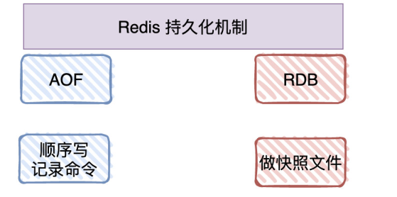

#### RDB（Redis Database）

​ 也称快照（snapshotting），按照一定的时间周期策略==把内存的数据以快照的形式保存到硬盘的二进制文件==，对应产生的数据文件为 `dump.rdb`（存放在 bin 目录下)。通过配置文件中的 save 参数来定义快照的周期。核心函数：**rdbSave（生成 RDB 文件）和 rdbLoad（从文件加载内存）**两个函数。`save`和`bgsave`命令都可以手动触发 RDB 持久化。

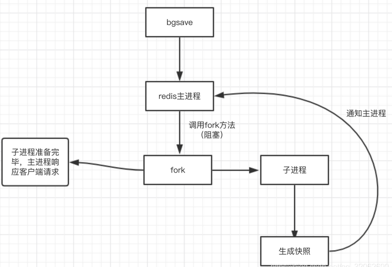

> bgsave 的原理？

​ ① 执行 bgsave 命令，Redis 父进程判断当前是否存在正在执行的子进程，如 RDB/AOF 子进程，如果存在 bgsave 命令直接返回。

​ ② 如果没有正在执行的子进程，那么父进程执行 fork 操作创建子进程，**fork 操作过程中父进程(redis 进程)会阻塞**。

​ ③ 父进程 fork 完成后，bgsave 命令返回(bgsave 命令就结束了)并不再阻塞父进程，可以继续响应其他命令。

​ ④ 子进程创建 RDB 文件，根据父进程内存生成临时快照文件，完成后对原有文件进行替换，替换操作是原子的。

​ ⑤ 子进程发送信号给父进程表示完成，父进程更新统计信息。

> 触发机制

**手动触发**分别对应 save 和 bgsave 命令：

- save（已经废弃）：阻塞当前 Redis 服务器服务，直到 RDB 持久化 过程完成为止，对于内存比较大的实例会造成长时间阻塞，线上环境不建议使用。
- bgasve：Redis 进程执行 **fork 操作创建子进程**，**RDB 持久化过程由子进程负责**，完成后自动结束。**阻塞只发生在 fork 阶段，一般时间很短**。bgsave 是针对 save 阻塞问题做的优化，因此 Redis 内部所有涉及 RDB 的操作都采用 bgsave 的方式。

**自动触发** RDB 持久化机制，例如：

- 使用 save 相关配置，如 save m n，表示 m 秒内数据集存在 n 次修改时，自动触发 bgsave。
- 如果从节点执行全量复制操作，主节点自动执行 bgsave 生成 RDB 文件并发送给从节点。
- 执行 debug reload 命令重新加载 Redis 时也会自动触发 save 操作。
- 默认情况下执行 shutdown 命令时，如果没有开启 AOF 持久化功能则自动执行 bgsave。

> 在生成 RDB 期间，Redis 可以同时处理写请求么？

​ **可以**，Redis 使用操作系统的**多进程写时复制技术 COW(Copy On Write)** 来实现快照持久化，保证数据一致性。

​ Redis 在持久化时会`fork`一个子进程，子进程负责将内存内容写入到临时文件，父进程继续处理 client 请求。由于 os 的 COW 机制，父子进程会共享相同的物理页面，当父进程处理写请求时，os 会为父进程要修改的页面创建副本。所以子进程地址空间内的数据是**fork 时刻整个数据库的一个快照**。

​ 当子进程将快照写入临时文件完毕后，用临时文件替换原来的快照文件，然后子进程退出。

##### RDB 的优缺点

- 优点：RDB 文件是一个紧凑的二进制压缩文件，是 Redis 在**某个时间点的全部数据快照**。所以使用 RDB**恢复数据的速度远远比 AOF 的快，非常适合备份、全量复制、灾难恢复等场景**。
- 缺点：每次进行`bgsave`操作都要执行 fork 操作创建子进程，属于重量级操作，频繁执行成本过高，所以无法做到实时持久化，或者秒级持久化。另外，由于 Redis 版本的不断迭代，存在不同格式的 RDB 版本，有可能出现低版本的 RDB 格式无法兼容高版本 RDB 文件的问题。

---

#### AOF（Append-only file）

​ 把 Redis 服务器接收到的所有**写命令都记录到日志中**，**redis 重跑一下日志文件相当于还原了数据**。

​ 由于快照方式是在一定间隔时间做一次，所以如果 redis 意外 down 掉的话，就会丢失最后一次快照后的所有更改。如果要求数据不能丢失任何修改的话，可以采用 aof 持久化方式。

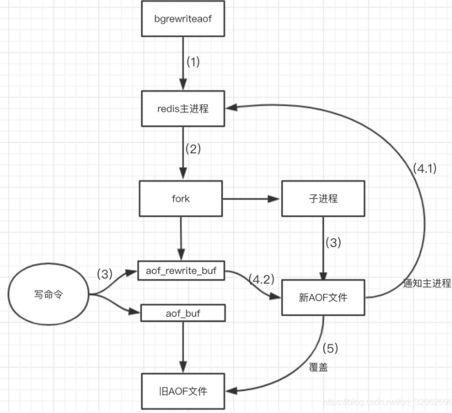

> 为什么 AOF 比 RDB 有更好的持久化性？

​ 这是由于 AOF 会产生一个`appendonly.aof`持久化文件 ，Redis 将收到的写命令都通过`Write`函数追加到该文件的最后，类似于 MySQL 的 binlog 。当 Redis 重启时会通过重新执行文件中保存的写命令来重建整个数据库的内容。

​ 当然**由于 os 会在内核中缓存 write 做的修改**，所以可能不是立即写到磁盘上，这样的话还是有可能丢失部分修改。不过我们可以通过文件告诉 Redis 我们想要通过 `fsync` 函数强制 os 写入到磁盘的时机。有三种方式：

##### AOF 的三种写回策略

- appendfsync always：收到写命令，写命令执行完后就立即写入磁盘，最慢，它在每一个写命令后都有一个慢速的落盘操作，不可避免的会影响主线程性能，但是保证完全的持久化。
- appendfsync everysec：每秒钟写入磁盘一次，只是先把日志写到 AOF 文件的内存缓冲区，每隔一秒把缓冲区中的内容写入磁盘。避免了同步写回的性能开销，虽然减少了对系统西能的影响，但是如果发生宕机，上一秒内未落盘的命令操作仍然会丢失。所以算两者的折中。
- appendfsync no：操作系统控制的写回，每个写命令执行完，只是先把日志写到 AOF 文件的内存缓冲区，由操作系统决定何时将缓冲区内容写回磁盘。在写完缓冲区后就可以继续执行后续的命令，但是落盘的时机已经不在 redis 手中，只要 AOF 记录没有写回磁盘，一旦宕机对应的数据就丢失了，完全依赖 os，性能最好，但持久化没保证。

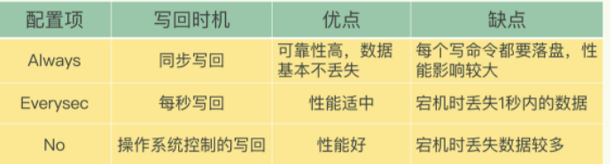

​ 想要高性能选择 No 策略，想要可靠性要 Always 策略，如果允许数据有一点丢失，又希望性能别受太大影响的话，就选择 everysec 策略。

##### AOF 文件过大(重写机制)

​ AOF 日志不断变大，我们就需要重写(重写是通过 bgrewriteof 子进程完成的不会阻塞主进程)AOF 文件，新的 AOF 文件：Redis 根据数据库现状创建的，也就是读取数据库中的所有键值对，然后对每一个键值对用一条命令记录它的写入，记录的都是数据库中数据的最新状态，经过 AOF 重写后 AOF 文件会变小。

​ 1、Redis 执行 fork() ，现在同时拥有父进程和子进程。 2、子进程开始**将新 AOF 文件的内容写入到临时文件**。 3、对于所有新执行的写入命令，**父进程一边将它们累积到一个内存缓存中，一边将这些改动追加到现有 AOF 文件的末尾,这样样即使在重写的中途发生停机，现有的 AOF 文件也还是安全的**。 4、当子进程完成重写工作时，它给父进程发送一个信号，父进程在接收到信号之后，将内存缓存中的所有数据追加到新 AOF 文件的末尾。 5、搞定！现在 Redis 原子地用新文件替换旧文件，之后所有命令都会直接追加到新 AOF 文件的末尾。

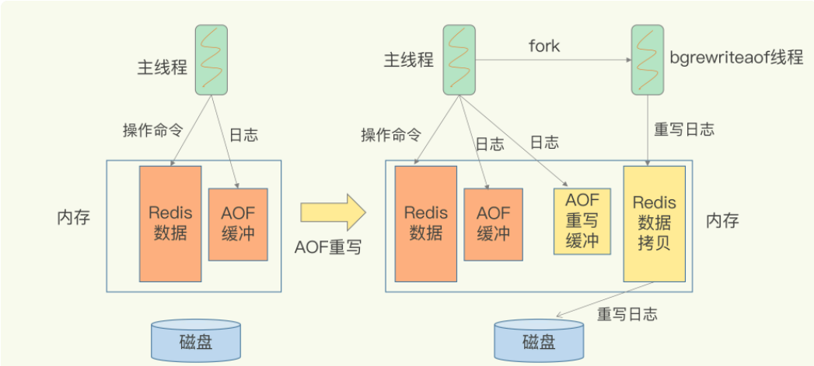

> AOF 的持久化文件越来越大怎么办？

​ aof 方式会让持久化文件越来越大，例如我们调用`incr test`命令 100 次，文件中必须保存全部的 100 条命令，但其实有 99 条命令都是多余的。因为要恢复数据库的状态，文件中保存一条`set test 100`就够了。

​ 所以为了压缩 aof 的持久化文件，Redis 提供了`bgrewriteaof`命令。收到此命令，Redis 将使用与快照类似的方式，将内存中的数据**以命令的方式**保存到临时文件中，最后替换原来的文件。

> AOF 文件破坏了怎么办？

​ 如果文件有错误，redis 是启动不起来的，需要修复 aof 文件。redis 给我们提供了一个工具`redis-check-aof --fix`加上文件名`appendonly.aof`即可。

---

#### RDB 和 AOF 的区别

- AOF 文件比 RDB 更新频率高，优先使用 AOF 还原数据。
- AOF 比 RDB 更安全，但持久化文件也更大，修复的速度也比 RDB 慢很多。
- AOF 运行效率比 RDB 慢，RDB 比 AOF 性能好。

---

#### 持久化方式的选择？

1、如果是数据不那么敏感，且可以从其他地方重新生成补回的，可以关闭持久化。

2、如果是数据比较重要，不想再从其他地方获取，且可以承受数分钟的数据丢失，比如作为缓存，那么可以只使用 RDB。

3、如果是用于当做内存数据库，那么最好 RDB 和 AOF 都开启。

4、Redis4.0 之后，添加了新的==混合持久化方式==。简单地说：将 RDB 文件的内容和增量的 AOF 日志文件存在一起。这里的 AOF 日志不再是全量的日志，而是自持久化开始到持久化结束的这段时间发生的增量 AOF 日志，通常这部分 AOF 日志很小。

- 优势：混合持久化结合了 RDB 持久化 和 AOF 持久化的优点， 由于绝大部分都是 RDB 格式，加载速度快，同时结合 AOF，增量的数据以 AOF 方式保存了，数据更少的丢失。
- 兼容性差，一旦开启了混合持久化，在 4.0 之前版本都不识别该 aof 文件，同时由于前部分是 RDB 格式，阅读性较差。

---

### Redis 如何保证高可用高并发性(主从+哨兵+集群)⭐

​ **Redis 中有三种集群方式用来保证高并发和高可用：主从复制，哨兵模式和集群**

### 主从复制

​ **概述：**为了避免单点故障，通常的做法是将数据库复制到多个副本部署在不同的服务器上。这样，即使有一套服务器出现了故障其他服务器仍然可以继续提供服务。Redis 提供了复制的功能，可以实现当一台数据库中的数据更新后，自动更新的数据同步到其他数据库上。一个 master 能对应多个 slave。一个 slave 只能对应一个 master。

​ 先启动主节点，然后一台一台启动从节点。

​ **作用**：

- ==读写分离==：master 写，slave 读，提高服务器读写负载能力
- ==负载均衡==：salve 分担 master 负载，大大提高 Redis 并发量与数据吞吐量
- ==故障恢复==：当 master 出现问题时，由 slave 提供服务，实现快速故障恢复
- ==高可用==：基于主从复制，构造哨兵模式与集群，实现 Redis 的高可用

​ **过程/原理：**

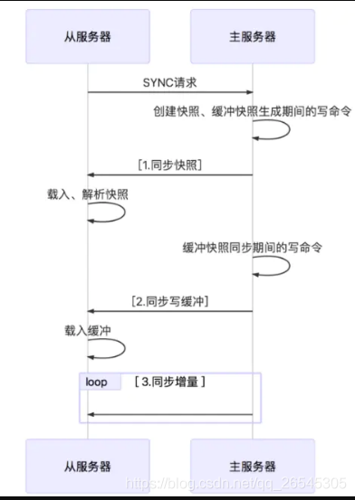

1. slave 启动成功之后，连接 master，发送 sync 命令；
2. master 接收 sync 命令之后，开始执行 BGSAVE 命令生成 RDB 文件，并使用**缓冲区记录此后执行的所有写命令**。
3. master 执行完 BGSAVE 后，向所有的 slave 发送快照文件。并在发送期间继续记录被执行的写命令
4. slave 接收到快照文件后丢弃所有旧数据，载入收到的快照
5. master 快照发送完毕后，开始向 slave 发送缓冲区的**写命令**
6. slave 完成对快照文件的加载，开始接受命令请求，并执行主数据库缓冲区的写命令。(从数据库初始化完成)
7. master 每执行一个写命令就像 slave 发送相同的写命令。slave 接收并执行写命令。(这是从数据库初始化完成后的操作)
8. 出现断开重连后，2.8 之后的版本会将断线期间的命令传给从数据库，增量复制。
9. **主从刚刚连接的时候，进行全量同步;全同步结束后，进行增量同步**。当然，如果有需要，slave 在任何时候都可以发起全量同步。Redis 的策略是，无论如何，首先会尝试进行增量同步，如不成功，要求从机进行全量同步。

#### 主从复制的优缺点

​ **优点**

- 支持主从复制，主机会自动将数据同步到从机，可以进行读写分离;

- 为了分载 Master 的读操作压力，Slave 服务器可以为客户端提供只读操作的服务，写服务依然必须由 Master 来完成;

- Slave 同样可以接受其他 Slaves 的连接和同步请求，这样可以有效地分载 Master 的同步压力;

- Master 是以非阻塞的方式为 Slaves 提供服务。所以在 Master-Slave 同步期间，客户端仍然可以提交查询或修改请求;

- Slave 同样是以阻塞的方式完成数据同步。在同步期间，如果有客户端提交查询请求，Redis 则返回同步之前的数据。

  **缺点**

- Redis 不具备自动容错和恢复功能，主机从机的宕机都会导致前端部分读写请求失败，需要等待机器重启或者手动切换前端的 IP 才能恢复;

- 主机宕机，宕机前有部分数据未能及时同步到从机，切换 IP 后还会引入数据不一致的问题，降低了系统的可用性;

- 如果多个 Slave 断线了，需要重启的时候，尽量不要在同一时间段进行重启。因为只要 Slave 启动，就会发送 sync 请求和主机全量同步，当多个 Slave 重启的时候，可能会导致 Master IO 剧增从而宕机。

- Redis 较难支持在线扩容，在集群容量达到上限时在线扩容会变得很复杂;

- redis 的主节点和从节点中的数据是一样的，降低的内存的可用性

### 哨兵模式

​ 主从模式下，当主服务器宕机后，需要手动把一台从服务器切换为主服务器，这就需要人工干预，费事费力，还会造成一段时间内服务不可用。这种方式并不推荐，实际生产中，我们优先考虑哨兵模式。这种模式下，master 宕机，哨兵会自动选举 master 并将其他的 slave 指向新的 master。

​ 在主从模式下，redis 同时提供了哨兵命令 redis-sentinel，**哨兵是一个独立的进程，作为进程，它会独立运行**。其原理是哨兵进程向所有的 redis 机器发送命令，等待 Redis 服务器响应，从而监控运行的多个 Redis 实例。

​ 哨兵可以有多个，一般为了便于决策选举，使用奇数个哨兵。哨兵可以和 redis 机器部署在一起，也可以部署在其他的机器上。多个哨兵构成一个哨兵集群，哨兵直接也会相互通信，检查哨兵是否正常运行，同时**发现 master 宕机哨兵之间会进行决策选举新的 master**
​ **哨兵模式的作用：**

- 通过发送命令，让 Redis 服务器返回监控其运行状态，包括主服务器和从服务器;
- 当哨兵监测到 master 宕机，会自动将 slave 切换到 master，然后通过发布订阅模式通过其他的从服务器，修改配置文件，让它们切换主机;
- 然而一个哨兵进程对 Redis 服务器进行监控，也可能会出现问题，为此，我们可以使用多个哨兵进行监控。各个哨兵之间还会进行监控，这样就形成了多哨兵模式。

​ **哨兵模式的工作：**

- 每个 Sentinel（哨兵）进程以每秒钟一次的频率向整个集群中的 Master 主服务器，Slave 从服务器以及其他 Sentinel（哨兵）进程发送一个 PING 命令。
- 如果一个实例（instance）距离最后一次有效回复 PING 命令的时间超过 down-after-milliseconds 选项所指定的值， 则这个实例会被 Sentinel（哨兵）进程标记为主观下线（SDOWN）
- 如果一个 Master 主服务器被标记为主观下线（SDOWN），则正在监视这个 Master 主服务器的所有 Sentinel（哨兵）进程要以每秒一次的频率确认 Master 主服务器的确进入了主观下线状态
- 当有足够数量的 Sentinel（哨兵）进程（大于等于配置文件指定的值）在指定的时间范围内确认 Master 主服务器进入了主观下线状态（SDOWN）， 则 Master 主服务器会被标记为客观下线（ODOWN）
- 在一般情况下， 每个 Sentinel（哨兵）进程会以每 10 秒一次的频率向集群中的所有 Master 主服务器、Slave 从服务器发送 INFO 命令。
- 当 Master 主服务器被 Sentinel（哨兵）进程标记为客观下线（ODOWN）时，Sentinel（哨兵）进程向下线的 Master 主服务器的所有 Slave 从服务器发送 INFO 命令的频率会从 10 秒一次改为每秒一次。
- 若没有足够数量的 Sentinel（哨兵）进程同意 Master 主服务器下线， Master 主服务器的客观下线状态就会被移除。若 Master 主服务器重新向 Sentinel（哨兵）进程发送 PING 命令返回有效回复，Master 主服务器的主观下线状态就会被移除。

​ 假设 master 宕机，sentinel 1 先检测到这个结果，系统并不会马上进行 failover(故障转移)选出新的 master，仅仅是 sentinel 1 主观的认为 master 不可用，这个现象成为主观下线。当后面的哨兵也检测到主服务器不可用，并且数量达到一定值时，那么哨兵之间就会进行一次投票，投票的结果由 sentinel 1 发起，进行 failover 操作。切换成功后，就会通过发布订阅模式，让各个哨兵把自己监控的从服务器实现切换主机，这个过程称为客观下线。这样对于客户端而言，一切都是透明的。

##### 哨兵模式的优缺点

​ **优点：**

- 哨兵模式是基于主从模式的，所有主从的优点，哨兵模式都具有。
- 主从可以**自动切换**，系统更健壮，可用性更高。

​ **缺点：**

- 具有主从模式的缺点，每台机器上的数据是一样的，内存的可用性较低。
- Redis 较难支持在线扩容，在集群容量达到上限时在线扩容会变得很复杂。

### 集群模式

​ Redis 的哨兵模式基本已经可以实现高可用，读写分离 ，**但是在这种模式下每台 Redis 服务器都存储相同的数据，很浪费内存**，所以在 redis3.0 上加入了 Cluster 集群模式，**实现了 Redis 的分布式存储，对数据进行分片，也就是说每台 Redis 节点上存储不同的内容**；

**运行机制：**

在 Redis 的每一个节点上，都有这么两个东西，一个是插槽（slot），它的的取值范围是：0-16383，可以从上面 redis-trib.rb 执行的结果看到这 16383 个 slot 在三个 master 上的分布。还有一个就是 cluster，可以理解为是一个集群管理的插件，类似的哨兵。

当我们的存取的 Key 到达的时候，Redis 会根据 crc16 的算法对计算后得出一个结果，然后把结果和 16384 求余数，这样每个 key 都会对应一个编号在 0-16383 之间的哈希槽，通过这个值，去找到对应的插槽所对应的节点，然后直接自动跳转到这个对应的节点上进行存取操作。

当数据写入到对应的 master 节点后，这个数据会同步给这个 master 对应的所有 slave 节点。

为了保证高可用，redis-cluster 集群引入了主从模式，一个主节点对应一个或者多个从节点。当其它主节点 ping 主节点 master 1 时，如果半数以上的主节点与 master 1 通信超时，那么认为 master 1 宕机了，就会启用 master 1 的从节点 slave 1，将 slave 1 变成主节点继续提供服务。

如果 master 1 和它的从节点 slave 1 都宕机了，整个集群就会进入 fail 状态，因为集群的 slot 映射不完整。如果集群超过半数以上的 master 挂掉，无论是否有 slave，集群都会进入 fail 状态。

**redis-cluster 采用去中心化的思想，没有中心节点的说法，客户端与 Redis 节点直连，不需要中间代理层，客户端不需要连接集群所有节点，连接集群中任何一个可用节点即可。**

##### 集群模式的优缺点：

优点
**采用去中心化思想，数据按照 slot 存储分布在多个节点，节点间数据共享，可动态调整数据分布;**

**可扩展性：可线性扩展到 1000 多个节点，节点可动态添加或删除;**

高可用性：部分节点不可用时，集群仍可用。通过增加 Slave 做 standby 数据副本，能够实现故障自动 failover，节点之间通过 gossip 协议交换状态信息，用投票机制完成 Slave 到 Master 的角色提升;

降低运维成本，提高系统的扩展性和可用性。

缺点
1.Redis Cluster 是无中心节点的集群架构，依靠 Goss 协议(谣言传播)协同自动化修复集群的状态

但 GosSIp 有消息延时和消息冗余的问题，在集群节点数量过多的时候，节点之间需要不断进行 PING/PANG 通讯，不必须要的流量占用了大量的网络资源。虽然 Reds4.0 对此进行了优化，但这个问题仍然存在。

2.数据迁移问题

Redis Cluster 可以进行节点的动态扩容缩容，这一过程，在目前实现中，还处于半自动状态，需要人工介入。在扩缩容的时候，需要进行数据迁移。

而 Redis 为了保证迁移的一致性，迁移所有操作都是同步操作，执行迁移时，两端的 Redis 均会进入时长不等的阻塞状态，对于小 Key，该时间可以忽略不计，但如果一旦 Key 的内存使用过大，严重的时候会接触发集群内的故障转移，造成不必要的切换。

### Redis 的主从复制

**概述：**主从复制，是指将一台 Redis 服务器的数据，复制到其它的 Redis 服务器。即使其中一台服务器宕机，其它服务器依然可以提供服务，**实现 Redis 高可用。**

- 通过主从复制可以允许多个 slave server 拥有和 master server 相同的数据库副本。
- master 可以拥有多个 slave，多个 slave 可以连接同一个 master 外，还可以连接到其他 slave。
- 主从复制不会阻塞 master，在同步数据时，master 可以继续处理 client 请求。
- 如果 master 同时收到多个 slave 发来的同步连接命令，master 只会启动一个进程来写数据库镜像，然后发送给所有的 slave。

**主从复制作用**：

- ==读写分离==：master 写，slave 读，提高服务器读写负载能力
- ==负载均衡==：salve 分担 master 负载，大大提高 Redis 并发量与数据吞吐量
- ==故障恢复==：当 master 出现问题时，由 slave 提供服务，实现快速故障恢复
- ==高可用==：基于主从复制，构造哨兵模式与集群，实现 Redis 的高可用

#### 复制过程

大体可以分为 3 个阶段：

- **建立连接阶段**：建立 slave 到 master 的连接，使 master 能够识别 slave， 并保存 slave 端口号

- **主库同步数据到从库阶段**：

  - slave 启动成功连接到 master 后会发送一个 psync 同步命令
  - master 收到 PSYNC 命令执行 BGSAVE 命令，在后台生成一个 rdb 文件，并创建一个发送缓冲区记录从当前开始执行的所有写命令
  - master 将 RDB 文件发送给 slave，slave 接收并载入这个 RDB 文件
  - master 将发送缓冲区的所有写命令发送给 slave

- **发送同步期间新写命令到从库阶段**：同步操作执行完后，主从服务器两者数据库达到一致状态。每当主服务器执行客户端发送写命令时，master 会将自己执行的写命令，发送给 slave 执行。（==利用长连接进行写命令的传播==）

#### 复制期间网络断了咋办

在 Redis 2.8 之前，如果主从库在命令传播时出现了网络闪断，那么，**从库就会和主库重新进行一次全量复制，开销非常大。**

从 Redis 2.8 开始，网络断了之后，主从库会采用==增量复制==的方式继续同步。

#### 由于主从延迟导致读取到过期数据怎么处理？

​ Redis 加入了一个新特性来解决主从不一致导致读取到过期数据问题，增加了 key 是否过期以及对主从库的判断，如果 key 已过期，当前访问的 master 则返回 null；当前访问的是从库，且执行的是只读命令也返回 null。

---

### Redis 事务

​ Redis 即使多个连接也是单线程写入。但是假如一个线程发送 1，2 两条指令，则在插入指令 1 之后，Redis 可能被其它线程抢先插入指令 3，从而执行顺序变成 1，3，2，事务就是防止 1，3，2 情况发生。

​ 可以将 Redis 中的事务简单理解为：Redis 事务提供了一种**将多个命令请求打包**的功能。然后，再按顺序执行打包的所有命令，并且不会被中途打断。 Redis 事务功能是通过==MULTI、EXEC、DISCARD 和 WATCH== 四个原语实现的。

- MULTI & EXEC：使用 MULTI 命令后可以输入多个命令，Redis 不会立即执行这些命令，而是将它们放到队列，当调用了 EXEC 命令将执行所有命令。

- DISCARD：如果事务定义过程中发现了问题，终止当前事务，发生在 MULTI 之后，EXEC 之前。

- WATCH：对 key 添加==监视锁（乐观锁机制）==，在执行 EXEC 前如果 key 发生了变化，终止所有事务执行。

**Redis 事务的三个阶段**：

1. 事务开始 MULTI
2. 命令入队
3. 事务执行 EXEC

事务执行过程中，如果服务端收到有 EXEC、DISCARD、WATCH、MULTI 之外的请求，将会把请求放入队列中排队。

**注意事项：**

- Redis 中，单条命令是原子性执行的，但==事务不保证原子性，且没有回滚==。事务中任意命令执行失败，其余的命令仍会被执行。

* ==事务中出现运行错误，那么正确的命令会被执行==。

---

### 分布式

#### 什么是分布式锁？

​ 分布式锁，顾名思义，就是分布式项目开发中用到的锁，可以用来控制分布式系统之间同步访问共享资源。

**分布式锁应该具备的条件**：

- 在分布式系统环境下，一个方法在同一时间只能被一个机器的一个线程执行；
- 高可用的获取锁与释放锁；
- 高性能的获取锁与释放锁；
- 具备可重入特性；
- 具备锁失效机制，防止死锁；
- 具备非阻塞锁特性，即没有获取到锁将直接返回获取锁失败。

#### 常见的分布式锁有哪些解决方案

​ 目前分布式锁有三种流行方案，即基于关系型数据库、Redis、Zookeeper 的方案。

> 基于关系型数据库，如 MySQL

基于关系型数据库实现分布式锁，是依赖数据库的唯一性来实现资源锁定，比如==主键和唯一索引==等。

**缺点**：

- 这把锁强依赖数据库的可用性，数据库是一个单点，一旦数据库挂掉，会导致业务系统不可用。（搞两个数据库，数据之前双向同步。一旦挂掉快速切换到备库上）
- 这把锁没有失效时间，一旦解锁操作失败，就会导致锁记录一直在数据库中，其他线程无法再获得到锁。（做一个定时任务，每隔一定时间把数据库中的超时数据清理一遍）
- 这把锁只能是非阻塞的，因为数据的 insert 操作，一旦插入失败就会直接报错。没有获得锁的线程并不会进入排队队列，要想再次获得锁就要再次触发获得锁操作。（搞一个 while 循环，直到 insert 成功再返回成功）
- 这把锁是非重入的，同一个线程在没有释放锁之前无法再次获得该锁。因为数据中数据已经存在了。（在数据库表中加个字段，记录当前获得锁的机器的主机信息和线程信息，那么下次再获取锁的时候先查询数据库，如果当前机器的主机信息和线程信息在数据库可以查到的话，直接把锁分配给他就可以了）

> 基于 Redis 实现

1、**获取锁**：`setnx lock-key value`来实现，返回 1 则设置成功。

2、**释放锁**：`del lock-key`即可。

3、**锁超时**：为了防止一个线程在获取锁后程序出现异常，导致其他线程/进程调用 setnx 命令总是返回 0 而进入死锁状态，需要为该 key 设置一个“合理”的过期时间。`expire key 30`。

> 基于 Zookeeper 实现

​ 基于 Zookeeper 临时有序节点可以实现的分布式锁。

​ 大致思想为：每个客户端对某个方法加锁时，在 Zookeeper 上的与该方法对应的指定节点的目录下，生成一个唯一的瞬时有序节点。 判断是否获取锁的方式很简单，只需要判断有序节点中序号最小的一个。 当释放锁的时候，只需将这个瞬时节点删除即可。同时，其可以避免服务宕机导致的锁无法释放，而产生的死锁问题。完成业务流程后，删除对应的子节点释放锁。

​ 在实践中，当然是从以可靠性为主。所以首推 Zookeeper。

---

#### Redis 实现分布式锁

Redis 分布式锁其实就是在系统里面占一个“坑”，其他程序也要占“坑”的时候，占用成功了就可以继续执行，失败了就只能放弃或稍后重试。

占坑一般使用 **setnx(set if not exists)**指令，只允许被一个程序占有，使用完调用 del 释放锁。也可以配合`EXPIRE key seconds`自动释放锁。

设置 key 的生存时间，当 key 过期时(生存时间为 0) ，会被自动删除

风险/ **缺陷** ：原子性没有得到满足，所以不建议。

#### Redis 的分布式锁有什么缺陷

Redis 分布式锁**不能解决超时的问题**，分布式锁有一个超时时间，程序的执行如果超出了锁的超时时间就会出现问题。

#### 分布式 Redis 是前期做还是后期规模上来了再做好？为什么？

​ 既然 Redis 是如此的轻量（单实例只使用 1M 内存），为防止以后的扩容，最好的办法就是一开始就启动较多实例。即便你只有一台服务器，你也可以一开始就让 Redis 以分布式的方式运行，使用分区，在同一台服务器上启动多个实例。

​ 一开始就多设置几个 Redis 实例，例如 32 或者 64 个实例，对大多数用户来说这操作起来可能比较麻烦，但是从长久来看做这点牺牲是值得的。

​ 这样的话，当你的数据不断增长，需要更多的 Redis 服务器时，你需要做的就是仅仅将 Redis 实例从一台服务迁移到另外一台服务器而已（而不用考虑重新分区的问题）。一旦你添加了另一台服务器，你需要将你一半的 Redis 实例从第一台机器迁移到第二台机器。

#### RedLock

Redis 官方站提出了一种权威的基于 Redis 实现分布式锁的方式名叫 Redlock，此种方式比原先的单节点的方法更安全。它可以保证以下特性：

- 安全特性：互斥访问，即永远只有一个 client 能拿到锁。
- 避免死锁：最终 client 都可能拿到锁，不会出现死锁的情况，即使原本锁住某资源的 client crash 了或者出现了网络分区。
- 容错性：只要大部分 Redis 节点存活就可以正常提供服务。

> 原理

假设有 5 个完全独立的 Redis 主服务器

1、获取当前时间戳。

2、client 尝试按照顺序使用相同的 key,value 获取所有 Redis 服务的锁，在获取锁的过程中的获取时间比锁过期时间短很多，这是为了不要过长时间等待已经关闭的 Redis 服务。并且试着获取下一个 Redis 实例。 比如：TTL 为 5s,设置获取锁最多用 1s，所以如果一秒内无法获取锁，就放弃获取这个锁，从而尝试获取下个锁。

3、client 通过获取所有能获取的锁后的时间减去第一步的时间，这个时间差要小于 TTL 时间并且至少有 3 个 Redis 实例成功获取锁，才算真正的获取锁成功。

4、如果成功获取锁，则锁的真正有效时间是 TTL 减去第三步的时间差 的时间；比如：TTL 是 5s,获取所有锁用了 2s,则真正锁有效时间为 3s(其实应该再减去时钟漂移)。

5、如果客户端由于某些原因获取锁失败，便会开始解锁所有 Redis 实例；因为可能已经获取了小于 3 个锁，必须释放，否则影响其他 client 获取锁。

---

### 发布及订阅消息

> 概述

- **发布订阅（pub/sub）**是一种消息通信模式，主要**目的**是解耦消息发布者和消息订阅者之间的耦合，这点和设计模式中观察者模式比较相似。pub/sub 不仅仅解决发布者和订阅者直接代码级别耦合也解决两者在物理部署上的耦合。
- redis 作为一个 pub/sub 的 server，在订阅者和发布者之间起到了消息路由的功能。订阅者可以通过 subscribe 和 psubscribe 命令向 redis server 订阅自己感兴趣的消息类型，redis 将消息类型称为通道(channel)。
- 当发布者通过 publish 命令向 redis server 发送特定类型的消息时。订阅该消息类型的全部 client 都会收到此消息。这里**消息的传递是多对多的**。一个 client 可以订阅多个 channel,也可以向多个 channel 发送消息。

> 命令

- `PSUBSCRIBE pattern`订阅一个或多个符合给定模式的频道。
- `PUBLISH channel message` 将消息发送到指定的频道。
- `SUBCRIBE channel` 订阅给定的一个或多个频道的信息。
- `UNSUBSCRIBE channel`退订给定的频道。

---

###

### Redis 单副本

> 概述

​ 采用单个 Redis 结点部署架构，没有备用结点实时同步数据，不提供数据持久化和备份策略，**适用于数据可靠性不高的纯缓存业务场景。**一旦这个 Redis 挂了，整个系统就不可用了。

> 优点

- 架构简单，部署方便。

- 高性价比：缓存使用时无需备用结点（单实例可用性可以用 supervisor 或 crontab 保证），当然为了满足业务的高可用性，也可以牺牲一个备用节点，但同一时刻只有一个实例对外提供服务。

- 高性能。

> 缺点

- 不保证数据的可靠性。
- 在缓存使用，进程重启后，数据丢失，即使有备用的节点解决高性能，但是仍然不能解决**缓存预热**问题，因此不适用于数据可靠性要求高的业务。
- 高性能受限于单核 CPU 的处理能力（Redis 是单线程机制），CPU 为主要瓶颈，所以适合操作命令简单，排序，计算较少的场景。

---

### Redis 多副本（主从）

> 概述

- Redis 多副本，采用主从部署结构，相较于单副本而言最大的特点就是**主从实例间数据实时同步，并且提供数据持久化和备份策略**。
- 主从实例部署在不同的物理服务器上，根据实际的基础环境配置，可以实现同时对外提供服务和读写分离策略。

> 优点

- 高可靠性：一方面，采用**双机主备架构**，能够在主库出现故障时自动进行主备切换，从库提升为主库提供服务，保证服务平稳运行；另一方面，开启数据持久化功能和配置合理的备份策略，能**有效的解决数据误操作和数据异常丢失**的问题。
- 读写分离策略：从节点可以扩展主库节点的读能力，有效应对大并发量的读操作。

> 缺点

- 当主服务器宕机后，需要手动将一个从节点晋升为主节点，同时需要通知业务方变更配置，并且需要让其他从库节点去复制新主库节点，整个过程需要人为干预，比较繁琐，还会造成一段时间内服务不可用。**这种方式并不推荐，实际生产中，我们优先考虑哨兵模式。这种模式下，master 宕机，哨兵会自动选举 master 并将其他的 slave 指向新的 master。 **
- 主库的写能力受到单机的限制。
- 主库的存储能力受到单机的限制。
- 原生复制的弊端在早期的版本中也会比较突出，如：Redis 复制中断后，Slave 会发起 psync ，此时如果同步不成功，则会进行全量同步，主库执行全量备份的同时，可能会造成毫秒或秒级的卡顿。

---

### Redis Sentinel（哨兵）

​ 当主服务器宕机后，如果手动把一台从服务器切换为主服务器，费事费力，还会造成一段时间内服务不可用。我们优先考虑使用哨兵模式，它的原理是==哨兵通过发送命令，等待 Redis 服务器响应==，从而对主从结构中的每台服务器进行监控，当 master 出现故障时，通过投票机制选择新的 master 并将其余 slave 连接到新的 master。

- Redis Sentinel 部署架构主要包括两部分：==Redis Sentinel 集群和 Redis 数据集群==。

- 其中 Sentinel 集群是由若干 Sentinel 节点组成的分布式集群，可以实现故障发现，故障自动转移，配置中心和客户端通知。Redis Sentinel 的节点数量要满足 2n+1（n>=1）的奇数个。

  注意：**哨兵也是一台 Redis 服务器**，只是不提供数据服务，我们一般配置多个哨兵，防止单个哨兵宕机，通常哨兵配置数量为单数。

> 优点

- Sentinel 集群部署简单；
- 能够解决 Redis 主从模式下的高可用切换问题；
- 很方便实现 Redis 数据节点的线形扩展，轻松突破 Redis 自身单线程瓶颈，可极大满足 Redis 大容量或高性能的业务需求；
- 可以实现一套 Sentinel 监控一组 Redis 数据节点或多组数据节点。

> 缺点

- 部署相对 Redis 主从模式要复杂一些，原理理解更繁琐；
- 资源浪费，Redis 数据节点中 slave 节点作为备份节点不提供写服务；
- Redis Sentinel 主要是针对 Redis 数据节点中的主节点的高可用切换，对 Redis 的数据节点做失败判定分为主观下线和客观下线两种，对于 Redis 的从节点有对节点做主观下线操作，并不执行故障转移。

#### 哨兵的作用和原理

**作用**：

1. ==监控==，不断检查 master 和 slave 是否正常运行
2. ==通知==， 当被监控的服务器出现问题时，向其它发送通知
3. ==自动故障转移==，根据==投票机制==选取新的 master，然后通过==发布订阅模式==通知其它 slave ，修改配置文件，让它们切换主机 。

**原理**：

1. 每个 Sentinel 以每秒一次的频率向它所知的 Master，Slave 以及其他 Sentinel 实例发送一个 ==PING 命令==。
2. 如果一个实例距离最后一次有效回复 PING 命令的时间超过 `down-after-milliseconds` 选项所指定的值， 则这个实例会被当前 Sentinel 标记为==主观下线==。
3. 如果一个 Master 被标记为主观下线，则正在监视这个 Master 的所有 Sentinel 要以每秒一次的频率确认 Master 的确进入了主观下线状态。当有足够数量的 Sentinel（大于等于配置文件指定的值，一般是超过半数）在指定的时间范围内确认 Master 的确进入了主观下线状态，则 Master 会被标记为==客观下线== 。
4. 当 Master 被 Sentinel 标记为客观下线时，Sentinel 向所有 Slave 发送 INFO 命令的频率会从 10 秒一次改为每秒一次。
5. 若没有足够数量的 Sentinel 同意 Master 已经下线， Master 的客观下线状态就会变成主观下线。若 Master 重新向 Sentinel 的 PING 命令返回有效回复， Master 的主观下线状态就会被移除。
6. Sentinel 集群内部通过投票机制竞选一个领头的 Sentinel，由领头的 Sentinel 来决定新 master，挑选备选的 master 原则：
   - 过滤故障的节点
   - 响应快的，由于 Sentinel 不断向 slave 发送指令，我们挑个响应快的
   - 选择优先级 `slave-priority` 最大的从节点作为主节点
7. Sentinel 发送指令，新 master 上任，其它 salve 通过==发布订阅模式切换 master==。

---

### Redis Cluster

> 概述

- Redis 的哨兵模式基本已经可以实现高可用，读写分离 ，但是在这种模式下==主从和哨兵存在难以扩容以及单机存储、读写能力受限的问题，且每台 Redis 服务器都存储相同的数据，很浪费内存==，所以在 Redis3.0 上加入了 Cluster 集群模式，实现了 Redis 的分布式存储。
- 集群通过==分片==（sharding）来进行数据共享，每个 Redis 节点存储不同的内容，并提供复制和故障转移功能。 当遇到单机内存，并发和流量等瓶颈的时候，Redis Cluster 能起到很好的负载均衡的目的。
- Redis Cluster 集群节点==最小配置 6 个节点以上（3 主 3 从）==，其中**主节点提供读写操作，从节点作为备用节点，不提供请求，只作为故障转移使用**。

> 优点

- 无中心架构；
- 数据按照 slot 存储分布在多个节点，节点间数据共享，可动态调整数据分布；
- 可扩展性：可线性扩展到 1000 多个节点，节点可动态添加或删除；
- 高可用性：部分节点不可用时，集群仍可用。通过增加 Slave 做 standby 数据副本，能够实现故障自动 failover，节点之间通过 gossip 协议交换状态信息，用投票机制完成 Slave 到 Master 的角色提升；
- 降低运维成本，提高系统的扩展性和可用性。

> 缺点

- Client 实现复杂。
- 数据通过异步复制，不保证数据的强一致性。
- Slave 在集群中充当“冷备”，不能缓解读压力，当然可以通过 SDK 的合理设计来提高 Slave 资源的利用率。
- Key 批量操作限制，如使用 mset、mget 目前只支持具有相同 slot 值的 Key 执行批量操作。对于映射为不同 slot 值的 Key 由于 Keys 不支持跨 slot 查询，所以执行 mset、mget、sunion 等操作支持不友好。
- Key 事务操作支持有限，只支持多 key 在同一节点上的事务操作，当多个 Key 分布于不同的节点上时无法使用事务功能。

---

#### 数据分片(节点数据分配问题)

​ 为了将不同的 key 分散放置到不同的 redis 节点，通常的做法是获取 key 的哈希值，然后根据节点数(对服务器的数量)来求模，但这种做法有明显弊端，当我们需要增加或减少一个节点时，会造成大量的 key 无法命中，所以就提出了一致性 hash 的概念。但是，Redis 集群没有使用一致性 hash，而是引入了==哈希槽==的概念。

​ Redis Cluster 采用哈希槽分区，==所有的键根据哈希函数映射到 0~16383 整数槽内==。每个 key 通过 CRC16 校验后对 16384 取模来决定放置哪个槽，每一个节点负责维护一部分槽以及槽所映射的键值数据。

#### 哈希槽是如何映射到 Redis 实例上呢？

1. 根据键值对的 key，使用 CRC16 算法，计算出一个 16 bit 的值；
2. 将 16 bit 的值对 16384 执行取模，得到 0 ～ 16383 的数表示 key 对应的哈希槽。
3. 根据该槽信息定位到对应的实例。

```java
计算公式：CRC16(key) % 16384
```

使用哈希槽的**好处**就在于可以方便的添加或移除节点：

1. 当需要增加节点时，只需要把其它节点的哈希槽挪到新节点即可
2. 当需要移除节点时，只需要移除节点上的哈希槽挪到其它节点即可

#### 一致性哈希

​ 一致性哈希算法也是使用取模算法，但是普通哈希的取模算法是对服务器的数量进行取模，而一致性哈希算法是对 2^32 取模，具体步骤如下：

1. 一致性哈希算法将整个哈希值空间按照顺时针反向组织成一个虚拟的圆环，称为 Hash 环；
2. 讲个服务器使用 Hash 函数进行哈希，具体可以选择服务器的 IP 地址或主机名作为关键字进行哈希，从而确定每台机器在哈希环上的位置
3. 最后使用算法定位数据访问到相应服务器：将数据 key 使用相同的函数 Hash 计算出哈希值，并确定此数据在环上的位置，从此位置沿环顺时针寻找，第一台遇到的服务器就是其该定位到的服务器。

- 一致性哈希优点：

  前面提到，如果简单对服务器数量进行取模，那么当服务器数量发生变化时，会产生缓存的雪崩，从而很有可能导致系统崩溃，而使用一致性哈希算法就可以很好的解决这个问题，因为一致性 Hash 算法对于节点的增减都只需重定位环空间中的一小部分数据，只有部分缓存会失效，不至于将所有压力都在同一时间集中到后端服务器上，具有较好的容错性和可扩展性。

- 一致性哈希缺点（环的倾斜，解决方法：虚拟节点）

  一致性哈希算法在**服务节点太少的情况下，容易因为节点分部不均匀而造成数据倾斜问题**，也就是被缓存的对象大部分集中缓存在某一台服务器上，从而出现数据分布不均匀的情况，这种情况就称为 hash 环的倾斜。如下图所示：

  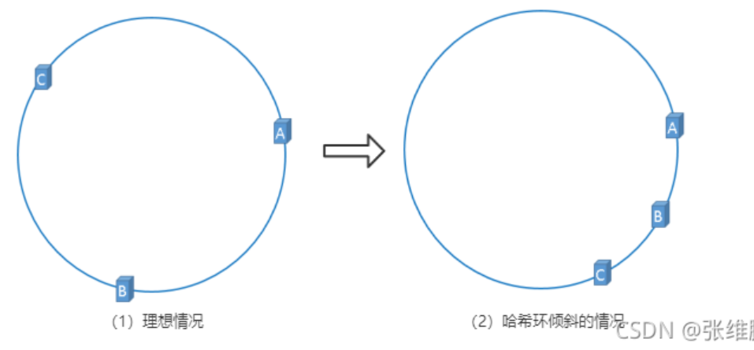

  解决方法：虚拟节点机制

  hash 环的倾斜在极端情况下，仍然有可能引起系统的崩溃，为了解决这种数据倾斜问题，一致性哈希算法引入了虚拟节点机制，**即对每一个服务节点计算多个哈希，每个计算结果位置都放置一个此服务节点，称为虚拟节点**，一个实际物理节点可以对应多个虚拟节点，虚拟节点越多，hash 环上的节点就越多，缓存被均匀分布的概率就越大，hash 环倾斜所带来的影响就越小，同时数据定位算法不变，只是多了一步虚拟节点到实际节点的映射。**具体做法可以在服务器 ip 或主机名的后面增加编号来实现**，加入虚拟节点以后的 hash 环如下：
  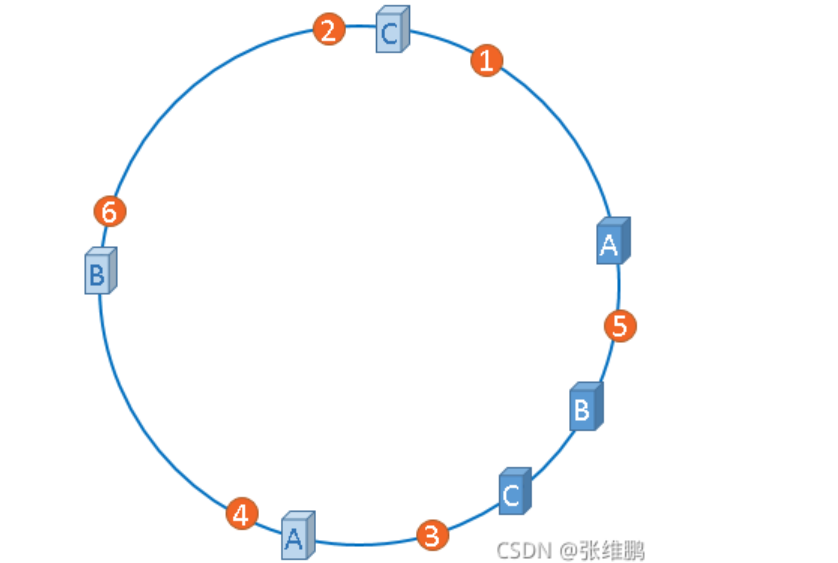

  ​

#### 集群如何扩容？

​ 集群扩容通过<font color='red'>重新分片</font>来实现。重新分片可以将已经分配给某个节点的任意数量的 slot 迁移给另一个节点，并且相关槽所属的键值对也会从源节点被移动到目标节点。

#### 复制与故障转移

​ Redis 集群中的节点分为主节点（master）和从节点（slave），读&写请求其实都是在 master 上完成的，slave 节点只是充当了一个数据备份的角色，当 master 发生了宕机，就会将对应的 slave 节点提拔为 master，来重新对外提供服务。

​ 简单来说，集群中的每个节点都会定期地向集群中其它节点发送 PING 消息，以此来检测对方是否在线，节点正常状态下接收到 PING 消息会返回一个 PONG 消息。针对 A 节点，某一个节点认为 A 宕机了，那么此时是==疑似下线==。而如果集群内==超过半数的节点认为 A 挂了==， 那么此时 A 就会被标记为 ==已下线==。

​ 一旦节点 A 被标记为了已下线，集群就会开始执行故障转移。其余正常运行的 master 节点会进行投票选举，从 A 节点的 slave 节点中选举出一个，将其切换成新的 master 对外提供服务。当某个 slave 获得了超过半数的 master 节点投票，就成功当选。

#### 节点间通信

​ Redis 集群各节点之间的通讯协议：==gossip 协议==。

​ gossip 协议的主要用途就是信息传播和扩散，它的基本思想：一个节点想要分享一些信息给网络中的其它的一些节点。于是，它周期性的随机选择一些节点，并把信息传递给这些节点。这些收到信息的节点接下来会做同样的事情，即把这些信息传递给其他一些随机选择的节点。

​ 主要交换故障信息、节点的增加和移除、hash slot 信息等。这种机制的**好处**在于，元数据的更新比较分散，不是集中在一个地方，更新请求会陆陆续续，打到所有节点上去更新，有一定的延时，降低了压力；**缺点**则是元数据更新有延时，可能导致集群的一些操作会有一些滞后。

#### netty 的线程模型

Netty 是一个`异步的`、基于`事件驱动`的网络应用框架，用于快速开发可维护、高性能的网络服务器和客户端,

简单的说, Netty 就是一个 网络框架 ,可以用来开发服务器或者客户端,并且 netty 与普通的我们理解的 tomcat,springBoot,OKHttp 等不一样的地方在于,它并不局限于 HTTP 协议,他是基于 socket 的, 所以当我们有需要使用自定义应用层协议的开发需求的时候, 用 netty 就很合适了,比如分布式,长连接什么的, 当然我们也可以基于 Netty 开发 Http 的服务器和客户端
