#   一、Spring

### Spring中用到了哪些设计模式

#### 工厂模式

​	Spring使用工厂模式可以通过 `BeanFactory` 或 `ApplicationContext` 创建 bean 对象。**工厂模式是把创建对象的任务交给工厂，从而来降低类与类之间的耦合**（工厂模式的优点）。Spring最主要的两个特性就是AOP和IOC，其中IOC就是控制反转，将对象的控制权转移给Spring，并由Spring创建实例和管理各个实例之间的依赖关系，其中，对象的创建就是通过BeanFactory 和 ApplicationContext 完成的。

​	BeanFactory是Spring里面最底层的接口，是Ioc的核心，定义了IOC的基本功能，包含了各种Bean的定义，加载、实例化、依赖注入和生命周期管理。BeanFactory采用的是延迟加载形式来注入Bean的，只有在使用某个Bean时(调用getBean())，才对该Bean进行加载实例化。这样，就不能提前发现一些存在的Spring的配置问题。

​	ApplicationContext接口作为BeanFactory的子类，除了提供BeanFactory所具有的功能外，还扩展了其他更完整的功能，对于Bean创建，ApplicationContext在容器启动时，一次性创建了所有的Bean。

- **BeanFactory 和 ApplicationContext的对比**
  - BeanFactory：延迟注入(使用到某个bean的时候才会注入)，会占用更少的内存，程序启动速度更快。
  - ApplicationContext：容器启动时，不管用没用到，一次性创建所有的bean(refresh()方法)，`BeanFactory` 仅提供了最基本的依赖注入支持，`ApplicationContext` 扩展了 `BeanFactory` ,除了有`BeanFactory`的功能还有额外更多功能，所以一般开发人员使用`ApplicationContext`会更多。

**ApplicationContext的三个实现类**：

1. `ClassPathXmlApplication`：把上下文文件当成类路径资源。
2. `FileSystemXmlApplication`：从文件系统中的 XML 文件载入上下文定义信息。
3. `XmlWebApplicationContext`：从Web系统中的XML文件载入上下文定义信息。

#### 单例模式

​	在我们的系统中，有一些对象其实我们只需要一个，比如说：线程池、缓存、对话框、注册表、日志对象、充当打印机、显卡等设备驱动程序的对象。事实上，**这一类对象只能有一个实例**，如果制造出多个实例就可能会导致一些问题的产生，比如：程序的行为异常、资源使用过量、或者不一致性的结果。

​	**单例模式的优点：**

- 对于频繁使用的对象，可以省略创建对象所花费的时间，对于重量级对象而言，是可观的一笔系统开销
- 由于new操作的次数减少，因而对系统内存的使用频率也会降低，减轻GC线程回收内存的压力。

​	**Spring中bean的默认作用域就是singleton(单例的)**。(Spring的依赖注入都是发生在AbstractBeanFactory的getBean里。getBean的doGetBean方法调用**getSingleton**进行bean 的创建)除了singleton作用域，Spring中bean还有下面几种作用域：

```java
xml : <bean id="userService" class="top.snailclimb.UserService" scope="singleton"/>
注解：@Scope(value = "singleton")
```

- prototype多实例：每次请求都会创建一个新的bean实例。
- request：每一次HTTP请求都会创建一个新的bean，该bean仅在HTTP request内有效
- session：每一次HTTP请求都会创建一个新的bean，该bean仅在当前HTTP session内有效
- **singleton与prototype的区别**：设置scope值是singleton时，加载spring配置文件时候就会创建单实例对象，设置scope值是prototype时，不是在加载Spring配置文件的时候创建对象，在调用getBean方法时创建多实例对象。

##### DCL(单例：双重校验锁)

**为什么两次if判断？**

​	外层判断提高效率(如果判断单例不为空直接不用执行加锁动作)，内层判断防止多次实例化对象。

​	**使用volatile的目的**：**避免指令重排序**。例子：线程1此时创建了singleton对象(分配了内存空间，也就是完成了第一个步骤)，但是2,3步骤乱序了，先执行了3，后执行2，也就是先将引用了指向了对象(由于对象还没有初始化，此时的对象是没有初始化的对象，而引用仅仅是一个地址)，这时如果线程2走到**第一个if**(没有在synchronized的代码块中，没有受到保护)的位置进行判断时此时INSTANCE不为空，他现在只是一个指向还没有初始化对象的一个地址，也就是t2线程拿到了一个**未初始化完毕的单例**。但也与原本的单例模式初衷违背，**因此需要volatile来避免指令重排序，以防出问题**。

​	实例化对象需要分为三个步骤(INSTANCE = new Singleton()为例)：

1. 分配内存空间(给singleton实例对象分配内存)
2. 初始化对象(调用Singleton的**构造函数**来初始化成员变量)
3. 将内存空间的地址赋值给对应的引用(将单例对象指向分配的内存空间，此时Instance(引用)才不为空)

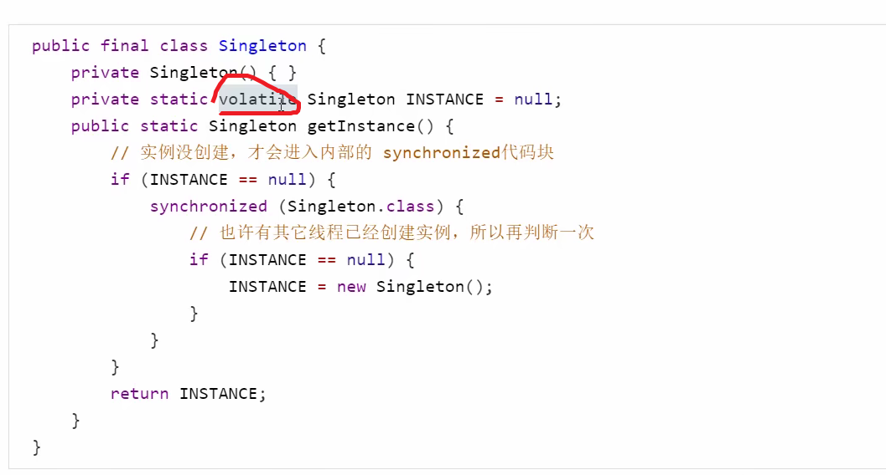

#### 代理设计模式

​	AOP(面向切面编程)能够将那些与业务无关，却为业务模块所共同调用的逻辑或责任**（例如事务处理、日志管理、权限控制等）**封装起来，便于减少系统重复代码，降低模块间的耦合度，并有利于未来的可拓展性和可维护性。

​	代理模式的设计动机就是通过代理对象来访问真实对象，通过建立一个对象代理类，由代理对象控制原对象的引用，从而实现对真实对象的操作。在代理模式中，代理对象主要起到一个中介的作用，用于协调与连接调用者(客户端)和被调用者(目标对象)，在一定程度上降低了系统的耦合度，同时也保护了目标对象。但缺点是在调用者与被调用者之间增加了代理对象，可能会造成请求的处理速度变慢。

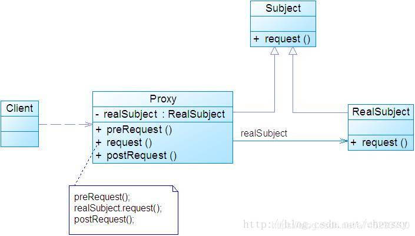

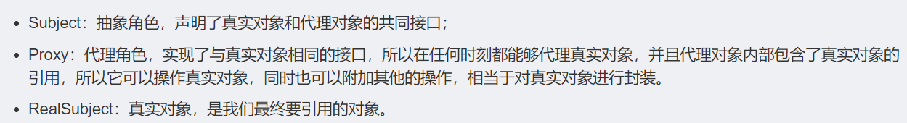

​	Spring AOP是基于动态代理的，主要有两种方式，JDK动态代理和[CGLIB](https://so.csdn.net/so/search?q=CGLIB&spm=1001.2101.3001.7020)动态代理：

- 如果有要代理的对象，实现了需要代理的类接口，那么Spring就会通过JDK Proxy去创建代理对象。J**DK动态代理的核心是InvocationHandler接口和Proxy类**，在获取代理对象时，使用Proxy类来动态创建目标类的代理类，**当代理对象调用真实对象的方法时，InvocationHandler通过invoke()**方法**反射**来调用目标类中的代码，动态地将横切逻辑和业务编织在一起。

  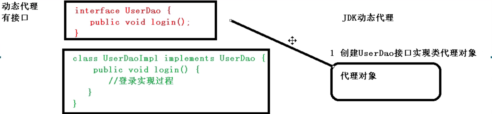

- 如果被代理类没有实现接口的实现类，此时Spring AOP就会使用**CGLIB来动态代理目标类**，CGLIB(Code Generation Library)，**是一个代码生成的类库，可以在运行时动态生成指定类的一个子类对象，并覆盖其中特定方法并添加增强代码**，从而实现AOP**。CGLIB是通过继承的方式实现动态代理，如果某个类被标记为final，那么其将无法使用CGLIB动态代理**。

  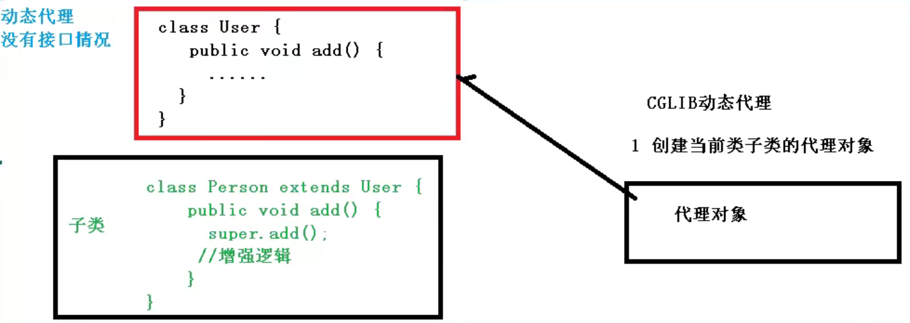

##### 代理模式与装饰器模式的区别

代理模式跟装饰器模式比较类似，有些读者可能容易将他们混淆，这里我们简单介绍下两者的区别：

- （1）装饰器模式关注于在对象上动态添加新行为，而代理模式虽然也可以增加新的行为，但关注于控制对象的访问。
- （2）装饰器模式执行主体是原类；代理模式是代理原类进行操作，执行主体是代理类。
- （3）代理模式中，代理类可以对客户端隐藏真实对象的具体信息，因此使用代理模式时，我们常常在代理类中创建真实对象的实例。而装饰器模式的通常做法是将原始对象作为参数传给装饰者的构造器。也就是说。代理模式的代理和真实对象之间的对象通常在编译时就已经确定了，而装饰者能够在运行时递归地被构造。


### Spring框架的优势？

1. **轻量**：Spring 是轻量的，基本的版本大约 2MB。
2. **控制反转IOC**：Spring 通过控制反转实现了<span style="background-color: yellow">松散耦合</span>，对象们给出它们的依赖，而不是创建或查找依赖的对象们。
3. **AOP**：Spring 支持**面向切面的编程**，并且把应用业务逻辑和系统服务分开。
4. **容器**：Spring 包含并管理应用中对象的生命周期和配置。
5. **MVC框架**：Spring 的 Web 框架是个精心设计的框架，是 Web 框架的一个很好的替代品。
6. **事务管理**：Spring 提供一个持续的事务管理接口，可以扩展到上至本地事务下至全局事务（JTA）。
7. **异常处理**：Spring 提供方便的 API 把具体技术相关的异常（比如由 JDBC，Hibernate or JDO 抛出的）转化为一致的 unchecked 异常

---

### IOC AOP

- **IOC**	

​	SpringIOC解决的是对象管理和对象依赖问题，本来使我们手动new出来的对象，现在则把对象交给Spring的IOC容器管理。IOC容器可以理解为一个对象工厂，其管理这些对象的创建和依赖关系。，它不是什么技术，而是一种解耦的设计思想。它的主要目的是借助于“第三方”(Spring 中的 IOC 容器) 实现具有依赖关系的对象之间的解耦(IOC容易管理对象，你只管使用即可)，从而降低代码之间的耦合度。**IOC 是一个原则，而不是一个模式，以下模式（但不限于）实现了IoC原则。**

​	**Spring IOC容器就像是一个工厂一样，当我们需要创建一个对象的时候，只要配置好配置文件/注解即可，完全不用考虑对象是如何创建出来的。**IOC容器负责创建对象，将对象连接在一起，配置这些对象，并从创建中处理这些对象的整个生命周期，直到他们被完全销毁。

​	**所有的类都会在spring容器中登记，告诉spring你是个什么东西，你需要什么东西，然后spring会在系统运行到适当的时候，把你要的东西主动给你，同时也把你交给其他需要你的东西。所有的类的创建、销毁都由 spring来控制，也就是说控制对象生存周期的不再是引用它的对象，而是spring。对于某个具体的对象而言，以前是它控制其他对象，现在是所有对象都被spring控制，所以这叫控制反转。**

​	**控制反转**IOC：把原有自己掌控的事去交给别人去处理(是一种思想/设计模式)，比如本来有我们自己new出来的对象，现在交由IOC容器，把对象的控制权交给他了。

​	举个例子："对象a 依赖了对象 b，当对象 a 需要使用 对象 b的时候必须自己去创建。但是当系统引入了 IOC 容器后， 对象a 和对象 b 之前就失去了直接的联系。这个时候，当对象 a 需要使用 对象 b的时候， 我们可以指定 IOC 容器去创建一个对象b注入到对象 a 中"。 对象 a 获得依赖对象 b 的过程,由主动行为变为了被动行为，控制权翻转，这就是控制反转名字的由来。

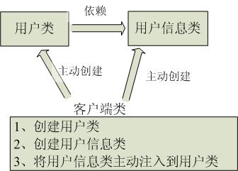

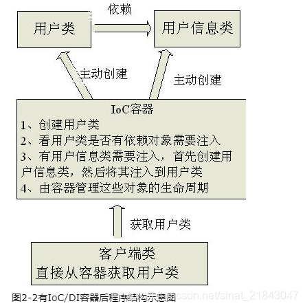

​	**依赖注入(DI)**：**IoC的一个重点是在系统运行中，动态的向某个对象提供它所需要的其他对象。这一点是通过DI（Dependency Injection，依赖注入）来实现的**，DI其实是控制反转的实现方式，对象无需自行创建或管理它的依赖关系，**依赖关系被自动注入到需要他们的对象中去**。**依赖注入就是将实例变量传入到一个对象中去**。

​	**DI是如何实现的？**：依赖注入是通过反射实现的，它允许程序在运行的时候动态生成对象、执行对象的方法、改变对象属性，。

​	例子：比如对象A需要操作数据库，以前我们总是要在A中自己编写代码来获得一个Connection对象，有了 spring我们就只需要告诉spring，A中需要一个Connection，至于这个Connection怎么构造，何时构造，A不需要知道。在系统运行时，spring会在适当的时候制造一个Connection，然后像打针一样，注射到A当中，这样就完成了对各个对象之间关系的控制。A需要依赖 Connection才能正常运行，而这个Connection是由spring注入到A中的。

**IOC好处/作用**：

1. 将对象集中处理，避免对象乱创建导致额外的内存开销。便于内存的优化
2. 降低耦合度，便于项目的扩展、易于维护，由容器去维护具体的对象。如果IoC+接口情况下，删除任意实现类都不会导致程序编译出错。虽然运行到特定得代码会报错，但是其他代码在使用时不会有问题，从侧面也反应出是松耦合。
2. 托管了类的产生过程，比如我们需要在类的产生过程中做一些处理，最直接的例子就是代理，如果有容器程序可以把这部分处理交给容器，应用程序则无需去关心类是如何完成代理的。

- **AOP**(面向切面编程)

​	解决的是非业务代码抽取的问题，AOP的底层是动态代理技术，比如我们需要在方法上注入些**重复性**的非业务代码，就可以利用Spring AOP。AOP就是在方法前后增加非业务代码。

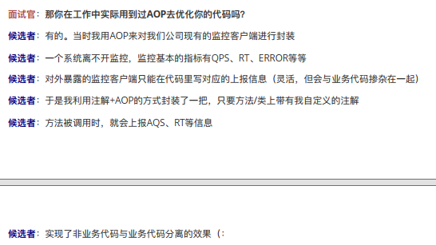

### 解释下AOP？

​		将与业务无关，却是业务模块所共同调用的逻辑封装起来，便于减少系统的重复代码，在需要执行时，<font color='red'>使用动态代理技术</font>，在不修改源码的基础上，对已有方法进行增强。

​		使用“横切”技术，AOP 把软件系统分为两个部分：**核心关注点和横切关注点**。业务处理的主要流程是核心关注点，与之关系不大的部分是横切关注点。横切关注点的一个特点是，它们经常发生在核心关注点的多处，而各处都基本相似。比如：<span style="background-color: yellow">日志记录、性能统计、安全控制、事务处理、异常处理等</span>。AOP 的作用在于分离系统中的各种关注点，将核心关注点和横切关注点分离开来。

**开发AOP三步走**：**编写核心业务代码→将公用代码抽取出来，制作成通知→在配置文件中，声明切入点与通知间的关系。**

#### SpringAOP与Aspectj AOP的区别

**Spring AOP 属于运行时增强，而 AspectJ 是编译时增强。** Spring AOP 基于代理(Proxying)，而 AspectJ 基于字节码操作(Bytecode Manipulation)。

Spring AOP 已经集成了 AspectJ ，AspectJ 应该算的上是 Java 生态系统中最完整的 AOP 框架了。AspectJ 相比于 Spring AOP 功能更加强大，但是 Spring AOP 相对来说更简单，

如果我们的切面比较少，那么两者性能差异不大。但是，当切面太多的话，最好选择 AspectJ ，它比Spring AOP 快很多。

#### AOP的基本概念

| AOP相关术语         | 说明                                                         |
| ------------------- | ------------------------------------------------------------ |
| Joinpoint（连接点） | 表示在程序中明确定义的点，典型的包括方法调用，对类成员的访问以及异常处理程序块的执行等等。 |
| Pointcut（切入点）  | 定义了相应的 Advice 将要发生的地方                           |
| Advice（通知/增强） | 定义了在 Pointcut 里面定义的程序点具体要做的操作             |
| Aspect（切面）      | Aspect 声明类似于 Java 中的类声明，在 Aspect 中会包含着一些 Pointcut 以及相应的 Advice。 |
| Weaving（织入）     | 把切面应用到目标对象并创建新的代理对象的过程                 |

#### AOP 通知类型

* 前置通知（Before）：目标方法被调用之前调用
* 后置通知（After-returning）：目标方法被调用之后调用
* 异常通知（After-throwing）：目标方法抛出异常后调用
* 最终通知（After）：无论方法执行是否成功，都会调用
* 环绕通知（Around）：在被通知的方法调用之前和调用之后执行自定义的行为

#### 动态代理与静态代理

​	**静态代理的的代理类是我们自己定义好的，在程序运行之前就已经编译完成，但是动态代理的代理类是在程序运行时创建的**。相比于静态代理，**动态代理的优势**在于可以很方便的对代理类的函数进行统一的处理，而不用修改每个代理类中的方法。比如我们想在每个代理方法之前都加一个处理方法，我们上面的例子中只有一个代理方法，如果还有很多的代理方法，就太麻烦了，我们来看下动态代理是怎么去实现的。

#### AOP代理的两种方式

​	AOP中的代理说是由AOP框架动态生成的一个对象，该对象可以作为目标对象使用。Spring 中的AOP有两种，JDK动态代理，CGLIB代理，**代理类在程序运行时创建的代理方式被成为动态代理**。**动态代理的优势在于可以很方便的对代理类的函数进行统一的处理，而不用修改每个代理类中的方法。是因为所有被代理执行的方法，都是通过在InvocationHandler中的invoke方法调用的，所以我们只要在invoke方法中统一处理，就可以对所有被代理的方法进行相同的操作了**。例如，这里的方法计时，所有的被代理对象执行的方法都会被计时，然而我只做了很少的代码量。

##### JDK动态代理

​		AOP 思想的实现一般都是基于代理模式 ，在 Java 中一般采用 JDK 动态代理模式，但是我们都知道，JDK 动态代理模式只能代理接口而不能代理类。因此，Spring AOP 会按照下面两种情况进行切换，因为 Spring AOP 同时支持 CGLIB、ASPECTJ、JDK 动态代理。

​	如果**目标对象的实现类实现了接口**，**Spring AOP 将会采用 JDK 动态代理来生成 AOP 代理类**；J**DK动态代理的核心是InvocationHandler接口和Proxy类**，在获取代理对象时，使用Proxy类来动态创建目标类的代理类，**当代理对象调用真实对象的方法时，InvocationHandler通过invoke()**方法**反射**来调用目标类中的代码，动态地将横切逻辑和业务编织在一起。

​	**JDK动态代理原理：**

​	在JDK动态代理中，要实现代理逻辑类就必须实现java.lang.reflect.**InvocationHandler**接口，实现里面的**invoke**方法。

​	**第一步**：**建立代理对象和真实对象(实现类对象)之间的关系**。用的**bind**方法，首先用成员变量来保存存入的真实对象。接着通过如下代码建立并生成代理对象。

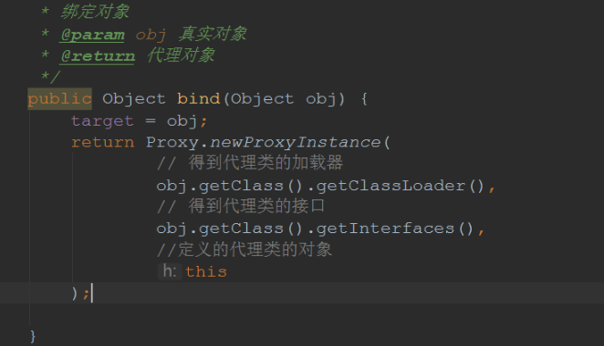

​	生成代理对象的函数Proxy.newProxyInstance()方法中**有三个参数**，第一个参数是类加载器(真实对象的类加载器)，第二个参数是我们把生成的代理对象挂在那个接口之下，如果没有接口这里会报错。第三个参数是实现方法逻辑的代理类，就是用哪一个类去代理的，this代表的是当前对象，其必须实现InvocationHandler接口的invoke方法，invoke是代理逻辑的实现方法。以此将真实对象与动态对象绑定，同时返回代理对象。

​	**第二步：实现代理逻辑方法**，invoke方法可以实现代理逻辑，解释一下invoke方法的三个参数。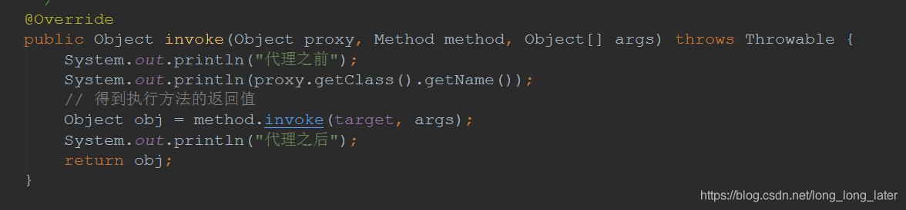

​	第一个参数proxy就是代理对象，也就是bind方法中返回的对象，method是当前调度方法也可以说是真实对象的方法，args就是调度方法的参数。**当使用代理对象的调度方法(调度实现类中的方法)的时候就会执行invoke()方法**（invoke中的invoke()方法**指的是执行真实对象的方法，只不过是利用反射来实现的**）。


##### CGLIB动态代理

​	如果**目标对象的实现类没有实现接口**，**Spring AOP 将会采用 CGLIB 来生成 AOP 代理类**。其不需要提供任何接口只需要一个非抽象类就能完成动态代理。

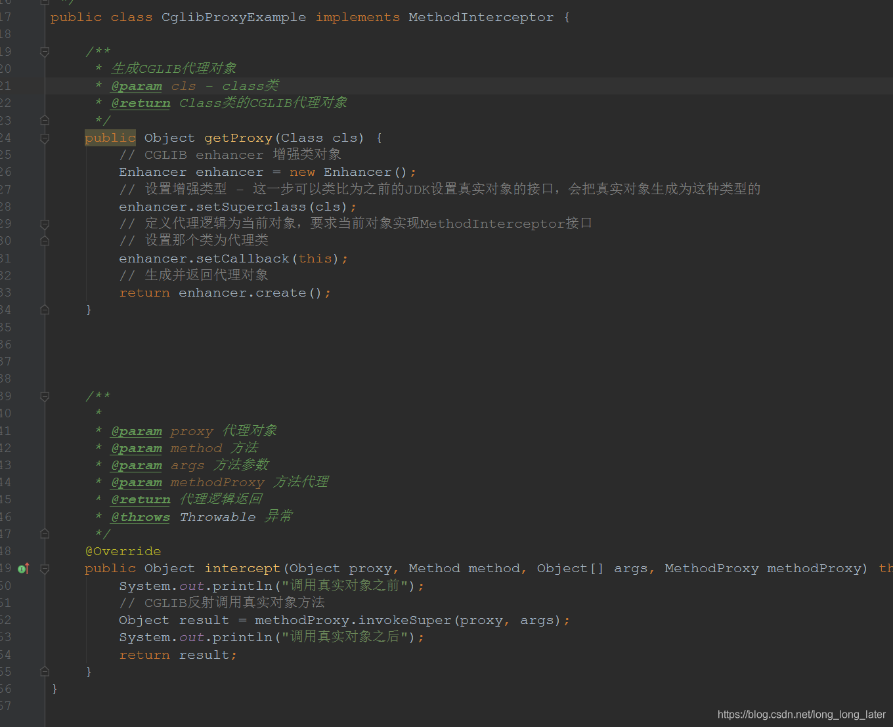

​	这里使用的是CGLIB的加强者Enhancer，然后设置了超类的方法（setSuperclass，因为cls相当于真实对象的类），这里可以和JDK的获得真实对象的接口类比，其实就是设置将真实对象转换为什么类型的(这里的什么类型就是把真实对象转换为代理的这个代理的类型)；之后和JDK代理一样设置代理类是什么（setCallback）。其中的this代表当前对象，要求这个对象实现了**MethodInterceptor**类的intercept方法，然后再生产代理对象返回。

​	在这个类中interceptor就是代理逻辑方法，参数说明注释中已经说明。和JDK实现的代理没有什么区别，需要注意的是intercept方法里面，和JDK代理相比多了一个methodProxy参数，这个参数是方法代理，通过代理对象来实现真实对象的方法和之前略有不同。那这里为什么会有method这个参数呢，我的理解是CGLIB也可以代理接口，这个时候就可以用到它了，代理接口method、代理非抽象类用methodProxy，和之前的JDK相同一致。


##### 两种代理的区别：

- JDK动态代理只能对实现了接口的类生成代理，没有实现接口的类不能使用。
- Cglib动态代理即使被代理的类没有实现接口，也可以使用，因为Cglib动态代理是使用继承被代理类的方式进行扩展。
- Cglib动态代理是通过继承的方式，覆盖被代理类的方法来进行代理，所以如果方法是被final修饰的话，就不能进行代理。

​	JDK代理和CGLIB代理是很相似的，都是先生成代理对象，制定代理的逻辑类。而代理逻辑类要实现接口的一个方法，那么定义的方法就是代理对象的逻辑方法，可以控制真实对象的方法。区别是JDK代理只可以代理接口，而CGLIB既可以代理接口又可以代理非抽象类。

#### AOP实现的四种方式

配置可以通过xml文件来进行，大概有四种方式：

1.        配置ProxyFactoryBean，显式地设置advisors, advice, target等（基于代理的AOP ）

2.        配置AutoProxyCreator，这种方式下，还是如以前一样使用定义的bean，但是从容器中获得的其实已经是代理对象

3.        通过<aop:config>来配置（纯POJO切面）

4.        通过<aop: aspectj-autoproxy>来配置，使用**AspectJ的注解来标识通知及切入点**

---

### 解释下IOC？

<font color='red'>IoC 就是把创建对象的权利交给 Spring 容器，通过依赖注入（DI）初始化类中成员变量</font>，用来削减程序间的耦合，解除代码中的依赖关系。

> 实现原理

1. 创建 XML 配置文件，配置要创建的对象类
2. 创建工厂类，使用 dom4j 解析 XML 配置文件
3. 使用<font color='red'>反射</font>来创建类对象

```
依赖注入也是通过反射机制来实现的，实例化一个类时，它通过反射调用类中 set 方法，将事先保存在 HashMap 中的类属性注入到类中。
```

**应用场景**：MVC 三层架构中，尽量避免使用 new 来实例化对象，最好将对象交由 Spring 容器创建，解耦。

#### 常用注入bean的方式(怎么定义bean)

1. 构造器依赖注入：构造器依赖注入通过容器触发一个类的构造器来实现的，该类有一系列参数，每个参数代表一个对其他类的依赖。
2. Setter 方法注入：Setter 方法注入是容器通过调用无参构造器或无参 static 工厂方法实例化 bean 之后，调用该 bean 的 Setter 方法，即实现了基于 Setter 的依赖注入。
3. 基于注解的注入：最好的解决方案是用构造器参数实现强制依赖，Setter 方法实现可选依赖。

##### ioc与工厂模式区别

​	**举个例子，如果用户需求发生变化，要把Chinese类修改一下。那么前一种工厂模式，就要更改Factory类的方法，并且重新编译布署。而IoC只需 要将class属性改变一下，并且由于IoC利用了Java反射机制，这些对象是动态生成的**，这时我们就可以热插拨Chinese对象（不必把原程序停止 下来重新编译布署）

​	只有Java代码发生改变,JVM才需要重新编译布署.而**XML文件的修改并没有发生Java代码发生改变,所以JVM不需要重新编译部署**.如果下次我想要个英国人我只需要加个新的标签就行了,所以说热插拨。

​	注意，IoC的灵活性是有代价的：设置步骤麻烦、生成对象的方式不直观、反射比正常生成对象在效率上慢一点。因此使用IoC要看有没有必要，我认为比较通用的判断方式是：用到工厂模式的地方都可以考虑用IoC模式。

---

### Bean相关

#### bean的生命周期

简单点说就是：bean的实例化–>bean的初始化–>bean的使用–>bean的销毁

1. 实例化：也就是new一个对象
2. 属性注入：Spring上下文对实例化的bean进行配置（IOC注入）
3. 设置beanId：如果实现BeanNameAware接口，调用setBeanName()方法设置ID
4. 调用BeanFactoryAware.setBeanFactory(setBeanFactory(BeanFactory)：可以用这个方式来获取其它Bean，只需在Spring配置文件中配置一个普通的Bean就可以；
5. 调用ApplicationContextAware.setApplicationContext(ApplicationContext)：与BeanFactoryAware.setBeanFactory同样作用，但是ApplicationContextAware是子接口，可以实现更多接口；
6. 实例化之前调用：BeanPostProcessor.postProcessBeforeInitialization(Object obj, String s)方法调用，
7. 实例化：如果在spring配置中还配置了init-method属性，会自动调用该方法；
8. 实质化之后调用：如果关联BeanPostProcessor接口，调用postProcessAfterInitialization(Object obj, String s)方法，
   <span style="background-color: yellow">注：前面这里我们就完成bean的实例化</span>
9. bean的销毁：当bean不再被使用时，就会调用destroy()方法；
10. bean销毁调用方法：如果配置了destroy-method方法，会自动调用该方法；


#### Bean的作用域

```java
xml : <bean id="userService" class="top.snailclimb.UserService" scope="singleton"/>
注解：@Scope(value = "singleton")
```

```java
@Scope("prototype")  / 设置作用域
```

1. singleton : 唯一 bean 实例，Spring 中的 bean 默认都是单例的；(<span style="background-color: yellow">使用单例的原因：性能、不需要多例</span>)
2. prototype : 每次请求都会创建一个新的 bean 实例，创建后spring将不再对其管理；
3. request：每一次 HTTP 请求都会产生一个新的 bean，该 bean 仅在当前 HTTP request 内有效，和 prototype 不同的是，spring 会继续监听管理；
4. session : 每一次会话都会产生一个新的 bean，该 bean 仅在当前 HTTP session 内有效；
5. global session：全局的web域，类似于servlet中的application。

- **singleton与prototype的区别**：设置scope值是singleton时，加载spring配置文件时候就会创建单实例对象，设置scope值是prototype时，不是在加载Spring配置文件的时候创建对象，在调用getBean方法时创建多实例对象。

---

#### bean 线程安全问题？

​		Spring 不保证 bean 的线程安全。Spring 中的 bean 默认都是单例的，当单例中存在竞争状态，即有线程安全问题。但一般不会出现线程安全问题，因为在 Spring 中，绝大部分 bean 都是无状态的，因此即使这些 bean 默认是单例的，也不会出现线程安全问题。

```java
有状态的 bean：对象中有实例变量（成员变量），可以保存数据，是非线程安全的
无状态的 bean：对象中没有实例变量（成员变量），不能保存数据，可以在多线程环境下共享，是线程安全的
```

比如：Controller、Service、Dao 这些类，这些类里面通常不会含有成员变量，因此它们被设计成单例的。如果这些类中定义了实例变量，就线程不安全了，所以尽量避免定义实例变量。

> 解决线程并发问题

Spring 对一些 Bean 中非线程安全状态采用 <font color='red'>ThreadLocal</font> 进行处理，解决线程安全问题。

---

#### 获取bean的方式

[Spring 在代码中获取 bean 的几种方式](https://www.cnblogs.com/yjbjingcha/p/6752265.html)

1. 在初始化时保存 `ApplicationContext` 对象：这种方式适用于采用 Spring 框架的独立应用程序，需要程序通过配置文件手工初始化Spring的情况。

   ```java
   ApplicationContext ac = new FileSystemXmlApplicationContext("applicationContext.xml"); 
   ac.getBean("userService");//比如：<bean id="userService" class="com.cloud.service.impl.UserServiceImpl"></bean>
   ```
   1. 通过 Spring 提供的 `utils `类获取 `ApplicationContext` 对象：这种方式适合于采用 Spring 框架的 B/S 系统，通过`ServletContext`对象获取`ApplicationContext`对象，然后在通过它获取需要的类实例。下面两个工具方式的区别是，前者在获取失败时抛出异常，后者返回null。

   ```java
   ApplicationContext ac1 = WebApplicationContextUtils.getRequiredWebApplicationContext(ServletContext sc); 
   ApplicationContext ac2 = WebApplicationContextUtils.getWebApplicationContext(ServletContext sc); 
   ac1.getBean("beanId"); 
   ac2.getBean("beanId");  
   ```

3. 抽象类 ApplicationObjectSupport 提供`getApplicationContext()`方法，可以方便的获取 ApplicationContext。Spring初始化时，会通过该抽象类的`setApplicationContext(ApplicationContext context)`方法将ApplicationContext 对象注入。

   ```java
   WebApplicationContext wac = 	(WebApplicationContext)servletContext.getAttribute(WebApplicationContext.ROOT_WEB_APPLICATION_CONTEXT_ATTRIBUTE);
   ```
   
4. 继承自抽象类 WebApplicationObjectSupport：类似上面方法，调用`getWebApplicationContext()`获取`WebApplicationContext`
5. 实现接口 ApplicationContextAware：实现该接口的`setApplicationContext(ApplicationContext context)`方法，并保存ApplicationContext 对象。Spring初始化时，会通过该方法将 ApplicationContext 对象注入。

6. 通过 Spring 提供的 ContextLoader：最后提供一种不依赖于servlet,不需要注入的方式。但是需要注意一点，在服务器启动时，Spring容器初始化时，不能通过以下方法获取Spring 容器

   ```java
   WebApplicationContext wac = ContextLoader.getCurrentWebApplicationContext();
   wac.getBean(beanID);
   ```

----

#### BeanFactory实现原理

**实质**：由一个工厂类根据传入的参数，动态决定该创建哪一个产品类

**实现原理**：

- bean容器的启动阶段：

  - 读取bean的xml配置文件，将bean元素分别转换成一个BeanDefinition对象
  - 然后通过BeanDefinitionRegistry将这些bean注册到beanFactory中，保存在它的一个concurrentHashMap中。
  - 将BeanDefinition注册到了BeanFactory之后，spring提供了一个扩展的切口，允许通过实现接口BeanFactoryPOSTProcessor在此处插入我们定义的代码。典型的例子就是：PropertyPlaceholderConfigurer，我们一般在配置数据库的dataSource时使用到的占位符的值，就是它注入进去的。

- 容器中bean实例化阶段

  实例化阶段主要是通过反射或者CGLIB对bean进行实例化，在这个阶段Spring又给我们暴露了很多的扩展点

  - 各种Aware接口，比如BeanFactoryAware，对于实现了这些Aware接口的bean，在实例化bean时Spring会帮我们注入对应的BeanFactory实例
  - BeanPostProcessor接口，实现了BeanPostProcessor接口的bean，在实例化bean时Spring会帮我们调用接口中的方法
  - InitializingBean接口，实现了InitializingBean接口的bean，在实例化bean时Spring会帮我们调用接口中的方法
  - DisposableBean接口，实现了DisposableBean接口的bean，在该bean死亡时Spring会帮我们调用接口中的方法。

### Spring的事务

#### 事务的实现方式

Spring 中事务有两种**实现方式**：编程式事务 & 声明式事务

1. <span style="background-color: yellow">编程式事务</span>

   通过编码的形式来管理和维护事务。

2. <span style="background-color: yellow">声明式事务</span>

   <font color='red'>声明式事务的实现基于 Spring AOP 来实现</font>，声明式事务实现又有两种方式：

   * 基于 XML 配置文件的方式
   * 在业务方法上添加 @Transactional 注解，将事务规则应用到业务逻辑中 

区别：编程式事务每次实现都要单独实现，但业务量大功能复杂时，使用编程式事务无疑是痛苦的，而声明式事务不同，声明式事务属于无侵入式，不会影响业务逻辑的实现，只需要在配置文件中做相关的事务规则声明或者通过注解的方式，便可以将事务规则应用到业务逻辑中。
	显然声明式事务管理要优于编程式事务管理，这正是Spring倡导的非侵入式的编程方式。唯一不足的地方就是声明式事务管理的粒度是方法级别，而编程式事务管理是可以到代码块的，但是可以通过提取方法的方式完成声明式事务管理的配置。

#### 事务的传播机制

​		**事务传播行为是为了解决业务层方法之间互相调用的事务问题**。当事务方法被另一个事务方法调用时，必须指定事务应该如何传播。例如：方法可能继续在现有事务中运行，也可能开启一个新事务，并在自己的事务中运行。在 TransactionDefinition 定义中包括了如下几个表示传播行为的常量：

+ 支持当前事务的情况：
  1. TransactionDefinition.PROPAGATION_REQUIRED：如果当前存在事务，则加入该事务；如果当前没有事务，则创建一个新的事务；
  2. TransactionDefinition.PROPAGATION_SUPPORTS：如果当前存在事务，则加入该事务；如果当前没有事务，则以非事务的方式继续运行；
  3. TransactionDefinition.PROPAGATION_MANDATORY：如果当前存在事务，则加入该事务；如果当前没有事务，则抛出异常。

+ 不支持当前事务的情况：
  1. TransactionDefinition.PROPAGATION_REQUIRES_NEW：创建一个新的事务，如果当前存在事务，则把当前事务挂起；
  2. TransactionDefinition.PROPAGATION_NOT_SUPPORTED：以非事务方式运行，如果当前存在事务，则把当前事务挂起。
  3. TransactionDefinition.PROPAGATION_NEVER：以非事务方式运行，如果当前存在事务，则抛出异常。

+ 其他情况：
  1. TransactionDefinition.PROPAGATION_NESTED：如果当前存在事务，则创建一个事务作为当前事务的嵌套事务来运行；如果当前没有事务，则该取值等价于 TransactionDefinition.PROPAGATION_REQUIRED。

#### 事务的隔离级别

TransactionDefinition 接口中定义了五个表示隔离级别的常量：

1. TransactionDefinition.ISOLATION_DEFAULT：使用后端数据库默认的隔离级别，MySQL 默认采用的 REPEATABLE_READ 隔离级别、Oracle 默认采用的 READ_COMMITTED 隔离级别；
2. TransactionDefinition.ISOLATION_READ_UNCOMMITTED：最低的隔离级别，允许读取尚未提交的数据变更，可能会导致脏读、幻读或不可重复读；
3. TransactionDefinition.ISOLATION_READ_COMMITTED：允许读取并发事务已经提交的数据，可以阻止脏读，但是幻读或不可重复读仍有可能发生；
4. TransactionDefinition.ISOLATION_REPEATABLE_READ：对同一字段的多次读取结果都是一致的，除非数据是被本身事务自己所修改，可以阻止脏读和不可重复读，但幻读仍有可能发生；
5. TransactionDefinition.ISOLATION_SERIALIZABLE：最高的隔离级别，完全服从 ACID 的隔离级别。所有的事务依次逐个执行，这样事务之间就完全不可能产生干扰，严重影响性能。

---

### Spring 框架中用到了哪些设计模式？

1. 工厂设计模式 : Spring 使用工厂模式通过 BeanFactory、ApplicationContext 创建 bean 对象；
2. 代理设计模式 : Spring AOP 功能的实现；
3. 单例设计模式 : Spring 中的 Bean 默认都是单例的；
4. 模板方法模式 : Spring 中 jdbcTemplate、hibernateTemplate 等以 Template 结尾的对数据库操作的类，它们就使用到了模板模式；
5. 包装器设计模式 : 我们的项目需要连接多个数据库，而且不同的客户在每次访问中根据需要会去访问不同的数据库。这种模式让我们可以根据客户的需求能够动态切换不同的数据源；
6. 观察者模式：Spring 事件驱动模型就是观察者模式很经典的一个应用；
7. 适配器模式：Spring AOP 的增强或通知(Advice)使用到了适配器模式、SpringMVC 中也是用到了适配器模式适配 Controller。

---

### 相关注解

> 基于注解方式实现对象创建以及注入属性

**对象创建的注解：**

1. @Component：普通组件
2. @Service：作用于业务逻辑层
3. @Controller：作用于表现层（SpringMVC的注解）
4. @Repository：作用于持久层

**属性注入的注解：**

1. @AutoWired：根据属性类型进行自动装配。
2. @Qualifier：根据属性名称进行注入，和@AutoWired配合使用。
3. @Resource：可以根据类型注入，可以根据名称注入。
4. @Value：注入普通类型属性。

**完全注解开发：**

```java
@Configuration  //作为配置类，替代xml配置文件
@ComponentScan(basePackages ="com.myj.spring5")
public class SpringConfig {
    //code
}
```


# 二、MyBatis

#### JDBC 连接数据库步骤？

1. 加载 JDBC 驱动程序
2. 获取数据库连接对象
3. 创建数据库操作对象
4. 执行 SQL 语句
5. 获取查询结果集
6. 处理异常，关闭 JDBC 对象资源

---

#### Statement 和 PrepareStatement 区别？

Statement 和 PrepareStatement 都是数据库操作对象，它们之间的区别：

* Statement 用于执行静态 sql 语句，执行时必须指定一个事先准备好的 sql 语句，也就是说 sql 语句是静态的

* PrepareStatement 支持预编译，采用 Cache 机制，对于多次重复执行的 sql 语句，可直接从 Cache 中取出，提高执行效率
* PrepareStatement 提高了代码的安全性，防止 sql 注入，sql 语句中可以使用 “？” 占位符，可以传动态的参数

```java
Statement stmt = connect.createStatementz();
String sql = "SELECT * FROM myj WHERE userId=10000 AND name LIKE 'xiaoming'";
ResultSet rs = stmt.executeUpdate(sql);

PreparedStatement preparedStatement = connect.prepareStatement("SELECT * FROM myj WHERE userId=? AND name LIKE ?");
prepareStatement.setInt(1, 10000);
prepareStatement.setString(2, "xiaoming");
prepareStatement.executeUpdate();
```

---

#### 什么是Mybatis？优缺点

​		MyBatis 是一个半ORM（对象关系映射）框架，内部封装了JDBC，是一个与数据库打交道的<span style="background-color: yellow">持久层框架</span>，可以通过 XML 和注解来实现数据库 CRUD 操作，简化了开发。开发时只需要关注 SQL 语句本身，不需要花费精力去处理加载驱动、创建连接、创建 Statement 等繁杂的过程。程序员直接编写原生态 SQL，可以严格控制 SQL 执行性能，灵活度高。

**优点**：

1. 基于 SQL 语句编程，相当灵活，不会对应用程序或者数据库的现有设计造成任何影响，SQL 写在 XML 里，解除 SQL 与程序代码的耦合，便于统一管理；提供XML标签，支持编写动态 SQL 语句，并可重用；
2. 与 JDBC 相比，减少了代码量，消除了 JDBC 大量冗余的代码，不需要手动开关连接；
3. 很好的与各种数据库兼容（因为 MyBatis 使用 JDBC 来连接数据库，所以只要 JDBC 支持的数据库 MyBatis 都支持）；
4. 提供映射标签，支持对象与数据库的 ORM 字段关系映射；提供对象关系映射标签，支持对象关系组件维护。

**缺点**：

1. SQL 语句的编写工作量较大，尤其当字段多、关联表多时，对开发人员编写 SQL 语句的功底有一定要求；
2. SQL 语句依赖于数据库，导致数据库移植性差，不能随意更换数据库。

---

#### 什么是 ORM？

​		ORM（Object Relational Mapping）即对象关系映射，简单来说就是<span style="background-color: yellow">在关系型数据库和对象之间做一个映射</span>。即可以将对象自动持久化到数据库中，也可以将数据库表中的行转化为 Java 对象。

##### 为什么要做持久化和ORM设计？

​		在目前的企业应用系统设计中，MVC，即 Model（模型）- View（视图）- Control（控制）为主要的系统架构模式。MVC 中的  Model 包含了复杂的业务逻辑和数据逻辑，以及数据存取机制（如  JDBC的连接、SQL生成和Statement创建、还有ResultSet结果集的读取等）等。<span style="background-color: yellow">将这些复杂的业务逻辑和数据逻辑分离，以将系统的紧耦合关系转化为松耦合关系（即解耦合），是降低系统耦合度迫切要做的，也是持久化要做的工作</span>。MVC 模式实现了架构上将表现层（即View）和数据处理层（即Model）分离的解耦合，而<span style="background-color: yellow">持久化的设计则实现了数据处理层内部的业务逻辑和数据逻辑分离的解耦合</span>。 而 ORM 作为持久化设计中的最重要也最复杂的技术，也是目前业界热点技术。

---

#### MyBatis 与 Hibernate 的区别？

* MyBatis 是半自动 ORM 框架，它需要程序员自己编写 SQL；Hibernate 是全自动 ORM 框架，可以做到无 SQL 对数据库进行操作；
* MyBatis 直接编写原生 SQL，可以严格控制 SQL 执行性能，灵活度高，非常适合对关系数据模型要求不高的软件开发，因为这类软件需求变化频繁，一但需求变化要求迅速输出成果。但是灵活的前提是 MyBatis 无法做到数据库无关性，如果需要实现支持多种数据库的软件，则需要自定义多套 SQL 映射文件，工作量大。
* Hibernate 会根据模型配置自动生成和执行 SQL 语句，灵活度差。但是对象/关系映射能力强，数据库无关性好，对于关系模型要求高的软件，如果用 Hibernate 开发可以节省很多代码，提高效率。

---

#### #{ } 和 ${ } 区别？

<span style="background-color: yellow">#{}是预编译处理，${}是字符串替换。</span>

#{key}：获取参数的值，预编译到 SQL 中，可简单理解为一个占位符 “？”，有效防止 SQL 注入，<span style="background-color: yellow">安全</span>。

${key}：获取参数的值，拼接到 SQL 中，存在 SQL 注入问题，<span style="background-color: yellow">不安全</span>。

---

#### resultMap和resultType的区别

基本映射：（resultType）使用resultType进行输出映射，只有查询出来的列名和pojo列名和pojo的属性名一致，该列才可以映射成功。（数据库，实体，查询字段,这些全部都得一一对应）

高级映射：（resultMap） 如果查询出来的列名和pojo的属性名不一致，通过定义一个resultMap对列名和pojo属性名之间作一个映射关系。（高级映射，字段名称可以不一致，通过映射来实现）<span style="background-color: yellow">常用在列名和Java对象属性不一样的情况</span>。

​		resultType和resultMap功能类似 ，都是返回对象信息 ，但是resultMap要更强大一些  ，可自定义。因为resultMap要配置一下，表和类的一一对应关系，所以说就算你的字段名和你的实体类的属性名不一样也没关系，都会给你映射出来，但是，resultType就比较鸡肋了，必须字段名一样，比如说 cId和c_id 这种的都不能映射 。

---

#### Mybatis 的缓存？

​		MyBatis 提供了<span style="background-color: yellow">缓存策略来减少数据库的查询次数</span>，MyBatis 中缓存分为一级缓存，二级缓存，此外，为了提高扩展性，MyBatis 还定义了缓存接口 Cache，我们可以通过实现 Cache 接口来自定义二级缓存。

* 一级缓存：也叫本地缓存，是 SqlSession 级别的缓存，是默认开启的。如果 SqlSession 执行插入、更新、删除，会清空 SqlSession 中的一级缓存，这样做的目的是让缓存中存储的是最新的信息，避免脏读。

* 二级缓存 ：二级缓存也叫全局缓存，是基于 namespace 级别的缓存，需要手动开启配置。一级缓存作用域太低，所以诞生了二级缓存。

**缓存查询原理**：

1. 先看二级缓存中有没有
2. 再看一级缓存中有没有
3. 查询数据库

---

#### Mybatis 分页？

​		MyBatis 使用 RouBounds 对象对查询结果集进行分页，然后按照 RowBounds 设置的参数进行截取，它是针对 ResultSet 结果集执行的内存分页，而非物理分页。即：查出所有记录再按偏移量和 limit 取结果。

<font color='red'>		但在大数据量的情况下这样的分页效率会很低</font>，一般情况下我们会使用 Mybaits 的分页插件工具 PageHelper 来完成分页。

<font color='red'>		分页插件 PageHelper </font>基本原理是使用 Mybatis 提供的插件接口，实现自定义插件，在插件的拦截方法内拦截待执行的 sql，然后重写 sql，添加对应的物理分页语句和物理分页参数。

---


# 三、SpringMVC

#### 三层架构与MVC

​	Spring [MVC](https://so.csdn.net/so/search?q=MVC&spm=1001.2101.3001.7020)是一个基于Java的实现了MVC设计模式的请求驱动类型的轻量级Web框架，通过把Model，View，Controller分离，**将web层进行职责解耦**，把复杂的web应用分成逻辑清晰的几部分，简化开发，减少出错，方便组内开发人员之间的配合。

首先，<span style="background-color: yellow">三层架构与MVC的目标一致：都是为了解耦和、提高代码复用。MVC是一种设计模式，而三层架构是一种软件架构。</span>

**三层架构**：

* 表现层：负责接收客户端请求，接收用户参数，向客户端响应结果。
* 业务层：负责业务逻辑处理，如：事务控制。
* 持久层：和数据库交互，对数据库表进行 CRUD。

**MVC**：

MVC 是 Model — View — Controler 的简称，它是一种设计模式，它分离了表现与交互。它被分为三个核心部件：模型、视图、控制器。

+ **Model（模型）**：模型负责各个功能的实现（如登录、增加、删除等）。模型用JavaBean（分为封装业务逻辑的JavaBean和封装数据的JavaBean）实现。
+ **View（视图）**：负责页面的显示、与用户的交互。包含各种表单，主要用到的技术有html/css/jsp/js等前端技术。
+ **Controller（控制器）**：<span style="background-color: yellow">控制器负责将视图与模型一一对应起来</span>，相当于一个模型分发器。所谓分发就是：①接收请求，并将该请求跳转（转发，重定向）到模型进行处理。②模型处理完毕后，再通过控制器，返回给视图中的请求处。

---

#### SpringMVC 工作流程？

对Servlet进行封装，屏蔽掉了很多Servlet的细节。

控制器 DispatcherServlet 接受客户端请求 -> 找到处理器映射 HandlerMapping (处理器映射器)解析请求对应的 Handler ->HandlerAdapter(处理器适配器)会根据 Handler(处理器) 来调用真正的处理器来处理请求，并处理相应的业务逻辑 -> 处理器返回一个模型视图 ModelAndView -> 视图解析器(viewResolver)进行解析 -> 返回一个视图对象 -> 前端控制器 DispatcherServlet 渲染数据（Model）-> 将得到视图对象返回给用户。

**具体如下**：

1. 用户向服务器发送请求，请求被 Spring 前端控制器Servelt DispatcherServlet 捕获；

2. 前端控制器DispatcherServlet 对请求 URL 进行解析，得到请求资源标识符（URI）。然后根据该 URI，调用 HandlerMapping 获得该 Handler 配置的所有相关的对象（包括 Handler 对象以及 Handler 对象对应的拦截器List，就是HandlerExecutionChain ），最后以 HandlerExecutionChain 对象的形式返回；

3. DispatcherServlet 根据获得的 Handler，选择一个合适的HandlerAdapter；（附注：如果成功获得 HandlerAdapter 后，此时将开始执行拦截器的 preHandler(…)方法）

4. (调用适配器对象实例的handle方法真正执行代码逻辑处理)提取 Request 中的模型数据，填充 Handler 入参，开始执行Handler（Controller)。在填充 Handler 的入参过程中，根据你的配置，Spring 将帮你做一些额外的工作：
   + HttpMessageConveter：将请求消息（如：Json、xml 等数据）转换成一个对象，将对象转换为指定的响应信息；
   + 数据转换：对请求消息进行数据转换。如：String 转换成 Integer、Double 等；
   + 数据格式化：对请求消息进行数据格式化。如：将字符串转换成格式化数字或格式化日期等；
   + 数据验证：验证数据的有效性（长度、格式等），验证结果存储到 BindingResult 或 Error 中;

5. Handler 执行完成后，向 DispatcherServlet 返回一个 ModelAndView 对象；

6. 根据返回的 ModelAndView，选择一个适合的 ViewResolver（必须是已经注册到 Spring 容器中的 ViewResolver)返回给DispatcherServlet；

7. ViewResolver 结合 Model 和 View(视图)，来渲染视图；(将模型数据填充到视图中)

8. 将渲染结果返回给客户端。

   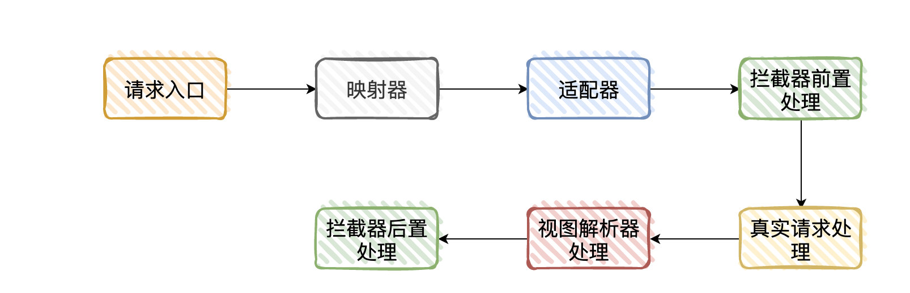

   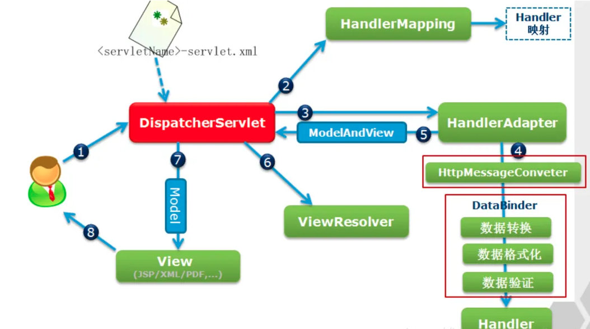

   视图view是一个接口，它的实现类支持不同的视图类型如jsp，freemarker，pdf等等。

---

####  SpringMVC 的核心组件？

* DispatcherServlet：前端控制器，它是整个流程的控制中心，由它调用其它组件处理用户的请求。<span style="background-color: yellow">相当于MVC中的C</span>。
* HandlerMapping：处理器映射器，根据用户请求找到具体哪个类，哪个方法执行。
* HandlerAdapter：处理器适配器，按照HandlerAdapter 要求的规则去执行 Handler。
* Handler：处理器，由我们根据自己业务开发。
* ViewResolver：视图解析器，把逻辑视图解析成具体的视图
* View：View 是一个接口，实现类支持不同的 View 类型（jsp、freemarker…）。

---

#### SpringMVC 的控制器是不是单例模式，如果是会有什么问题，怎么解决？

是单例模式，所以在多线程访问的时候有线程安全问题。但是不要使用同步，会影响性能，解决方案是在控制器里面不能写字段。

---

#### SpringMVC 怎么样设定重定向和转发的？

+ 转发：在返回值前面加 “forward:”
+ 重定向：在返回值前面加 “redirect:”

---

#### 过滤器 & 拦截器 & 监听器？

当访问服务器的资源时，过滤器、拦截器可以将请求拦截下来，完成一些特殊的功能，如：登录验证、统一编码处理、敏感字符过滤。

|                     | 过滤器                                                       | 监听器                                                      | 拦截器                                              |
| ------------------- | ------------------------------------------------------------ | ----------------------------------------------------------- | --------------------------------------------------- |
| 关注的点            | web请求                                                      | 系统级别参数、对象                                          | Action（部分web请求）                               |
| 如何实现的          | 函数回调                                                     | 事件                                                        | Java反射机制（动态代理）                            |
| 应用场景            | 设置字符编码、URL级别的权限访问控制、过滤敏感词汇、压缩响应信息 | 统计网站在线人数、清除过期session                           | 拦截未登陆用户、审计日志                            |
| 是否依赖Servlet容器 | 依赖                                                         |                                                             | 不依赖                                              |
| Servlet提供的支持   | Filter接口                                                   | ServletContextListener抽象接口、HttpSessionListener抽象接口 |                                                     |
| Spring提供的支持    |                                                              |                                                             | HandlerInterceptorAdapter类、HandlerInterceptor接口 |
| 级别                | 系统级                                                       | 系统级                                                      | 非系统级                                            |

* **过滤器**（Filter）

  过滤器的配置比较简单，直接实现 Filter 接口，Filter 接口中定义了 3 个方法：

  * init( )：服务器启动后，会创建 Filter 对象，然后调用 init 方法，只执行一次，用于加载资源
  * doFilter( )：每一次请求被拦截资源时执行，执行多次
  * destroy( )：服务器关闭后，Filter 对象被销毁，如果服务器是正常关闭，则会执行该方法，只执行一次，用于释放资源

  过滤器执行流程：

  1. 执行过滤器 	2. 执行放行后的资源 	3. 回来执行过滤器放行下边的代码

* **拦截器**（Interceptor）

  **SpringMVC配置拦截器直接实现 HandlerInterceptor 接口**，HandlerInterceptor 接口中定义了 3 个方法：

  * preHandle( )：这个方法将在请求处理之前进行调用，返回值为 true 表示继续执行，false 表示当前请求结束
  * postHandle( )：只有在 preHandle( ) 方法返回值为 true 时才会执行。在 Controller 中的方法调用之后，DispatcherServlet 返回渲染视图之前被调用
  * afterCompletion( )：只有在 preHandle( ) 方法返回值为 true  时才会执行。在整个请求结束之后， DispatcherServlet 渲染了对应的视图之后执行

  <font color='red'>将自定义好的拦截器处理类进行注册</font>，并通过 addPathPatterns、excludePathPatterns 等属性设置需要拦截或需要排除的 URL。

* **监听器**

  它可以监听客户端的请求、服务器端的操作从而自动执行一些操作等。监听器不需要访问，它是自动执行的，由一些事件自动触发。

  常用的监听接口：ServletContext 监听接口、ServletSession 监听接口。


---

### SSM框架

#### 什么是SSM框架

​	SSM框架是spring、springMVC、和mybatis框架的整合，是标准的MVC模式。标准的SSM框架有四层，分别是持久层dao层(mapper)，业务层service层，表现层controller层和view层。使用spring实现业务对象的管理，使用springMVC负责请求的转发和视图管理，mybatis作为数据对象的持久化引擎。

##### 持久层：dao层(mapper)层

​	作用：**主要是做数据持久层工作，负责与数据库进行联络的一些任务都封装在此**。

- Dao层首先设计的是接口，然后在spring的配置文件中定义接口的实现类
- 然后可以在模块中进行接口的调用来进行数据业务的处理。(不用关心接口的实现类是哪个类)
- 数据源的配置以及有关数据库连接的参数都在Spring的配置文件中进行配置

##### 业务层：service层

​	作用：**Service层主要负责业务模块的逻辑应用设计**

- 先设计接口然后在设计实现类，然后在spring的配置文件中配置其实现的关联。(业务逻辑层的实现具体要调用到自己已经定义好的Dao的接口上)这样就可以在应用中调用Service接口来进行业务处理。
- 建立好Dao之后再建立service层，service层又要在controller层之下，因为既要调用Dao层的接口又要提供接口给controller层。每个模型都有一个service接口，每个接口分别封装各自的业务处理的方法。

##### 表现层：Controller层

​	作用：**负责具体的业务模块流程的控制**。

- 配置也同样在Spring的配置文件中进行
- 调用Service层提供的接口来控制业务流程
- 业务流程的不同会有不同的控制器，在具体的开发中可以将我们的流程进行抽象的归纳，设计出可以重复利用的子单元流程模块。

##### view层

​	作用：主要和控制层紧密结合，主要负责前台jsp页面的表示。

#### 各层之间的联系

​	DAO层，Service层这两个层次都可以单独开发，互相的耦合度很低，完全可以独立进行，这样的一种模式在开发大项目的过程中尤其有优势，Controller，View层因为耦合度比较高，因而要结合在一起开发，但是也可以看做一个整体独立于前两个层进行开发。这样，在层与层之前我们只需要知道接口的定义，调用接口即可完成所需要的逻辑单元应用，一切显得非常清晰简单。

# 四、Springboot

### 什么是Springboot

用来简化spring应用的初始搭建以及开发过程 使用特定的方式来进行配置（properties或yml文件）

创建独立的spring应用程序 main方法运行 

嵌入的Tomcat 无需部署war文件 

简化maven配置 

自动配置spring添加对应功能starter自动化配置 

**答：spring boot来简化spring应用开发，约定大于配置，去繁从简，just run就能创建一个独立的，产品级别的应用**

---

### Springboot有哪些优点

- 快速创建独立运行的spring项目与主流框架集成 

- 使用嵌入式的servlet容器，应用无需打包成war包

- starters自动依赖与版本控制 

- 大量的自动配置，简化开发，也可修改默认值 

- 准生产环境的运行应用监控 

- 与云计算的天然集成

> 独立运行 简化配置 自动配置 无代码生成和XML配置 无需部署war文件

### **如何重新加载Spring Boot上的更改，而无需重新启动服务器？**

这可以使用**DEV工具**来实现。通过这种依赖关系，您可以节省任何更改，嵌入式tomcat将重新启动。 

Spring Boot有一个开发工具（DevTools）模块，它有助于提高开发人员的生产力。Java开发人员面临的一个主要挑战是将文件更改自动部署到服务器并自动重启服务器。 

开发人员可以重新加载Spring Boot上的更改，而无需重新启动服务器。这将消除每次手动部署更改的需要。Spring Boot在发布它的第一个版本时没有这个功能。 

这是开发人员最需要的功能。DevTools模块完全满足开发人员的需求。该模块将在生产环境中被禁用。它还提供H2数据库控制台以更好地测试应用程序。 

org.springframework.boot 

spring-boot-devtools 

true 

### **Spring Boot、Spring MVC 和 Spring 有什么区别？**

1、Spring

Spring最重要的特征是**依赖注入**。所有 SpringModules 不是依赖注入就是 IOC 控制反转。

当我们恰当的使用 DI 或者是 IOC 的时候，我们可以开发松耦合应用。松耦合应用的单元测试可以很容易的进行。

2、Spring MVC

Spring MVC 提供了一种**分离式的方法**来开发 Web 应用。通过运用像 DispatcherServelet，MoudlAndView 和 ViewResolver 等一些简单的概念，开发 Web 应用将会变的非常简单。

3、SpringBoot

**Spring 和 SpringMVC 的问题在于需要配置大量的参数。**


Spring Boot 通过一个<span style = "color:red">**自动配置和启动的项目**</span>来解决这个问题。为了更快的构建产品就绪应用程序，Spring Boot 提供了一些非功能性特征。

---

### **Spring Boot 的自动配置是如何实现的？**

Spring Boot 项目的启动注解是：`@SpringBootApplication`，其实它就是由下面三个注解组成的：

+ `@SpringBootConfiguration`
+ ``@ComponentScan``
+ `@EnableAutoConfiguration`

其中`@EnableAutoConfiguration` 是实现自动配置的入口，该注解又通过 `@Import `导入第三方提供的bean配置类：`AutoConfigurationImportSelector`，在该类中加载 META-INF/spring.factories 的配置信息。然后筛选出以 `@EnableAutoConfiguration` 为 key 的数据，加载到 IOC 容器中，实现自动配置功能！

​		本质上来说，其实`@EnableAutoConfiguration`会帮助springboot应用把所有符合`@Configuration`配置都加载到当前SpringBoot创建的IoC容器。

---

### **什么是 Spring Boot Stater ？**

Starter是Spring Boot中的一个非常重要的概念，Starter相当于模块，它能将模块所需的依赖整合起来并对模块内的Bean根据环境（ 条件）进行自动配置。使用者只需要依赖相应功能的Starter，无需做过多的配置和依赖，Spring Boot就能自动扫描并加载相应的模块

1. 它整合了这个模块需要的依赖库；
2. 提供对模块的配置项给使用者；
3. 提供自动配置类对模块内的Bean进行自动装配；

例如，在Maven的依赖中加入spring-boot-starter-web就能使项目支持Spring MVC，并且Spring Boot还为我们做了很多默认配置，无需再依赖spring-web、spring-webmvc等相关包及做相关配置就能够立即使用起来。

### 怎么开发starter

1. **新建Maven项目**，在项目的POM文件中定义**使用的依赖**；
2. **新建配置类**，写好配置项和默认的配置值，指明配置项前缀；
3. **新建自动装配类**，使用@Configuration和@Bean来进行自动装配；
4. **新建spring.factories文件**，指定Starter的自动装配类；

### 为什么我们需要 spring-boot-maven-plugin?

spring-boot-maven-plugin 提供了一些像 jar 一样**打包或者运行应用程序的命令**。

1、spring-boot:run 运行你的 SpringBoot 应用程序。

2、spring-boot：repackage 重新打包你的 jar 包或者是 war 包使其可执行

3、spring-boot：start 和 spring-boot：stop 管理 Spring Boot 应用程序的生命周期（也可以说是为了集成测试）。

4、spring-boot:build-info 生成执行器可以使用的构造信息。

### springboot读取配置文件的方式

springboot默认读取配置文件为**application.properties**或者是**application.yml**

### springboot集成mybatis的过程

1. 添加mybatis的starter maven依赖

   ```xml
   <dependency>
       <groupId>org.mybatis.spring.boot</groupId>
       <artifactId>mybatis-spring-boot-starter</artifactId>
       <version>1.3.2</version>
   </dependency>
   ```

2. 在mybatis的接口中 添加@Mapper注解 

3. 在application.yml配置数据源信息

### Spring Boot 的核心注解是哪个？

启动类上面的注解是**@SpringBootApplication**，它也是 Spring Boot 的核心注解，主要组合包含了以下 3 个注解：

@SpringBootConfiguration：组合了 @Configuration 注解，实现配置文件的功能。

@EnableAutoConfiguration：打开自动配置的功能，也可以关闭某个自动配置的选项，如关闭数据源自动配置功能： @SpringBootApplication(exclude = { DataSourceAutoConfiguration.class })。

@ComponentScan：Spring组件扫描。

### 开启 Spring Boot 特性有哪几种方式？

1）继承spring-boot-starter-parent项目

2）导入spring-boot-dependencies项目依赖

### spring-boot-starter-parent有什么作用

1. 定义了Java编译版本是1.8
2. 使用**UTF-8**进行编码
3. 继承自**spring-boot-dependencies**，这个里面**定义了依赖的版本**，也正是因为继承了这个依赖，所以我们在写一来是才不需要版本号
4. 执行打包操作的配置
5. 自动化的配置过滤
6. 针对application.properties和application.yml的资源过滤

### Spring Boot 需要独立的容器运行吗？

可以不需要，内置了 Tomcat/ Jetty 等容器。

### 启动 Spring Boot 的方式

1）打包用命令或者放到容器中运行

2）用 Maven/ Gradle 插件运行

3）直接执行 main 方法运行

### SpringBoot 实现热部署有哪几种方式？

主要有两种方式：

 1、Spring **Loaded**

 2、Spring-boot-**devtools**　

### Spring Boot 的核心配置文件有哪几个？它们的区别是什么？

Spring Boot 的核心配置文件是 **application** 和 **bootstrap** 配置文件。

**application** 配置文件这个容易理解，主要用于 Spring Boot 项目的自动化配置。

**bootstrap** 配置文件由父 ApplicationContext加载的，比application优先加载，配置在应用程序上下文的引导阶段生效，一般来说我们在speing cloud config或者Nacos中回用到它，且bootstrap中的属性不能被覆盖

### SpringBoot的配置加载顺序

在spring boot项目中，可以通过以下几种方式来加载配置

- properties文件
- yml 文件
- 系统环境变量
- 命令行参数

### yml相对于properties配置的优势

- **配置有序**，在一些特殊的场景下，配置有序很关键
- **支持数组**，数组中的元素可以是基本数据类型也可以是对象
- **简洁**

相比于 properties配置文件，yml还有一个缺点，就是不支持**`@PropertySource`**注解导入自定义的yml配置

### 怎么在自定义端口上运行SpringBoot应用程序

在application.properties中指定端口，默认是8080端口

### SpingBoot是否可以使用xml配置

SpringBoot推荐使用java配置而非xml配置，但是SpringBoot中也可以使用xml配置，通过**`@ImportResource`**注解可以引入一个xml配置

### Spring Boot 可以兼容老 Spring 项目吗，如何做？

可以兼容，使用 **@ImportResource** 注解导入老 Spring 项目配置文件。

### 如何实现SpringBoot的安全性

使用**spring-boot-starter-security**依赖项，并且添加安全配置，它只需要很少的代码，配置类将必须扩展WebSecurityConfigurerAdapter并覆盖其方法

### SpringBoot打成的jar和普通的jar有什么区别

SpringBoot项目最终打包的jar是**可执行的jar**，这种jar可以直接通过**`java  -jar xxx.jar`**命令来运行，这种jar**不可以作为普通的jar被其他项目依赖**，即使依赖了也不能使用其中的类

SpringBoot的jar无法被其他项目依赖，主要还是它**和普通jar的结构不同**。普通的jar包，解压后直接就是包名，包里就是我们的代码，而SpringBoot打包成的可执行jar解压后，在**\BOOT-INF\classes**目录下才是我们的代码，因此无法直接引用。**如果非要引用，可以在pom.xml文件中增加配置，将springBoot项目打包成两个jar，一个可执行，一个可引用**

```java
<plugins>
    <plugin>
        <groupId>org.apache.maven.plugins</groupId>
        <artifactId>maven-compiler-plugin</artifactId>
        <configuration>
            <source>1.8</source>
        <target>1.8</target>
        </configuration>
    </plugin>
    <plugin>
        <groupId>org.springframework.boot</groupId>
        <artifactId>spring-boot-maven-plugin</artifactId>
    </plugin>
</plugins>
```

### 如何使用springBoot实现异常处理

Spring提供了一种使用**ControllerAdvice**处理异常的非常有用的方法，通过实现一个ControllerAdvice类，来处理控制器抛出的所有异常


# Maven

### Maven的目录结构

****

---

### Maven基本命令

1. `-v`：查询Maven版本。本命令用于检查maven是否安装成功。Maven安装完成之后，在命令行输入`mvn -v`，若出现maven信息，则说明安装成功。

2. `compile`：编译。将java源文件编译成class文件。

3. `test`:测试项目。执行test目录下的测试用例。

4. `package`：打包。将项目打成jar包。
5. `clean`：删除target文件夹。
6. `install`：安装。将当前项目放到Maven的本地仓库中，供其他项目使用。

---

### 什么是Maven仓库？

Maven仓库用来存放Maven管理的所有Jar包。分为：**本地仓库** 和 **中央仓库**。

+ 本地仓库：Maven本地的Jar包仓库。
+ 中央仓库： Maven官方提供的远程仓库。

当项目编译时，Maven首先从本地仓库中寻找项目所需的Jar包，若本地仓库没有，再到Maven的中央仓库下载所需Jar包。

---

### 什么是“坐标”？

在Maven中，<span style="background-color: yellow">坐标是Jar包的唯一标识</span>，Maven通过坐标在仓库中找到项目所需的Jar包。

如下代码中，groupId和artifactId构成了一个Jar包的坐标。

```java
<dependency>
   <groupId>cn.missbe.web.search</groupId>
   <artifactId>resource-search</artifactId>
   <packaging>jar</packaging>
   <version>1.0-SNAPSHOT</version>
</dependency>
```

- **groupId**:所需Jar包的项目名
- **artifactId**:所需Jar包的模块名
- **version**:所需Jar包的版本号

---

### 传递依赖 与 排除依赖

+ 传递依赖：如果我们的项目引用了一个Jar包，而该Jar包又引用了其他Jar包，那么在默认情况下项目编译时，Maven会把直接引用和简洁引用的Jar包都下载到本地。

+ 排除依赖：如果我们只想下载直接引用的Jar包，那么需要在pom.xml中做如下配置：(将需要排除的Jar包的坐标写在中)

  ```java
  <exclusions>
     <exclusion>
        <groupId>cn.missbe.web.search</groupId>
        <artifactId>resource-search</artifactId>
        <packaging>pom</packaging>
        <version>1.0-SNAPSHOT</version>
     </exclusion>
  </exclusions>
  ```

---

### 依赖范围scope  

- compile ：默认范围，用于编译      
- provided：类似于编译，但支持你期待jdk或者容器提供，类似于classpath      
- runtime: 在执行时需要使用      
- test:    用于test任务时使用      
- system: 需要外在提供相应的元素。通过systemPath来取得      
- systemPath: 仅用于范围为system。提供相应的路径      
- optional:   当项目自身被依赖时，标注依赖是否传递。用于连续依赖时使用

---

### 依赖冲突

若项目中多个Jar同时引用了相同的Jar时，会产生依赖冲突，但Maven采用了两种避免冲突的策略，因此在Maven中是不存在依赖冲突的。

1. **短路优先**：若本项目引用了A.jar，A.jar又引用了B.jar，B.jar又引用了X.jar，并且C.jar也引用了X.jar。在此时，Maven只会引用引用路径最短的Jar。

   ```java
   本项目——>A.jar——>B.jar——>X.jar
   本项目——>C.jar——>X.jar
   ```

2. **声明优先**：引用路径长度相同时，在pom.xml中谁先被声明，就使用谁。

---

### 聚合

将多个项目同时运行就称为聚合。

**实现** 只需在pom中作如下配置即可实现聚合：

```java
<modules>
    <module>web-connection-pool</module>
    <module>web-java-crawler</module>
</modules>
```

---

### 继承

在聚合多个项目时，如果这些被聚合的项目中需要引入相同的Jar，那么可以将这些Jar写入父pom中，各个子项目继承该pom即可。

**实现**：

```java
父pom配置：将需要继承的Jar包的坐标放入标签即可。
<dependencyManagement>
    <dependencies>
          <dependency>
            <groupId>cn.missbe.web.search</groupId>
            <artifactId>resource-search</artifactId>
            <packaging>pom</packaging>
            <version>1.0-SNAPSHOT</version>
          </dependency> 
    </dependencies>
</dependencyManagement>

子pom配置：
<parent>
      <groupId>父pom所在项目的groupId</groupId>
      <artifactId>父pom所在项目的artifactId</artifactId>
      <version>父pom所在项目的版本号</version>
</parent>
 <parent>
      <artifactId>resource-search</artifactId>
      <groupId>cn.missbe.web.search</groupId>
      <version>1.0-SNAPSHOT</version>
</parent>
```

---


# Dubbo

### RPC

​		RPC（Remote Procedure Call，**远程过程调用**），是一种<span style="background-color: yellow">进程间通信方式</span>，也就是说两台服务器 A、B，一个应用部署在 A 服务器上，想要调用 B 服务器上应用提供的函数/方法，由于不在同一个内存空间，不能直接调用，需要通过网络来表达调用的语义和传达调用参数。如果是本地方法调用，直接压栈即可。RPC 就是要像调用本地的函数一样去调远程函数。

​		RPC 是一个分布式计算的 CS 模式，总是由 Client 向 Server 发出一个执行若干过程请求，Server 接受请求，使用客户端提供的参数，计算完成之后将结果返回给客户端。

> 原理


1. 服务集成 RPC 后，服务（ Provider，服务提供者）启动后会通过 Registry（服务注册与发现的服务管理中心），把服务的**唯一 ID 和 IP 地址，端口信息**等注册到 RPC 框架注册中心（图中的 Registry 部分）。
2. 当调用者（Consumer）想要调用服务的时候，通过 Provider 注册时的服务唯一 ID 去注册中心查找在线可供调用的服务，返回一个 IP 列表（3.notify 部分）。
3. 第三步 Consumer 根据一定的策略，比如随机或者轮训从 Registry 返回的可用 IP 列表真正调用服务（4.invoke）。Container：服务运行容器，如 jetty。
4. 最后是统计功能，RPC 框架都提供监控功能，监控服务健康状况，控制服务线上扩展和上下线（5.count）

---

#### 如果服务提供者挂了，注册中心如何知道服务不可用了呢？

​		服务掉线分为**主动下线**和**心跳检测**。

​		比如服务由于发版时，在重启之前先主动通知注册中心：我要重启了，有流量进来先不要分给我，让别的机器服务，等我重启成功后在放流量进来，或者是在管理后台手动直接摘掉机器，这个是**主动下线**。

​		心跳检测是处理服务非正常下线（如断电断网）的情况，这个时候如果注册中心不知道该服务已经掉线，一旦被其调用就会带来问题。为了避免出现这样的情况，注册中心增加一个心跳检测功能，它会对服务提供者（Provider）进行心跳检测，比如每隔 30s 发送一个心跳，如果三次心跳结果都没有返回值，就认为该服务已下线，赶紧更新 Consumer 的服务列表，告诉 Consumer 调用别的机器。

---

#### 如果注册中心挂了，那服务之间还能相互调用吗？

问：如果注册中心挂了，比如你用的是 Zookeeper，如果 Zookeeper 挂了，那服务之间还能相互调用吗？

答：首先注册中心挂掉也要分两种情况，如果数据库挂了，ZK 还是能用的，因为 ZK 会缓存注册机列表在缓存里。其次 ZK 本身就是一个集群的，一台机器挂了，ZK 会选举出集群中的其他机器作为 Master  继续提供服务，如果整个集群都挂了也没问题，因为调用者本地会缓存注册中心获取的服务列表。省略和注册中心的交互，Consumer 和  Provider 采用直连方式，这些策略都是可配置的。

---

#### 能否自己写一个 RPC 框架？RPC的技术重点

虽然没有自己动手写过，但是有三个需要实现的技术重点：

```java
int Multiply(int l, int r) {
    int y = l * r;
    return y;
}
int lvalue = 10;
int rvalue = 20;
int l_times_r = Multiply(lvalue, rvalue)
```

在远程调用时，我们需要执行的函数体是在远程的机器上的，也就是说，Multiply 是在另一个进程中执行的。我们如何实现远程调用呢？

1. <font color='red'>Call ID 映射</font>。我们怎么告诉远程机器我们要调用 Multiply 函数呢？在本地调用中，函数体是直接通过函数指针来指定，我们调用 Multiply，编译器就自动帮我们调用它相应的函数指针。但在远程调用中，函数指针是不行的，因为两个进程的地址空间完全不同。所以，<span style="background-color: yellow">在 RPC 中，所有函数都必须有自己的一个 ID，并且这个 ID 在所有进程中都是唯一确定的</span>。客户端在做远程过程调用时，必须附上这个 ID。然后我们还需要在客户端和服务端分别维护一个 ”函数 <--> Call ID“ 的对应表。当客户端需要进行远程调用时，它就查一下这个表，找出相应的 Call ID，然后把它传给服务端，服务端也通过查表来确定客户端需要调用的函数，然后执行相应函数代码。
2. <font color='red'>序列化和反序列化</font>。客户端怎么把方法参数值传给远程函数呢？本地调用过程中，直接把参数压到栈中，然后函数自己去栈中读即可。但在远程调用过程中，客户端跟服务端是不同的进程，不能通过内存来传递参数。因此需要客户端把参数转换成字节流，传给服务端，然后服务端将字节流转换成自身能读取的格式，是一个序列化和反序列化的过程。同理，从服务端返回的值也需要序列化反序列化的过程。
3. <font color='red'>网络传输</font>。数据准备好了之后，如何进行传输？网络传输层需要把调用的ID和序列化后的参数传给服务端，然后把计算好的结果序列化传给客户端。<span style="background-color: yellow">大部分 RPC 框架都使用 TCP 协议</span>。


1. 客户端 invoke 方法编写，使用 JDK 的动态代理技术，客户端调用远程服务方法时调用的是 InvocationHandler 的 invoke 方法。
2. 客户端 Filter 方法编写，完善的 RPC 框架少不了监控、路由、降级、鉴权等功能。
3. 创建 Socket，在 Filter 方法中实现 Client.write 方法，其逻辑为从连接池（ChannelPool）中获取连接，然后将数据写进 Channel。
4. 实现数据序列化、压缩，目的减少网络传输的数据量，向服务端发送 request 数据，这里可以使用 Netty 异步通讯框架。
5. 服务端收到客户端发过的消息后，从 Channel 中将消息读出来之前，也会先经反序列化解压。
6. 请求就到了服务端 Filter 中。请求依次经过监控、鉴权方法。
7. 根据客户端传递来的服务信息和参数，通过反射调用相应的业务服务并拿到业务处理结果。然后在 ResponseFilter 中将返回结果写入 Channel。
8. 服务端序列化、压缩等，发送给客户端。
9. 客户端收到消息后，经过客户端反序列化、解压缩，后交给 ResponseThreadPoolProcessor 线程池处理。
10. ResponseThreadPoolProcessor 收到消息后，就将结果返回给之前的方法调用，整个调用请求就结束了。

---

#### 已经有 http 协议接口，或者说 RestFul 接口，为什么还要使用 RPC 技术？

​		系统与系统交互较少的情况下，使用 http 协议优点显而易见：开发简单、测试也比较直接、部署方便，利用现成的 http 协议进行系统间通讯，如果业务真的慢慢做大，系统也慢慢扩大，RPC 框架的好处就显示出来 了，⾸先 <span style="background-color: yellow">RPC 支持长链接</span>，通信不必每次都要像 http 一样去重复 3 次握⼿，减少了网络开销。
​		其次就是 <span style="background-color: yellow">RPC 框架一般都有注册中心模块</span>，有完善的监控管理功能，服务注册发现、服务下线、服务动态扩展等都方便操作，服务化治理效率大大提高。

​		基于 TCP 协议实现的 RPC，能更灵活地对协议字段进行定制，相比 http 能减少网络传输字节数（比如http的头信息等），降低网络开销（握手）提高性能。实现更大的吞吐量和并发数，但是需要更多的关注底层复杂的细节， 对开发人员的要求也高，增加开发成本。

#### RPC 和 HTTP 区别？

​		RPC 适合用来做内部进程间的调用，主要用于公司内部的服务调用，性能消耗低，传输效率高，服务治理方便；HTTP 适合用来做外部浏览器接口调用，API 接口调用，第三方接口调用等。实际上很多所谓的 RPC 框架就是在 TCP 上自己封装的应用层协议，可以让请求报文体积更小，所以就不会像 HTTP 协议那么臃肿

---

#### RPC 接口如何保证幂等性？

​		<font color='red'>接口幂等性就是用户对于同一操作发起的一次请求或多次请求的结果是一致的，不会因为多次点击而产生了副作用</font>。举个最简单的例子，那就是支付，用户购买商品后支付，支付扣款成功，但是返回结果时网络异常，此时钱已经扣了，用户再次点击按钮，此时会进行第二次扣款，返回结果成功，用户查询余额发现多扣钱了，流水记录也变成了两条，这就没有保证接口的幂等性。

什么情况下需要保证接口的幂等性？在增删改查中，尤为注意的就是增加或者修改。  

1. 查询操作：查询对于结果不会有任何改变，查询一次或多次，在数据不变的情况下，查询结果是一样的， select 具有天然的幂等性。

2. 删除操作：删除一次或删除多次都是把数据删除，因此删除操作也是具有幂等性的。

3. 更新操作：如把表中 id 为 xxx 的记录的 A 字段值增加 1，这种操作就是不幂等的。

4. 新增操作：增加在重复提交的场景下会出现幂等性问题，如：支付问题。  


<span style="background-color: yellow">如何设计接口才能做到幂等呢？</span>

1. <span style="background-color: yellow">全局唯一 ID + 唯一索引</span>：根据业务生成一个全局唯一 ID，调用接口时会传入该 ID，在 MySQL 表中建立一个唯一索引，接口提供方拿到 ID 做数据库的 insert 操作，如果插入成功，则响应服务请求；插入失败，则通过事务回滚

2. <span style="background-color: yellow">token 机制</span>：生成全局唯一 token，调用接口时会传入该 token，接口提供方会去 Redis 中查询这个 token 是否存在，如果存在则说明该操作已经执行过了，将拒绝本次服务请求；否则响应服务并将 token 写入 Redis 中，之后包含相同业务 token 参数请求将被拒绝

3. <span style="background-color: yellow">分布式锁</span>：比如在支付场景，接口提供方增加一个 setnx 判断，订单 id 作为 key， value 随便放，如果设置成功，才放行，否则说明已经支付过了。  

---

### 集群和分布式区别？

集群：同一个业务，部署在多个服务器上。

分布式：同一个业务，拆分成多个子业务部署在多个服务器上。

---

### 什么是 Dubbo？关键功能？

​		基于 Java 的高性能轻量级的 RPC 分布式服务框架，它提供三大核心能力：<span style="background-color: yellow">面向接口的远程方法调用，智能容错和负载均衡，服务自动注册和发现</span>。

​		把大型系统划分为一个个小的功能模块，将这些模块分布在各个服务器上，这么多服务器合起来组成一个完整系统来提供服务，模块间也有联系，我们需要一个治理系统来维护复杂的关系，保证系统有条不紊的进行，dubbo 就能维护和治理复杂的关系，有了它我们就可以使用分布式的思想来架构应用。

### Dubbo 服务关键节点？

服务提供者：暴露服务的服务提供方，<font color='red'>服务提供者在启动时，向注册中心注册自己提供的服务。</font>

服务消费者：调用远程服务的服务消费方，<font color='red'>服务消费者启动时，向注册中心订阅自己所需的服务</font>，服务消费者从提供者地址列表中，基于负载均衡算法，选一台提供者进行调用，如果调用失败，再选择另一台调用。

注册中心：注册中心返回服务提供者地址列表给消费者。

监控中心：统计消费者和提供者在内存中累计调用次数和调用时间，定时每分钟发送一次统计到监控中心。

### RPC/Dubbo 的服务注册流程

1. 服务容器负责启动，加载，运行服务提供者。
2. 服务提供者在启动时，向注册中心注册自己提供的服务，暴露自己的 IP 和端口信息。
3. 服务消费者在启动时，向注册中心订阅自己所需的服务。
4. 注册中心返回服务提供者列表给消费者，如果有变更，<span style="background-color: yellow">注册中心将基于长连接推送给数据消费者</span>。
5. 服务消费者，从提供这地址列表中，基于<span style="background-color: yellow">软负载均衡算法</span>，选一台提供者进行调用，如果调用失败，再选另外一台服务调用。
6. 服务消费者和提供者，在内存中累计调用次数和调用时间，定时发送一次统计数据到监控中心

---

### Dubbo 负载均衡策略？

| Dubbo 负载均衡策略                      | 说明                                                         |
| --------------------------------------- | ------------------------------------------------------------ |
| Random    <font color='red'>默认</font> | 随机，按权重设置随机概率                                     |
| RoundRobin                              | 轮询                                                         |
| LeastActive                             | 调用服务器之前询问上次处理请求花费时间，挑一个响应速度最快的服务器 |
| ConsistentHash                          | 一致性 Hash，相同参数请求总是发到同一提供者                  |

### 集群容错几种方法？

| 集群容错方案                              | 说明                                             |
| ----------------------------------------- | ------------------------------------------------ |
| Failover    <font color='red'>默认</font> | 失败自动切换，当出现失败，重试其它服务器         |
| Failfast                                  | 快速失败，只发起一次调用，失败立即报错           |
| Failsafe                                  | 失败安全，出现异常时，直接忽略                   |
| Failback                                  | 失败自动恢复，记录失败请求，定时重发             |
| Forking                                   | 并行调用多个服务器，只要一个成功即返回           |
| Broadcast                                 | 广播调用所有提供者，逐个调用，任意一台报错则报错 |

### Dubbo 使用什么通信框架？

Dubbo 使用 Netty 作为网络传输框架。

<font color='red'>Dubbo 默认是同步等待结果阻塞的</font>，即调用 Dubbo 请求后，调用线程将会阻塞，直至服务提供者返回结果，同时也支持异步调用。

### Dubbo 和 SpringCloud 对比？

Dubbo 只是解决分布式系统之间远程调用问题（RPC 问题），并不能解决分布式系统所有问题，SpringCloud 有针对分布式系统存在问题的一套解决方案。

**微服务架构需要解决的问题？**

1. 这么多服务，客户端之间如何去访问？
2. 这么多服务，服务之间如何进行通信？**Dubbo**
3. 这么多服务，如何治理？**ZooKeeper**
4. 服务挂了，怎么办？

---


# ZooKeeper

### ZooKeeper是什么？

​		Zookeeper 是一个分布式服务框架，是集群的管理者，监视着集群中各个节点的状态，根据节点提交的反馈进行下一步操作，分布式应用程序可以基于 Zookeeper 实现数据发布/订阅、负载均衡、命名服务、分布式协调/通知、集群管理、Master 选举、分布式锁和分布式队列等功能。

​		<span style="background-color: yellow">简单来说，Zookeeper = 文件系统 + 通知机制</span>。

----

### 监听通知机制

​		客户端注册监听它关心的目录节点，当目录节点发生变化（数据改变、被删除、子目录节点增加删除）时，zookeeper会通知客户端。

​		client 端会对某个 znode 建立一个 watcher 事件，当该 znode 发生变化时，这些 client 会收到 zk 的通知，然后 client 可以根据 znode 变化来做出业务上的改变等。

### 文件系统 & Znode

​		Zookeeper维护一个类似文件系统的多层级节点命名空间（节点称为 znode），与文件系统不同的是，这些节点都可以设置关联的数据（存储数据），而文件系统中只有文件节点可以存放数据而目录节点不行。

​		Zookeeper 为了保证高吞吐和低延迟，在内存中维护了这个树状的目录结构，这种特性使得 Zookeeper 不能用于存放大量的数据，每个节点的存放数据上限为1M。

**有四种类型的znode：**

- 持久化目录节点`create /test devil`：客户端与zookeeper断开连接后，该节点依旧存在。除非手动删除，否则节点一直存在于 Zookeeper 上。
- 持久化顺序节点`create -e /test devil`：基本特性同持久节点，只是增加了顺序属性，节点名后边会追加一个由父节点维护的自增整型数字。
- 临时目录节点`create -s/test`：临时节点的生命周期与客户端会话绑定，一旦客户端会话失效（客户端与zookeeper 连接断开不一定会话失效），那么这个客户端创建的所有临时节点都会被移除。
- 临时顺序节点`create -e -s /test`：基本特性同临时节点，增加了顺序属性，节点名后边会追加一个由父节点维护的自增整型数字。

---

### Zookeeper 的部署方式有哪几种？

* 部署方式有单机模式、集群模式（奇数台）。
* 角色：Leader 和 Follower。
* 集群最少需要机器数：3。因为 zk 集群的机制是只要超过半数的节点正常，集群就能正常提供服务，2 个节点的 cluster 就不能挂掉任何一个节点了，3 个节点的 cluster 可以挂掉一个节点。

---

### Zookeeper 选举机制？

Zookeeper 为了保证各节点的协同工作，在工作时需要一个 Leader 角色，而 Zookeeper 默认采用 FastLeaderElection 算法，<span style="background-color: yellow">且投票数大于半数则胜出的机制</span>。

<font color='red'>为什么要选举出 Leader</font>？

1. 处理所有的写请求并同步给 Follower
2. 启动时同步数据给 Follewer 节点 

> 选举机制相关概念

1. 服务器 ID：在配置集群时设置的 myid 参数文件，且参数分别为服务器 1、服务器 2、服务器 3，编号越大在 FastLeaderElection 算法中的权重越大。

2. 选举状态。选举过程中，zk 服务器有四种状态，分别为：

   * 竞选状态（LOOKING）
   * 随从状态（FOLLOWING，同步 Leader 状态，参与投票）
   * 观察状态（OBSERVING，同步 Leader 状态，不参与投票）
   * 领导者状态（LEADING）

3. 数据 ID（Zxid）：服务器中存放的最新数据版本号，该值越大则说明数据越新，在选举过程中越新权重越大。

4. 逻辑时钟：就是投票轮数，用来判断多个投票是否在同一轮选举周期中，该值在服务端是一个自增序列，每次进入新一轮的投票后，都会对该值进行加 1 操作


> 选举机制

zk 选举机制有两种类型，分别为：

1. 服务器启动时期的 Leader 选举，即<span style="background-color: yellow">初次选举</span>

   全新集群选举是新搭建起来的，没有数据 ID 和逻辑时钟数据影响集群的选举。假设，目前有 5 台服务器，它们的编号是 1~5，按编号依次启动 zk 服务。

   * 服务器 1 启动，首先，会给自己投票；其次，发投票信息，由于其它机器还没有启动，所以它无法接收到投票的反馈信息，因此服务器 1 一直属于 LOOKING 状态
   * 服务器 2 启动，首先，会给自己投票；其次，在集群中启动 zk 服务的机器发起投票对比，这时它会与服务器 1 交换结果，由于服务器 2 编号大，所以服务器 2 胜出，此时服务器 1 会将票投给服务器 2，但此时服务器 2 的投票数并没有大于集群半数（2 < 5/2），所以两个服务器的状态依然是 LOOKING 状态
   * 服务器 3 启动，首先，会给自己投票；其次，与之前启动的服务器 1、2 交换信息，由于服务器 3 的编号最大，所以服务器 3 胜出，那么<font color='red'>服务器 1、2 会将票投给服务器 3</font>，此时投票数正好大于半数（3 > 5/2），所以服务器 3 称为 Leader，服务器 1、2 称为 Follower
   * 服务器 4 启动，首先，会给自己投票；其次，与之前启动的服务器 1、2、3 交换信息，尽管服务器 4 的编号大，但是服务器 3 已经胜出，所以服务器 4 只能成为追随者
   * 服务器 5 启动，同服务器 4 一样，均成为追随者状态

   ```java
   总结：
   1.每个服务器启动后先选自己
   2.选自己发现当不了 leader，然后把这一票投给 id 大的
   3.一旦某台服务器的票数超过半数以上，立刻升级为 leader
   4.之后再启动的服务器不管 id 多大，只能当 follower
   ```

2. Leader 突然宕机，<span style="background-color: yellow">重新进行选举</span>

   由于 zk 集群已经运行过一段时间，那么服务器中就会存在运行的数据，选举的过程中就需要引入服务器 ID、数据 ID 和逻辑时钟。

   * 统一逻辑时钟后，对比数据 ID 值，数据 ID 反应数据的新旧程度，因此数据 ID 大的胜出
   * 如果逻辑时钟和数据 ID 都相同的情况下，那么比较服务器 ID（编号），值大则胜出

   简单来讲，非全新集群选举时是优中选优，保证 Leader 是 zk 集群中数据最完整、最可靠的一台服务器。

---

### 分布式锁

​		Zookeeper 提供两种锁：独占锁、共享锁。独占锁即一次只能有一个线程使用资源，共享锁是读锁共享，读写互斥，即可以有多线线程同时读同一个资源，如果要使用写锁也只能有一个线程使用。Zookeeper 可以对分布式锁进行控制。

---

### Zookeeper 的监听原理是什么？

1. 在 main 线程中创建 Zookeeper 客户端，这时就会创建 2 个线程，一个负责网络连接通信（connect），一个负责监听（listener）
2. 通过 connect 线程将注册的监听事件发送给 Zookeeper
3. 在 Zookeeper 的注册监听器列表中将注册的监听事件添加到列表中
4. Zookeeper 监听到有数据或路径变化，就会将这个消息发送给 listener 线程
5. listener 线程内部调用了 process( ) 方法


---

### Zookeeper 常用命令？

```java
help  //显示所有操作命令
ls path[watch]  //使用ls命令来查看当前znode中所包含的内容
ls2 path[watch]  //查看当前节点数据并能看到更新次数等内容
create //普通创建：-s(含有序列,顺序节点)/-e(临时，重启或者超时消失)
get path[wathch]  //获得节点的值
set //设置节点的具体值
stat  //查看节点状态
delete //删除节点
rmr  //递归删除节点    
```

---


# Nginx

### 什么是 Nginx？

​		Nginx 是高性能的 HTTP 和反向代理的web服务器，处理高并发能力是十分强大的，能经受高负载的考验，有报告表明能支持高达 50,000 个并发连接数。具体配置在 nginx.conf， 它监听的端口号：80。

+ 特点：占有内存小，并发能力强。中国大陆使用Nginx网站用户有：百度，京东、新浪、网易、淘宝、腾讯等。
+ 完全由C语言写成，能够在不间断服务的情况下进行软件版本的升级。

---

### Nginx与Tomcat的区别？

+ nginx常用做静态内容服务和代理服务器，直面外来请求转发给后面的应用服务（tomcat等），tomcat更多用来做一个应用容器，让javaweb app跑在里面的东西，对应同级别的有jboss、jetty等东西。（但是事无绝对，nginx也可以通过模块开发来提供应用功能，tomcat也可以直接提供http服务，通常用在内网和不需要流控等小型服务的场景。）
+ 严格的来说，Apache/Nginx 应该叫做「HTTP Server」；而 Tomcat 则是一个「Application Server」，或者更准确的来说，是一个「Servlet/JSP」应用的容器（Ruby/Python 等其他语言开发的应用也无法直接运行在 Tomcat 上）。
  1. 一个 HTTP Server 关心的是 HTTP 协议层面的传输和访问控制，所以在 Apache/Nginx 上你可以看到代理、负载均衡等功能。客户端通过 HTTP Server 访问服务器上存储的资源（HTML 文件、图片文件等等）。
  2. 应用服务器，则是一个应用执行的容器。它首先需要支持开发语言的 Runtime（对于 Tomcat 来说，就是 Java），保证应用能够在应用服务器上正常运行。其次，需要支持应用相关的规范，例如类库、安全方面的特性。对于 Tomcat 来说，就是需要提供 JSP/Sevlet 运行需要的标准类库、Interface 等。为了方便，应用服务器往往也会集成 HTTP Server 的功能，但是不如专业的 HTTP Server 那么强大，所以应用服务器往往是运行在 HTTP Server 的背后，执行应用，将动态的内容转化为静态的内容之后，通过 HTTP Server 分发到客户端。

---

### 正向代理 & 反向代理

+ <span style="background-color: yellow">正向代理</span>：通过代理服务器来访问服务器的过程就叫正向代理，需要在客户端配置代理服务器进行指定网站访问。正向代理相对于目标服务器而言隐藏了客户端的真实IP地址，因为对于目标服务器而言所有请求都是从正向代理服务器发出的，正向代理主要是为了突破网络访问限制，比如<span style="background-color: yellow">科学上网</span>，还有就是隐藏客户端IP地址。   
+ <span style="background-color: yellow">反向代理</span>：反向代理对于客户端而言隐藏了目标服务器IP地址，只需要知道代理服务器地址就能访问到目标服务器的资源。其主功能是可以做负载均衡和安全防护。不过，不管正向代理还是反向代理，都能加快客户端的访问速度，因为nginx服务器是一个高性能的http web服务器，其能够对代理中的数据作缓冲。

---

### Nginx的主要特征

+ <span style="background-color: yellow">反向代理</span>：Nginx不仅可以反向代理，还可以正向代理来进行上网等功能。
+ <span style="background-color: yellow">负载均衡</span>：将原先请求集中到单个服务器上的情况改为将请求分发到多个服务器上。
+ <span style="background-color: yellow">动静分离</span>：为了加快网站的解析速度，可以把动态页面和静态页面由不同的服务器来解析。动静分离目前实现方案分两种：
  1. 把静态文件独立成单独的域名，放在独立的服务器上，是目前主流的方案。
  2. 动态跟静态文件混合在一起发布，通过 Nginx 分开。

---

### Nginx高性能原因

#### 1、epoll多路复用

​		在了解**epoll多路复用**之前，先看看**Java BIO**模型，也就是Blocking IO，阻塞模型。当客户端与服务器建立连接之后，通过`Socket.write()`向服务器发送数据，只有当数据写完之后，才会发送。如果当Socket缓冲区满了，那就不得不阻塞等待。

​		接下来看看**Linux Select**模型。该模式下，会监听一定数量的客户端连接，一旦发现有变动，就会唤醒自己，然后遍历这些连接，看哪些连接发生了变化，执行IO操作。相比阻塞式的BIO，效率更高，但是也有个问题，假如10000个连接变动了1个，那么效率将会十分低下，所以有1024个数量上限。此外，**Java NIO**或者Non-Blocking IO就借鉴了Linux Select模型。

​		而<span style="background-color: yellow">epoll模型</span>，在Linux Select模型之上，新增了<span style="background-color: yellow">回调函数，更变触发回调直接读取</span>（理论上无上限），不用遍历，效率更高。

#### 2、master-worker进程模型

​		通过`ps -ef|grep nginx`命令可以看到有两个Nginx进程，一个标注为`master`，一个标注为`worker`，而且`worker`进程是`master`进程的子进程。这种父子关系的好处就是，`master`进程可以管理`worker`进程。

​		客户端的请求，并不会被`master`进程处理，而是交给下面的`worker`进程来处理，多个`worker`进程通过“**抢占**”的方式，取得处理权。如果某个`worker`挂了，`master`会立刻感知到，用一个新的`worker`代替。这就是Nginx高效率的原因之一，这个是Nginx可以平滑重启的原理。

​		此外，`worker`进程是单线程的，没有阻塞的情况下，效率很高。而epoll模型避免了阻塞。

​		综上，**epoll**+**master-worker**使得`worker`进程可以高效率地执行单线程I/O操作。

#### 3、协程机制

Nginx引入了一种比线程更小的概念，那就是“**协程**”。一个线程可以有多个协程。

- 依附于线程的内存模型，切换开销小；
- 遇到阻塞，Nginx会立刻剥夺执行权，代码同步，调用新的不阻塞的协程；
- 由于在同一个线程内，也<span style="background-color: yellow">不需要加锁</span>。

---

### Nginx 负载均衡算法？

| Nginx 负载均衡算法                   | 说明                                                         |
| ------------------------------------ | ------------------------------------------------------------ |
| 轮询   <font color='red'>默认</font> | 每个请求按时间顺序逐一分配到不同的后端服务器                 |
| weight 权重                          | 根据权重分配，权重越高被分配的客户端越多                     |
| ip_hash                              | 每个请求按访问 ip 的 hash 结果分配，这样每个访客固定访问一个后端服务器 |
| fair                                 | 按后端服务器的响应时间来分配请求，响应时间短的优先分配       |

---

### mater-workers机制（Nginx原理）

- nginx 启动后，是由两个进程组成的。master（管理者）和worker（工作者）。
- 一个nginx 只有一个master。但可以有多个worker。过来的请求由master管理，worker进行争抢式的方式去获取请求。


#### master-workers 机制的好处

1. 每个 worker **采用独立的进程**，不需要加锁，所以省掉了锁带来的开销。一个进程退出后，其它进程还在工作，服务不会中断，master 进程则很快启动新的 worker 进程。
2. 可以使用 nginx –s reload 热部署，利用 nginx 进行热部署操作

---

#### 设置多少个 worker？

​		Nginx 同 redis 类似都采用了 io 多路复用机制，每个 worker 都是一个独立的进程，但每个进程里只有一个主线程，通过异步非阻塞的方式来处理请求， 即使是千上万个请求也不在话下。每个 worker 的线程可以把一个 cpu 核心的性能发挥到极致。所以 <span style="background-color: yellow">worker 数和服务器的 cpu 核心数相等是最为适宜的</span>。设少了会浪费 cpu，设多了会造成 cpu 频繁切换上下文带来的损耗。

#### 发送请求，占用了 worker 的几个连接数？

2 或者 4 个。

+ 2 个（访问静态资源，一来一回），<span style="background-color: yellow">这种情况是直接将静态资源放在了 Nginx 服务器上</span>。
+ 4 个（访问动态资源，一来一回 + Tomcat 的一来一回）。

**假设Nginx有一个master，有四个worker，每个worker支持最大的连接数是1024，那么支持的最大并发数是多少？**

4 * 1024 / 2 = 2048 或者 4 * 1024 / 4 = 1024。

---

### Nginx重启之后，为什么master不会挂？ 

`sbin/nginx -s reload `重启之后，worker的端口号会变，master的不会变的原因？

​		因为master不能挂，挂了整个nginx就废了。master进程发送信号给 worker进程，要求worker进程将所有的socket对应的句柄交给master进程去管理，然后master进程重新去load配置文件，启动一个新的worker进程，然后将对应的句柄交给新的worker进程管理。

---

### 为什么worker内部不使用多线程？

​		首先，多线程就是为了防止单线程堵塞，造成效率问题。但是worker里的单线程是非阻塞的，只不过是调用socket的read和write，而且是在epoll中，速度是非常快的，不会造成堵塞，单线程反而更快，仅仅只是一份内核空间到用户的拷贝。

---


# Kafka

### MQ

#### 什么是 MQ？作用？

MQ（Message Queue，消息队列），是 “先进先出” 的一种数据结构，存储消息的中间件，多用于分布式系统之间进行通信。

MQ 作用：一般用来解决<span style="background-color: yellow">应用解耦、异步处理、流量削峰</span>等问题，实现高性能，高可用，可伸缩和最终一致性架构。

> 应用解耦


1. 订单系统和库存系统、支付系统、物流系统耦合在一起，如果库存系统出现问题，可能订单系统也会出现问题，**系统容错性低**

2. 如果增加 X 系统，程序员需要修改订单系统的代码，**扩展性差**

> 异步处理


1. 第一种用户下单需要等待 920ms 才能得到下单响应，第二种用户下单只需要 25ms 就能得到下单响应

2. 用户下单请求发送给消息队列之后立即响应，因为订单系统已经完成它的工作，不用管库存系统、支付系统、物流系统是否成功，因为它们是从 MQ 中拿数据进行消费

> 流量削峰


1. 并发量大时，所有的请求直接怼到数据库，给数据库造成巨大压力

2. **可应用到秒杀场景**：秒杀请求直接进消息队列，消息队列设置定长，只能存储 1w 个数据，10w 个用户谁快谁先进消息队列，然后秒杀业务再从消息队列中取出数据进行业务计算

----

#### MQ的缺点

1. <span style="background-color: yellow">系统可用性降低</span>：解耦后，多个系统通过消息中间件交互，MQ挂了整个系统就挂了。
2. <span style="background-color: yellow">系统复杂度提升</span>：需要考虑消息的处理，包括**消息幂等性**（重复消费问题），**消息保序性**（一个订单多条消息问题），以及**消息中间件本身的持久化**和稳定性可靠性。
3. <span style="background-color: yellow">消息一致性问题</span>：A系统处理完业务，通过MQ给B、C、D三个系统发消息数据，如果B系统、C系统处理成功，D系统处理失败。**如何保证消息数据处理的一致性？** <font color='red'>要考虑事务问题</font>

---

#### 常用的MQ


---

#### push、pull

> push

**消息消费的过程：**

1. mq接收到消息  

2. mq主动将消息推送给消费者（消费者需提供一个消费接口）

<span style="background-color: yellow">mq属于主动方，消费者属于一种被动消费，一旦有消息到达mq，会触发mq推送机制，将消息推送给消费者，不管消费者处于何种状态。</span>

**优点：**

1. 消费者代码较少：对于消费者来说，只需提供一个消费接口给mq即可；mq将接收到的消息，随即推送到指定的消费接口

2. <span style="background-color: yellow">消息实时性比较高</span>：对于消费者来说，消息一旦到达mq，mq会立即推送给消费者

**缺点：**

1. 消费者属于被动方，消息量比较大时，对消费者性能要求比较高；若消费者机器资源有限，可能会导致压力过载，引发宕机的情况。

2. <span style="background-color: yellow">对消费者可用性要求比较高</span>：当消费者不可用时，会导致很push失败，在mq方需要考虑至少推送成功一次，这块的设计下章节会做说明。

> pull （Kafka、RocketMq）

**消息消费的过程：**

1. 消费端采用<span style="background-color: yellow">轮询</span>的方式，从mq服务中拉取消息进行消费

2. 消费完成通知mq删除已消费成功的消息

3. 继续拉取消息消费

<span style="background-color: yellow">对于消费者来说，是主动方，可以采用线程池的方式，根据机器的性能来增加或缩小线程池的大小，控制拉取消息的速度，可以很好的控制自身的压力。</span>

**优点**：

1. 消费者可以根据自己的性能主动控制消息拉去的速度，控制自己的压力，不至于把自己弄跨

2. 实时性相对于push方式会低一些

3. 消费者属于主动方，控制权更大一些

**缺点：**

1. 消费方需要实现消息拉取的代码

2. <span style="background-color: yellow">消费速度较慢时，可能导致mq中消息积压，消息消费延迟等</span>

> 总结

1. 消费者性能较好，对实时性要求比较高的，可以采用push的方式。
2. 消费者性能有限，建议采用pull的方式。
3. 整体上来说，主要在于消费者的性能，机器的性能如果没有问题，push和pull都是可以的。

----

### Kafka的消费模式

​		Kafka的消费模式主要有两种：一种是一对一的消费，也即点对点的通信，即一个发送一个接收。第二种为一对多的消费，即一个消息发送到消息队列，消费者根据消息队列的订阅拉取消息消费。

> 一对一

​		消息生产者发布消息到Queue队列中，通知消费者从队列中拉取消息进行消费。**消息被消费之后则删除**，Queue支持多个消费者，但<span style="background-color: yellow">一条消息只能被一个消费者消费</span>。


> 一对多

​		这种模式也称为发布/订阅模式，即利用Topic存储消息，消息生产者将消息发布到Topic中，同时有多个消费者订阅此topic，消费者可以从中消费消息，注意发布到Topic中的消息会被多个消费者消费，**消费者消费数据之后，数据不会被清除**，Kafka会默认保留一段时间，然后再删除。


---

### Kafka基础架构


- Producer：消息生产者，向Kafka中发布消息的角色。
- Consumer：消息消费者，即从Kafka中拉取消息消费的客户端。
- Consumer Group：消费者组，消费者组则是一组中存在多个消费者，消费者消费Broker中当前Topic的不同分区中的消息，消费者组之间互不影响，所有的消费者都属于某个消费者组，即消费者组是逻辑上的一个订阅者。某一个分区中的消息只能够一个消费者组中的一个消费者所消费
- Broker：一台Kafka服务器就是一个Broker，一个集群由多个Broker组成，一个Broker可以容纳多个Topic。
- Topic：主题，可以理解为一个队列，生产者和消费者都是面向一个Topic。<span style="background-color: yellow">topic是一个逻辑概念</span>
- Partition：分区，为了实现扩展性，一个非常大的Topic可以分布到多个Broker上，一个Topic可以分为多个Partition，每个Partition是一个有序的队列(分区有序，不能保证全局有序)<span style="background-color: yellow">是一个物理概念</span>
- Replica：副本Replication，为保证集群中某个节点发生故障，节点上的Partition数据不丢失，Kafka可以正常的工作，Kafka提供了副本机制，一个Topic的每个partition有若干个副本，一个Leader和多个Follower
- Leader：每个分区多个副本的主角色，生产者发送数据的对象，以及消费者消费数据的对象都是Leader。
- Follower：每个分区多个副本的从角色，实时的从Leader中同步数据，保持和Leader数据的同步，Leader发生故障的时候，某个Follower会成为新的Leader。

---

### Kafka的文件存储

- Kafka文件存储是通过<span style="background-color: yellow">本地落盘</span>的方式存储的，主要是通过相应的`log`与`index`等文件保存具体的消息文件。`.index`文件是索引文件，存储了消息的`offset`。`.log`中存放的是真实的数据。

- Producer生产的数据会不断追加到该`log`文件的末端，且每条数据都有自己的offset。消费者组中的每个消费者，都会实时记录自己消费到了哪个offset，以便出错时恢复。

- **`.log`太大了怎么办？**：生产者不断向log文件追加消息文件，为了防止log文件过大导致定位效率低下，Kafka的log文件以1G（可以设置）为一个分界点，当`.log`文件大小超过1G的时候，此时会创建一个新的`.log`文件，同时为了快速定位大文件中消息位置，Kafka采取了<span style="background-color: yellow">分片</span>和<span style="background-color: yellow">索引</span>的机制来加速定位。

  

---

#### partition的数据文件（offffset，MessageSize，data）

partition中的每条Message包含了以下三个属性： offset，MessageSize，data：

1. **offset**表示Message在这个partition中的偏移量，offset不是该Message在partition数据文件中的实际存储位置，而是逻辑上一个值，它唯一确定了partition中的一条Message，可以认为offset是partition中Message的 id； 
2. **MessageSize**表示消息内容data的大小；
3. **data**为Message的具体内容。

#### 数据文件分段 segment

​		Kafka为每个分段后的数据文件建立了索引文件，文件名与数据文件的名字是一样的，只是文件扩展名为index。 index文件中并没有为数据文件中的每条Message建立索引，而是采用了<span style="background-color: yellow">稀疏存储</span>的方式，每隔一定字节的数据建立一条索引。这样避免了索引文件占用过多的空间，从而可以将索引文件保留在内存中。

#### 负载均衡

​		由于消息topic由多个partition组成，且partition会均衡分布到不同broker上。因此，为了有效利用broker集群的性能，提高消息的吞吐量，producer可以通过**随机或者hash**等方式，将消息平均发送到多个partition上，以实现负载均衡。

---

### Kafka为什么这么快

- **顺序写磁盘**：Kafka的producer生产数据，需要写入到log文件中，写的过程是追加到文件末端，<span style="background-color: yellow">顺序写</span>的方式，官网有数据表明，同样的磁盘，顺序写能够到600M/s，而随机写只有200K/s，这与磁盘的机械结构有关，顺序写之所以快，是因为其省去了大量磁头寻址的时间。

- **零复制技术**：通常情况下，Kafka的消息会有多个订阅者，生产者发布的消息会被不同的消费者多次消费，为了优化这个流程，Kafka使用了“零拷贝技术”。
  1. 传统拷贝：操作系统将数据从磁盘文件中读取到内核空间的页面缓存---->应用程序将数据从内核空间读入到用户空间缓冲区---->应用程序将读到的数据写回内核空间并放入到socket缓冲区---->操作系统将数据从socket缓冲区复制到网卡接口，此时数据通过网络发送给消费者
  2. <span style="background-color: yellow">零拷贝技术</span>：只用将磁盘文件的数据复制到页面缓存中一次，然后将数据从页面缓存直接发送到网络中（发送给不同的订阅者时，都可以使用同一个页面缓存），从而避免了重复复制的操作。如果有10个消费者，传统方式下，数据复制次数为4*10=40次，而使用“零拷贝技术”只需要1+10=11次，1表示从磁盘复制到页面缓存，10表示10个消费者各自读取一次页面缓存。

---

### 生产者

#### 生产者分区分配策略

分区的原因：

- **方便在集群中扩展**：每个partition通过调整以适应它所在的机器，而一个Topic又可以有多个partition组成，因此整个集群可以适应适合的数据
- **可以提高并发**：以Partition为单位进行读写。类似于多路。

分区的原则：

- 指明partition（这里的指明是指第几个分区）的情况下，直接将指明的值作为partition的值。
- 没有指明partition的情况下，但是存在值key，此时将key的hash值与topic的partition总数进行取余得到partition值。
- 值与partition均无的情况下，第一次调用时随机生成一个整数，后面每次调用在这个整数上自增，将这个值与topic可用的partition总数取余得到partition值，即**round-robin**（轮询）算法。

---

#### AR、ISR

ISR：In-Sync Replicas 副本同步队列，由leader维护。
AR：Assigned Replicas 所有副本。

> 若有一个follower坏了，导致不能发送ack怎么办？

​		采用了第二种方案进行同步ack之后，如果leader收到数据，所有的follower开始同步数据，但有一个follower因为某种故障，迟迟不能够与leader进行同步，那么leader就要一直等待下去，直到它同步完成，才可以发送ack，此时需要如何解决这个问题呢？		

​		leader维护了一个<span style="background-color: yellow">动态的ISR</span>（in-sync replica set），即与leader保持同步的follower集合，当ISR中的follower完成数据的同步之后，给leader发送ack，如果<span style="background-color: yellow">follower长时间没有向leader同步数据，则该follower将从ISR中被踢出</span>，该之间阈值由`replica.lag.time.max.ms`参数设定。当leader发生故障之后，会从ISR中选举出新的leader。

---

#### ack机制(生产者消息可靠性保证)

​		为保证producer发送的数据能够可靠的发送到指定的topic中，topic的每个partition收到producer发送的数据后，都需要向producer发送ack ，如果producer收到ack就会进行下一轮的发送，**否则重新发送数据**。

​		对于某些不太重要的数据，对数据的可靠性要求不是很高，能够容忍数据的少量丢失，所以没有必要等到ISR中所有的follower全部接受成功。Kafka为用户提供了三种可靠性级别，用户根据可靠性和延迟的要求进行权衡，选择不同的配置。

+ `0`：producer不等待broker的ack，这一操作提供了最低的延迟，broker接收到还没有写入磁盘就已经返回，**当broker故障时有可能丢失数据**。
+ `1`（默认）：producer等待broker的ack，partition的leader落盘成功后返回ack，如果在follower同步成功之前leader故障，那么将丢失数据。（**只是leader落盘**）
+ `-1`：producer等待broker的ack，partition的leader和ISR的follower全部落盘成功才返回ack，但是如果在follower同步完成后，broker发送ack之前，如果leader发生故障，会造成<span style="background-color: yellow">数据重复</span>。**全部落盘**。

---

#### 数据一致性：LEO、HW(高水位)

​	**LEO(Log End Offset)**：每个副本最后的一个offset。

​	**HW(High Watermark)**：高水位，指代消费者能见到的最大的offset，ISR队列中最小的LEO。

**follower故障和leader故障**：

- **follower故障**：follower发生故障后会被临时踢出ISR，等待该follower恢复后，follower会读取本地磁盘记录的上次的HW，并将log文件高于HW的部分截取掉，从HW开始向leader进行同步，等待该follower的LEO大于等于该partition的HW，即follower追上leader之后，就可以重新加入ISR了。
- **leader故障**：leader发生故障之后，会从ISR中选出一个新的leader，为了保证多个副本之间的数据的一致性，其余的follower会先将各自的log文件高于HW的部分截掉，然后从新的leader中同步数据。

<span style="background-color: yellow">这只能保证副本之间的数据一致性，并不能保证数据不丢失或者不重复</span>

---

#### ExactlyOnce/幂等性(重复数据)

<span style="background-color: yellow">幂等性：同一用户对于同一操作的一次请求与多次请求，结果是一样的</span>

| At Least Once                        | At Most Once         |
| ------------------------------------ | -------------------- |
| 服务器ACK级别设置为-1（all）         | 服务器ACK级别设置为0 |
| 保证producer到Server之间不会丢失数据 | 不能保证数据不丢失   |
| 不能保证数据不重复                   | 可以保证数据不重复   |

**对于重要的数据，则要求数据不重复也不丢失，即Exactly Once即精确的一次。**

+ 在`0.11`版本的Kafka之前，只能保证数据不丢失，在下游对数据的重复进行去重操作，对于多个下游应用的情况，则分别进行全局去重，对性能有很大影响。

+ `0.11`版本的kafka，引入了一项重大特性：<span style="background-color: yellow">幂等性</span>，**Kafka 中的幂等性指代Producer不论向Server发送了多少次重复数据，Server端都只会持久化一条数据**。

  <span style="background-color: yellow">幂等性 + At Least Once = Exactly Once</span>

> 幂等性：主要为了解决消息重复

- 启用幂等性：在 Producer 的参数中设置`enable.idempotence=true`即可。
- Kafka 的幂等性实现：实际是将之前的去重操作放在了数据上游来做，开启幂等性的 Producer 在初始化的时候会被分配一个`PID`，发往同一个 Partition 的消息会附带`Sequence Number`，而Broker端会对`<PID,Partition,SeqNumber>`做缓存，当具有相同主键的消息的时候，Broker 会持久化一条。
- `PID`在重启之后会发生变化，同时不同的 Partition 也具有不同的主键，所以<span style="background-color: yellow">幂等性无法保证跨分区跨会话的Exactly Once</span>。

---

### 消费者

#### 消费者消费方式

<span style="background-color: yellow">consumer采用pull的方式来从broker中读取数据</span>。

​		push推的模式很难适应消费速率不同的消费者，因为消息发送率是由broker决定的，它的目标是尽可能以最快的速度传递消息，但是这样容易造成consumer来不及处理消息，典型的表现就是<span style="background-color: yellow">拒绝服务以及网络拥塞</span>。而pull方式则可以让consumer根据自己的消费处理能力以适当的速度消费消息。

​		pull模式不足在于如果Kafka中没有数据，消费者可能会陷入循环之中 (因为消费者类似监听状态获取数据消费的)，一直返回空数据，针对这一点，Kafka的消费者在消费数据时会传入一个<span style="background-color: yellow">时长参数timeout</span>，如果当前没有数据可供消费，consumer会等待一段时间之后再返回，时长为timeout。

---

#### 消费者分区分配策略

是指一个 consumer group 中一个 consumer ，如何选择一个 topic 多个 partition 中的一个 partition 来进行 pull 消息。

**Kafka的两种分配策略：**round-robin循环、range。

> 轮询策略

​		主要采用<span style="background-color: yellow">轮询</span>的方式分配所有的分区。按照分区字典对分区和消费者进行排序，然后对分区进行轮询，遇到自己订阅的则消费。轮询的方式会导致每个Consumer所承载的分区数量不一致，从而导致各个Consumer压力不均。

> Range策略（默认）

​		按照range的方式进行分配，本质上是遍历每个topic，然后将这些topic按照其订阅的consumer数进行平均分配，多出来的则按照consumer的字典序挨个分配，这种方式会导致在前面的consumer得到更多的分区，导致各个consumer的压力不均衡。

----

#### Consumer Group 的 offset 放在哪儿

​		由于Consumer在消费过程中可能会出现断电宕机等故障，Consumer恢复以后，需要从故障前的位置继续消费，所以Consumer需要实时记录自己消费到了那个offset，以便故障恢复后继续消费。<span style="background-color: yellow">由group+partition+topic来唯一确定offset</span>

​		Kafka0.9版本之前，consumer默认将offset保存在zookeeper中，但是 ZooKeeper 这类元框架其实并不适合进行频繁的写更新，而 Consumer Group 的位移更新却是一个非常频繁的操作。这种大吞吐量的写操作会极大地拖慢 ZooKeeper 集群的性能。

​	    0.9版本之后，consumer默认将offset保存在kafka一个内置的topic中，该topic为`__consumer_offsets`

---

### Kafka中zookeeper的作用

1. **Broker 注册** ：在 Zookeeper 上会有一个专门**用来进行 Broker 服务器列表记录**的节点。每个 Broker 在启动时，都会到 Zookeeper 上进行注册，即到/brokers/ids 下创建属于自己的节点。每个 Broker 就会将自己的 IP 地址和端口等信息记录到该节点中去
2. **Topic 注册** ： 在 Kafka 中，同一个**Topic 的消息会被分成多个分区**并将其分布在多个 Broker 上，**这些分区信息及与 Broker 的对应关系**也都是由 Zookeeper 在维护。
3. **负载均衡** ：上面也说过了 Kafka 通过给特定 Topic 指定多个 Partition, 而各个 Partition 可以分布在不同的 Broker 上, 这样便能提供比较好的并发能力。 对于同一个 Topic 的不同 Partition，Kafka 会尽力将这些 Partition 分布到不同的 Broker 服务器上。当生产者产生消息后也会尽量投递到不同 Broker 的 Partition 里面。当 Consumer 消费的时候，Zookeeper 可以根据当前的 Partition 数量以及 Consumer 数量来实现动态负载均衡。

---

### 事务

#### Producer事务

开启：`enable.idempotence = true`

​		为了<span style="background-color: yellow">跨分区、跨会话的事务</span>，需要引入一个全局唯一的Transaction ID，并将Producer获得的PID(可以理解为Producer ID)和Transaction ID进行绑定，这样当Producer重启之后就可以通过正在进行的Transaction ID获得原来的PID。

​		为了管理Transaction，Kafka引入了一个新的组件Transaction Coordinator，Producer就是通过有和Transaction Coordinator交互获得Transaction ID对应的任务状态，Transaction Coordinator还负责将事务信息写入内部的一个Topic中，这样即使整个服务重启，由于事务状态得到保存，进行中的事务状态可以恢复，从而继续进行。

<span style="background-color: yellow">幂等性 Producer 只能保证单分区、单会话上的消息幂等性；而事务能够保证跨分区、跨会话间的幂等性</span>

#### Consumer事务

​		对于Consumer而言，事务的保证相比Producer相对较弱，尤其是无法保证Commit的信息被精确消费，这是由于Consumer可以通过offset访问任意信息，而且不同的Segment File声明周期不同，同一事务的消息可能会出现重启后被删除的情况。

---

### 消息顺序性的体现

Kafka只能保证<span style="background-color: yellow">partition内消息顺序有序，无法保证全局有序</span>

- **生产者端**：通过分区的leader副本负责数据顺序写入，来保证消息顺序性。不同partition之间不能保证顺序。但是绝大多数用户都可以通过message key来定义，因为同一个key的Message可以保证只发送到同一个partition。Kafka中发送1条消息的时候，可以指定(topic, partition, key) 3个参数。partiton和key是可选的。如果你指定了partition，那就是所有消息发往同1个partition，就是有序的。
- **消费者端**：Kafka保证，1个partition只能被1个consumer消费。或者你指定key（比如order id），具有同1个key的所有消息，会发往同1个partition。

**为什么做不到全局有序？**   因为消息会发送到不一样的分区，分区之间发送的顺序是无法保证的。可以将Partition设置为1。

**如何做到并发且全局有序？**

- topic设置一个分区，发送端和消费端开启多线程生产和消费。
- topic设置多个分区，自定义发送端的分区策略，数据发送到同一个分区中，消费端开启多线程消费。
- topic设置多个分区，自定义发送端的分区策略，数据发送不同分区，消费时按发送分区的顺序消费，发送和消费端都启动多线程来提高并发度。

---

### 消息重复消费和消息漏掉的场景

1. **重复消费**
   - 消费端，处理完数据还没来的及提交，程序就挂了，导致再次连接时，重新消费这一批数据。**处理方案：**将消息提交改为手动提交，数据处理和消息提交放在一个事务里，可以借助mysql的事务。
   - producer 送的消息没有收到ack，导致producer重试。  **解决方案：**启动kafka的幂等性 enable.idempotence=true 同时要求 ack=all 且 retries>1。
2. **漏掉消息**
   - 生产端，ack=0不重试，ack=1 leader写入就返回，这种情况下，leader挂了，重新选举生成的leader并没有这个偏移量导致消息重复，消费端，先提交，后处理数据的时候出现异常
   - 分区副本数小于2个,导致没有足够数量的副本参与新leader选举, 无法保证数据的高可用,当原leader挂了之后, 没有follower被选举为leader。

---

### 分区器、序列化器、拦截器

1. 序列化器
   - 字符串序列化器 StringSerializer
   - 整形 IntegerSerializer
   - 字节数组 ByteSerializer
2. 分区器
   - kafka 本身有自己的分区策略，如果未指定，则采用默认的分区策略。
   - kafka 默认的分区策略是根据key进行分区的分配，即hash(key) % numPartitions, numPartitions:分区数量，如果key相同，则被分配到同一个分区。
3. 拦截器
   - 拦截器主要用于client的定制化控制逻辑，生产者拦截器可以用在消息发送前做一些准备工作
   - 使用场景：
     - 按照某种规则过滤不符合要求的消息
     - 修改消息内容
     - 统计类需求
4. 顺序：<span style="background-color: yellow">拦截器 -> 序列化器 -> 分区器</span>

---

### 如何判断一个节点是否还活着

- 节点必须可以维护和ZooKeeper 的连接，Zookeeper通过**心跳机制**检查每个节点的连接。
- 如果节点是个follower，他必须能及时的同步leader的写操作，延时不能太久。


---


# 分布式相关理论与算法

### 负载均衡算法

- **轮询**

  所有请求被依次分发到每台应用服务器上

  优点：每台服务器需要处理的请求数目相同，适用于服务器硬件都相同的场景

  缺点：服务器压力一样，不适合服务器配置不同的情况

- **随机**

  请求被随机分配到各个服务器

  优点：使用简单，因为好的随机数本身就很均衡

  缺点：不适合机器配置不同的场景

- **最少连接**

  将请求分配到连接数最少的服务器上（目前处理请求最少的服务器）。

  优点：根据服务器当前的请求处理情况，动态分配
  缺点：算法实现相对复杂，需要监控服务器请求连接数

- **源地址散列**

  根据IP地址进行Hash计算，得到应用服务器，这样来自同一个IP地址的请求总在同一个服务器上处理
  优点：将来自同一IP地址的请求，同一会话周期内，转发到相同的服务器；实现会话粘滞
  缺点：目标服务器宕机后，会话会丢失

  **加权轮询**

  在轮询，随机，最少链接，Hash等算法的基础上，通过加权的方式，进行负载服务器分配。
  优点：根据权重，调节转发服务器的请求数目；
  缺点：使用相对复杂

---


### CAP理论

​		指的是在一个分布式系统中，**当出现了网络分区的时候**，只能选择CP（ZooKeeper）或者AP（Redis）架构。

- 一致性（Consistency）：无论访问哪个节点，都能获得相同的结果。
- 可用性（Availability）：在集群中一部分节点故障后，集群整体是否还能响应客户端的读写请求。（对数据更新具备高可用性）
- 分区容忍性（Partition tolerance）：分布式系统出现网络分区的时候，仍然能够对外提供服务。

**注意点：**

1. **ZooKeeper 保证的是 CP**：任何时刻对 ZooKeeper 的读请求都能得到一致性的结果，但是， ZooKeeper 不保证每次请求的可用性比如在 Leader 选举过程中或者半数以上的机器不可用的时候服务就是不可用的。 

2. 如果系统没有发生“分区”的话，节点间的网络连接通信正常的话，也就不存在 P 了。这个时候，我们就可以同时保证 C 和 A 了。

> 什么是网络分区？

​		分布式系统中，多个节点之前的网络本来是连通的，但是因为某些故障（比如部分节点网络出了问题）某些节点之间不连通了，整个网络就分成了几块区域，这就叫网络分区。

---

### BASE理论

​		**BASE** 是 **Basically Available（基本可用）** 、**Soft-state（软状态）** 和 **Eventually Consistent（最终一致性）** 三个短语的缩写。BASE 理论是对 CAP 中一致性 C 和可用性 A 权衡的结果，其来源于对大规模互联网系统分布式实践的总结，是基于 CAP 定理逐步演化而来的，它大大降低了我们对系统的要求。

**核心思想：**

​		即使无法做到强一致性，但每个应用都可以根据自身业务特点，采用适当的方式来使系统达到最终一致性。也就是牺牲数据的一致性来满足系统的高可用性，系统中一部分数据不可用或者不一致时，仍需要保持系统整体“主要可用”。

---

### Paxos算法

​		Paxos 算法诞生于 1990 年，这是一种解决分布式系统一致性的经典算法 。但是，由于 Paxos 算法在国际上被公认的非常难以理解和实现，因此不断有人尝试简化这一算法。到了2013 年才诞生了一个比 Paxos 算法更易理解和实现的分布式一致性算法—Raft 算法。

### Raft 算法

> 分布式算法的挑战

1. 时序性：运行在不同网络下的机器中的进程如何判断一些事件的发生顺序。
2. 并发性：运行在不同网络下的机器中的进程如何共享资源，而互不干扰。如访问共同的数据库。
3. 健壮性：应对网络中的不稳定性以及硬件的不稳定性。
4. 一致性：如何保障无论访问哪个服务节点，都能获得相同的结果。

> 共识算法

​		共识是可容错系统中的一个基本问题：即使面对故障，服务器也可以在共享状态上达成一致。

​		共识算法允许一组节点像一个整体一样一起工作，即使其中的一些节点出现故障也能够继续工作下去，其正确性主要是源于复制状态机的性质：一组`Server`的状态机计算相同状态的副本，即使有一部分的`Server`宕机了它们仍然能够继续运行。

适用于实际系统的共识算法通常具有以下特性：

- 安全。确保在非拜占庭条件（也就是上文中提到的简易版拜占庭）下的安全性，包括网络延迟、分区、包丢失、复制和重新排序。
- 高可用。
- 一致性不依赖时序。错误的时钟和极端的消息延迟，在最坏的情况下也只会造成可用性问题，而不会产生一致性问题。
- 在集群中大多数服务器响应，命令就可以完成，不会被少数运行缓慢的服务器来影响整体系统性能。

---

#### 节点类型

一个 Raft 集群包括若干服务器，以典型的 5 服务器集群举例。在任意的时间，每个服务器一定会处于以下三个状态中的一个：

- `Leader`：负责发起心跳，响应客户端，创建日志，同步日志。
- `Candidate`：Leader 选举过程中的临时角色，由 Follower 转化而来，发起投票参与竞选。
- `Follower`：接受 Leader 的心跳和日志同步数据，投票给 Candidate。

在正常的情况下，只有一个服务器是 Leader，剩下的服务器是 Follower。Follower 是被动的，它们不会发送任何请求，只是响应来自 Leader 和 Candidate 的请求。


#### 日志

`entry`：每一个事件成为 entry，只有 Leader 可以创建 entry。entry 的内容为`<term,index,cmd>`，其中 cmd 是可以应用到状态机的操作。

`log`：由 entry 构成的数组，每一个 entry 都有一个表明自己在 log 中的 index。只有 Leader 才可以改变其他节点的 log。entry 总是先被 Leader 添加到自己的 log 数组中，然后再发起共识请求，获得同意后才会被 Leader 提交给状态机。Follower 只能从 Leader 获取新日志和当前的 commitIndex，然后把对应的 entry 应用到自己的状态机中。


#### 任期

​		raft 算法将时间划分为任意长度的任期（term），<span style="background-color: yellow">任期用单调递增的数字表示，是一个逻辑时间，越大的term表示任期越新</span>。每一个任期的开始都是一次选举，在选举开始时，一个或多个 Candidate 会尝试成为 Leader。 如果一个 Candidate 赢得了选举，它就会在该任期内担任 Leader。如果没有选出 Leader，将会开启另一个任期，并立刻开始下一次选举。raft 算法保证在给定的一个任期最少要有一个 Leader。

​		每个节点都会存储当前的 term 号，当服务器之间进行通信时会交换当前的 term 号；如果有服务器发现自己的 term 号比其他人小，那么他会更新到较大的 term 值。如果一个 Candidate 或者 Leader 发现自己的 term 过期了，他会立即退回成 Follower。如果一台服务器收到的请求的 term 号是过期的，那么它会拒绝此次请求。


#### leader选举

raft 使用心跳机制来触发 Leader 的选举。

**选举开始的条件：**

​		Leader 会向所有的 Follower 周期性发送心跳来保证自己的 Leader 地位。如果一台服务器能够收到来自 Leader 或者 Candidate 的有效信息，那么它会一直保持为 Follower 状态，并且刷新自己的 electionElapsed，重新计时。

​		如果一个 Follower 在一个周期内没有收到心跳信息，就叫做选举超时，然后它就会认为此时没有可用的 Leader，并且开始进行一次选举以选出一个新的 Leader，然后他会向所有节点发起 `RequestVoteRPC` 请求。<span style="background-color: yellow">选主期间整个集群对外是不可用的</span>。

**赢得选举的条件是：**

​		一个 Candidate 在一个任期内收到了来自集群内的多数选票`（N/2+1）`，就可以成为 Leader。

**选不出leader怎么办？**

​		由于可能同一时刻出现多个 Candidate，导致没有 Candidate 获得大多数选票，如果没有其他手段来重新分配选票的话，那么可能会无限重复下去。

​		raft 使用了<span style="background-color: yellow">随机的electionTimeout</span>来避免上述情况。每一个 Candidate 在发起选举后，都会随机化一个新的electionTimeout，这种机制使得各个follower能够分散开来，在大多数情况下只有一个服务器会率先超时；它会在其他服务器超时之前赢得选举。


#### 日志复制

​		一旦选出了 Leader，它就开始接受客户端的请求。每一个客户端的请求都包含一条需要被复制状态机（`Replicated State Mechine`）执行的命令。

​		Leader 收到客户端请求后，会生成一个 entry，包含`<index,term,cmd>`，再将这个 entry 添加到自己的日志末尾后，向所有的节点广播该 entry，要求其他服务器复制这条 entry。

​		如果 Follower 接受该 entry，则会将 entry 添加到自己的日志后面，同时返回给 Leader 同意。如果 Leader 收到了多数的成功响应，Leader 会将这个 entry 应用到自己的状态机中，之后可以成为这个 entry 是 `committed` 的，并且向客户端返回执行结果。

​		Leader 需要保证自己存储全部已经提交的日志条目。这样才可以使日志条目只有一个流向：从 Leader 流向 Follower，Leader 永远不会覆盖已经存在的日志条目。每个 Candidate 发送 RequestVoteRPC 时，都会带上最后一个 entry 的信息。所有节点收到投票信息时，会对该 entry 进行比较，如果发现自己的更新，则拒绝投票给该 Candidate。


#### 时间与可用性

​		raft 的要求之一就是**安全性不依赖于时间**：系统不能仅仅因为一些事件发生的比预想的快一些或者慢一些就产生错误。为了保证上述要求，最好能满足以下的时间条件：

```
broadcastTime << electionTimeout << MTBF
```

- `broadcastTime`：向其他节点并发发送消息的平均响应时间；
- `electionTimeout`：选举超时时间；
- `MTBF(mean time between failures)`：单台机器的平均健康时间；

`broadcastTime`<<`electionTimeout`：为的是使`Leader`能够持续发送心跳信息（heartbeat）来阻止`Follower`开始选举；

`electionTimeout`<<`MTBF`：为的是使得系统稳定运行。当`Leader`崩溃时，大约会在整个`electionTimeout`的时间内不可用；我们希望这种情况仅占全部时间的很小一部分。

由于`broadcastTime`和`MTBF`是由系统决定的属性，因此需要决定`electionTimeout`的时间。一般来说，broadcastTime 一般为 `0.5～20ms`，electionTimeout 可以设置为 `150～300ms`，MTBF 一般为一两个月。

---


### 一致性哈希

​		不同的负载均衡算法适用的业务场景也不同的。轮训这类的策略只能适用与每个节点的数据都是相同的场景，访问任意节点都能请求到数据。但是不适用分布式系统，因为分布式系统意味着数据水平切分到了不同的节点上，访问数据的时候，一定要寻址存储该数据的节点。

> 使用哈希算法的问题

​		哈希算法最简单的做法就是进行**取模运算**。但是有一个很致命的问题，<span style="background-color: yellow">如果节点数量发生了变化，也就是在对系统做扩容或者缩容时，必须迁移改变了映射关系的数据</span>，否则会出现查询不到数据的问题。

​		要解决这个问题的办法，就需要我们进行**迁移数据**，比如节点的数量从 3 变化为 4 时，要将计算公式由`hash(key) % 3`变成 `hash(key) % 4 `，重新对数据和节点做映射。假设总数据条数为 M，哈希算法在面对节点数量变化时，**最坏情况下所有数据都需要迁移，所以它的数据迁移规模是 O(M)**，这样数据的迁移成本太高了。

> 一致性哈希算法

​		为了避免分布式系统在扩容或者缩容时，发生过多的数据迁移，采用一致性哈希算法。一致哈希算法也用了取模运算，但与哈希算法不同的是，哈希算法是对节点的数量进行取模运算，而<span style="background-color: yellow">一致哈希算法是对 2^32 进行取模运算，是一个固定的值</span>。可以把一致哈希算法是对 2^32 进行取模运算的结果值想象成一个 2^32 个点组成的圆环，这个圆环被称为**哈希环**，如下图：


一致性哈希要进行两步哈希：

- 第一步：对<span style="background-color: yellow">存储节点进行哈希计算</span>，也就是对存储节点做哈希映射，比如根据节点的 IP 地址进行哈希；
- 第二步：当对数据进行存储或访问时，对<span style="background-color: yellow">数据进行哈希映射</span>；

所以，一致性哈希是指将「存储节点」和「数据」都映射到一个首尾相连的哈希环上。对「数据」进行哈希映射得到一个结果后，往<span style="background-color: yellow">顺时针的方向的找到第一个节点，就是存储该数据的节点</span>。在一致哈希算法中，如果增加或者移除一个节点，仅影响该节点在哈希环上顺时针相邻的后继节点，其它数据也不会受到影响。

> 存在的问题

​		**一致性哈希算法并不保证节点能够在哈希环上分布均匀**，这样就会带来一个问题，会有大量的请求集中在一个节点上。在这种节点分布不均匀的情况下，进行容灾与扩容时，哈希环上的相邻节点容易受到过大影响，容易发生雪崩式的连锁反应。


> 解决方案：使用虚拟节点

​		要想解决节点能在哈希环上分配不均匀的问题，就是要有大量的节点，节点数越多，哈希环上的节点分布的就越均匀。但问题是，实际中我们没有那么多节点。所以这个时候我们就加入<span style="background-color: yellow">虚拟节点</span>，也就是对一个真实节点做多个副本。

​		具体做法是，**不再将真实节点映射到哈希环上，而是将虚拟节点映射到哈希环上，并将虚拟节点映射到实际节点，所以这里有「两层」映射关系。**


​		引入虚拟节点后，可以会提高节点的均衡度，还会提高系统的稳定性。所以，带虚拟节点的一致性哈希方法不仅适合硬件配置不同的节点的场景，而且适合节点规模会发生变化的场景。

