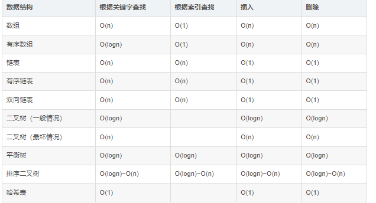
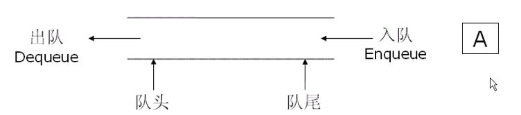

## 二叉树

### 遍历

​		前、中、后序遍历的**区别**是第几次到达这个节点的时候打印。

#### 非递归实现前、中、后序遍历

> 前序遍历

+ 方法一：弹出栈打印，先压右孩子，再压左孩子。

  ```java
  if(root!=null){
              Stack<TreeNode> stack=new Stack<>();
              stack.add(root);
              if(!stack.empty()){
                  root=stack.pop();
                  //弹出栈打印
                  System.out.println(root.val);
                  if(root.right!=null)
                      stack.push(root.right);
                  if(root.left!=null)
                      stack.push(root.left);
              }
          }
  ```

+ 方法二：根节点入栈，打印根节点，访问左子树，做到头之后，取出栈顶节点，访问右子树

  ```java
  Stack<TreeNode> stack = new Stack<>();
  while(root!=null||!stack.empty()){
      while(root!=null){
          //一直往左走
          stack.push(root);
          System.out.println(root.val);
          root=root.left
      }
      root=stack.pop();
      root=root.right;
  }
  ```


> 中序遍历

+ 因为是**左-根-右**，整条左边界依次入栈，之后弹出打印节点，然后来到弹出节点的右树上继续执行。

  ```java
   Stack<TreeNode> stack = new Stack<>();
   while(root != null || !stack.isEmpty()){//只要当前节点不为空(即当前节点的左右子树没有访问完毕)或者栈中还有节点(还有节点没有访问)
       //只要还有左子树
       while(root != null){
           stack.push(root);//根节点入栈
           root = root.left;//访问左子树
       }
       root = stack.pop();//取出左子树的根节点
       System.out.println(root.val);//打印根节点
       root = root.right;//访问右子树
   }
  ```


> 后序遍历

+ 跟前序遍历的两个方法类似。因为是**左-右-根**，所以再定义一个栈，先放入根，再放右，再放左。

  ```java
  Stack<TreeNode> stack1 = new Stack<>();
  Stack<TreeNode> stack2 = new Stack<>();
  if(root == null) return list;
  while(!stack.empty()){
      TreeNode node = stack1.pop();
      //先放入根
      stack2.push(node.val);
      //因为stack2得继续放入右，所以stack1得先放入左，再放入右
      if(node.left != null)
     	    stack.push(node.left);
      if(node.right != null)
      	stack.push(node.right);
  }
  ```

---


## 查找

### 二分查找

#### 普通二分

```java
int binary_search(int[] nums, int target) {
    int left = 0, right = nums.length - 1; 
    while(left <= right) {
        int mid = left + (right - left) / 2;
        if (nums[mid] < target) {
            left = mid + 1;
        } else if (nums[mid] > target) {
            right = mid - 1; 
        } else if(nums[mid] == target) {
            // 直接返回
            return mid;
        }
    }
    // 直接返回
    return -1;
}
```

#### 搜索左边界

+ 循环过后的left，是夹着target值的两个元素的**右边元素的下标**。也就是**nums[left]>=target**。

+ 可以这样想：搜索左边界，所以右边界，一直移到target左边才停止；搜索右边界同理。

  

```java
int left_bound(int[] nums, int target) {
    int left = 0, right = nums.length - 1;
    while (left <= right) {
        int mid = left + (right - left) / 2;
        if (nums[mid] < target) {
            left = mid + 1;
        } else if (nums[mid] > target) {
            right = mid - 1;
        } else if (nums[mid] == target) {
            // 别返回，右侧边界左移
            right = mid - 1;
        }
    }
    // 最后要检查 left 越界的情况
    if (left >= nums.length || nums[left] != target)
        return -1;
    return left;
}
```

#### 搜索右边界

+ 循环过后的right，是夹着target值的两个元素的**左边元素的下标**。也就是**nums[right]<=target**。

```java
int right_bound(int[] nums, int target) {
    int left = 0, right = nums.length - 1;
    while (left <= right) {
        int mid = left + (right - left) / 2;
        if (nums[mid] < target) {
            left = mid + 1;
        } else if (nums[mid] > target) {
            right = mid - 1;
        } else if (nums[mid] == target) {
            // 别返回，左侧边界右移
            left = mid + 1;
        }
    }
    // 最后要检查 right 越界的情况
    if (right < 0 || nums[right] != target)
        return -1;
    return right;
}
```

----

### 查找树

#### 二叉排序树

又称**二叉查找树**。它或者是一颗空树，或者具有以下特点：

+ 若它的左子树不空，则左子树上所有节点的值均小于它的根节点的值。
+ 若它的右子树不空，则右子树上所有节点的值均大于它的根节点的值。
+ 它的左右子树也均是二叉排序树。

#### 二叉平衡树（AVL树）

特点：

+ 它是一种**高度平衡的二叉平衡树**，其**左右子树的高度最多相差1**。
+ 在插入、删除数据时通过左旋/右旋操作保持二叉树的平衡。
+ **查找的时间复杂度是O(logn)，而插入删除也为O(logn)**。

在作为数据库索引的数据结构时的弊端：

+ 一个结点存储一个元素，那么在元素非常多的时候，可能需要树的度和高度都非常大，这使得磁盘IO操作次数非常多（访问一次树的结点就是一次IO，IO的次数取决于树的高度）。为了打破一个结点只能存储一个元素的限制，引入了**多路查找树**的概念。
+ AVL树不支持查询范围的快速查找（只有B+树才支持）。

#### 多路查找树

##### 2-3树/2-3-4树

特点：

+ 每个结点拥有2个孩子或3个孩子（或4个孩子）。
+ 一个2结点包含一个元素和两个孩子（或没有孩子），**注意与二叉排序树不同，不能只有一个孩子**。
+ 一个3结点包含一大一小两个元素和三个孩子（或没有孩子）。
+ 一个4结点包含大中小三个元素和四个孩子（或没有孩子）。

##### B树

概述：

​		**B树是一种平衡的多路查找树**，2-3树、2-3-4树都是B树的特例。**结点最大的孩子数目称为B树的阶**。

m阶的B树具有以下特点：

+ 每个结点的值（索引）都是按递增次序排序存放的，左小右大。

+ 如果根结点不是叶结点，那么其最少有两个子树。
+ 每个非根的分支结点（非根非叶）都有k-1个元素和k个孩子，其中k的范围为[Math.ceil(M/2)，M]。
+ 所有叶子都处于同一层。
+ 所有分支结点包含下列数据：（n,A0,K1,A1,K2...Kn,An）。其中Ki是关键字（值、索引），Ai是指向子树的指针，且Ai-1指向的子树所包含的索引值均小于Ki。n是关键字K的个数，也就是第三条中的k。


为什么使用B树可以大幅减少IO次数呢？

​		假设要处理的数据很大，因此无法将B树一次全部装入内存。因此我们只需要调整B树，使其阶数与硬盘存储的页面大小相匹配。比如一棵B树的阶为1001，也就是一个结点能够存放1000个关键字，高度为3，那么它可以存储超过10亿个关键字。我们可以让根节点永久保留在内存中，那么查找某一个关键字的至多需要两次IO即可。

​		但是B树还是有缺陷的，假如说要找到10到30之间的元素个数，那么找到小于15的元素个数之后，还要从根结点继续查找。

##### B+树

B树和B+树最主要的区别在于**非叶子结点是否存储数据**的问题。B+树特别适合带范围的查找。

特点：

+ B+树的非叶子结点不存储数据。
+ 出现在分支结点中的元素会被当做它们在该分支节点位置的中序后继者（叶子结点）中再次列出。所有分支结点包含的关键字可以看成索引，仅含有其子树中最大（或最小）的关键字。
+ 叶子节点之间使用双向指针连接，最底层的叶子节点形成了一个双向有序链表。


##### 红黑树

​	**解决二叉树多次插入新的节点导致不平衡的问题**

1.节点颜色有红色和黑色
【2-3树到红黑树的转化已经解释过】

2.根节点必为黑色
【2-3树中如果根节点为2节点，那么它本来就对应红黑树中黑节点；如果根节点为3节点，也可以用黑色节点表示较大的那个元素，然后较小的元素作为左倾红节点存在于红黑树中】

3.所有叶子节点都是黑色
【此处提到的叶子其实是空链接null】

4.任意节点到叶子节点经过的黑色节点数目相同

【红黑树中的红节点是和黑色父节点绑定的，在2-3树中本来就是同一层的，只有黑色节点才会在2-3树中真正贡献高度，由于2-3树的任一节点到空链接距离相同，因此反应在红黑树中就是黑色完美平衡】

5.不会有连续的红色节点
2-3树中本来就规定没有4节点，2-3-4树中虽然有4节点，但是要求在红黑树中体现为一黑色节点带两红色儿子，分布左右，所以也不会有连续红节点

### 哈希表查找

**概述**：

+ 散列技术是在记录的存储位置和它的关键字之间建立一个确定的对应关系f，使得每一个关键字key对应一个存储位置f（key）。
+ 对应关系f称为**散列函数**，又称**哈希函数**。
+ 采用散列技术将记录存储在一块连续的存储空间中，这块连续存储空间称为**散列表（哈希表）**。

**步骤**：

+ 在存储时，通过散列函数计算记录的散列地址，并按此地址存储该记录。
+ 在查找时，同样通过计算的散列地址，找到该记录。

**特点**：

+ 散列技术最适合的求解问题是查找与给定值相等的记录，省的比较了。
+ 设计一个**简单、均匀、存储利用率高、冲突少**的散列函数极为重要。

#### 散列函数的构造方法

+ **直接定址法**：也就是取关键字的某个线性值作为地址，需要事先知道关键字的分布情况，用的很少。
+ **数字分析法**：抽取关键字的一部分来做某些运算，适合关键字位数很多的情况（比如手机号）。
+ **平方取中法**：对关键字平方再取中间几位作为地址，适合不知道关键字的分布，而位数比较少的情况。
+ **折叠法**：将关键字分割再做相加等处理。
+ **除留余数法**：（**最常用的方法**）对于散列表长为m的散列函数公式：`f(key)=key mod p(p≤m)`当然，还可以对关键字折叠、平方之类的操作之后再取模。
+ **随机数法**：`f(key)=random(key)`适合关键字长度不等的情况。

#### 处理散列冲突的方法

+ **再散列函数法**：事先准备多个散列函数，每当发生散列地址冲突时，就换一个散列函数。
+ **链地址法**：将所有关键字为同义词的记录存储在一个单链表中，不过也带来了查找时遍历单链表的损耗。
+ **公共溢出区法**：将所有冲突的元素放在一个公共溢出区。
+ **开放地址法**：一旦发生冲突，就去寻找下一个空的散列地址，只要散列表足够大，总能找到空的散列地址。

#### 散列表查找的性能分析

+ 散列函数是否均匀。
+ 处理冲突的方法。
+ 散列表的装填因子。（装填因子α=填入表的记录个数/散列表的长度）

## 链表

#### 找单向链表的倒数第k个结点

​	由于单链表不知道其长度n，如果用for循环n-k个节点找的话，需要先遍历链表一次确定长度n，因此需要遍历两次，不太行。

​	**解法**：使用双指针，p1，p2都指向头结点，先让p1走k步，然后p1，p2同时走，直到p1走到链表尾的null此时p2的位置就是倒数第k个节点。

## 常见数据结构的时间复杂度



## 排序、 


### 冒泡排序(N^2)

==时间复杂度O(N^2)，额外空间复杂度O(1)，实现可以做到稳定性==。第一次遍历N,第二次N-1，第三次N-2，最后1，共[N+(N-1)+(N-2)+(N-3)+.....+1]

**基本思想**：通过对待排序序列从前向后（从下标较小的元素开始） ,依次比较相邻元素的值， 若发现逆序则交换。一共进行数组的个数-1次排序。==每次把最大的值交换到后面==。

**优化**：如果一趟比较下来没有进行过交换， 就说明序列有序， 因此要在排序过程中设置一个标志 flag 判断元素是否进行过交换。    

```java
public static void bubbleSort(int[] arr){
      if(arr == null || arr.length<2){
            return;
      }

    //用来优化的标志，如果在这一趟排序中，若flag最后仍为FALSE，则说明已经有序
    boolean flag = false;
    int temp = 0; //临时变量，用来交换
    
    //一共进行arr.length-1次大的循环
    for(int i = 0 ; i < arr.length - 1; i ++){
        for(int j = 0; j < arr.length -1- i; j++){
            if(arr[j] > arr[j+1]) {
                flag = true; //发生了交换就将flag赋为true
                temp = arr[j];
                arr[j] = arr[j+1];
                arr[j+1] = temp;
            }
        }
        if(!flag){  // 在一趟排序中， 一次交换都没有发生过，排序已经完成
            break;
        }else{
            flag = false;
        }
    }
}
```

---

### 选择排序(N^2)

==时间复杂度O(N^2)， 额外空间复杂度O(1)， 不可以做到稳定性==

**基本思想：**第一次从 arr[0]~arr[n-1] 中选取最小值，与 arr[0]交换， 第二次从 arr[1]~arr[n-1]中选取最小值， 与 arr[1]交换， 第三次从 arr[2]~arr[n-1]中选取最小值， 与 arr[2]交换， …， 第 i 次从 arr[i-1]~arr[n-1]中选取最小值， 与 arr[i-1]交换， …, 第 n-1 次从 arr[n-2]~arr[n-1]中选取最小值，与 arr[n-2]交换， 总共通过 n-1 次， 得到一个按排序码从小到大排列的有序序列。==每次把最小的值交换到前面==

```java
public static void selectSort(int[] arr){
     for(int i = 0; i < arr.length-1; i ++){
         int minIndex = i;  //将i作为当前的最小值
         for(int j = i+1; j < arr.length; j ++){
            minIndex =  arr[minIndex] > arr[j] ? j:minIndex;
         }
         swap(arr,i,minIndex);
      }
}

public static void swap(int[] arr, int i, int j){
     int temp = arr[i];
     arr[i] = arr[j];
     arr[j] = temp;
}
```

---

### 插入排序(N^2)

==时间复杂度O(N^2)， 额外空间复杂度O(1)， 实现可以做到稳定性 ，最好O(N)==

**基本思想：**把 n 个待排序的元素看成为一个有序表和一个无序表， 开始时有序表中只包含一个元素， 无序表中包含有 n-1 个元素， 排序过程中每次从无序表中取出第一个元素， 把它的排序码依次与有序表元素的排序码进行比较， 将它插入到有序表中的适当位置， 使之成为新的有序表。  

```java
public static void insertSort(int[] arr){

    if(arr == null || arr.length < 2){
        return;
    }

    //从第1个数与第0个数的对比开始
    for(int i = 1; i < arr.length; i ++){
        for(int j = i - 1; j >= 0; j --){ 
            //比较当前的数和它后面的数的大小，前面已经排好序了
            if(arr[j] > arr[j+1]){
                swap(arr,j,j+1);
            }
        }
    }
}

public static void swap(int[] arr, int i, int j){
    int temp = arr[i];
    arr[i] = arr[j];
    arr[j] = temp;
}
```

---

### 希尔排序(O < N^2)

​		是插入排序的改进版本，是第一批时间复杂度突破 O(N^2) 的算法。将原本大量记录数的记录进行分组，分割成若干个子序列，然后对这些子序列内分别进行插入排序，当整个序列**基本有序**时，再对全体记录进行一次直接插入排序。

```java
public class ShellSort {
    //核心代码---开始
    public static void sort(Comparable[] arr) {
        int j;
        for (int gap = arr.length / 2; gap >  0; gap /= 2) {
            for (int i = gap; i < arr.length; i++) {
                Comparable tmp = arr[i];
                for (j = i; j >= gap && tmp.compareTo(arr[j - gap]) < 0; j -= gap) {
                    arr[j] = arr[j - gap];
                }
                arr[j] = tmp;
            }
        }
    }
}
```

```java
class Solution {
	public  void shellsort(int[] arr) {
        for (int gap = arr.length / 2; gap > 0; gap /= 2)
            for (int i = gap; i < arr.length; i++) {
                for (int j = i; j >= gap; j -= gap) {
                    if (arr[j] < arr[j - gap]) {
                        swap(arr, j, j - gap);
                    } else {
                        break;
                    }
                }
            }
//交换


    }

    public void swap(int[] nums, int i, int j) {
        int tem = nums[i];
        nums[i] = nums[j];
        nums[j] = tem;
        return;
    }
}
```


### 归并排序/分治(N*logN)

==时间复杂度O(N*logN)， 额外空间复杂度O(N)， 实现可以做到稳定性==。递归实际利用的是栈结构。

```java
public static void mergeSort(int[] arr){
    if(arr == null || arr.length < 2){
        return;
    }

    sortProcess(arr, 0, arr.length-1);
}

/**
* 排序的过程（分 + 治）
* @param arr 要排序的数组
* @param l  左边的索引
* @param r  右边的索引
*/
public static void sortProcess(int[] arr, int l , int r) {

    if (l == r) {
        //递归结束的条件(base case)
        //说明此时待排序的数组中只有一个数
        return;
    }

    int mid = l + ((r - l) >> 1);
    sortProcess(arr, l, mid);  //对左半部分排序
    sortProcess(arr, mid + 1, r);  //对右半部分排序

    merge(arr, l, mid, r);  //合并相邻的有序子序列
}

/**
     * 合并相邻的有序序列
     * @param arr
     * @param l
     * @param mid
     * @param r
     */
public static void merge(int arr[], int l, int mid, int r){
    int[] helper = new int[r - l + 1]; //辅助数组，用来暂存合并后的有序数据
    int i = 0; //指示helper中第一个为空的位置，即下一个元素要插入的位置

    int p1 = l; //指向左半部分的第一个元素
    int p2 = mid + 1; //指向右半部分的第一个元素


    //当两个指针都不越界时
    //越界指当p1指向了右半部分或者当p2大于r之后
    while(p1 <= mid && p2 <= r){
        helper[i++] = arr[p1] < arr[p2] ? arr[p1++] : arr[p2++];
    }

    //当p1越界，将右半部分数组的剩余部分复制到helper
    while(p2 <= r){
        helper[i++] = arr[p2++];
    }

    //当p2越界，将左半部分数组的剩余部分复制到helper
    while(p1 <= mid){
        helper[i++] = arr[p1++];
    }

    //将helper中元素复制到arr中的对应位置
    for(int j = 0; j < helper.length; j ++){
        arr[l+j] = helper[j];
    }
}
```

---

### 快速排序(N*logN)

相当于冒泡排序的升级，同属交换排序类。

==基本思想==：通过一趟排序将待排记录分割成独立的两部分，其中一部分记录的关键字均比另一部分记录的关键字小，则可分别对这两部分记录继续进行排序，以达到整个序列有序的目的。

**快排的最坏情况为：**

​	待排序的序列为正序或者逆序，每次划分只得到一个比上一次划分少一个记录的子序列，另一个为空。

```java
class Solution {
    public int[] sortArray(int[] nums) {
        sort(nums,0, nums.length-1);
        return nums;
    }
    public  void sort(int[] array,int left,int right) {
        if (left>=right)return;
        int base=(int)(Math.random()*(right-left+1))+left;
        int i = left;
        int j = right;
        while (i<j){
            while (base<j&&array[j]>=array[base]){
                j--;
            }         
            swap(array,j,base);
            base = j;
            while (base>i&&array[i]<=array[base]){
                i++;
            }        
            swap(array,i,base);
            base = i;

        }
        sort(array, left, base-1);
        sort(array, base+1, right);
        return;
    }
    public  void swap(int[] array,int left,int right) {
        int tmp = array[left];
        array[left]= array[right];
        array[right]=tmp;
        return;
    }
}
```


```java
public class QuickSort {
    public static void quickSort(int[] arr,int low,int high){
        int i,j,temp,t;
        if(low>high){
            return;
        }
        i=low;
        j=high;
        //temp就是基准位
        temp = arr[low];
        while (i<j) {
            //先看右边，依次往左递减
            while (temp<=arr[j]&&i<j) {
                j--;
            }
            //再看左边，依次往右递增
            while (temp>=arr[i]&&i<j) {
                i++;
            }
            //如果满足条件则交换
            if (i<j) {
                t = arr[j];
                arr[j] = arr[i];
                arr[i] = t;
            }
 
        }
        //最后将基准为与i和j相等位置的数字交换
         arr[low] = arr[i];
         arr[i] = temp;
        //递归调用左半数组
        quickSort(arr, low, j-1);
        //递归调用右半数组
        quickSort(arr, j+1, high);
    }
 
 
    public static void main(String[] args){
        int[] arr = {10,7,2,4,7,62,3,4,2,1,8,9,19};
        quickSort(arr, 0, arr.length-1);
        for (int i = 0; i < arr.length; i++) {
            System.out.println(arr[i]);
        }
    }
}
```


```java
public void quickSort (int[] nums, int low, int high) {
        if(low >= high) return;
        int povit = Partition(nums, low, high);
        quickSort(nums, low, povit - 1);
        quickSort(nums, povit + 1, high);
    }
public int Partition (int[] nums, int low, int high) {
        int m = low + (high - low) / 2;
        int temp;
        //将nums[low]三数取其中
        if (nums[low] > nums[high]) {
            temp = nums[low];
            nums[low] = nums[high];
            nums[high] = temp;
        }
        if (nums[m] > nums[high]) {
            temp = nums[m];
            nums[m] = nums[high];
            nums[high] = temp;
        }
        if (nums[m] > nums[low]) {
            temp = nums[m];
            nums[m] = nums[low];
            nums[low] = temp;
        }
        
        //将nums[low]的值先存到povit中，采取赋值方法（而非交换）
        int povit = nums[low];
        while (low < high) {
            while (low < high && nums[high] >= povit) high--;
            nums[low] = nums[high];
            while (low < high && nums[low] <= povit) low++;
            nums[high] = nums[low]; 
        }
        nums[low] = povit;//此时low=high
        return low;
    }
```

#### 寻找第k大的数（基于快速排序）

```java
public int findKthLargest(int[] nums, int k) {
       myQuickSort(nums,k,0,nums.length-1);
       return nums[nums.length-k];
    }

public void myQuickSort(int[] nums,int k,int low,int high){
        int len=nums.length;
        if(low>=high) return;
        int povit=Partition(nums,low,high);
    //主要是增加判断，减少不必要的排序
        if(povit==len-k) return;
        else if(povit<len-k) myQuickSort(nums,k,povit+1,high);
        else myQuickSort(nums,k,low,povit-1); 
}

    public int Partition(int[] nums,int low,int high){
            int m=low+(high-low)/2;
            int temp;
            //将nums[low]三数取其中
            if(nums[low]>nums[high]){
                temp=nums[low];
                nums[low]=nums[high];
                nums[high]=temp;
            }
            if(nums[m]>nums[high]){
                temp=nums[m];
                nums[m]=nums[high];
                nums[high]=temp;
            }
            if(nums[m]>nums[low]){
                temp=nums[m];
                nums[m]=nums[low];
                nums[low]=temp;
            }
            int povit=nums[low];
            while(low<high){
                while(low<high&&nums[high]>=povit) high--;
                nums[low]=nums[high];
                while(low<high&&nums[low]<=povit) low++;
                nums[high]=nums[low]; 
            }
            nums[low]=povit;
            return low;
    }
```

---

### 堆排序(N*logN)

​		相当于简单选择排序的升级，==时间复杂度O(NlogN)， 额外空间复杂度O(NlogN)， 不可以做到稳定性==  。建立大顶堆是O(N），二叉树的高度是O(logN)，每次调整的最大次数是O(logN)。

堆结构：完全二叉树。位置i的左孩子的下标是2i+1，右孩子的下标是2i+2，父节点的下标(i-1)/2。

每个结点的值都大于或等于其左右孩子结点的值， 称为**大顶堆**。注意 : 没有要求结点的左孩子的值和右孩子的值的大小关系。     


建立大顶堆的过程：

+ heapInsert: 分别比较数组中的元素和父节点的大小，若大于父节点的大小，则交换顺序，i的父节点是(i-1)/2
+ heapFy: 父节点和两个孩子中较大的比较，若小于孩子中较大的，就和孩子交换

```java
public static void heapSort(int[] arr){
    if (arr == null || arr.length < 2) {
        return;
    }

    //构造出最初的大顶堆
    for (int i = 0; i < arr.length; i++) {
        heapInsert(arr, i);
    }

    //将最大值和堆中的最后一个元素交换
    int size = arr.length;
    swap(arr, 0, --size);

    while (size > 0) {
        //将剩下的前size个元素构成大顶堆
        heapify(arr, 0, size);
        //将最大值和堆中的最后一个元素交换
        swap(arr, 0, --size);
    }
}

//将arr[index]放到合适的位置
public static void heapInsert(int[] arr, int index){
    while(arr[index] > arr[(index - 1) / 2]){  //如果当前数大于父节点，则当前数和当前父节点交换
        swap(arr,index,(index - 1) / 2);
        index = (index - 1) / 2; //让index指向交换后的位置，继续查看和交换后父节点的关系
    }
}

//将剩下的size个元素重新调整成大顶堆
public static void heapify(int[] arr, int index, int size) {
    int left = 2*index + 1;  //左孩子的位置
    while(left < size) {
        //找出左右子节点中最大的值
        int largest = (left + 1) < size && arr[left + 1] > arr[left] ? (left + 1) : left;
        ////找出父节点和孩子之间的最大值
        largest = arr[index] > arr[largest] ? index : largest;
        if (largest == index) {
            break;
        }
        //让父节点和最大的值进行交换
        swap(arr, index, largest);
        index = largest;
        left = 2 * index + 1;
    }
}

public static void swap(int[] arr, int i, int j){
    int temp = arr[i];
    arr[i] = arr[j];
    arr[j] = temp;
}
```

### Arrays.sort()

​		当size<60，使用插入排序，当size>60时，使用归并或者快速排序，其中基础类型用quick，class等对象类型。默认用merge进行，因为基础排序不在乎稳定性，只要求快，merge是稳定的。

```java
// [[5,4],[6,4],[2,3]]
// 按照第一列从小到大排列，第二列从大到小
Arrays.sort(envelopes, new Comparator<Integer>() {
    public int compare(int[] interval1, int[] interval2) {
        return interval1[0] == interval2[0] ? interval2[1] - interval1[1] 
            : interval1[0] - interval2[0];
    }
});
```

---


## 栈、队列

### 栈

​	栈：一种特殊的线性表，其只允许在固定的一端插入和删除元素操作。进行数据插入和删除操作的一端称为栈顶，另一端称为栈底。栈中的数据元素遵守后进先出LIFO (Last In First Out) 的原则；

### 队列

​	相比栈，队列的特性和栈是相反的。它只允许在一端进行插入数据操作，在另一端进行删除数据操作的特殊线性表，队列具有先进先出FIFO (First In First Out) 的特性。入队列：进行插入操作的一端称为队尾；出队列：进行删除操作的一端称为队头，对于队列来说，一种入队顺序，只有一种出队顺序。



#### 栈和队列的应用场景

​	栈：当问题关心最近一次的操作，而且需要在O（1）的时间内查找到更前的一次操作时使用栈。

​	队列：当需要按照一定的顺序来处理数据，且数据的数据量在不断的变化的时候，例如排队问题，排在对头的先处理。

## 位运算符

| 运算符 | 意义                                                         |
| ------ | ------------------------------------------------------------ |
| &      | 按位与                                                       |
| \|     | 按位或                                                       |
| ~      | 按位非                                                       |
| ^      | 按位异或：==不同为1，相同为0==                               |
| <<     | 左移：==左移n位相当于乘以2的n次方==                          |
| >>     | 右移：==右移n位相当于除以2的n次方==                          |
| <<<    | 无符号右移：与 右移>> 的区别就是无论操作数是正数还是负数，高位都是补0 |

### 左移<< 和 右移 >>


---

### 位运算的常见使用

#### 1.判断一个数的奇偶性

```java
n & 1 == 1   //奇数，奇数的二进制的最后一位肯定是1
n & 1 == 0   //偶数，偶数的二进制的最后一位肯定是0
```

#### 2.交换两个数

```java
int a = 3;
int b = 4;
a = a ^ b;
b = b ^ a;  // b = b ^ (a ^ b) --> b = a
a = a ^ b;  // a = (a ^ b) ^ (b ^ (a ^ b)) -- > a = b
```

上面的计算主要遵循了一个计算公式

```java
b ^ (a ^ b) = a
```

#### 3.n&(n-1)

等于n去掉末尾的那个0，也就是说当`n&(n-1) == 0`时，n必为2的次幂。

#### 4.快速幂

```java
public double myPow(double x, int n) {
     if(n==0) return 1;
     double res = 1;
     long a = n;
     long b = Math.abs(a);
     while(b>0){
         //当末位是1时，乘进res
         if((b&1) == 1) res = res*x;
         x *= x;
         b >>>= 1; //去掉最后一位
     }
     if(n<0) return 1/res;
     return res;
}
```


---


## ACM模式代码

### 多行输入

```java
输入：
5 10 9
0 5
9 1
8 1
0 1
9 100
输出：
43
```

```java
import java.util.Arrays;
import java.util.Scanner;

public class MUltilineInput {
    public static void main(String[] args) {
       //Scanner类默认的分隔符就是空格
        Scanner sc = new Scanner(System.in);
        while (sc.hasNext()) {
            int n = sc.nextInt();
            int full = sc.nextInt();
            int avg=sc.nextInt();
            int[][] nums=new int[n][2];
            for(int i=0;i<n;i++){
                nums[i][0]=sc.nextInt();
                nums[i][1]=sc.nextInt();
            }
            //核心代码
            ...
            
            //输出答案
            System.out.println(...);
        }
    }
}
```


### 一次读取一行数据

```java
输入：
1 2 3 4
5 6 7 8 
输出：
10
26
```

```java
import java.util.*;
  
public class Main {
    public static void main(String[] args) {
        Scanner sc = new Scanner(System.in);
        while (sc.hasNext()) {
            //以字符串的形式，读取一行数据
            String str = sc.nextLine();
            String [] strs = str.split(" ");
            int res = 0;
            for(String s : strs){
                res += Integer.parseInt(s);
            }
            System.out.println(res);
        }
        return;
    }
}
```


### 一维数组输入

```java
输入例子:
7 15
15 5 3 7 9 14 0

输出例子:  //保留两位小数
2.50
```

```java
import java.util.Arrays;
import java.util.Scanner;

public class ArrayInput {
    public static void main(String[] args){
        Scanner sc = new Scanner(System.in);
        while (sc.hasNext()){
            int n = sc.nextInt();   //存入第一个行第1个数
            long l = sc.nextLong();	//存入第一个行第2个数
            long[] nums = new long[n];
            //将第2行的数存入数组
            for (int i = 0; i < n; i++){
                nums[i] = sc.nextLong();
            }
            //核心代码
            ...
            //输出答案，保留两位小数
            System.out.println(String.format("%.2f",gap/2.0));
    }
}
```


### 二维数组输入

如果要求的测试用例需要读取二维数组，我们应该先读取二维数组的长度和宽度存在两个整数中。在下一行将一串整型数字存入二维数组中。

注意：为了换行读取可以使用`nextLine()`跳过换行。

```java
Scanner sc = new Scanner(System.in);
while(sc.hasNext()) {
    int r = sc.nextInt();  //读取行
    int c = sc.nextInt();  //读取列
    int[][] matrix = new int[r][c];
    sc.nextLine();    // 跳过行数和列数后的换行符
    for(int i=0;i<r;i++) {
        for (int j = 0; j < c; j++) {
            matrix[i][j] = sc.nextInt();
        }
    }
    //核心代码
    ...
}
```


### 链表输入

```java
//以反转链表为例
//输入是一串数字，请将其转换成单链表格式之后，再进行操作。
//输入描述: 一串数字，用逗号分隔
//输入实例: 1,2,3,4,5

import java.util.Scanner;
import java.util.Stack;

public class LinkListInput {
    //先构建一个节点类，用于链表构建
    static class LinkNode {
        int val;
        LinkNode next;
        public LinkNode(int val){
            this.val = val;
        }
    }
    
    public static void main(String[] args){
        Scanner scanner = new Scanner(System.in);
        //以字符串形式作为输入
        String str = scanner.next().toString();
        //通过分隔符将其转为字符串数组
        String[] arr  = str.split(",");
        //初始化一个整数数组
        int[] ints = new int[arr.length];
        //给整数数组赋值
        for(int j = 0; j < ints.length; j++) {
            ints[j] = Integer.parseInt(arr[j]);
        }
        //创建头节点
        LinkNode head = new LinkNode(0);
        //初始化链表
        LinkNode p = head;
        for(int i = 0; i < ints.length; i++){
            p.next = new LinkNode(ints[i]);
            p = p.next;
        }
        //核心代码
        ...
        //打印答案
        //输出： 1,5,2,4,3
        while (head != null) {
            if(head.next == null){
                System.out.print(head.val);
            }else{
                System.out.print(head.val + ",");
            }
            head = head.next;
        }  
    }
}
```


### 树的输入

```java
import java.io.BufferedReader;
import java.io.IOException;
import java.io.InputStreamReader;
import java.util.Stack;

//以判断是否是二叉搜索树为例
//给定一个二叉树，判断其是否是一个有效的二叉搜索树。
//输入：
//    5
//   / \
//  1   3
//     / \
//    4   6
//输出: false

//构造树需要的结点类
class TreeNode {
    TreeNode left, right;
    int val;
    public TreeNode(int val) {
        this.val = val;
    }
}

public class TreeInput {
    // 根据数组构造二叉树，输入格式： [5,1,3,null,null,4,6]
    public TreeNode constructBinaryTree(int[] vec) {
        TreeNode[] vecTree = new TreeNode[vec.length];
        TreeNode root = null;
        for (int i = 0; i < vec.length; i++)  {
            TreeNode node = null;
            if (vec[i] != -1)  node = new TreeNode(vec[i]);
            vecTree[i] = node;
            if (i == 0) root = node;
        }
        for (int i = 0; i * 2 + 2 < vec.size(); i++) {
            if (vecTree[i] != NULL) {
                vecTree[i]->left = vecTree[i * 2 + 1];
                vecTree[i]->right = vecTree[i * 2 + 2];
            }
    	}
    	return root;
    }
    
    public static void main(String[] args) throws IOException {
         //核心代码
        ...
    }
}
```

##### hashmap抛出第一个key

```
map.keySet().iterator().next()
```

