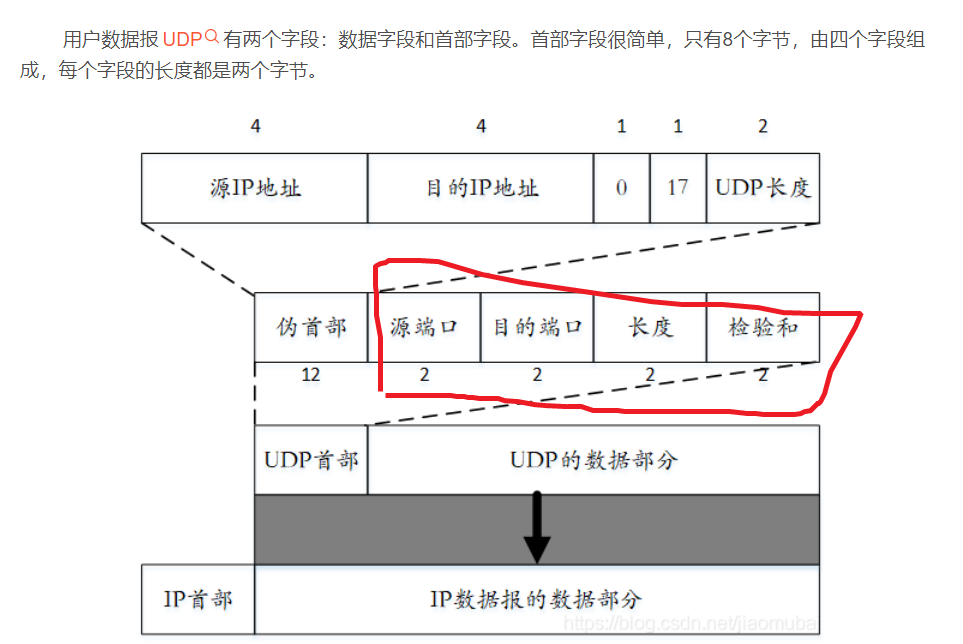
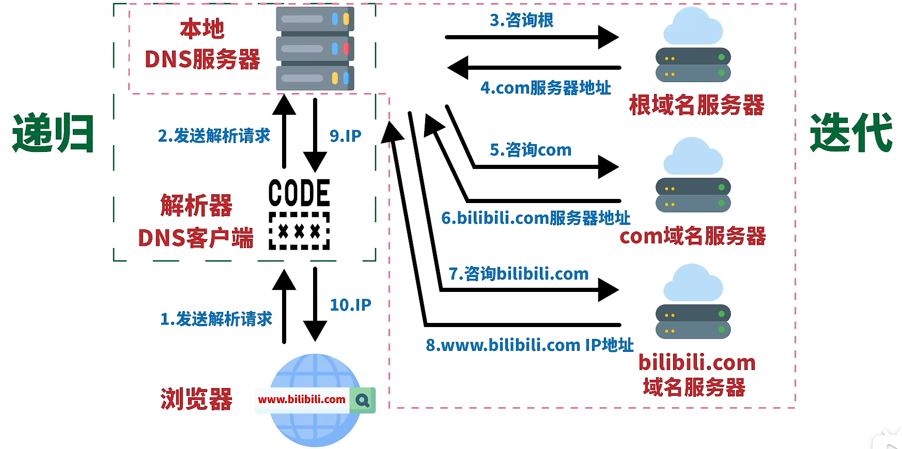
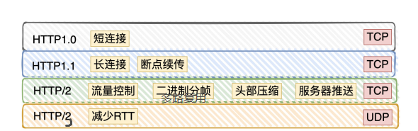
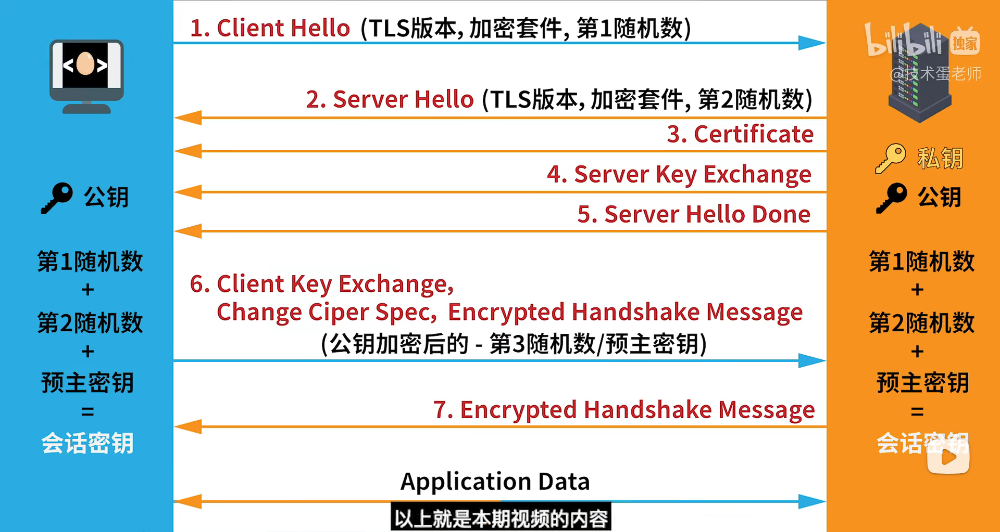

# 概述

## 在浏览器中输入 URL 地址到显示主页的过程？

1. **DNS 解析**：浏览器查询 DNS，获取域名对应的 IP 地址；
2. **ARP协议**：从 IP 地址，解析出硬件地址。
3. **TCP 连接**：浏览器获得域名对应的 IP 地址以后，浏览器向服务器请求建立链接，发起三次握手；
4. **发送 HTTP 请求**：TCP 连接建立起来后，浏览器向服务器发送 HTTP 请求；如果是HTTPs连接的话，看HTTPs的工作原理。
5. **服务器处理请求并返回 HTTP 报文**。具体是服务器接收到这个请求，根据路径参数映射到特定的请求处理器进行处理，并将处理结果及相应的视图返回给浏览器；
6. **浏览器解析渲染页面**：浏览器解析并渲染视图，若遇到对 js 文件、css 文件及图片等静态资源的引用，则重复上述步骤并向服务器请求这些资源；浏览器根据其请求到的资源、数据渲染页面，最终向用户呈现一个完整的页面。
7. **连接结束。**

**Tomcat层面**：

​	一个http请求到来，容器将请求封装为Servlet中的HttpServletRequest对象，调用init()方法，service()方法输出response，由容器包装为httpresponse返回给客户端。


### 互联网的组成


> 边缘部分

+ 由所有连接在互联网上的主机组成，这部分是**用户直接使用的**。这些主机又称为**端系统**。
+ 按照通信方式可分为：**客户-服务器方式**（C/S方式）和**对等方式**（P2P方式）。

> 核心部分

+ 由大量网络和连接这些网络的路由器组成，**为边缘部分提供服务**。
+ 在网络核心部分起特殊作用的是**路由器**，是一种专用计算器。
+ ==路由器（网络层）==是实现**分组交换**的关键，其任务是**转发收到的分组**，也就是把数据（IP报文）传送到正确的网络。

> 分组交换

+ 分组交换采用**存储转发**技术。

+ 需要发送的整块数据称为一个**报文**。

+ 把一个报文划分成几个分组，再加上一些控制信息组成的**首部**，就构成了一个**分组**。分组又称为**包**，首部又称为**包头**。

  

---

### 五（七）层协议的体系结构


> 五层协议：

**1、应用层**

* 是体系结构的最高层。
* 是通过**应用进程间的交互**来完成特定的网络应用。
* 其定义的是**应用进程间通信和交互的规则**。

**2、运输层**（包括两种协议）

* 任务是负责向**两台主机中进程之间的通信**提供**通用的数据传输**服务。
* **传输控制协议TCP**：提供**面向连接、可靠**的数据传输服务，其数据传输的单位是==报文段==。
* **用户数据报协议UDP**：提供**无连接的、尽最大努力**的数据传输服务，（**不能保证数据传输的可靠性**），其数据传输的单位是**用户数据报**。

​	传输层可能⼤家刚接触的时候，会认为它负责将数据从⼀个设备传输到另⼀个设备，事实上**它并不负责**  实际场景中的⽹络环节是错综复杂的，中间有各种各样的线路和分叉路⼝，**如果⼀个设备的数据要传输给另⼀个设备，就需要在各种各样的路径和节点进⾏选择，⽽传输层的设计理念是简单、⾼效、专注，如果传输层还负责这⼀块功能就有点违背设计原则了**。  

**3、网络层**

​	⽹络层负责将数据从⼀个设备传输到另⼀个设备，通过IP地址这个设备的编号，进行寻址和路由将数据从一个设备传输到另一个设备。

+ 负责不同主机间的通信服务。
+ 发送数据时，网络层把运输层产生的报文段或用户数据报封装成**分组**或==包==进行传送。
+ 在TCP/IP协议中，分组也叫作IP数据报。
+ 互联网是由大量**异构**网络通过路由器相互连接起来的。
+ **异构网络**：如果一个网络中包含不同的操作系统或者不同的网络架构，那么称这个网络为异构网络。

​		IP 协议的寻址作⽤是告诉我们去往下⼀个⽬的地该朝哪个⽅向⾛，路由则是根据「下⼀个⽬的地」选择路径。寻址更像在导航，路由更像在操作⽅向盘。  

**4、数据链路层**

+ 数据层将网络层交下来的IP数据报**组装成帧**，在两个相邻节点间的链路上传送==帧==。
+ 每一帧包括数据和必要的**控制信息**。
+ 控制信息还使接收端能够检测到所收到的帧中有无差错。如有差错，**丢弃帧**；如需改正数据，就要采用可靠传输协议来纠正出现的差错。
+ 上面那一条也说明，数据链路层**不仅要检错，而且要纠错**。

那问题来了，路由器怎么知道这个 IP 地址是哪个设备的呢？
	于是，**就需要有⼀个专⻔的层来标识⽹络中的设备，让数据在⼀个链路中传输，这就是数据链路层（Data LinkLayer），它主要为⽹络层提供链路级别传输的服务**。  每⼀台设备的⽹卡都会有⼀个 MAC 地址，它就是⽤来唯⼀标识设备的。路由器计算出了下⼀个⽬的地 IP 地址，再通过 ARP 协议找到该⽬的地的 MAC 地址，这样就知道这个 IP 地址是哪个设备的了。  

**5、物理层**

+ 在物理层上所传数据的单位是==比特==。

> 七层协议

| OSI七层参考模型 | 说明                                                         |
| --------------- | ------------------------------------------------------------ |
| 应用层          | 可以和用户交互，能产生网络流量的应用程序，如：QQ、浏览器等   |
| 表示层          | 负责数据格式转换，将应用处理的信息转换为适合网络传输的格式，或将下一层数据转换成上一层能处理的消息 |
| 会话层          | 建立及管理会话                                               |
| 传输层          | 提供可靠传输、不可靠传输、流量控制，分割与重组数据，能够错误纠正，失败重传 |
| 网络层          | 负责选择最佳路径，规划IP地址                                 |
| 数据链路层      | 将数据包封装成帧，透明传输，差错校验，只检错不纠错，发送数据有错误就丢弃 |
| 物理层          | 负责网络通信的二进制比特流传输                               |

---

### 每一层对应的网络协议有哪些？

| 层级       | 网络协议                                                     |
| ---------- | ------------------------------------------------------------ |
| 应用层     | HTTP、文件传输协议FTP、域名系统DNS、安全外壳协议SSH、动态主机配置协议DHCP |
| 传输层     | TCP、UDP                                                     |
| 网络层     | 网际协议IP、地址解析协议ARP、网际控制报文协议ICMP            |
| 数据链路层 | 自动重传请求协议ARQ、点对点协议PPP                           |
| 物理层     | 中继器、集线器、网线                                         |

---

### 数据传递过程


**对等层**：因为上图的复杂过程对用户屏蔽，所以觉得进程AP1直接把数据交给了AP2。对于任何两个相同的层次，也好像如同上图虚线一样传递给了对方，这就是所谓对等层之间的通信。

**协议栈**：因为这几个层次画在一起很像一个**栈**结构。

**协议数据单元PDU**：OSI把对等层之间传送的数据单位称为该层的**协议数据单元PDU**。

### TCP/IP的体系结构

​	TCP/IP,是包含了一系列构成互联网基础的网络协议，是Internet的核心协议，基于TCP/IP的参考模型将协议分成四个层次，分别是链路层(网络接口层)、网络层、传输层和应用层。

​	TCP/IP协议族按照层次由上到下，层层包装。最上面是应用层，第二层是传输层有TCP和UDP协议，第三层是网络层，ip协议就在这里，它负责对数据加上ip地址和其他数据以及确定传输的目标。第四层是数据链路层，为待传送的数据加一个以太网协议头为最后的数据传输做准备。


> 沙漏计时器形状的TCP/IP协议族示意


可以看到：

+ TCP/IP协议可以为各式各样的应用提供服务（所谓everything over IP）。
+ TCP/IP协议允许IP协议在各式各样的网络构成的互联网上运行（所谓IP over everything）。

---

### 各层中间设备的名称

将网络互联起来要使用一些**中间设备**。有以下四种不同的中间设备：

+ 物理层使用的中间设备叫做**转发器**。
+ 数据链路层使用的中间设备叫做**交换机**。
+ 网络层使用的中间设备叫做**路由器**。
+ 网络层以上使用的中间设备叫做**网关**。用网关连接两个不兼容系统需要在高层进行协议的转换。由于比较复杂，目前用的比较少。有时把路由器也称为网关。

虽然**没有一种单一网络能够适应所有用户的需求**，但是我们可以==利用IP协议使这个网络在网络层看起来好像是一个统一的网络==。

---


# 1、物理层

### 基本概念

+ 考虑的是怎么才能在连接各种计算机的传输媒体上传输数据比特流。
+ 可以将物理层的主要任务描述为确定与传输媒体的接口有关的一些特性，比如：机械特性（接线器的形状、尺寸），电器特性（接口电缆上电压的范围），功能特性（某条线上电压的意义）......

> 作用

+ 尽可能地屏蔽掉这些传输媒体和通信手段的差异，使物理层上面的数据连接层感觉不到这些差异，这样就可以让数据链路层只需要考虑如何完成本层的协议和服务。

> 通信方式分类

+ **单向通信**，又称为**单工通信**。
+ **双向交替通信**，又称为**半双工通信**。
+ **双向同时通信**，又称为**全双工通信**。

### 信道复用技术

> 频分复用FDM

+ 所有用户在同样的时间占用不同的带宽资源。
+ 

> 时分复用TDM

+ 所有用户在不同的时间占用同样的频带宽度。
+ 

> 统计时分复用STDM

+ 是一种改进的时分复用，**集中器**常使用这个统计时分复用。
+ STDM帧不是固定分配时隙，而是按需动态地分配时隙。
+ 统计复用又称为**异步时分复用**。
+ 

> 波分复用WDM

+ 就是**光的频分复用**。
+ 现在已经能做到在一根光纤上复用几十路或更多路数的光载波信号，称为**密集波分复用**。

> 码分复用CDM

+ 也称为**码分多址CDMA**。

### 宽带接入技术

**1、ADSL技术**

+ 非对称数字用户线ADSL技术对现有的模拟电话用户线进行改造，使其能够承载宽带数字业务。

**2、光纤同轴混合网（HFC网）**

+ 是在目前覆盖面很广的有线电视网的基础上开发的一种居民宽带接入网。

**3、FTTx技术**

+ 光纤到户FTTH。
+ 为了有效地利用光纤资源，在光纤干线和用户之间广泛使用无源光网络PON。

---


# 2、数据链路层

数据链路层把网络层交下来的==IP数据报添加首部和尾部封装成帧发送到链路上==，以及把==接收到的**帧**中的数据取出并上交给网络层==。

数据链路层主要属于计算机网络的低层，使用的信道主要有以下两种类型：

+ **点对点信道**：使用一对一的点对点通信方式。
+ **广播信道**：使用一对多的广播通信方式。

### CRC校验

​	

### 使用点对点信道的数据链路层

#### 数据链路和帧

+ **数据链路**：在一条线路上传输数据时，除了必须有一条物理线路外，还必须有一些必要的通信协议来控制这些数据的传输。若把**实现这些协议的硬件和软件加到链路上**，就构成了数据链路。现在常使用**网络适配器**来实现这些协议。
+ **帧**：点对点信道的数据链路层的协议数据单元。


---

#### 封装成帧

+ 封装成帧就是在一段数据的前后分别添加首部和尾部，这样就构成了一个帧。

+ 首部和尾部的一个重要作用就是**帧定界**。此外，还有很多必要的控制信息。

+ 每一种链路层协议都规定了所能传送的帧的**数据部分长度上限——最大传送单元MTU**(Maximum Transfer Unit)。

  

+ 当数据是有ASCII码组成的文本文件时，帧定界可以使用特殊的**帧定界符**。

  

---

#### 透明传输

​		==不管传输什么样的比特组合，这样的传输就是透明传输==。当数据中存在与帧结束符相同的数据，就必须采取适当措施来处理，否则计算机会误认为该数据就是帧结束符，造成数据接收不完整。

+ ==字节填充法==：在发送端，在一串比特流尚未加上SOH、EOT时，先用硬件扫描整个帧，在控制字符前插入转义字符 "ESC"，接收端将数据送往网络层前删除插入的转义字符。


+ ==零比特填充法==：在发送端，在一串比特流尚未加上帧头帧尾时，先用硬件扫描整个帧，只要发现 5 个连续 1，则立即填入一个 0；在接收一个帧时，先找到帧尾以确定帧的边界，接着再用硬件对其中的比特流进行扫描，每当发现 5 个连续 1 时，就将这 5 个连续 1 后的一个 0 删除，以还原成原来的比特流。

---

#### 差错检测

+ 1变0,0变1，称为**比特差错**。一段时间内，传输错误的比特占所有传输比特总数的比例称为**误码率BER**。
+ 目前广泛使用了**循环冗余检验CRC**的检错技术。其原理是在数据后面添加供差错监测用的**冗余码**。这种冗余码成为**帧检验序列FCS**。
+ 现在的通信网络采用区别对待：
  1. 对于通信质量较好的有线链路，不使用确认和重传机制，即不要求数据链路层向上提供可靠的传输服务；
  2. 对于通知质量较差的无线传输链路，使用确认和重传机制，数据链路层向上提供可靠的传输服务。

---

#### 点对点协议PPP

PPP协议是用户计算机与ISP进行通信时所使用的的数据链路层协议。


> PPP协议应满足的要求

+ **简单**
+ **封装成帧**
+ **透明性**
+ **多种网络层协议**：必须能够在**同一条物理链路上同时支持多种网络层协议**。
+ **多种类型链路**
+ **差错检测**
+ **检测连接状态**
+ **最大传送单元**
+ **网络层地址协商**：必须使通信的两个网络层的实体能够通过协商知道或能够配置彼此的网络层协议。
+ **数据压缩协商**
+ 需要注意，在TCP/IP协议族中，**可靠传输由运输层的TCP协议负责**，因此数据链路层的PPP协议不需要进行纠错，不需要设置序号，也不需要进行流量控制。PPP协议不支持多点线路(即一个主站轮流和链路上的多个从站进行通信)，而只支持点对点的链路通信。此外，PPP协议只支持全双工链路。

> PPP协议的组成

+ 一个将IP数据报封装到串行链路的方法。
+ 一个用来建立、配置和测试数据链路连接的**链路控制协议LCP**。
+ 一套**网络控制协议NCP**。

> PPP协议的帧格式


> PPP协议的工作状态


1、**链路建立**之后，LCP开始协商一些**配置选项**，即发送LCP的**配置请求帧**。这是一个PPP帧，其信息字段包含特定的配置请求。链路的另一端可以发送以下响应中的一种：

+ **配置确认帧**：所有选项都接受。
+ **配置否认帧**：所有选项都理解但不能接受。
+ **配置拒绝帧**：选项有的无法识别或不能接受，需要协商。

2、在**网络层协议**状态，PPP链路的两端的网络控制协议NCP根据网络层的不同协议互相交换网络层特定的网络控制分组。PPP协议两端的网络层**可以运行不同的网络层协议**，但仍然可以使用同一个PPP协议进行通信。

---

### 使用广播信道的数据链路层

#### 局域网的数据链路层

特点：**网络为一个单位所拥有，且地理范围和站点数目均有限。**

**局域网的拓扑**:


+ （a）星形网。集线器和双绞线大量用于局域网。
+ （b）环形网。
+ （c）总线网。各站直接连接在总线上。

---

#### 以太网的信道利用率


​       要提高以太网的信道利用率，就必须减小τ与To之比。在以太网中定义了参数a,它是以太网单程端到端时延τ与帧的发送时间To之比:


​       从上式可以看出，参数a的值应当尽可能小些。也就是说，当数据量一定时，**以太网的连线的长度受到限制**，同时**以太网的帧长不能太短**。

---

#### 以太网的MAC层

在局域网中，**硬件地址**又称为**物理地址**或**MAC地址**。是指局域网上的每一台计算机中**固化在是适配器的ROM中的地址**，也就是每一个网卡就有一个MAC地址。

适配器有**过滤地址**，每从网络上收到一个MAC帧就先用硬件检查MAC帧中的目的地址。如果是发送本站的就收下，否则丢弃。“发送到本站的帧”包括：

（1）**单播**帧（一对一）：收到的帧的MAC地址与本站的硬件地址相同。

（2）**广播**帧（一对全体）：发送给局域网上所有站点的帧。

（3）**多播**帧（一对多）：发送给本局域网上一部分站点的帧。

##### MAC帧的格式


+ **类型**字段用来标志上一层使用的是什么协议。
+ 当数据字段的长度小于46个字节时，MAC子层就会在数据字段的后面加入一个整数字节的填充字段，以保证以太网的MAC帧长不小于64字节。当上层使用IP协议时，其首部会有一个**总长度**字段，所以网络层就把填充的整数字节丢弃。
+ **前同步码**作用是使接收器的适配器在接收MAC帧时能迅速调整其时钟频率，使它与发送端的时钟同步。
+ **帧开始定界符**的前6位与前同步码一样，后两位的11是为了告诉适配器：**MAC帧的信息马上要来啦！**
+ MAC帧的FCS字段的检验范围不包括前同步码和帧开始定界符。
+ 在以太网上传送数据时是以帧为单位来传送的，且传送时各帧之间还必须有一定的间隙。因此，接收端只要找到帧开始定界符，后面连续到达的比特流都属于同一个MAC帧。以太网**不需要使用帧结束定界符**，也**不需要使用字节插入来保证透明传输**。

---

### MAC（硬件地址） vs IP地址

+ IP 地址：IP地址是网络层以及以上各层使用的地址，互联网上的每一个网络和每一台主机分配一个 IP 地址。由于IP地址使用软件实现的，所以是==逻辑地址==。
+ MAC地址：又称为==物理地址==、硬件地址，是数据链路层和物理层使用的地址。用来定义网络设备的位置，网卡在通讯时通过 MAC 地址相互识别。

区别：

1. **分配依据不同**：IP 地址的分配是基于网络拓扑，它可以自动分配；MAC 地址的分配是由网卡生产厂家烧入网卡的，具有全球唯一性。

2. **地址能否更改不同**：IP 地址是可以更改的，MAC 地址虽然也可以更改，但一般不会更改，除非要用来绕过一些验证软件。

3. 此外，IP 地址为 32 位，MAC 地址为 48 位；IP 地址应用于 OSI 第三层，即网络层；MAC 地址应用在 OSI 第二层，即数据链路层。

---

### MSS vs MTU

1. MSS（Maximum Segment Size，最大分段大小）

   <font color='red'>MSS 是 TCP 用来限制应用层发送的最大字节数</font>。假设MTU=1500，则MSS=1500-20（IP头）-20（TCP头）=1460byte。

   因为在网络编程中，我们要尽量避免出现 IP 分片(因为如果在IP层进行分片了话，如果其中的某片的数据丢失了，对于保证可靠性的TCP协议来说，会增大重传数据包的机率，而且只能重传整个TCP分组（进行IP分片前的数据包），因为TCP层是不知道IP层进行分片的细节的，也不关心)。对于 TCP 包来说，在建立三次握手的过程中，连接双方会相互通告 MSS，每次发送的 TCP 数据都不会超过双方 MSS 的最小值，所以就保证了 IP 数据包不会超过 MTU，避免了 IP 分片。

2. MTU（Maximum Transmit Unit，最大传输单元）

   MTU 限制了数据链路层传输的数据帧大小，==以太网的 MTU 是 1500 字节==。如果传输层发送到网络层的数据 > 1500 字节，需要==IP 分片==。

---


# 3、网络层

​		==网络层向上只提供简单灵活的、无连接的、尽最大努力交付的数据报服务==

### 网际协议IP

==IP地址的编址方法经过了三个历史阶段：分类的IP地址----> 子网的划分----> 构成超网==


与IP协议配套使用的还有三个协议：

+ 地址解析协议ARP
+ 网际控制报文协议ICMP
+ 网际组管理协议IGMP

ARP在最下面是因为IP要经常使用这个协议，ICMP和IGMP画在这一层的上部，是因为它们要使用IP协议。

---

### 分类的IP地址

​		==IP地址 ::={<网络号>,<主机号>}== （**::=**：表示**“定义为“**。）

下图是各种IP地址的网络号字段和主机号字段：


IP地址的一些特点：

+ 实际上IP地址是标志一台主机（或路由器）和一条链路的**接口**。当一台主机同时连两个网络时，就必须同时具有两个相应的IP地址，这种主机称为**多归属主机**。
+ **用转发器和网桥连接起来的若干个局域网仍为一个网络**，因为这些局域网都具有同样的网络号。不同网络之间必须使用路由器进行互连。

---

#### 将IP地址分类的好处

+ IP地址管理机构在分配IP地址时**只分配网络号**。
+ 路由器**仅根据目的主机所连接的网络号来转发分组**，可以使路由表中的项目数大幅度减少，从而**减少了路由表所占的存储空间以及查找路由表的时间**。

---

### 地址解析协议ARP

作用：从网络层使用的IP地址，解析出数据链路层使用的硬件地址。

**解决方法**：在主机**ARP高速缓存**中存放一个从IP地址到硬件地址的映射表，并且这个映射表还经常动态更新。

> 过程

当主机A要向主机B发送IP数据报时，先在其ARP高速缓存中查看有无主机B的IP地址。算法如下：

+ 若有，找到对应的硬件地址。再把这个地址写入MAC帧。

+ 若没有，（可能主机B新入网，或者主机A刚加上电，其缓存还是空的），那么：

  ​		1、ARP进程先在本局域网上**广播**发送一个**ARP请求分组**，为了求得主机B的硬件地址。

  ​		2、本局域网上的所有主机ARP进程都收到了这个请求分组。

  ​		3、若主机B接收到这个请求分组，则以**单播**的形式发送一个**ARP响应分组**，告诉主机A它的硬件地址。

  ​		4、主机A收到响应分组后，就将主机B的硬件地址写入ARP高速缓存中。（高速缓存中的每一个映射地址都设置有**生存时间**）

> ARP 欺骗：伪造 IP 地址和 MAC 地址实现 ARP 欺骗
>

​		一台计算机想和 PC0 和 PC1 通信，这台计算机使用 ARP 协议询问 PC0：你的 MAC 地址是多少？由于 ARP 协议是发送广播包来询问目标 MAC 地址，PC1 也能收到这条消息，在 PC1 中装了黑客软件，这时候 PC1 告诉它：PC0 的 MAC 地址是 M2，M2 就会将 M1 覆盖，那么传输数据时，就会将原本传送给 PC0 的数据传给 PC1，PC1 收到数据后将目标 MAC 地址改为 M1，再将数据传给 M1，相当于经过了M2 的转发。

---

### IP数据报的格式


​		IP层下面的每一种数据链路层协议都规定了一个数据帧中的**数据字段的最大长度**，这称为**最大传送单元MTU**。数据报的总长度（首部+数据部分）的长度不能超过MTU的值，最常用的==以太网的MTU值是1500==。

​	其中16位的标识、3位标志位（ 0、DF、MF）中的DF（Don’t Fragment）和MF（More Fragment） 以及13位的片偏移用来IP报文的分片和重组。

分片举例：片偏移以8个字节为一个单位。


---

### 划分子网和构造超网

#### 划分子网

就是在IP地址中又增加一个**子网号字段**，使两级IP地址变为三级IP地址。又称**子网寻址**或**子网路由选择**。==IP地址 ::={<网络号>,<子网号>,<主机号>}==

具体思路：

+ 将一个网络划分为若干个**子网**，怎么分是该网络内部的事，对外**仍然表现为一个网络**。

+ 方法是**从网络的主机号借用若干位来作为子网号**，主机号也因此减少位数。

+ 先根据IP数据报的目的网络号找到连接本单位网络上的路由器，之后路由器再找到子网。

> 子网掩码

​		从IP数据报的首部无法看出源主机或目的主机所连接的网络是否进行了子网划分，此时就应该使用**子网掩码**。（网络号全为1，主机号全为0，与IP地址按位与）。

现在互联网的标准规定：

​		所有的网络都必须使用子网掩码，同时路由器的路由表中也必须有子网掩码这一栏。如果一个网络不划分子网，那么该网络的子网掩码就使用**默认子网掩码**。这样可以不用查找该地址的类别就能知道这是哪一类的IP地址，**更便于查找路由表**。

---

#### 使用子网时分组的转发

使用子网划分后，路由表必须包含以下三项内容：**目的网络地址**、**子网掩码**、**下一跳地址**。

算法如下：

+ 从收到的数据报的首部中提取目的IP地址D。
+ 先判断是否为**直接交付**。对路由器直接相连的网络逐个检查：用各网络的子网掩码与D按位相与。匹配，交付；不匹配，
+ 若路由器有目的地址为D的**特定主机路由**，则传送给该路由，否则，
+ 对路由表的每一行中的子网掩码与D相与，若结果匹配，则跳转至下一路由器，否则，
+ 若有**默认路由**，则把数据报传送给该路由，否则，报告转发分组出错。

---

#### 无分类编址CIDR（构造超网）

==IP地址 ::={<网络前缀>,<主机号>}==

最主要的特点有两个：

+ **CIDR消除了传统的A，B，C类地址以及划分子网的概念**，把32位的IP地址划分为前后两个部分。（因此IP地址又回到了两级编址，只不过是**无分类的两级编址**）。CIDR还使用**斜线记法**，或成为**CIDR记法**，即在IP地址后面加上“/”，然后写上网络前缀所占的位数。

+ CIRD把**网络前缀都相同**的连续的IP地址组成一个“**CIDR地址**“。

为了更方便地进行路由选择，CIDR使用32位的**地址掩码**。IP地址“/”后面的数字，也就是地址掩码中1的个数。

**路由聚合**：由于一个CIDR地址块中有很多地址，所以在路由表中就利用CIDR地址块来查找目的网络。路由聚合也称为**构成超网**。

> 最长前缀匹配

在使用CIDR时，由于采用网络前缀这种记法，路由表中的项目也要改变：由**网络前缀**和**下一跳地址**组成。

但是在查找路由表时可能会得到不止一个匹配结果，此时**应当从匹配结果中选择具有最长网络前缀的路由**，叫做**最长前缀匹配**。又称为最长匹配或最佳匹配。

> 使用二叉线索查找路由表

二叉线索是一种特殊结构的树。每一个叶节点包含所对应别的网络前缀和子网掩码。

---

### 网际控制报文协议ICMP

==本质上还是一个IP数据报，只不过IP数据报的数据段部分被ICMP报文替代了而已。==

​		主要用于补充 IP 传输数据报的过程中，发送主机无法确定数据报是否到达目标主机。<font color='red'>ICMP 报文是在 IP 数据报内部传输的</font>。IP 协议是无连接的，因此其传输是不可靠的，不能保证 IP 数据报能够成功的到达目的主机，无法进行差错控制，当遇到 IP 数据无法访问目标时，会自动发送 ICMP 消息。


#### ICMP报文的种类


> 差错报告报文

+ **终点不可达**：当路由器或主机==不能交付数据报==时就向源点发送终点不可达报文。

+ **时间超过**：当路由器收到==生存时间为零的数据报==时，除==丢弃该数据==外，还要向源点发送时间超过报文。当终点在预先规定的时间内不能收到一个数据报的全部数据片时，就将已收到的数据报片丢弃，并向源点发送时间超过报文。

+ **参数问题**：当路由器或目的主机收到的==数据报的首部中有的字段的值不正确==时，就==丢弃该数据==，并向源点发送参数问题报文。

+ **改变路由（重定向）**：路由把==改变路由报文发送给主机==，让主机知道下次应将数据报发送给另外的路由器（可通过更好的路由）。

  ```
  对改变路由的解释：
  	在互联网的主机中也要有一个路由表。当主机要发送数据报时，首先是查找主机自己的路由表，看应当从哪一个接口把数据报发送出去。在互联网中主机的数量远大于路由器的数量，出于效率的考虑，这些主机不和连接在网络上的路由器定期交换路由信息。在主机刚开始工作时，一般都在路由表中设置一个默认路由器的IP地址。不管数据报发送到哪个目的地址，都一律先把数据报传送给这个默认路由器，而这个默认路由器知道到每一个目的网络的最佳路由(通过和其他路由器交换路由信息)。如果默认路由器发现主机发往某个目的地址的数据报的最佳路由应当经过网络上的另一个路由器R时，就用改变路由报文把这情况告诉主机。于是，该主机就在其路由表中增加一个项目:到某某目的地址应经过路由器R (而不是默认路由器)。
  ```

**差错控制报文的内容**：

+ 将需要进行差错报告的IP数据报的首部和数据字段的前8个字节提取出来，作为ICMP差错报告报文的数据字段。提取数据报前8个字节是为了**得到运输层的端口号（对于TCP、UDP）**以及**运输层报文的发送序号（对于TCP）**。

+ 再加上ICMP差错报告报文本来的前8个字节，构成ICMP差错报告报文。


**不应发送ICMP差错报告报文的情况**：

+ 对ICMP差错报告报文，不再发送ICMP差错报告报文。
+ 对具有多播地址的数据报，不发送ICMP差错报告报文。
+ 对具有特殊地址（如0.0.0.0）的数据报，不发送ICMP差错报告报文。
+ 对第一个分片的数据报片的所有后序数据报片，都不发送ICMP差错报告报文。

> 询问报文

+ **回送请求和回答**：ICMP回送请求报文是由主机或路由器向一个特定的目的主机发出的询问。收到此报文的主机必须给源主机发送ICMP回送回答报文。主要用来==测试目的站是否可以到达以及了解其有关状态==。
+ **时间戳请求和回答**：ICMP时间戳请求报文是请某台主机回答当前的日期和时间。在ICMP时间戳回答报文中有一个32位的字段，其中写入的整数表示从1900年1月1日到当前时刻有多少秒。==主要用于时钟同步和时间测量==。

---

#### 应用：PING、Traceroute

1. **分组网间探测PING**：==用来测试两台主机之间的连通性==。PING使用了**ICMP回送请求与回送回答报文**。PING是应用层直接使用网络层ICMP的一个例子，没有通过运输层的TCP/UDP。
2. **Traceroute**：==用来跟踪一个分组从源点到终点的路径==。 Traceroute 发送的 IP 数据报封装的是无法交付的 UDP 用户数据报，并由目的主机发送**终点不可达差错报告报文**。   

---

### VPN、NAT

> VPN

+ 利用公用的互联网作为本机构各专用网之间的通信载体，这样的专用网称为**虚拟专用网VPN**。
+ VPN只是在效果上和真正的专用网一样。

> NAT

NAT（Network Address Translation，网络地址转换），<font color='red'>负责将内网地址转化为公网地址，所有路由器都有它</font>。

+ 装有NAT软件的路由器叫做NAT路由器，它至少有一个有效的外部全球IP地址。

+ NAT地址转换表举例：

  

---

### IPv4 vs IPv6

1. 地址空间不同，IPv4 中规定 IP 地址长度为 32，而 IPv6 中 IP 地址的长度为 128

   IPv4 最大的问题在于网络地址资源有限，它地址长度为 32，也就是最多有 2^32 次方台电脑可以连接到 Internet 上，而目前 IP 地址的需求量越来越大，它无法满足我们的需求。

2. 更高的安全性

   使用 IPv6 网络中用户可以对网络层的数据进行加密并对 IP 报文进行校验，极大的增强了网络安全。

3. 增强的组播支持以及对流的支持

4. 路由表大小不同，IPv6 的路由表相比 IPv4 的更小

---

### 存ip地址，用什么数据类型

当存储IPv4地址时，应该使用32位的无符号整数（UNSIGNED INT）来存储IP地址，而不是使用字符串。

- 节省空间，不管是数据存储空间，还是索引存储空间。通常，在保存IPv4地址时，一个IPv4最小需要7个字符，最大需要15个字符，所以，使用VARCHAR(15)即可。MySQL在保存变长的字符串时，还需要额外的一个字节来保存此字符串的长度。而如果使用无符号整数来存储，只需要4个字节即可。
- 便于使用范围查询（BETWEEN...AND），且效率更高。
- 缺点：不便于阅读，需要手动转换。MySQL提供了相应的函数来把字符串格式的IP转换成整数`INET_ATON`，以及把整数格式的IP转换成字符串的`INET_NTOA`。

---


# 4、传输层

**概述**：

+ 运输层向上面的应用层提供通信服务。它属于==面向通信部分的最高层，同时也是用户功能中的最底层==。
+ **通信的真正端点并不是主机而是主机中的进程**。
+ **复用**：是指在发送方不同的应用进程都可以使用同一个传输层协议传送数据（需要加上适当的首部）。
+ **分用**：是指在接收方的运输层可以把这些数据正确交付目的进程。
+ 网络层和运输层的一个明显区别：==运输层提供应用进程间的逻辑通信。网络层提供主机间的逻辑通信==。

### 传输层作用：

​	提供了应用程序之间的通信也就是端到端的通信，提供应用的多路复用/分用服务、可靠性传送。传输层还有寻址的功能，定位应用程序在哪里。以及流量的控制，防止接收端速度太慢造成溢出和丢包的现象。

### 传输层与网络层的区别

​	网络层和运输层的一个明显区别：==运输层提供应用进程间的逻辑通信。网络层提供主机间的逻辑通信==。

​	网络层提供了主机之间的逻辑通道。即把一个数据包从一个主机发到另一个主机上面。传输层提供了**应用进程之间的端-端连接**。我们知道一个电脑可能有多个进程同时在使用网络连接，那么网络包达到主机之后，传输层来使网络包网络包找到自己属于的进程。

​	**传输层的复用和分用**：

- 复用：是指发送方**不同的应用程序**都可**使用同一个传输层协议传送数据**(需要加上适当的首部)
- 分用：接收方的传输层在拨去报文的首部后能够把这些数据正确交付到目的应用进程，**也就是传输层能够区分不同的进程的数据并且加以区分处理**。

​	**网络层的复用和分用：**

- 复用：网络层的复用是指发送方不同协议的数据都可以封装成IP数据报发送出去。
- 分用：网络层的分用是指接收方的网络层在剥去首部后吧数据交给相应的协议。

### 端口

+ 这种在协议栈层间的抽象的协议端口是==软件端口==，和路由器或交换机上的硬件端口是完全不同的概念。
+ ==TCP/IP的运输层用一个16位端口号来标志一个端口==。**端口号只具有本地意义**。
+ 运输层的端口号分为：**服务器端使用的端口号**和**客户端使用的端口号**。
+ 服务器端使用的端口号分为：**系统端口号**（0-1023，固定可查）；**登记端口号**（1024-49151）
+ 客户端使用的端口号（49151-65535）：仅在客户进程运行时才动态选择，又叫做**短暂端口号**。

---

### UDP&TCP：区别与应用场景

> 区别

1. TCP 是==面向字节流==的传输方式，UDP 是==面向数据报==的传输方式。
2. TCP 是面向连接的、可靠传输、传输数据==有序==；UDP 是无连接的、不可靠传输、不保证传输数据的有序性。
3. TCP不保存数据边界，UDP保留数据边界（不拆分、不合并，加了首部就下传）。
4. TCP 连接只能是一对一的；UDP 支持一对一、一对多、多对一和多对多的交互通信。
5. ==TCP传输速度相对UDP较慢==。UDP 发送数据就是简单的把数据包封装一下，然后从网卡发出去就行了，数据包之间并没有状态上的联系，正因为 UDP 这种简单的处理方式，使得它的性能损耗非常少。对于 CPU 内存资源的占用也远小于 TCP，但是对于网络传输过程中产生的丢包，UDP 协议并不能保证，所以 UDP 在传输稳定上要弱于 TCP。
6. ==TCP有流量控制和拥塞控制==，UDP没有。

> 应用场景


TCP 传输数据稳定可靠，<font color='red'>适用于对网络通讯质量要求较高的场景</font>，需要准确无误的传输给对方，如：文件传输、接收邮件、远程登陆等。

UDP 的优点是速度快，但可能产生丢包，所以<font color='red'>适用于对实时性要求较高</font>，但是对少量丢包并没有太大要求的场景，比如：网络语音电话（即时通讯，速度要求高，但是出现偶尔断续不是太大问题，并且此处完全不可以使用重发机制）、广播通信（广播、多播）等。

---

### UDP



用户报数据协议UDP只在IP数据报服务之上增加了**复用、分用和差错检测**的功能。

**主要特点**：

+ UDP是**无连接**的，即发送数据之前不需要建立连接，减少了开销和发送数据之前的时延。

+ UDP使用**尽最大努力交付**，即不保证可靠交付，因此主机不需要维持复杂的连接状态。

+ UDP是**面向报文**的。对于应用层交下来的报文，既不合并也不拆分，**保留这些报文的边界**，在添加首部后就下交给网络层（==所以不会产生粘包问题==）。因此应用层必须选择合适大小的报文。

  

+ UDP**没有拥塞控制**。这对某些允许网络拥塞时丢失一些数据，但不允许数据有太大时延的应用非常的合适。

+ UDP支持**一对一，一对多，多对一，多对多的交互通信**。

+ UDP的**首部开销小**：TCP20个字节，UDP8个字节。

> UDP首部格式

由4个字段组成，每个字段都是2个字节。

+ **源端口**：在需要对方回信时选用。不需要时可全用0。
+ **目的端口**：在终点交付报文时必须使用。
+ **长度**：UDP用户数据报的长度，其最小值是8（仅有首部）。
+ **检验和**：检测UDP用户数据报在传输中是否有错，有错就丢弃。

> 端口分用


​		当接收方UDP发现收到的报文中的目的端口号不正确，就丢弃该报文，并由网际控制报文协议ICMP发送**端口不可达**差错控制报文。

> 伪首部

​		UDP在计算**检验和**时，要在UDP用户数据报之前增加**12个字节的伪首部**。这个伪首部也仅用来计算检验和。

​		UDP计算检验和与计算IP数据报首部检验和的方法相似，但UDP把**首部和数据部分一起检验**。


---

#### UDP可以建立连接么

​		UDP 中可以使用 connnet 操作建立连接，但 UDP 中 connect 操作与 TCP 中的 connect 操作有着本质区别。TCP 中调用 connect 会引起三次握手，客户端与服务器端建立连接。UDP 中调用 connect 仅仅是把对方的 ip 和 port 记录下来，UDP 中使用 connect 可以提高发送效率，udp 建立连接可以在一个连接中发送多个 udp 报文。

#### UDP 如何保证可靠传输？

通过==自动重传请求ARQ==可以在不可靠的传输网络上实现可靠的通信。

可靠性由上层应用实现，所以要实现 UDP 可靠性传输，必须通过应用层来实现和控制。<font color='red'>实现可靠性主要是添加确认机制和重传机制</font>：

1. 添加 seq/ack 机制，确保数据发送到对端
2. 添加发送和接收缓冲区
3. 添加超时重传机制

​        发送端发送数据时，生成一个随机的 seq = x，然后每一片按照数据大小分配 seq。数据到达接收端后放入接收缓存，接收端发送一个 ack = x 的包，表示我已经收到了数据。发送端收到了 ack 包后，删除发送缓冲区对应的数据。时间到后，定时任务检查是否需要重传数据。

其实，目前也有一些开源程序利用 UDP 来实现了可靠的数据传输，如：

1. RUDP、RTP、UDT（UDT 建于 UDP 之上，并引入拥塞控制和数据可靠性控制机制）
2. <font color='red'>HTTP3.0 弃用了 TCP 协议</font>，改为<font color='blue'>使用基于 UDP 协议的 QUIC 协议来实现</font>，基于 UDP 主体将 TCP 的重要功能转移到用户空间来实现，从而绕开内核实现用户态的 TCP 协议，但是真正实现起来还是非常复杂的。

---

### TCP

#### 粘包

> 什么是粘包

​		我们知道，TCP是面向字节流的，虽然应用层和 TCP 传输层之间的数据交互是大小不等的数据块，但是 TCP 把这些数据块仅仅看成一连串无结构的字节流，没有边界。从TCP的首部格式也可以看出，没有表示数据长度的字段。

​		所以在使用TCP时，有了粘包和拆包的可能。**一个数据包中包含了发送端发送的两个数据包的信息，这种现象即为粘包**。

> 粘包是怎么产生的

+ **发送方产生粘包**

  ​		采用 TCP 协议传输数据的客户端与服务器经常是保持一个长连接的状态（一次连接发一次数据不存在粘包），双方在连接不断开的情况下，可以一直传输数据。但==当发送的数据包过小==时，TCP 协议默认的会启用 ==Nagle 算法==，将这些较小的数据包进行合并发送（缓冲区数据发送是一个堆压的过程）；这个合并过程就是在发送缓冲区中进行的，也就是说数据发送出来它已经是粘包的状态了。

+ **接收方产生粘包**

  ​		接收方采用 TCP 协议接收数据时的过程是这样的：数据到接收方，传输层的 TCP 协议处理是将其放置接收缓冲区，然后由应用层来主动获取（C 语言用 recv、read 等函数）；这时会出现一个问题，就是我们在程序中调用的读取数据函数不能及时的把缓冲区中的数据拿出来，而下一个数据又到来并有一部分放入的缓冲区末尾，等我们读取数据时就是一个粘包。（放数据的速度 > 应用层拿数据速度）

> 怎么解决拆包和粘包

一般有两个通用的解决方法：

+ 特殊字符控制。
+ 在包头首部添加数据报的长度。

注意：UDP是面向报文的，没有缓冲，也没有包的拆分合并，所以没有粘包问题，但是有==丢包和乱序==。不完整的包是不会有的，收到的都是完全正确的包。传送的数据单位协议是 UDP 报文或用户数据报，发送的时候既不合并，也不拆分。

---

#### TCP的首部格式

TCP虽然是面向字节流的，但TCP传送的数据单元却是==报文段==。报文段首部的前20个字节是固定的，后面有4n字节是根据需要而增加的选项（n是整数）。


+ 序号：在一个TCP连接中传送的字节流中的每一个字节都是按顺序编号。首部中序号字段值则是指**本报文段**所发送的数据的第一个字节的序号。
+ **确认号**：是期望收到对方的下一个报文段的第一个数据字节的序号。
+ 数据偏移：它指出TCP报文段的数据起始处距离TCP报文段的起始处有多远，**实际上是指出了TCP报文段的首部长度**。
+ **窗口**：指出了现在允许对方发送的数据量（从确认号开始），窗口值作为接收方让发送方设置其发送窗口的大小。
+ 检验和：检验范围包括首部和数据两部分，需要加上12个字节的伪首部。
+ 选项：**最大报文段长度MSS**，**时间戳**（包括时间戳值、时间戳回送回答）...
+ **确认ACK**：TCP规定，在连接建立后所有传送的报文段都必须把ACK设置为1。
+ 同步SYN：在连接时用来同步序号。SYN置1就表示这是一个连接请求或连接接受报文。
+ 终止FIN：用来释放一个连接，当FIN=1表示此报文段的发送方的数据已发送完毕。
+ 紧急指针：仅在URG=1时才有意义，指明了本报文段中的紧急数据的字节数，即使窗口为0也可发送紧急数据。

----

### TCP的可靠传输

#### 如何保证？

1. 应用数据被分割成 TCP 认为最适合发送的数据块。
2. TCP 给发送的每一个包进行**编号**，接收方对数据包进行排序，把有序数据传送给应用层。
3. **校验和：** TCP 将保持它首部和数据的检验和。这是一个端到端的检验和，目的是检测数据在传输过程中的任何变化。如果收到段的检验和有差错，TCP 将丢弃这个报文段和不确认收到此报文段。
4. TCP 的接收端会丢弃重复的数据。
5. **流量控制：** TCP 连接的每一方都有固定大小的缓冲空间，TCP 的接收端只允许发送端发送接收端缓冲区能接纳的数据。当接收方来不及处理发送方的数据，能提示发送方降低发送的速率，防止包丢失。TCP 使用的流量控制协议是可变大小的滑动窗口协议。 （TCP 利用滑动窗口实现流量控制）
6. **拥塞控制：** 当网络拥塞时，减少数据的发送。
7. **ARQ 协议：** 也是为了实现可靠传输的，它的基本原理就是每发完一个分组就停止发送，等待对方确认。在收到确认后再发下一个分组。
8. **超时重传：** 当 TCP 发出一个段后，它启动一个定时器，等待目的端确认收到这个报文段。如果不能及时收到一个确认，将重发这个报文段。

---

#### 停止等待协议

​		停止等待协议是为了实现可靠传输的，它的基本原理就是每发完一个分组就停止发送，等待对方确认。在收到确认后再发下一个分组；在停止等待协议中，若接收方收到重复分组，就丢弃该分组，但同时还要发送确认。主要包括以下几种情况：无差错情况、出现差错情况（超时重传）、确认丢失和确认迟到。

#### ARQ(自动重传请求)

+ **停止等待 ARQ 协议**：停止等待协议中的超时重传是指只要超过一段时间仍然没有收到确认，就重传前面发送过的分组（认为刚才发送过的分组丢失了）。因此每发送完一个分组需要设置一个超时计时器，其重传时间应比数据在分组传输的平均往返时间更长一些。这种自动重传方式常称为自动重传请求 ARQ。
+ **连续 ARQ 协议**：可提高信道利用率。发送方维持一个发送窗口，凡位于发送窗口内的分组可以连续发送出去，而不需要等待对方确认。接收方一般采用累计确认，对按序到达的最后一个分组发送确认，表明到这个分组为止的所有分组都已经正确收到了。

---

#### 超时重传时间的选择

我们知道TCP的发送方在规定时间内没有收到确认就要重传已经发送的报文段，虽然听起来简单，但是**重传时间的选择确实TCP最复杂的问题之一**。

+ 对于重传时间的设置，TCP采用了一种自适应算法，它记录一个报文段发出的时间，以及收到相应的确认的时间。这两个时间之差就是**报文段的往返时间RTT**。

+ TCP保留了一个RTT的一个**加权平均往返时间RTTs**，又称为**平滑的往返时间**。每得到一个新的RTT，就重新计算一次RTTs。（α一般为0.125）
  $$
  \text { 新的 } \mathrm{RTT}_{\mathrm{S}}=(1-\alpha) \times\left(\text { 旧的 } \mathrm{RTT}_{\mathrm{S}}\right)+\alpha \times(\text { 新的 RTT 样本 })
  $$

+ 超时计时器设置的**超时重传时间RTO**，一般按照下面这个式子：

$$
\mathrm{RTO}=\mathrm{RTT}_{\mathrm{S}}+4 \times \mathrm{RTT}_{\mathrm{D}}
$$

---

#### 选择确认SACK

​		还有一个问题，就是若收到的报文段无差错，只是未按序号，中间还缺少一些序号的数据。**选择确认**（Selective ACK）就是一种可行的处理办法。

> 工作原理

​		假设A向B发送数据，1-1000收到了，1001-1500没收到，1501-3000收到了...那么需要B向A发送没有收到的字节流的左右边界。


​		但是我们知道，TCP的首部中没有哪个字段能够提供上述这些字节块的边界信息。所以规定：如果要使用SACK，必须在建立TCP连接时就约定好，在首部的选项中加上**允许SACK**的选项。但是因为SACK文档没有指明发送方怎么响应SACK，因此大多数的实现还是重传所有未被确认的数据块。

---

### TCP的流量控制(点)

#### 滑动窗口？

​		TCP 利用滑动窗口实现==流量控制==的机制。**流量控制是为了控制发送方发送速率，保证接收方来得及接收。**

​		TCP 中采用**滑动窗口**来进行传输控制，滑动窗口的大小代表**接收方还有多大的缓冲区可以用于接收数据**，发送方可以通过滑动窗口的大小来确定应该发送多少字节的数据。当滑动窗口为 0 时，发送方一般不能再发送数据报，但有两种情况除外，一种情况是可以==发送紧急数据==，例如，允许用户终止在远端机上的运行进程。另有一种情况：如果B向A发送了零窗口的报文段后不久，接收缓存又有了一些空间，于是B向A发送了rwnd=400的报文段，但是丢失了。此时A一直在等待B的非零窗口通知，B在等A的数据，陷入死锁。为解决这个问题，TCP为每一个连接设有一个==持续计时器==。只要TCP连接的一方收到一个对方的零窗口通知，就启动计时器。若计时器的时间到期，就发送一个零窗口的==探测报文段（仅携带1字节的数据）==。

+ ==发送缓存==用来暂时存放：准备发送的数据、已发送但尚未收到确认的数据。
+ ==接收缓存==用来暂时存放：按序到达，但尚未被应用程序读取的数据、未按序到达的数据。
+ TCP通常对==不按序到达==的数据先存在缓存中，等到缺失的字节收到后，再**按序交付上层的应用进程**。

#### TCP的传输效率

控制TCP报文段发送的不同机制：

+ 缓存中存放的数据到达MSS（最大报文段长度）字节时，就组装成一个TCP报文段发送出去。

+ 由发送方的应用程序指明发送，即TCP支持的**推送（push）**操作。
+ 发送端的一个计时器期限到了，就把当前的缓存数据发送出去。

#### Nagle算法

在TCP的实现中广泛使用Nagle 算法。算法如下:

​        若发送应用进程把要发送的数据逐个字节地送到TCP的发送缓存，则**发送方就把第一个数据字节先发送出去**，把后面到达的数据字节都缓存起来。当发送方收到对第一个确认后，再把发送缓存中的所有数据组装成一个报文段发送出去，同时继续对随后到达的数据进行缓存。**只有在收到对前一个报文段的确认后才继续发送下一个报文段**。当数据到达较快而网络速率较慢时，用这样的方法可明显地减少所用的网络带宽。

​		Nagle 算法还规定，**当到达的数据已达到发送窗口大小的一半或已达到报文段的最大长度时，就立即发送一个报文段**。这样做，就可以有效地提高网络的吞吐量。

#### 糊涂窗口综合征

​		设想一种情况: TCP接收方的缓存已满，而应用进程一次只从接收缓存中读取1个字节(这样就使接收缓存空间仅腾出1个字节)，然后向发送方发送确认，并把窗口设置为1个字节(但发送的数据报是40字节长)。接着，发送方又发来1个字节的数据(请注意，发送方发送的IP数据报是41字节长)。接收方发回确认，仍然将窗口设置为1个字节。这样进行下去，使网络的效率很低。

​		要解决这个问题，可以**让接收方等待一段时间**，使得或者**接收缓存已有足够空间容纳一个最长的报文段**，或者**等到接收缓存已有一半空闲的空间**。只要出现这两种情况之一，接收方就发出确认报文，并向发送方通知当前的窗口大小。此外，发送方也不要发送太小的报文段，而是把数据积累成足够大的报文段，或达到接收方缓存的空间的一半大小。

​		上述两种方法可配合使用。使得在发送方不发送很小的报文段的同时，接收方也不要在缓存刚刚有了一点小的空间就急忙把这个很小的窗口大小信息通知给发送方。

---

### TCP的拥塞控制(总)

​		若对网络中某一资源的需求超过了该资源所能提供的可用部分，网络性能就会变坏，称为拥塞：**∑对资源的需求>可用资源**。所谓**拥塞控制**就是**防止过多的数据注入到网络中，这样可以使网络中的路由器或链路不致过载**。

​		拥塞控制和流量控制不同，前者是一个全局性的过程，相比之下，==流量控制往往是指点对点通信量的控制==。 

​		为了进行拥塞控制，TCP 发送方要维持一个==拥塞窗口(cwnd)== 的状态变量。拥塞控制窗口的大小取决于网络的拥塞程度，并且动态变化。发送方让自己的发送窗口取为拥塞窗口和接收方的接受窗口中较小的一个。发送方控制拥塞窗口的原则：没有拥塞，窗口就大一点，反之，小一点。**判断网络拥塞的依据就是出现了超时**。

​		TCP 的拥塞控制采用了四种算法，即：==慢开始、拥塞避免、快重传和快恢复==。在网络层也可以使路由器采用适当的分组丢弃策略（如：==主动队列管理 AQM==），以减少网络拥塞的发生。

> 慢开始、拥塞避免

+ 算法思路：**由小到大逐渐增大发送窗口**。如果立即把大量数据字节注入到网络，那么可能会引起网络阻塞，因为现在还不知道网络的负载情况。
+ 刚开始==指数级增长==，称为**慢开始**。（cwnd<ssthresh时）
+ 为了防止拥塞窗口cwnd增长过大引起网络拥塞，还需要设置一个**慢开始门限ssthresh**。
+ 当cwnd>ssthresh时，cwnd不再进行指数级增长，而改为一个一个增加的==线性增长阶段==，称为**拥塞避免**。


> 快重传

+ 目的：为了让发送方尽早知道发生了个别报文段的丢失。首先要求接收方不要等待自己发送数据时才进行捎带确认，而是要立即发送确认。
+ 按照快重传算法，假设A给B发送了1,2,3,4...n个数据报，其中编号3的包始终没有收到，此时B就会重复确认编号2的号，意在告诉A，包3还没有收到。当A连续收到3个重复确认包2的ACk时，A将不再等待包3的计时器，而是**快速重传**包3。

> 快恢复

​		在上图中的点4，发送方知道只是丢失了个别的报文段。于是不启动慢开始，而是快恢复。设置cwnd=ssthresh=cwnd/2=8，开始执行拥塞避免。

---

#### 超时事件就一定是网络拥塞么？

​		当然不一定，有可能是因为某个数据报出现了丢失或者损害，导致了这个数据包超时事件的发生。此时进行==快重传==。

#### 主动队列管理AQM

+ TCP拥塞控制和网络层采取的策略有着密切的联系：假定路由器对于某些分组的处理时间特别长，会使得发送端重传。而重传会使TCP连接的发送端认为发生了拥塞，于是在实际并没有拥塞的情况下采取了拥塞控制。
+ 网络层的策略对TCP拥塞控制影响最大的就是**路由器的分组丢弃策略**。路由器按照**FIFO**处理分组，当队列满了的时候，就执行**尾部丢弃策略**。
+ **主动队列管理**就是不要等到路由器丢弃队尾分组，要主动丢弃，这样就提醒了发送方放慢发送的速率。

---

### 三次握手

1. TCP三次握手
   1. 第一次client发送syn字段。
   2. 第二次service发送ack+1字段和syn字段。
   3. 第三次client发送ack字段。
   4. 此过程统一了序列字段号，确认了双方的收发能力均正常。


+ 首先，服务器端创建**传输控制块**，进入LISTEN状态，等待连接。
+ ==第一次握手（SYN）==：客户端发送==SYN报文==（首部中的**同步位SYN=1**），同时选择一个初始序号**seq=x**（SYN报文段不能携带数据，但要消耗一个序号），进入==SYN-SENT（同步已发送）==状态。
+ ==第二次握手（SYN+ACK）==：服务器端收到请求报文段之后，若同意建立连接，则向客户端发送确认。该报文段**SYN=1，ACK=1**，**确认号ack=x+1**，同时也选择一个初始序号**seq=y**（该报文段同样不能携带数据，但同样**要消耗一个序号**）。此时服务器进入==SYN-RCVD（同步收到）==状态。
+ ==第三次握手（ACK）==（可以携带数据）：客户端收到 SYN+ACK 报文之后，会回应一个 ACK 报文。ACK报文段可以携带数据，如果不携带，则不消耗序号。此时TCP连接已经建立，A、B进入**ESTAB-LISHED**（已建立连接）状态。

> 为什么需要三次握手？

​		<font color='red'>防止客户端发出的已失效的连接请求又传送到服务器端，造成资源浪费</font>。

​		客户端发送的连接请求（SYN报文）如果在网络中滞留，客户端等待一个超时重传时间之后，就会重新请求连接，如果服务端正确接收并确认应答，双方便开始通信，通信结束后释放连接。此时，如果那个失效的连接请求抵达了服务端，假设不采用 ”三次握手“，那么只要服务器端发出确认，新的连接就建立了，但此时客户端并没有发出建立连接的请求，因此它会忽略服务器端发来的确认，也不会向服务器端发送数据，但服务器端却以为新的连接已经建立，它会一直等待客户端发送数据（也不会一直等，有一个保活计时器），浪费资源。

#### 为什么不能两（二）次握手

​	如客户端发出连接请求，但因连接请求报文丢失而未收到确认，于是客户端再重传一次连接请求。后来收到了确认，建立了连接。数据传输完毕后，就释放了连接，客户端共发出了两个连接请求报文段，其中第一个丢失，第二个到达了服务端，但是第一个丢失的报文段只是在某些网络结点长时间滞留了，延误到连接释放以后的某个时间才到达服务端，此时服务端误认为客户端又发出一次新的连接请求，于是就向客户端发出确认报文段，同意建立连接，不采用三次握手，只要服务端发出确认，就建立新的连接了，此时客户端忽略服务端发来的确认，也不发送数据，则服务端一直等待客户端发送数据，浪费资源。

#### 为什么连接的时候是三次握手，关闭的时候却是四次握手？

​	因为当Server端收到Client端的SYN连接请求报文后，可以直接发送SYN+ACK报文。其中ACK报文是用来应答的，SYN报文是用来同步的。但是关闭连接时，当Server端收到FIN报文时，很可能并不会立即关闭SOCKET，所以只能先回复一个ACK报文，告诉Client端，"你发的FIN报文我收到了"。只有等到我Server端所有的报文都发送完了，我才能发送FIN报文，因此不能一起发送。故需要四步握手。

#### 半连接队列和全连接队列？

​		服务器第一次收到客户端的 SYN 之后，就会处于 SYN_RCVD 状态，此时双方还没有完全建立其连接，服务器会把此种状态下请求连接放在一个队列里，我们把这种队列称之为**半连接队列**。当然还有一个**全连接队列**，就是已经完成三次握手，建立起连接的就会放在全连接队列中。如果队列满了就有可能会出现丢包现象。

----

### 四次挥手


TCP四次挥手

1. 第一次client发送 FIN 字段，表示想要关闭连接。
2. 第二次service发送 ack 字段，表示收到了client的关闭连接请求。
3. 第三次service在发送完要发送的数据后，发送 FIN 字段。
4. 第四次client发送 ack 字段，表示接受到service的消息。
5. 随后client会等待 2MSL 的时间，原因是怕最后一个 ACK 包对方没收到，那么对方在超时后将重发第三次挥手的 FIN 包，主动关闭端接到重发的 FIN 包后可以再发一个 ACK 应答包。.

+ 此时客户端、服务器都处于连接已建立状态。客户端的应用进程先向其TCP发出连接释放报文段，并停止发送数据，主动关闭TCP连接。
+ ==第一次挥手（客户端FIN）==：客户端发送一个FIN报文（终止控制位FIN置1），其序号为u（已传送数据的最后一个序号+1）。此时A进入==FIN-WAIT-1==（终止等待1）状态。FIN报文段即使不携带数据，也要消耗掉一个序号。
+ ==第二次挥手（服务器ACK）==：服务器收到连接释放报文后发出ACK报文，确认号ack=u+1，之后服务器B进入==CLOSE-WAIT==（关闭等待）状态。A收到B的确认后，A到B向的连接就释放了，此时TCP处于**半关闭**状态，也就是A已经没数据要发给B了，但B要发送数据，A还是得接收。此时A进入==FIN-WAIT2==状态。
+ ==第三次挥手（服务器FIN）==：等服务器发完数据后，发出FIN报文段，此时ack=u+1。B进入==LAST-AC==（最后确认）状态。
+ ==第四次挥手（客户端ACK）==：客户端收到服务器的连接释放报文段之后，还是得确认下。在确认报文中把ACK置1，因为前面发的FIN报文消耗了一个序号，所以seq=u+1。服务器收到后，当场==CLOSE==。但此时客户端进入==TIME-WAIT（时间等待）状态==。必须经过==时间等待计时器设置的2MSL==（最长报文段寿命），之后就CLOSE了。

> 为什么客户端需要等待2MSL？

##### 为什么需要等待2MSL

MSL 指 Maximum Segment Lifetime，**TCP 报文最大生存时间**。两个原因：

​	确保最后的 ACK 能让被动关闭方接收，从而帮助其正常关闭

+ 为了保证 A 发送的最后一个 ACK 报文段能够到达 B。如果 A 在 TIME_WAIT 状态不等待一段时间，而是发送完 ACK 报文后立即释放连接，那么如果这个 ACK 报文段丢失，B 就无法按照正常步骤进入 CLOSED 状态。

连接“化身”和报文迷走有关系，为了让旧连接的重复分节在网络中自然消失（让TCP报文得以正常消失）

+ 客户端在发送完最后一个 ACK 确认报文后，再经过 2MSL 时间，就可以使本连接持续的时间内所产生的所有报文段都从网络中消失，这样就可以避免上一次 TCP 连接的数据包影响到下一次的 TCP 连接。

#### 保活计时器的作用

​		除了时间等待计时器之外，TCP还有一个**保活计时器**。假如客户端主机突然坏了，服务器也不能一直等，所以设立一个计时器。

​		服务器每收到一次客户的数据，就重新设置保活计时器，时间的设置通常是**两个小时**。若两个小时都没有收到客户端的数据，服务端就发送一个探测报文段，以后则每隔 75 秒钟发送一次。若连续发送 10 个探测报文段后仍然无客户端的响应，服务端就认为客户端出了故障，接着就关闭这个连接。

---


# 5、应用层

## 在浏览器中输入 URL 地址到显示主页的过程？

1. **DNS 解析**：浏览器查询 DNS，获取域名对应的 IP 地址；
2. **ARP协议**：从 IP 地址，解析出硬件地址。
3. **TCP 连接**：浏览器获得域名对应的 IP 地址以后，浏览器向服务器请求建立链接，发起三次握手；
4. **发送 HTTP 请求**：TCP 连接建立起来后，浏览器向服务器发送 HTTP 请求；如果是HTTPs连接的话，看HTTPs的工作原理。
5. **服务器处理请求并返回 HTTP 报文**。具体是服务器接收到这个请求，根据路径参数映射到特定的请求处理器进行处理，并将处理结果及相应的视图返回给浏览器；
6. **浏览器解析渲染页面**：浏览器解析并渲染视图，若遇到对 js 文件、css 文件及图片等静态资源的引用，则重复上述步骤并向服务器请求这些资源；浏览器根据其请求到的资源、数据渲染页面，最终向用户呈现一个完整的页面。
7. **连接结束。**

**Tomcat层面**：

​	一个http请求到来，容器将请求封装为Servlet中的HttpServletRequest对象，调用init()方法，service()方法输出response，由容器包装为httpresponse返回给客户端。


---

## 域名系统DNS

**域名系统DNS**是互联网使用的命名系统，用来便于人们使用的机器名字转换成IP地址。（作用：根据域名查出IP地址）

域名到IP地址的解析是由分布在互联网上的许多==域名服务器程序==共同完成的。运行域名服务器程序的机器称为==域名服务器==。

**域名结构**：


**域名服务器**：

+ 根域名服务器采用了**任播**技术(多个服务器使用的是同一个ip地址)，因此当DNS客户向某个根域名服务器的IP地址查询报文时，互联网上的路由器就能找到离这个DNS客户最近的一个根域名服务器。

---

### 域名到IP地址的解析过程



+ 浏览器先查询hosts文件是否有与这个域名对应的ip地址，如果有则直接向这个ip地址发起http请求。
+ 如果没有，调用解析程序，成为一个DNS客户，把待解析的域名放在DNS请求报文中，以==UDP用户数据报方式==（为了减少开销）发送给本地域名服务器。服务器查找到域名后，把对应的IP地址放在回答报文中返回。
+ 若本地域名服务器不能回答该请求，则此域名服务器就暂时成为了DNS中的另一个客户，并向根域名服务器发送查询请求。当根域名服务器收到本地域名服务器发出的迭代查询请求报文时，要么给出IP地址，要么告诉本地服务器：“你下一步应当向**哪一个域名服务器**进行查询”。然后让本地服务器进行后续的查询。**根域名服务器通常是把自己知道的顶级域名服务器的 IP 地址**告诉本地域名服务器，让本地域名服务器再向顶级域名服务器查询。顶级域名服务器在收到本地域名服务器的查询请求后，要么给出所要查询的 IP  地址，要么告诉本地服务器下一步应当向哪一个**权限域名服务器**进行查询。最后，本地域名服务器得到了所要解析的 IP  地址或报错，然后把这个结果返回给发起查询的主机。
+ ==DNS域名服务器根据域名的层级，进行分级查询==。

### 域名缓存

​		为了提高 DNS 查询效率，并减少因特网上的 DNS 查询报文数量，在域名服务器中广泛使用了高速缓存，用来存放最近查询过的域名以及从何处获得域名的记录。

​		由于名字到地址的绑定并不经常改变，为保持高速缓存中的内容正确，域名服务器应为每项内容设置计时器并处理超过合理时间的项（例如：每个项目两天）。当域名服务器已从缓存中删去某项信息后又被请求查询该项信息，就必须重新到授权管理该项的域名服务器绑定信息。当权限服务器回答一个查询请求时，在响应中都指明绑定有效存在的时间值。增加此时间值可减少网络开销，而减少此时间值可提高域名解析的正确性。

​		不仅在本地域名服务器中需要高速缓存，在主机中也需要。许多主机在启动时从本地服务器下载名字和地址的全部数据库，维护存放自己最近使用的域名的高速缓存，并且只在从缓存中找不到名字时才使用域名服务器。维护本地域名服务器数据库的主机应当定期地检查域名服务器以获取新的映射信息，而且主机必须从缓存中删除无效的项。由于域名改动并不频繁，大多数网点不需花精力就能维护数据库的一致性。

### DNS使用UDP还是TCP

​		其实 DNS 的整个过程是既使用 TCP 又使用 UDP。

​		当进行==区域传送==（主域名服务器向辅助域名服务器传送变化的那部分数据，域名服务器同步）时会使用 TCP，因为数据同步传送的数据量比一个请求和应答的数据量要多，而 TCP 允许的报文长度更长，因此为了保证数据的正确性，会使用基于可靠连接的 TCP。

​		当客户端向 DNS 服务器查询域名 ( 域名解析) 的时候，一般返回的内容不会超过 UDP 报文的最大长度，即 512 字节。用 UDP  传输时，不需要经过 TCP 三次握手的过程，从而==大大提高了响应速度==，但这要求域名解析器和域名服务器都必须自己处理超时和重传从而保证可靠性。

---

## 万维网WWW

+ 万维网是一个大规模的、联机式的信息储藏所，==简称web==。

+ 提供分布式服务，用**链接** 的方法能方便地从互联网上的一个站点访问另一个站点。

+ 万维网是一个分布式的**超媒体**系统，是**超文本**系统的扩充。

### HTML、XML、JSON

> HTML超文本标记语言

**概述**：

+ 目的：使任何一台计算机都能显示出任何一个万维网服务器上的页面。

+ **HTML不是应用层的协议，只是一门语言**。

> XML可拓展标记语言

**概述**：

+ 相比HTML，XML的设计宗旨的**传输和储存数据**，而不是数据显示。
+ 目的：为了便于不同平台、应用之间的数据共享和通信。为了弥补HTML的缺陷和局限性。
+ HTML与XML的对比：


> JSON

**概述**：

+ 全称是 JavaScript Object Notation，即 JavaScript对象标记法。是一种轻量级（Light-Meight)、基于文本的(Text-Based)、可读的(Human-Readable)格式。
+ JSON 的名称中虽然带有JavaScript，但这是指其语法规则是参考JavaScript对象的，而不是指只能用于JavaScript 语言。

**语法格式**：

- 数组（Array）用方括号(“`[]`”)表示。
- 对象（0bject）用大括号(“`{}`”)表示。
- 名称/值对(`name/value`）组合成数组和对象。
- 名称(`name`）置于**双引号**中，值（`value`）有**字符串、数值、布尔值、null、对象和数组**。
- 并列的数据之间用逗号(“`,`”）分隔。

**相比XML**：

- 没有结束标签,长度更短,读写更快
- 能够直接被JavaScript解释器解析
- 可以使用数组

---

### 统一资源定位符URL

格式：**<协议>://<主机>:<端口>/<路径>**

**使用HTTP的URL**：

​		**http://<主机>:<端口>/<路径>**

+ HTTP的默认端口号是80，通常可省略。
+ 若再省略<路径>项，则URL就指到**主页**。

---

## HTTP

**超文本传输协议**概述：

+ HTTP协议定义了**浏览器怎样向万维网服务器请求文档，以及服务器怎样把文档传送给浏览器**。
+ 从层次上看，HTTP是**面向事务**（一次链接是一次事务）的应用层协议，是万维网能够可靠地交换文件的重要基础。
+ 每一个网点都有一个服务器进程，它不断监听TCP的端口80，以便发现是否有浏览器向它发出连接建立请求。
+ HTTP**本身是无连接的**，也就是说双方在交换HTTP报文之前，不需要建立HTTP连接。
+ HTTP是**无状态的**，也就是说同一个客户第二次访问同一个服务器上的页面时，服务器的响应与第一次被访问时的相同，服务器不记得这个客户来过没。一般用**cookie**和**session**来弥补HTTP的无状态特性，不过也已经不能满足分布式的业务要求了，现在都是用token。

---

### HTTP的报文结构

> HTTP请求：请求行、请求头部、空行和请求体
>

- **请求行**：包括请求方法，访问的资源URL，使用的HTTP版本。`GET`和`POST`是最常见的HTTP方法，除此以外还包括`DELETE、HEAD、OPTIONS、PUT、TRACE`。
- **请求头**：格式为`属性名:属性值`，服务端根据请求头获取客户端的信息，主要有`cookie、host、connection、accept-language、accept-encoding、user-agent`。
- **请求体**：用户的请求数据如用户名，密码等。

```javascript
POST /xxx HTTP/1.1            请求行
Accept:image/gif.image/jpeg   请求头部
Accept-Language:zh-cn
Connection:Keep-Alive
Host:localhost
User-Agent:Mozila/4.0(compatible;MSIE5.01;Window NT5.0)
Accept-Encoding:gzip,deflate

username=dabin                请求体
```

> HTTP响应：状态行、响应头、空行和响应体

- **状态行**：协议版本，状态码及状态描述。
- **响应头**：响应头字段主要有`connection、content-type、content-encoding、content-length、set-cookie、Last-Modified，、Cache-Control、Expires`。
- **响应体**：服务器返回给客户端的内容。

```ht
HTTP/1.1 200 OK	 状态行
Server:Apache Tomcat/5.0.12		响应头
Date:Mon,6Oct2003 13:23:42 GMT
Content-Length:112

<html>	响应体
    <body>响应体</body>
</html>
```

---

### HTTP的首部字段

| HTTP 首部字段                   | 说明                                                         |
| ------------------------------- | ------------------------------------------------------------ |
| Host                            | 浏览器指定请求的服务器的域名或端口号                         |
| User-Agent                      | 浏览器表明自己的身份，是哪种浏览器                           |
| Accept                          | 指定客户端能够接收的内容类型                                 |
| Accept-Language                 | 浏览器可接受的语言                                           |
| Accept-Encoding                 | 指定浏览器可以支持的 Web 服务器返回内容压缩编码类型          |
| Accept-Charset                  | 浏览器可以接受的字符编码集                                   |
| Connection                      | 指定与连接相关的属性，如：（Keep-Alive，长连接）             |
| <font color='red'>Cookie</font> | <font color='red'>HTTP 请求发送时，会把保存在该请求域名下的所有 Cookie 值一起发送给 Web 服务器</font> |

在服务器生成并发送 Cookie 时，Cookie 会和 path 地址绑定，浏览器发送请求的路径与 Cookie 的 path 属性一致时，这个请求才会带上这个 Cookie。

---

### HTTP方法与状态码

| 方法（操作） | 意义                            | 安全性 |
| ------------ | ------------------------------- | ------ |
| OPTION       | 请求一些选项的信息              | 安全   |
| GET          | 请求读取有URL所标志的信息       | 安全   |
| POST         | 给服务器添加信息                | 不安全 |
| HEAD         | 请求读取由URL所标志的信息的首部 | 安全   |
| PUT          | 在指明的URL下存储一个文档       | 不安全 |
| DELETE       | 删除指明的URL所标志的资源       | 不安全 |
| TRACE        | 用来进行环回测试的请求报文      |        |
| CONNECT      | 用于代理服务器                  |        |

状态码分类：

| 状态码 | 意义                                               | 类别             |
| ------ | -------------------------------------------------- | ---------------- |
| 1xx    | 通知信息，如请求收到了或正在处理。                 | 信息性状态码     |
| 2xx    | 请求正常处理完毕                                   | 成功状态码       |
| 3xx    | 重定向，需要进行附加操作以完成请求                 | 重定向状态码     |
| 4xx    | 客户端的差错，如请求中有一些错误的语法或不能完成。 | 客户端错误状态码 |
| 5xx    | 服务器的差错，如服务器失效无法完成请求。           | 服务器错误状态码 |

> HTTP 哪些常用的状态码及使用场景？

+ 101 切换请求协议，从 HTTP 切换到 WebSocket 
+ 200 请求成功，有响应体 
+ 301 永久重定向：会缓存 。指页面永久性转移，表示资源或页面永久性地转移到了另一个位置。
+ 302 临时重定向：不会缓存。指页面暂时性转移，表示资源或页面暂时转移到另一个位置，常被用作网址劫持，容易导致网站降权，严重时网站会被封掉，不推荐使用。
+ 304 协商缓存命中 
+ 403 服务器禁止访问
+ 404 资源未找到
+ 400 请求错误 
+ 500 服务器端错误
+ 503 服务器繁忙

---

### POST和GET的区别与应用场景

==GET 用于获取资源，而 POST 用于传输实体主体==

区别： 

1. **参数**：GET 和 POST 的请求都能使用额外的参数，但是 ==GET 的参数是以查询字符串出现在 URL 中==，而 ==POST 的参数存储在请求的实体主体中==。

2. **安全性**：安全的 HTTP 方法不会改变服务器状态，也就是说它只是**可读**的。 ==GET 方法是安全的，而 POST 却不是==，因为 POST 的目的是传送实体主体内容，这个内容可能是用户上传的表单数据，上传成功之后，服务器可能把这个数据存储到数据库中，因此状态也就发生了改变。 
3. **幂等性**：幂等的 HTTP 方法，同样的请求被执行一次与连续执行多次的效果是一样的，服务器的状态也是一样的。所有的安全方法也都是幂等的。在正确实现的条件下，GET，HEAD，PUT 和 DELETE 等方法都是幂等的，而 POST 方法不是。
4. **可缓存**：请求报文的 HTTP 方法本身是可缓存的，包括 GET 和 HEAD，但是 PUT 和 DELETE 不可缓存，POST 在多数情况下不可缓存的。

---

### HTTP 1.0/1.1/2.0/3.0



> HTTP 1.0

​		**HTTP 1.0规定浏览器与服务器只保持短暂的连接，浏览器的每次请求都需要与服务器建立一个TCP连接，服务器完成请求处理后立即断开TCP连接**，服务器不跟踪每个客户也不记录过去的请求。（注意可以强制开启持续连接，在请求和响应头设置`Connection：keep-alive`,但是这不是标准字段，不同实现的行为可能不一致，因此不是根本的解决办法）


​		在TCP第三次握手的时候，浏览器就可以把HTTP请求报文，作为第三次报文的数据，发给服务器。可以看到，1.0版本的**缺点**是==每请求一个文档都要进行3次握手和一个HTTP响应报文，总共2个RTT的时间==。1.1版本中的持续连接就弥补了这个缺点。

> HTTP 1.1

​		相比较于HTTP 1.0来说，最主要的改进就是引入了==持续连接==。所谓的持续连接就是服务器在发送响应后，仍在一段时间内保持这条连接，使同一个客户和该服务器可以继续在这条连接上传送HTTP报文，即==TCP连接默认不关闭，可以被多个请求复用==。

1. ==持续连接==/长链接：方式有两种：
   + 非流水线：客户在收到前一个响应之后才能发出下一个请求，因此每访问一次对象，会有1个RTT的花销，比非持续连接的两倍RTT好一点。但是在服务器发完一个对象后，此TCP连接就处于空闲状态，浪费了服务器资源。
   + 流水线：客户在收到前一个响应之前就能发出下一个请求，服务器就可连接发回响应报文。因此，使用流水线方式，客户访问所有的对象只需一个RTT时间。

2. ==管道机制==：1.1版本还引入了管道机制，即在同一个TCP连接里面，客户端可以同时发送多个请求。这样就进一步改进了HTTP协议的效率。

**缺点**：虽然有了持久连接和管道机制，大大提升了HTTP的效率。但是服务端还是按顺序执行的，效率还有提升空间。

> HTTP 2

- ==新的二进制格式==

  ​		HTTP1.1 基于**文本格式传输数据**；HTTP 2.0采用==二进制格式传输数据==，解析更高效。

- ==多路复用==

  ​	通过	单一的HTTP/2连接请求发起多重请求-响应消息，多个请求stream共享一个TCP连接。实现多路并行并不依赖于建立多个TCP连接。

  ​	在一个连接里，客户端和浏览器都可以**同时发送多个请求或回应**，而且不用按照顺序一一对应。能这样做有一个前提，就是HTTP 2进行了==二进制分帧==，即 会将所有传输的信息分割为更小的消息和帧，并对它们采用二进制格式的编码。比如说，服务器需要处理客户端的A、B两个请求，于是先回应A请求，结果发现处理过程非常耗时，于是就发送A请求已经处理好的部分，接着回应B请求，完成后，再发送A请求剩下的部分。而这个负责拆分、组装请求和二进制帧的一层就叫做**二进制分帧层**。

- ==头部压缩==

  ​		HTTP1.1的`header`带有大量信息，而且每次都要重复发送；HTTP2.0 把`header`从数据中分离，并封装成头帧和数据帧，**使用特定算法压缩头帧**，有效减少头信息大小。并且 HTTP2.0 在客户端和服务器端记录了之前发送的键值对，对于相同的数据，不会重复发送。比如请求a发送了所有的头信息字段，请求b则只需要发送差异数据，这样可以减少冗余数据，降低开销。

- ==服务端推送==

  ​		HTTP2.0 允许服务器向客户端推送资源，无需客户端发送请求到服务器获取。也就是说，服务器事先把一些客户端可能询问的事情提前发送到客户端的缓存上。

> HTTP 3

HTTP 2.0 虽然性能不错，<font color='red'>但仍然存在不足</font>：建立连接时间长、队头阻塞问题（本质上是 TCP 的问题）

HTTP 3.0 基于 UDP 实现，实现了类似 TCP 的多路数据流、传输可靠性等功能，称为==QUIC==（Quick UDP Internet Connection，快速 UDP 互联网连接）协议。

1. ==队头阻塞问题==：HTTP2.0 协议的多路复用机制解决了 HTTP 层的队头阻塞问题，<font color='red'>但在 TCP 层仍然存在队头阻塞问题</font>。TCP 协议在收到数据包之后，这部分数据可能是乱序到达的，但是 TCP 必须将所有数据收集排序整合后给上层使用，如果其中某个包丢失了，就必须等待重传，从而出现某个丢包数据阻塞整个连接的数据使用。QUIC 协议是基于 UDP 协议实现的，<font color='red'>在一条链接上可以有多个流</font>，流与流之间是互不影响的，当一个流出现丢包影响范围非常小，从而解决队头阻塞问题。
2. ==0RTT 建链==：简单来说，基于 TCP 协议和 TLS 协议的 HTTP2.0 在真正发送数据包之前需要花费一些时间（至少一个RTT）来完成握手和加密协商，完成之后才可以真正传输业务数据。但是 <font color='red'>QUIC 则第一个数据包就可以发业务数据</font>，从而在连接延时有很大优势，可以节约数百毫秒的时间。
3. ==前向纠错（FEC）==：QUIC 每发送一组数据就对这组数据进行异或运算，并将结果作为一个 FEC 包发送出去，接收方收到这一组数据后，根据数据包和 FEC 包即可进行校验和纠错。
4. ==连接迁移==：网络切换几乎时时刻刻都在发生。TCP 协议使用五元组来表示一条唯一的连接，<font color='red'>当我们从 4G/5G 环境切换到 WIFI 环境时，手机的 IP 地址就会发生变化</font>，这时必须创建新的 TCP 连接才能继续传输数据。QUIC 协议基于 UDP 实现，摒弃了五元组的概念，使用 64 位的随机数作为连接的 ID，并使用该 ID 表示连接。基于 QUIC 协议之下，我们在日常 4G/5G 和 WIFI 切换时，或者不同基站之间切换都不会重连，从而提高业务层的体验。


---

## HTTPS

### 原理 

​		HTTPS 是**加密传输**，加密过程中使用了三种手段：==证书、对称加密和非对称加密==。

​		==HTTPS 相比于 HTTP 多了一层 TSL==（安全传输层协议，SSL的升级版），使用 HTTPS 通讯时，一开始时不会太快，因为它们一开始要==证书验证和协商密钥==。

HTTPS 的整体过程分为==证书验证和数据传输==阶段，具体的交互过程如下：  



​	服务器在使用HTTPS前需要去认证的CA机构申请一份数字证书。

1. 客户端向服务器发起 HTTPS 的请求，连接到服务器的 443 端口
2. ==服务器将非对称加密的公钥以数字证书的形式回传给客户端==(数字证书中包含证书持有者、证书有效期和服务器公钥)
3. 客户端验证证书是否有效(CA机构有自己的私钥对数字证书加密，客户端用CA的公钥对证书解密，因为CA是工信机构会内置到浏览器或者操作系统中，所以客户端会有公钥)，如果无效，则弹出警告提示；如果有效，在本地生成一个随机数(对称秘钥的对称加密)，同时使用证书中的公钥加密随机数(非对称加密)，并且发送给服务器
4. 服务端使用私钥对随机数进行解密，然后服务端使用随机数构造对称加密算法，对网页内容加密返回给浏览器
5. 浏览器根据本地存储的随机数进行解密，得到最终的网页内容

### HTTPS 一定安全吗？

​		HTTPS 不一定安全，一些网站会使用**自签名证书**。自签名证书是指不受信任的任意机构或个人，使用工具自己签发的 SSL 证书。不是从公共证书机构（CA）那里申请来的证书，没有第三方监督审核，不受浏览器和操作系统信任，常被用于伪造证书进行中间人攻击，劫持 SSL 加密流量。

### 使用 HTTPS 会被抓包吗？ 

​		会被抓包，HTTPS 只防止用户在不知情的情况下通信被监听，如果用户主动授信，是可以构建“中间人”网络，代理软件可以对传输内容进行解密。

### SSL

​		SSL（Secure Sockets Layer，安全套接字协议），在传输层与应用层之间利用数据加密技术保障传输数据的安全。在发送方，SSL 接收应用层的数据（如：HTTP 报文），对数据进行加密，然后把加了密的数据送往传输层。在接收方，SSL 从 TCP 套接字读取数据，解密后把数据交给应用层。

### HTTP 和 HTTPS 的区别？

1. 开销：HTTPS 协议需要到 CA 申请证书，一般免费证书很少，需要交费；
2. 资源消耗：HTTP 是超文本传输协议，信息是明文传输，HTTPS 则是具有安全性的 ssl 加密传输协议，需要消耗更多的 CPU 和内存资源；
3. 端口不同：HTTP 和 HTTPS 使用的是完全不同的连接方式，用的端口也不一样，前者是 80，后者是 443；

----

## 动态主机配置协议DHCP

​		为了把协议软件做成通用可移植的，可把协议软件参数化。把协议软件中给这些参数赋值的动作叫做**协议配置**。例如，连接到互联网的计算机的协议软件需要配置IP地址、子网掩码、默认路由器IP地址、域名服务器IP地址。手动配置易错，所以使用**动态主机配置协议DHCP**，它提供了一种机制，称为**即插即用联网**。这种机制允许一台计算机加入新的网络获取IP地址而不用手工参与。

​		若每个网络上都设置有一个DHCP服务器，那样太多了，因此现在是每个网络至少有一个**DHCP中继代理**（通常是一台路由器）。DHCP报文是**UDP用户数据报的数据**。

​		租期：一般在租期时间的1/2时，客户端会向给它分配IP地址的DHCP服务器发送一个单播请求报文。如果服务器判断客户端可以继续使用，那么回复一个ACK报文。不过不能续租，则回复NAK报文。假如在1/2时续约失败，则会在7/8时，**广播**方请求报文进行续约，DHCP服务器处理同首次分配IP地址的流程。

> 过程：
>

+ DHCP采用客户服务器方式，需要IP地址的主机在启动时就向DHCP服务器广播发送**发现报文**（将目的IP全置为1），此时该主机就成为了DHCP客户。
+ 该主机还需将IP数据报的源IP全设为0。这样，本地网络的主机都能收到该广播报文，但只有DHCP服务器（中继代理）会回答（DHPC服务器一看源IP都是0的请求，就知道生意来了）。但是网络上的DHCP服务器太多会造成浪费，所以使用DHPC中继代理。DHCP中继代理收到请求后，以**单播**的形式向DHCP服务器转发此报文。
+ DHCP服务器首先在其数据库中查找该主机的配置信息，若找到，返回该信息；若没有，则从服务器的IP地址池中获取一个地址分配给该计算机，DHCP回答报文叫做**提供（offer）报文**。（内容包括：**ip地址、子网掩码、网关、ip的有效期等信息**）
+ 我们知道，有可能不止一台DHCP中继代理都到了发现报文，主机也因此可能收到多个offer报文。所以主机会选择一个ip地址（一般是第一个收到的ip），并向对应的服务器发送一个**request报文**（意在告诉这台服务器，我看中这个ip了）。DHCP收到报文后，会给客户主机回复一个ACK报文，并把这个分配出去的ip进行登记。

---

## Cookie、Session、Token

[Cookie、Session、Token区别](https://blog.csdn.net/whl190412/article/details/90024671?ops_request_misc=%257B%2522request%255Fid%2522%253A%2522164515290716780357240152%2522%252C%2522scm%2522%253A%252220140713.130102334..%2522%257D&request_id=164515290716780357240152&biz_id=0&utm_medium=distribute.pc_search_result.none-task-blog-2~all~top_positive~default-1-90024671.first_rank_v2_pc_rank_v29&utm_term=cookie+session+token%E5%8C%BA%E5%88%AB&spm=1018.2226.3001.4187)

### Cookie(保存在客户端)

​		由于HTTP是一种无状态的协议，服务器单从网络连接上无从知道客户身份。怎么办呢？就**给客户端们颁发一个通行证吧，每人一个，无论谁访问都必须携带自己通行证。这样服务器就能从通行证上确认客户身份了。这就是Cookie的工作原理**。

​		Cookie实际上是一小段的文本信息。客户端请求服务器，如果服务器需要记录该用户状态，就使用response向客户端浏览器颁发一个Cookie。**客户端浏览器会把Cookie保存起来**。当浏览器再请求该网站时，浏览器把请求的网址连同该Cookie一同提交给服务器。服务器检查该Cookie，以此来辨认用户状态。服务器还可以根据需要修改Cookie的内容。


### Session(保存在服务端)

​		Session是另一种记录客户状态的机制，不同的是Cookie保存在客户端浏览器中，而Session保存在服务器上。客户端浏览器访问服务器的时候，服务器把客户端信息以某种形式记录在服务器上。这就是Session。客户端浏览器再次访问时只需要从该Session中查找该客户的状态就可以了。

​		**如果说Cookie机制是通过检查客户身上的“通行证”来确定客户身份的话，那么Session机制就是通过检查服务器上的“客户明细表”来确认客户身份。**Session相当于程序在服务器上建立的一份客户档案，客户来访的时候只需要查询客户档案表就可以了。
​		==session有一个缺陷：session无法跨域，也就是说如果web服务器做了负载均衡，那么下一个操作请求到了另一台服务器的时候session会丢失。==总不能把Session在不同的机子上复制来复制去，解决方案是：

1. 使用Session Sticky，即让一个用户请求一直粘在一个服务器上。但是这台机器挂了就没办法了。
2. 使用一个单独的机器来存储Session id，所有的访问都经过一遍，这样还得把这个机器搞成集群，负担太大。

### Token

基于Token的身份验证的过程如下:

1. 用户通过用户名和密码发送请求。
2. 程序验证。
3. 程序返回一个签名的token 给客户端。
4. 客户端储存token,并且每次用于每次发送请求。
5. 服务端**验证**token并返回数据。服务器端只需要保存token的密钥即可。

---


# 网络安全

### 被动攻击和主动攻击

​		计算机网络的通信面临两大类威胁，即**被动攻击**和**主动攻击**。

**被动攻击**：

+ 是指攻击者网络上窃听他人的通信内容，通常称为**截获**。
+ 在被动攻击中，攻击者只是观察和分析某一个**协议数据单元**。

**主动攻击**：

+ **篡改**：故意篡改网络上发送的报文，包括彻底中断发送的报文，并把伪造的报文发给对方。
+ **恶意程序**：包括**计算机病毒**、**计算机蠕虫**（一种通过网络通信将自身从一个结点发送到另一个节点并自动启动的程序）、**特洛伊木马**（执行的功能并非声称的功能）、**逻辑炸弹**（满足某种条件时执行特殊功能）、**后门入侵**（利用系统漏洞入侵系统）、**流氓软件**。
+ **拒绝服务DOS**：指攻击者向互联网上的某个服务器不停发送大量分组，使该服务器无法提供正常服务。若从互联网上的成百上千个网络集中攻击一个网站，称为**分布式拒绝服务DOS**。
+ **SYN Flood**（不握第三次手）： 又称 SYN 洪水攻击，也是拒绝服务攻击的一种，是一种曾经很经典的攻击方式。攻击者利用TCP协议的安全缺陷，不断发送一系列的SYN请求到目标系统，消耗服务器系统的资源，从而导致目标服务器不响应合法流量请求。（发生在TCP三次握手阶段，使用虚拟IP向服务器发送请求，但不再回应，也就是第三次手不握了，让服务器等待）。

### 什么是安全的计算机网络？

+ 保密性：只有信息发送接收的双方能够懂得信息内容，为此需要使用各种密码技术。
+ 端点鉴别：必须能够鉴别发送方和接收方的真实身份。
+ 信息的完整性：需要保证信息没有被篡改过。
+ 运行的安全性：**访问控制**（对访问网路的权限进行控制）对系统安全性非常重要。

---

### 对称加密 & 非对称加密

​		对称密钥加密是指==加密和解密使用同一个密钥==的方式，这种方式存在的最大问题就是==密钥发送问题==，即如何安全地将密钥发给对方。

​		而非对称加密是指使用一对非对称密钥，即==公钥和私钥==，公钥可以随意发布，但私钥只有自己知道。发送密文的一方使用对方的公钥进行加密处理，对方接收到加密信息后，使用自己的私钥进行解密。

​		由于非对称加密的方式不需要发送用来解密的私钥，所以可以保证安全性；但是和对称加密比起来，它非常的慢（对称加密的加密效率通常为非对称加密的千倍左右），所以我们还是要用对称加密来传送消息，但**对称加密所使用的密钥我们可以通过非对称加密的方式发送出去**。

---

### 数字签名 & 数字证书

> 数字签名

​		数字签名是**非对称加密**算法和**摘要算法**的一种应用，能够保证信息在传输过程中不被篡改，也能保证数据不被伪造。		

​		使用时，发送方使用摘要算法获得发布内容的摘要，然后<font color='red'>使用私钥对摘要进行加密（加密后的数据就是数字签名）</font>，然后<font color='red'>将发布内容、数字签名和公钥一起发送给接收方即可</font>。接收方接收到内容后，首先取出公钥解密数字签名，获得正文的摘要数据，然后使用相同的摘要算法计算发布内容的摘要，将计算的摘要与解密的摘要进行比较，若一致，则说明发布内容没有被篡改。  

​		实际上，单一的数字签名应用，可能会存在安全风险。假设发送方为 A，接收方为 B，出现的一个不安全分子 M，<font color='red'>原本 A 将发布内容、数字签名和 A 的公钥发送给 B</font>，结果半道被 M 截获了， M 修改了发布内容，用自己的私钥生成了数字签名，然后将修改的发布内容、M 的数字签名、 M 的公钥发送给了了 B， B 接收时验证一样可通过，但实际上接收的已经是被篡改的数据。实际使用中，<font color='RED'>数字签名常常同数字证书一同出现</font>。  

> 数字证书

​		上面提到我们对数字签名进行验证时，需要用到公钥。如果公钥是伪造的，那我们无法验证数字签名了，也就根本不可能从数字签名确定对方的合法性了，<font color='red'>这时候证书就闪亮登场了</font>。由一个统一的证书管理机构来管理所有需要发送数据方的公钥，对公钥进行认证和加密。<font color='red'>认证加密后的公钥就称为 CA 证书，证书中包含了申请者的公钥</font>。

​		**CA 机构使用自己的私钥对申请者的公钥加密**，发送数据时，<font color='red'>将数字签名、证书和发送内容一起发给对方</font>，对方拿到证书后，需要使用 CA 机构提供的 “统一密钥对” 中的公钥对证书解密，拿到发送方的公钥，然后解密发送方发过来的数字签名，重新计算摘要作对比，以验证数据内容的完整性。

---

### 网络攻击

#### DNS劫持

[DNS劫持/域名劫持](https://www.iamshuaidi.com/4112.html)

#### SYN攻击

[SYN FLOOD](https://www.iamshuaidi.com/4120.html)

SYN 攻击利用 TCP 协议三次握手的原理，它的过程：

1. Client 伪造大量的虚假 IP，向服务器端发送 SYN 包，也就是伪造第一次握手数据包
2. 服务器端在收到 SYN 包后，会返回响应，并进入 SYN_RECV 状态，等待客户端的确认
3. 但是伪造的 IP 肯定不会给予响应，于是服务器端认为数据包丢失，就会不断重发，直至超时

<font color='red'>危害？</font>

​		**这些伪造的 SYN 包会长期占用半连接队列**，当攻击的 SYN 包超过半连接队列的最大值时（设置 Backlog 参数），正常客户发送 SYN 数据包请求连接就会被服务器丢弃，目标系统运行缓慢，严重者引起网络堵塞甚至系统瘫痪。

> 防御方法

1. 对 SYN 包进行监视，如果发现某个 IP 发起了较多的攻击报文，采用防火墙或直接将这个 IP 列入黑名单即可
2. 无效连接监视释放，不停监视系统的半连接和不活动连接，当达到一定阈值时拆除这些连接，从而释放系统资源
3. 降低 SYN timeout 时间，使得主机尽快释放半连接
4. 延缓 TCB 分配方法，消耗服务器资源主要是由于当 SYN 数据报文一到达，系统立即分配 TCB，从而占用了资源。而 SYN Flood 由于很难建立起正常连接，因此，当正常连接建立起来后再分配 TCB 则可以有效地减轻服务器资源的消耗。常见的方法是使用 SYN Cache 和 SYN Cookie 技术

---

#### 如何防止 cookie 被盗用？

1. HttpOnly

   为了防止用户通过 js 修改伪造 cookie，可以设置 cookie 的 HttpOnly 属性为true，如果 cookie 中设置了 HttpOnly 属性，且为 true，那么通过 js 脚本将无法读取到 cookie 信息，这样就能有效的防止 XSS 攻击，防止 cookie 内容被盗窃。

2. 使用 https 协议替代普通 http 协议

   既然无法伪造 cookie 了，但还是可以通过抓包获取其它用户的 cookie，毕竟 cookie 是在网络中传输的，为了防止 cookie 被中间人劫持，我们就可以用 https 协议代替普通的 http 协议，这样恶意用户抓到的报文已经是密文了，也就不知道 cookie 了。

---

### SSL、TLS

SSL/TLS是一种密码通信框架，是世界上使用最广泛的密码通信方法。SSL/TLS综合运用了密码学中的对称密码，消息认证码，公钥密码，数字签名，伪随机数生成器等，可以说是密码学中的集大成者。

+ SSL(Secure Socket Layer)安全套接层，是1994年由Netscape公司设计的一套协议。
+ TLS(Transport Layer Security)传输层安全是IETF在SSL3.0基础上设计的协议，实际上相当于SSL的后续版本。

> 应用


SSL/TLS是一个安全通信框架，上面可以承载HTTP协议或者SMTP/POP3协议等。

> TLS协议的架构


TLS主要分为两层：

1. 底层的是TLS记录协议，主要负责==使用对称密码对消息进行加密==。
2. 上层的是TLS握手协议，主要分为握手协议，密码规格变更协议和应用数据协议4个部分：
   - **握手协议**负责在客户端和服务器端商定密码算法和共享密钥，包括证书认证，是4个协议中最最复杂的部分。
   - **密码规格变更协议**负责向通信对象传达变更密码方式的信号。
   - **警告协议**负责在发生错误的时候将错误传达给对方。
   - **应用数据协议**负责将TLS承载的应用数据传达给通信对象的协议。

